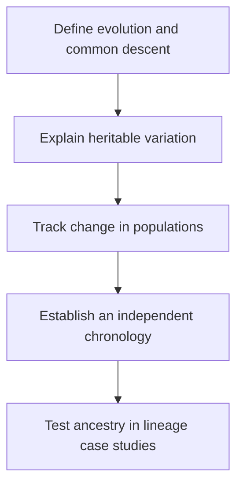
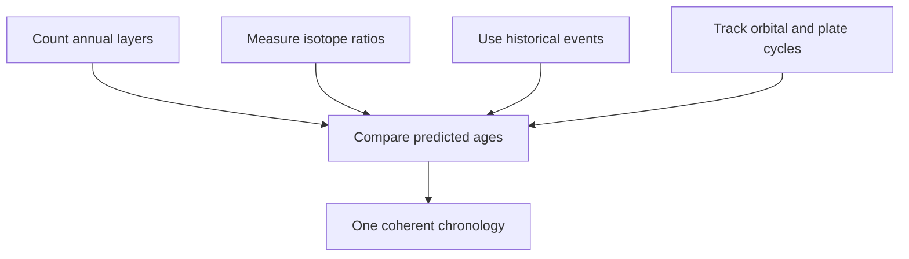
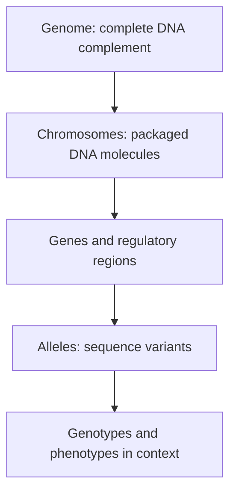
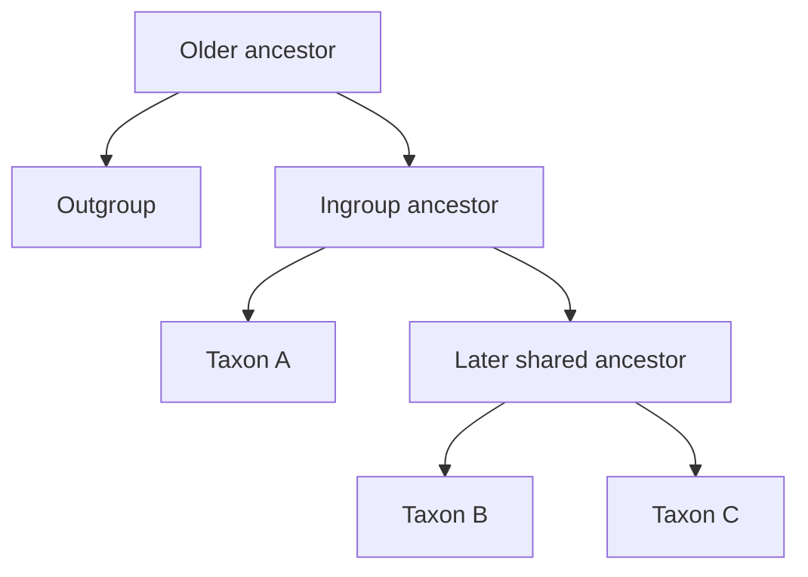

# Technical and revision appendix

This appendix is the central technical reference layer for the eight recorded lessons. It
collects equations, notation, geological scale, population-genetic baselines,
tree-reading rules and lineage summaries that would interrupt the flow of the
main notes. It does **not** replace the detailed, timestamped explanations in
[`lessons/`](lessons/) or the cross-course revision route in
[`docs/`](docs/00-course-map.md).

Use the [full glossary](GLOSSARY.md) for definitions, the [source
catalogue](sources/livestream-catalog.md) for provenance, and the [roadmap](ROADMAP.md)
for recorded dates versus future plans.

## Quick navigation

| Go to | Use it for |
| --- | --- |
| [1. How to use this appendix](#1-how-to-use-this-appendix) | A reliable claim-to-evidence study routine |
| [2. Recorded-course reference](#2-recorded-course-reference) | Dates, runtimes, scope boundaries and the historical-thinkers index |
| [3. Notation, quantities and units](#3-notation-quantities-and-units) | Time units, symbols and scientific naming conventions |
| [4. Deep-time quick reference](#4-deep-time-quick-reference) | Geological intervals and course landmarks |
| [5. Radiometric-dating reference](#5-radiometric-dating-reference) | Equations, assumptions, isotope systems and independent clocks |
| [6. Genetics and mutation reference](#6-genetics-and-mutation-reference) | Molecular hierarchy, inheritance baselines and experimental cases |
| [7. Evolutionary-mechanism comparison](#7-evolutionary-mechanism-comparison) | Selection, mutation, drift, flow, fixation and speciation |
| [8. Phylogeny and tree-reading rules](#8-phylogeny-and-tree-reading-rules) | Tree parts, topology and character matrices |
| [9. Claim → prediction → observation → limit](#9-claim--prediction--observation--limit) | Evidence audits and model comparison |
| [10. Lineage quick-reference tables](#10-lineage-quick-reference-tables) | Whale, bird, mammal and tetrapod character sequences |
| [11. Source, caption and timestamp conventions](#11-source-caption-and-timestamp-conventions) | Attribution, provenance and reproducible links |
| [12. Revision templates and quality checks](#12-revision-templates-and-quality-checks) | Answer structures and a final self-audit |

## 1. How to use this appendix

Three kinds of statement appear here:

- **Course account:** a paraphrase of Erika's explanation, linked to the
  relevant livestream moment.
- **Revision synthesis:** a compact connection among several lessons. It is not
  presented as a quotation from Erika.
- **Technical context:** standard scientific notation, dates or equations,
  linked to an institutional source or the fuller repository note where useful.

For a difficult claim, work in this order:

1. identify the proposition being tested;
2. state a prediction that follows before inspecting the result;
3. distinguish the observation from its interpretation;
4. name an important limitation or alternative explanation; and
5. use the timestamp to hear the surrounding discussion.

That sequence is developed in [Section 9](#9-claim--prediction--observation--limit).

## 2. Recorded-course reference

Dates are YouTube's public `datePublished` dates. Runtimes include the later
audience programme, while the lesson packages deliberately stop before the
superchat Q&A. The catalogue explains the [caption basis and editorial
boundary](sources/livestream-catalog.md#caption-and-timestamp-provenance).

| # | Published | Lesson | Runtime | Audience-Q&A boundary | Detailed package |
| ---: | :---: | --- | ---: | ---: | --- |
| 1 | 3 Nov 2025 | [History of Thought](https://www.youtube.com/watch?v=XoE8jajLdRQ) | 3:31:01 | [3:01:30](https://www.youtube.com/watch?v=XoE8jajLdRQ&t=10890s) | [Lesson 1](lessons/01-history-of-thought/README.md) |
| 2 | 3 Dec 2025 | [Mutations](https://www.youtube.com/watch?v=9uQWss3w8x0) | 4:32:29 | [2:35:56](https://www.youtube.com/watch?v=9uQWss3w8x0&t=9356s) | [Lesson 2](lessons/02-mutations/README.md) |
| 3 | 7 Jan 2026 | [Natural Selection (etc.)](https://www.youtube.com/watch?v=K2JCO6eXans) | 4:17:13 | [3:08:37](https://www.youtube.com/watch?v=K2JCO6eXans&t=11317s) | [Lesson 3](lessons/03-natural-selection/README.md) |
| 4 | 4 Feb 2026 | [The Age of the Earth](https://www.youtube.com/watch?v=dTVFcr4GCMk) | 4:40:59 | [4:14:00](https://www.youtube.com/watch?v=dTVFcr4GCMk&t=15240s) | [Lesson 4](lessons/04-age-of-earth/README.md) |
| 5 | 11 Mar 2026 | [Evolutionary Case Studies: Whales](https://www.youtube.com/watch?v=fnY58Y8FJBQ) | 4:05:21 | [2:47:39](https://www.youtube.com/watch?v=fnY58Y8FJBQ&t=10059s) | [Lesson 5](lessons/05-whales/README.md) |
| 6 | 22 Apr 2026 | [Evolutionary Case Studies: Birds](https://www.youtube.com/watch?v=vhOyNiv6PTY) | 4:59:22 | [3:06:25](https://www.youtube.com/watch?v=vhOyNiv6PTY&t=11185s) | [Lesson 6](lessons/06-birds/README.md) |
| 7 | 1 Jun 2026 | [Evolutionary Case Studies: Mammals](https://www.youtube.com/watch?v=TuWlGUq5Wi4) | 5:26:35 | [3:40:04](https://www.youtube.com/watch?v=TuWlGUq5Wi4&t=13204s) | [Lesson 7](lessons/07-mammals/README.md) |
| 8 | 8 Jul 2026 | [The Evolution of Tetrapods (+more)](https://www.youtube.com/watch?v=aJofeBRFwvI) | 5:41:14 | [4:04:43](https://www.youtube.com/watch?v=aJofeBRFwvI&t=14683s) | [Lesson 8](lessons/08-tetrapods/README.md) |

**Published total:** 37:14:14. A boundary is an editorial scope marker, not a
claim that everything before it is prepared lecture or that everything after it
is scientifically unimportant.

### The course's logical dependency chain



The case studies depend on the earlier machinery but do not merely assume their
conclusions. Each asks whether anatomy, chronology, development, genetics and
ecology agree on the same branching history. See the fuller [course
map](docs/00-course-map.md).

### Lesson 1 historical-thinkers index

This is a map of the intellectual sequence Erika presents, not a “great person”
list and not a claim that each thinker held modern evolutionary theory. Several
people supplied one part of the later synthesis while rejecting another.

| Broad period | Thinker or tradition | Contribution or position in Erika's account | Revision distinction and waypoint |
| --- | --- | --- | --- |
| Classical Greece | Plato | Essential forms make individual variation an imperfect deviation. | Essentialism contrasts with population thinking; it is not a theory of descent ([58:20](https://www.youtube.com/watch?v=XoE8jajLdRQ&t=3500s)). |
| Classical Greece | Aristotle | *Scala naturae* orders fixed forms in a hierarchy. | A ladder of value or complexity is not a branching genealogy ([59:40](https://www.youtube.com/watch?v=XoE8jajLdRQ&t=3580s)). |
| Ancient China | Zhuang Zhou | Transformation in nature makes fixity less inevitable. | A precedent for thinking about change, not natural selection ([1:00:20](https://www.youtube.com/watch?v=XoE8jajLdRQ&t=3620s)). |
| Late antiquity and medieval scholarship | Augustine; Nasir al-Din al-Tusi; Ibn Khaldun | Non-literal chronology, variation, adaptation and continuity among living forms appear in different contexts. | These ideas should not be retrofitted into a complete Darwinian theory ([1:01:00–1:02:24](https://www.youtube.com/watch?v=XoE8jajLdRQ&t=3660s)). |
| Seventeenth–eighteenth centuries | Robert Hooke, Nicolas Steno and John Ray | Fossils are treated as remains of organisms; strata and extinction become empirical problems. | Their natural theology did not prevent geological investigation ([1:19:00–1:20:14](https://www.youtube.com/watch?v=XoE8jajLdRQ&t=4740s)). |
| Seventeenth century | James Ussher | Biblical and extra-biblical chronologies yield a creation date around 4004 BCE. | One influential chronology is not itself a geological measurement, and other theological chronologies differed ([1:13:40–1:15:00](https://www.youtube.com/watch?v=XoE8jajLdRQ&t=4420s)). |
| Eighteenth century | Carl Linnaeus | Binomial naming and nested ranks organise biological similarity. | He intended to catalogue fixed creation, yet the hierarchy supplied a pattern descent could explain ([1:24:20–1:30:40](https://www.youtube.com/watch?v=XoE8jajLdRQ&t=5060s)). |
| Late eighteenth century | James Hutton | Repeated erosion, deposition and landscape change imply much more time than a short chronology. | He did not calculate the modern age of Earth ([1:22:19–1:23:13](https://www.youtube.com/watch?v=XoE8jajLdRQ&t=4939s)). |
| Turn of the nineteenth century | William Paley | Organised complexity motivates an inference to design. | Apparent purpose alone does not discriminate design from an observed natural process ([1:03:40–1:12:40](https://www.youtube.com/watch?v=XoE8jajLdRQ&t=3820s)). |
| Early nineteenth century | Mary Anning | Large marine-reptile fossils make extinction and unfamiliar past faunas difficult to dismiss. | The fossils are evidence of lost organisms, not by themselves a complete evolutionary mechanism ([1:33:40–1:34:06](https://www.youtube.com/watch?v=XoE8jajLdRQ&t=5620s)). |
| Early nineteenth century | Georges Cuvier | Comparative anatomy and fossil succession establish extinction and repeated faunal change. | He accepted extinction and deep history while retaining species fixity ([1:36:20–1:40:40](https://www.youtube.com/watch?v=XoE8jajLdRQ&t=5780s)). |
| Early nineteenth century | Jean-Baptiste Lamarck | Species transform through a proposed natural mechanism. | Simple inheritance of acquired use/disuse is not the modern inheritance mechanism ([1:40:40–1:41:40](https://www.youtube.com/watch?v=XoE8jajLdRQ&t=6040s)). |
| Early nineteenth century | Charles Lyell | Present processes and stable natural laws interpret ancient geology. | Modern actualism includes floods, impacts and eruptions; it is not “everything is always slow” ([1:48:20–1:53:00](https://www.youtube.com/watch?v=XoE8jajLdRQ&t=6500s)). |
| Late eighteenth–early nineteenth centuries | Thomas Malthus | Population growth can outstrip resources. | Darwin borrowed the population-pressure inference, not Malthus's social programme ([1:46:00–1:47:28](https://www.youtube.com/watch?v=XoE8jajLdRQ&t=6360s)). |
| Nineteenth century | Charles Darwin | Geology, fossils, biogeography, common descent and selection are joined in one branching account. | The *Beagle* evidence was cumulative; Darwin's five propositions remain separable ([2:05:20–2:22:20](https://www.youtube.com/watch?v=XoE8jajLdRQ&t=7520s)). |
| Nineteenth century | Alfred Russel Wallace | Biogeography independently leads to a closely similar selection mechanism. | Joint presentation in 1858 preceded Darwin's extended 1859 argument ([2:17:00–2:21:00](https://www.youtube.com/watch?v=XoE8jajLdRQ&t=8220s)). |
| Nineteenth century | Gregor Mendel | Pea crosses reveal segregation and repeatable numerical inheritance ratios. | Clean single-locus characters establish particulate inheritance, not that every phenotype follows a one-gene dominant/recessive rule ([lesson 2, 42:47–53:40](https://www.youtube.com/watch?v=9uQWss3w8x0&t=2567s)). |

Read the full intellectual context in [classification and
ancestry](lessons/01-history-of-thought/02-classification-and-ancestry.md) and
[Darwin and Wallace](lessons/01-history-of-thought/03-darwin-and-natural-selection.md).

## 3. Notation, quantities and units

### Time and scale

| Symbol | Meaning | Scale or convention | Avoid this confusion |
| --- | --- | --- | --- |
| `s`, `min`, `h` | second, minute, hour | Stream navigation and experimental duration | `m` is normally metre, not minute, in scientific units. |
| `a` or `yr` | year | One year; `a` is common in geochronology | A calendar date and an age estimate are different quantities. |
| `ka` | thousand years | $10^3$ years | `kya` is also seen informally; use one convention consistently. |
| `Ma` | million years | $10^6$ years | In this guide it expresses an age before the present, such as 66 Ma. |
| `Myr` | duration of one million years | An elapsed interval, such as “over 10 Myr” | `Ma` usually locates a point in the past; `Myr` describes a span. |
| `Ga` | billion years | $10^9$ years | Earth's age is about 4.5 Ga, not 4.5 Ma. |
| `BP` | years before present | Conventionally measured from AD 1950 in radiocarbon work | Uncalibrated radiocarbon years are not automatically calendar years. |

The age-of-Earth lesson distinguishes numerical age from **relative order**:
superposition and fossil succession can show which event came first before an
isotope system assigns a number ([2:07:35](https://www.youtube.com/watch?v=dTVFcr4GCMk&t=7655s)).

### Molecular and population notation

| Symbol or unit | Meaning | Typical use here |
| --- | --- | --- |
| `bp`, `kb`, `Mb`, `Gb` | base pair; $10^3$, $10^6$, $10^9$ base pairs | DNA sequence length |
| `nt` | nucleotide | RNA or a single-stranded sequence length |
| `aa` | amino acid | Protein length or the consequence of a coding change |
| $p$, $q$ | frequencies of two alleles | For two alleles, $p+q=1$ |
| $p^2$, $2pq$, $q^2$ | expected diploid genotype frequencies | Hardy–Weinberg baseline |
| $N$ | population size, sample count or parent atoms | Define it locally; the same letter has different uses across fields. |
| $N_e$ | effective population size | The size of an idealised population with the same drift behaviour |
| $w$ | relative fitness | Reproductive contribution relative to other genotypes |
| $s$ | selection coefficient | A modelled fitness difference; not the same `s` as seconds when context is population genetics |
| $T$ or $t$ | temperature, elapsed time or generation count | Define it beside each equation; this appendix uses lower-case $t$ for decay time. |
| $\ln$ | natural logarithm | The inverse operation needed to solve an exponential decay equation for time |
| $\lambda$ | decay constant | Probability rate for a particular unstable nuclide; units are inverse time |
| $t_{1/2}$ | half-life | Time over which half of a large parent population decays |

Erika uses a human haploid genome size of roughly 3.2 billion base pairs at
[lesson 2, 1:03:02](https://www.youtube.com/watch?v=9uQWss3w8x0&t=3782s). A
typical diploid body cell carries two homologous chromosome sets before DNA
replication; “3.2 Gb” and “the amount of DNA in every cell at every cell-cycle
stage” are therefore not interchangeable statements.

### Naming and typography conventions

| Item | Convention used in this guide | Example or qualification |
| --- | --- | --- |
| Genus and species | Capitalise the genus, use lower case for the species epithet, and italicise both. | *Homo sapiens*, *Tiktaalik roseae* |
| Abbreviated genus | After the genus has been written in full and the meaning is unambiguous, shorten it to its initial. | *H. sapiens* |
| Higher taxon or clade | Use roman type unless the name itself contains a genus or species name. | Mammalia, Tetrapoda, Cetacea |
| Informal group | Use lower case unless it begins a sentence. | mammals, tetrapods, whales |
| Gene and protein symbols | Follow the source when an organism-specific distinction matters. Bold symbols in this guide mainly improve scanability. | **SHH** may name the gene or, in looser course prose, the signalling system; check the surrounding sentence. |

Gene typography differs among organisms and journals: capitalisation, italics
and the distinction between a gene, its RNA and its protein are not universal.
The repository therefore prioritises an unambiguous full name on first use and
does not treat bold type alone as a biological claim.

### Reading values responsibly

- A measured value should carry a unit and, where supplied, uncertainty.
- “Approximately” signals that a rounded teaching value is being used; it does
  not erase the evidence behind the estimate.
- A percentage similarity has no meaning without the sequences compared, the
  alignment procedure and the treatment of insertions, deletions and duplicated
  regions. Will asks about a single human–chimpanzee percentage and Erika begins
  separating the possible denominators in the tetrapod Q&A
  ([2:27:37–2:28:04](https://www.youtube.com/watch?v=aJofeBRFwvI&t=8857s)).
- A fossil's age, a lineage's divergence estimate and a rock's crystallisation
  age answer related but non-identical questions.

## 4. Deep-time quick reference

The divisions below are a **rounded orientation chart**, not the evidence that
establishes any boundary. Consult the maintained [International Commission on
Stratigraphy's chart](https://stratigraphy.org/chart) for current numerical
definitions and uncertainties.

| Eon / era | Approximate interval | Periods important to this course | Course relevance |
| --- | ---: | --- | --- |
| Hadean | 4.54–4.0 Ga | — | Early Solar System and extensively molten early Earth; meteorites help estimate Earth's formation age. |
| Archean | 4.0–2.5 Ga | — | Ancient crust and early life; much older crust has been recycled. |
| Proterozoic | 2.5 Ga–538.8 Ma | — | Most of Earth's history; later intervals include diversification of multicellular life. |
| Palaeozoic | 538.8–251.9 Ma | Cambrian, Ordovician, Silurian, **Devonian**, Carboniferous, **Permian** | Devonian tetrapod evidence; synapsid history; end-Permian extinction. |
| Mesozoic | 251.9–66.0 Ma | **Triassic, Jurassic, Cretaceous** | Mammaliaforms and Mesozoic mammals; theropod and avialan history; end-Cretaceous extinction. |
| Cenozoic | 66.0 Ma–present | **Palaeogene**, Neogene, Quaternary | Eocene whale transition and later radiations of surviving mammal and bird branches. |

### Course landmarks—not a ladder of progress

| Approximate placement | Event or evidence | What the course uses it to show |
| --- | --- | --- |
| About 4.5 Ga | Meteorites from early Solar System material | Independent route to Earth's formation age ([3:14:22–3:14:36](https://www.youtube.com/watch?v=dTVFcr4GCMk&t=11662s)). |
| 4.3–4.4 Ga | Jack Hills detrital zircons | Surviving minerals older than intact terrestrial rocks ([3:12:58](https://www.youtube.com/watch?v=dTVFcr4GCMk&t=11578s)). |
| Devonian | Lobe-finned vertebrates, digit trackways and early tetrapods | Character mosaics in the fish–tetrapod transition; the roughly 390 Ma Zachełmie tracks complicate a tidy ladder ([3:39:59–3:45:43](https://www.youtube.com/watch?v=aJofeBRFwvI&t=13199s)). |
| About 252 Ma | End-Permian extinction | Severe pruning and a small-bodied post-crisis fauna, not a ranking of “more evolved” survivors ([3:11:30–3:25:21](https://www.youtube.com/watch?v=TuWlGUq5Wi4&t=11490s)). |
| Triassic–Jurassic | Cynodont and mammaliaform transformations | Jaw, ear, palate and physiology assemble in mosaics; *Morganucodon* retains two jaw joints ([2:48:02](https://www.youtube.com/watch?v=TuWlGUq5Wi4&t=10082s)). |
| Jurassic–Cretaceous | Theropods and avialans | Feathers precede the complete modern flight system; *Archaeopteryx* combines avialan and retained theropod states ([1:54:05–2:01:44](https://www.youtube.com/watch?v=vhOyNiv6PTY&t=6845s)). |
| 66 Ma | End-Cretaceous extinction | Extinction prunes non-avian dinosaurs and many other branches; surviving lineages later diversify. |
| Eocene | Archaeocete radiation over roughly ten million years | Terrestrial, amphibious and fully marine cetacean mosaics occur in an ordered branching history ([1:49:50](https://www.youtube.com/watch?v=fnY58Y8FJBQ&t=6590s)). |

Do not read this table as a single file of ancestors. Different branches
overlap in time, and most named fossils are not demonstrated direct ancestors.
The geological record samples a branching history.

## 5. Radiometric-dating reference

### The decay equations

For an unstable parent nuclide with decay constant $\lambda$:

$$
N(t)=N_0e^{-\lambda t}
$$

The half-life $t_{1/2}$ is related to the decay constant by:

$$
\lambda=\frac{\ln 2}{t_{1/2}}
$$

Combining them gives the form used in the lesson:

$$
N(t)=N_0\left(\frac{1}{2}\right)^{t/t_{1/2}}
$$

and, if $N_0$ and the remaining parent $N(t)$ are known or inferable,

$$
t=\frac{1}{\lambda}\ln\left(\frac{N_0}{N(t)}\right).
$$

Here $N_0$ is the starting number of parent atoms and $N(t)$ the number
remaining. Erika introduces the exponential behaviour and the roughly
5,700-year teaching value for carbon-14 at
[2:09:31–2:10:32](https://www.youtube.com/watch?v=dTVFcr4GCMk&t=7771s).

**Idealised check:** after three half-lives, the fraction of parent remaining is
$(1/2)^3=1/8=12.5\%$. For carbon-14, using the lesson's rounded value, that is
about 17,100 years. A real radiocarbon age also requires suitable material,
background correction and calibration; the arithmetic alone does not validate
the sample.

If a daughter product is measured, the useful age relation depends on the
particular decay system and how initial daughter material is constrained. In a
simple closed-system case where $D^*$ is daughter produced only by decay and
$P$ is parent remaining:

$$
t=\frac{1}{\lambda}\ln\left(1+\frac{D^*}{P}\right).
$$

This compact formula should not be used to skip mineral-specific corrections,
branching decay chains, concordia/isochron methods or uncertainty propagation.
Erika's central point is methodological: a mass spectrometer supplies isotope
ratios, while the chosen mineral, decay system and geological context determine
what event the ratio can date ([material and event,
2:22:18–2:23:27](https://www.youtube.com/watch?v=dTVFcr4GCMk&t=8538s);
[mass spectrometer, 2:23:29–2:23:54](https://www.youtube.com/watch?v=dTVFcr4GCMk&t=8609s)).

### Internal consistency methods

These are technical context for the checks named above, not additional claims
silently attributed to the stream.

| Method | Construction | What it can estimate or test | Essential limit |
| --- | --- | --- | --- |
| Isochron | Analyse related minerals or samples that shared one initial daughter/reference ratio but began with different parent/reference ratios; plot the present ratios. | Under closed-system behaviour, the line's slope yields elapsed time and its intercept estimates the initial daughter/reference ratio. Scatter and geological context test whether one line is justified. | Co-genetic origin, a shared initial ratio and suitable closed-system histories must be defended; a fitted line is not automatically an age. |
| Uranium–lead concordia | Compare the paired $^{238}\mathrm{U}\rightarrow{}^{206}\mathrm{Pb}$ and $^{235}\mathrm{U}\rightarrow{}^{207}\mathrm{Pb}$ clocks from the same analysis on the concordia diagram. | A closed analysis plots on the concordia curve at its compatible age. Disturbed analyses may form a discordia array whose intercepts constrain crystallisation and later lead-loss history. | Concordia tests internal compatibility; mineral inheritance, mixed domains and complex disturbance still require imaging, sampling and geological interpretation. |

**Concordia** is therefore a particular uranium–lead construction;
**concordance** is the broader idea that independent results agree within their
uncertainties.

### Assumptions are test conditions, not hidden wishes

| Question | Why it matters | How it can be checked or constrained |
| --- | --- | --- |
| What event started or reset the clock? | Crystallisation, cooling, metamorphism and death are different events. | Mineralogy, texture, field relations and closure behaviour. |
| What was present initially? | Non-radiogenic or initial daughter material can inflate a naive daughter count. | Co-genetic minerals, isochron approaches, known initial ratios or decay-chain relations. |
| Did the sample remain closed to parent and daughter? | Heating, weathering or fluid movement can add or remove isotopes. | Alteration screening, concordance among minerals or systems, replicate analyses and geological context. |
| Is the decay constant stable? | The time conversion requires the measured nuclear behaviour. | Laboratory physics and cross-checks against independent clocks. Erika reviews attempted rate changes at [2:38:04](https://www.youtube.com/watch?v=dTVFcr4GCMk&t=9484s). |
| Is the clock suited to this age range? | Too little daughter may accumulate in a young sample; too little parent may remain in an old one. | Select a half-life and material capable of resolving the interval. The “truck scale” analogy begins at [2:39:31](https://www.youtube.com/watch?v=dTVFcr4GCMk&t=9571s). |
| Were ratios and uncertainties measured adequately? | An instrument can return a number outside a defensible analytical range. | Standards, blanks, calibration, repeated preparation and independent laboratories. |

Erika lists the starting condition, rate, method suitability and measurement
questions together at [2:36:32](https://www.youtube.com/watch?v=dTVFcr4GCMk&t=9392s).

### Match the clock to the material and event

| Situation | Appropriate reasoning | Inappropriate shortcut |
| --- | --- | --- |
| Recently dead organic material | Carbon exchange stops at death; carbon-14 can date suitable preserved carbon within its practical range. | Treating any black material or surrounding mineral as original organismal carbon. |
| Material approaching 50–60 ka | Background, contamination and the diminishing parent signal become decisive ([2:16:18–2:20:12](https://www.youtube.com/watch?v=dTVFcr4GCMk&t=8178s)). | Reading every finite instrument output as the sample's true age. |
| Dinosaur-age fossil | Date bracketing volcanic units or suitable minerals with a long-range system; use stratigraphic context. | Expecting carbon-14 to date mineralised dinosaur bone tens of millions of years old. |
| Young volcanic eruption | Choose a system with enough resolution, or date appropriate associated organic material. | Using a long-half-life clock merely because it works on much older volcanic rocks. |
| Ancient igneous mineral | Interpret the closure/crystallisation history and test disturbance. | Assuming the result automatically dates deposition, erosion and every later event. |

| System or measurement | Suitable material and event | Useful scale in this course | Principal checks and limits |
| --- | --- | --- | --- |
| Carbon-14 | Original organic carbon; time since an organism stopped exchanging carbon | Recent prehistory, with a practical course range of roughly 50–60 ka ([2:16:18–2:20:12](https://www.youtube.com/watch?v=dTVFcr4GCMk&t=8178s)) | Calibration, blanks, background and modern contamination dominate near the limit; it does not directly date mineralised dinosaur bone. |
| Potassium–argon / argon–argon | Suitable volcanic minerals; crystallisation or cooling of the dated phase | Volcanic events and ash well beyond the carbon-14 range | Mineral suitability, open-system behaviour and inherited or excess argon must be assessed; a clock used below its resolution can still print a misleading number. The Vesuvius test begins at [2:40:45](https://www.youtube.com/watch?v=dTVFcr4GCMk&t=9645s). |
| Uranium–lead | Commonly zircon; crystallisation and later disturbance recorded within the grain | Ancient igneous events and the oldest surviving terrestrial minerals | Initial lead, lead loss and open-system history are tested through isotope relations and concordance; a detrital zircon predates the sediment that contains it. |
| Uranium–thorium | Suitable carbonate, including speleothem growth layers | Cave-carbonate chronologies within the method's applicable interval | Detrital thorium, later fluid movement and closed-system behaviour require testing. Erika's Mulu example begins at [lesson 8, 58:20](https://www.youtube.com/watch?v=aJofeBRFwvI&t=3500s). |
| Stable oxygen or carbon isotopes | Tooth, bone, shell, ice, sediment or speleothem chemistry | Environmental, dietary, habitat or climate reconstruction | These ratios are **proxies, not clocks**: they need calibration and an independent chronology. Erika applies them to whale habitat at [lesson 5, 2:41:41–2:42:50](https://www.youtube.com/watch?v=fnY58Y8FJBQ&t=9701s). |

The table is a selection guide, not a laboratory protocol. Each system has
mineral-specific preparation, calibration and uncertainty requirements; see the
full [radiometric-dating lesson](lessons/04-age-of-earth/02-dating-and-cross-checks.md).

### Why convergence is stronger than repetition



| Cross-check | Independent basis | Lesson waypoint |
| --- | --- | --- |
| Tree rings and carbon-14 | Biological annual growth versus nuclear decay | Prediction at [2:24:37](https://www.youtube.com/watch?v=dTVFcr4GCMk&t=8677s), agreement at [2:26:31](https://www.youtube.com/watch?v=dTVFcr4GCMk&t=8791s) |
| Lake Suigetsu varves | Seasonal sediment layers, tree-ring overlap and radiocarbon | [2:27:12](https://www.youtube.com/watch?v=dTVFcr4GCMk&t=8832s) |
| Ice layers and volcanic ash | Counted ice accumulation versus an identifiable eruption and isotope dating | [2:28:42](https://www.youtube.com/watch?v=dTVFcr4GCMk&t=8922s) |
| Orbital cycles and climate archives | Astronomical periodicity versus cave, marine and ice chemistry | [2:29:31–2:32:43](https://www.youtube.com/watch?v=dTVFcr4GCMk&t=8971s) |
| Seafloor and island chains | Distance and present plate motion versus rock age | [2:33:21](https://www.youtube.com/watch?v=dTVFcr4GCMk&t=9201s) |
| AD 79 Vesuvius | Written/archaeological date versus argon–argon analysis | [2:40:45](https://www.youtube.com/watch?v=dTVFcr4GCMk&t=9645s) |

The strength comes from different principal failure modes. Three repeats on one
instrument improve precision; three physical archives agreeing on a chronology
also test whether the shared interpretation is broadly correct. See the [USGS
overview](https://pubs.usgs.gov/gip/geotime/age.html) and the detailed [dating
lesson](lessons/04-age-of-earth/02-dating-and-cross-checks.md).

## 6. Genetics and mutation reference

### Molecular hierarchy



| Level | Revision definition | Important qualification |
| --- | --- | --- |
| Nucleotide | Base, sugar and phosphate unit | DNA bases pair A–T and G–C; RNA uses U instead of T. |
| Gene | DNA region contributing to a functional product | A gene is not necessarily one visible trait, and expression varies by tissue and time. |
| Allele | Alternative sequence state at a locus | A new allele can arise by mutation; recombination reshuffles existing alleles. |
| Chromosome | Long DNA molecule packaged with proteins | Homologous chromosomes carry corresponding loci but need not carry identical alleles. |
| Genome | Complete DNA complement | Protein-coding sequence is only part of a genome; “non-coding” is not synonymous with “non-functional.” |
| Genotype | The allele state considered for an organism or locus | Dominance describes a heterozygous phenotype, not which allele is “stronger.” |
| Phenotype | Measurable characteristic produced through genotype, development and environment | Similar phenotypes can arise by homology, convergence or different pathways. |

DNA complementarity and the distinction between genome, gene and expression are
developed at [lesson 2, 1:01:26–1:05:00](https://www.youtube.com/watch?v=9uQWss3w8x0&t=3686s).

### Replication, transcription and translation

| Process | Main template | Main product | Evolutionary relevance |
| --- | --- | --- | --- |
| Replication | DNA | DNA copy | Copying errors that escape repair can become mutations. |
| Transcription | DNA | RNA | Regulation changes when, where or how much a gene product is made. |
| Translation | mRNA codons | Amino-acid chain | A coding change can alter, truncate or leave the peptide unchanged. |

A translation mistake affects a particular protein molecule; it is not thereby
a heritable DNA mutation. For most multicellular animals, a sequence change must
enter the germ line to be transmitted to descendants. Erika separates mutation
from recombination at [1:16:52](https://www.youtube.com/watch?v=9uQWss3w8x0&t=4612s)
and follows the molecular pathway in [the full DNA note](lessons/02-mutations/02-dna-and-mutation.md).

### Mutation types and likely molecular consequences

| Mutation class | What changes | Possible consequences | What the label does **not** tell you |
| --- | --- | --- | --- |
| Substitution | One base is replaced | Synonymous, missense, nonsense, splice or regulatory change | Whether fitness rises or falls |
| Insertion or deletion | Bases are added or removed | Frameshift if a coding indel is not a multiple of three; in-frame change otherwise | Whether the region is coding or regulatory |
| Duplication | A segment, gene or larger region is copied | Dosage increase, redundancy, subfunctionalisation, neofunctionalisation or later loss | That a new function appears immediately |
| Inversion | A segment reverses orientation | Breakpoint effects, altered regulation or reduced recombination in heterozygotes | That every gene inside stops working |
| Translocation | Material moves between chromosomal locations | Disrupted genes, novel regulation or reproductive effects | That the change is necessarily inherited |
| Regulatory change | Expression control is altered | Different timing, location or quantity of expression | That the encoded protein sequence changed |

Mutation is random **with respect to what an organism needs**, not necessarily
equal in probability at every base. Physical size also fails to predict effect:
a one-base change can be severe, while a large change can occur in a region with
little detected phenotypic consequence. Erika introduces this scale contrast at
[1:44:14–1:44:34](https://www.youtube.com/watch?v=9uQWss3w8x0&t=6254s).

### Gene duplication as evolutionary opportunity

After duplication, the copies can retain dosage, divide an ancestral task,
diverge so one performs a new task, or accumulate disabling changes. Erika's
“cat/cat” then “cat/sat” analogy isolates the logic at
[2:08:01–2:08:58](https://www.youtube.com/watch?v=9uQWss3w8x0&t=7681s): one
copy can preserve an older role while the other changes. It is a model of
redundancy, not a claim that spelling changes are molecular mechanisms.

### Mendelian and Hardy–Weinberg baselines

For a simple one-locus cross with complete dominance, let $A$ be dominant and
$a$ recessive. Crossing $AA\times aa$ gives heterozygous $Aa$ first-generation
offspring. Crossing two of those heterozygotes gives:

| Offspring genotype | Probability | Phenotype under complete dominance |
| --- | ---: | --- |
| $AA$ | $1/4$ | Dominant |
| $Aa$ | $1/2$ | Dominant |
| $aa$ | $1/4$ | Recessive |

Thus the expected genotype ratio is **1:2:1** and the phenotype ratio **3:1**
([lesson 2, 47:50–49:31](https://www.youtube.com/watch?v=9uQWss3w8x0&t=2870s)).
These are probabilities over repeated fertilisations, not a guarantee that each
family of four contains the exact ratio. Independent assortment applies cleanly
to unlinked loci; linkage, incomplete dominance, codominance, multiple alleles,
polygenic traits and environment can change the simple expectation.

For two alleles $A$ and $a$ with frequencies $p$ and $q$:

$$
p+q=1
$$

Under random mating and the other Hardy–Weinberg conditions:

$$
p^2+2pq+q^2=1
$$

| Term | Expected genotype | If $p=0.3$ and $q=0.7$ |
| --- | --- | ---: |
| $p^2$ | $AA$ | 0.09 |
| $2pq$ | $Aa$ | 0.42 |
| $q^2$ | $aa$ | 0.49 |

The five ideal conditions are no mutation, no gene flow, no selection, random
mating and a population large enough to make sampling drift negligible. The
model is a **null baseline**, not a claim that natural populations are static.
Erika introduces the equation and worked example at
[lesson 3, 1:01:20–1:04:00](https://www.youtube.com/watch?v=K2JCO6eXans&t=3680s).
A departure says that at least one assumption failed; ecological, demographic
or genomic evidence is needed to identify which one.

### Genetic, developmental and experimental case index

This index prevents two opposite errors: treating a named gene as if it alone
builds a whole organism, and treating coordinated anatomical change as if no
testable developmental route exists.

| Case | Sequence, pathway or treatment | What the observation tests | Essential limit |
| --- | --- | --- | --- |
| Mouse gene-desert deletion | Large non-coding intervals | Homozygous deletions were compatible with viability and the measured traits, challenging a claim that every removed base is individually essential ([1:06:14–1:07:01](https://www.youtube.com/watch?v=9uQWss3w8x0&t=3974s)). | It does not show that all non-coding DNA lacks function or that no unmeasured effect exists. |
| Cystic fibrosis | **CFTR** variants, including the common three-base $\Delta$F508 deletion | A local sequence change can alter an upstream protein and produce system-wide physiological effects ([1:56:11–1:56:53](https://www.youtube.com/watch?v=9uQWss3w8x0&t=6971s)). | The disorder is not caused by one universal point mutation. |
| Sickle-cell trade-off | **HBB** glutamate-to-valine substitution | Molecular effect, genotype and malaria environment predict heterozygote advantage ([2:00:28–2:04:34](https://www.youtube.com/watch?v=9uQWss3w8x0&t=7228s)). | One allele reduces severe-malaria risk; it does not supply complete immunity, and two copies can cause severe disease. |
| Lactase persistence | Regulatory variants in **MCM6** affecting nearby **LCT** expression | Different populations can reach continued adult lactase expression through regulatory changes under dairying selection ([1:57:43–1:58:32](https://www.youtube.com/watch?v=9uQWss3w8x0&t=7063s)). | No single persistence allele is universal; drinking milk does not direct the needed mutation. |
| HIV resistance | **CCR5-$\Delta$32** deletion | Changing a cell-surface entry route can reduce susceptibility to particular HIV strains ([1:59:34](https://www.youtube.com/watch?v=9uQWss3w8x0&t=7174s)). | It is a 32-base deletion, not a substitution, and not universal protection. |
| Pocket-mouse colour | **MC1R** and **Agouti** variation | Genotype, pigment phenotype and lava/sand substrate can be tested together ([2:13:43–2:14:49](https://www.youtube.com/watch?v=9uQWss3w8x0&t=8023s)). | Dark colour is not inherently beneficial; its fitness effect reverses with background. |
| Mammalian fur length | **FGF5** variation | One regulatory/growth pathway can change coat length, supplying selectable variation ([2:06:30–2:06:39](https://www.youtube.com/watch?v=9uQWss3w8x0&t=7590s)). | Long fur is not always adaptive; climate sets the consequence. |
| High bone mass | Gain-of-function **LRP5** variants | An altered pathway can increase bone density and change fracture-related trade-offs ([2:10:02–2:10:28](https://www.youtube.com/watch?v=9uQWss3w8x0&t=7802s)). | A possible benefit in one ecology is not a universal fitness advantage. |
| Bajau diving physiology | Selection signal near **PDE10A**, thyroid regulation and spleen physiology | Population genomics, physiology and diving ecology can be connected in a selection test ([2:11:39–2:12:18](https://www.youtube.com/watch?v=9uQWss3w8x0&t=7899s)). | One locus does not fully determine diving skill or every individual's spleen size. |
| Naturally short sleep | **DEC2/BHLHE41** variant | A heritable molecular variant can associate with a measurable sleep phenotype ([2:13:24](https://www.youtube.com/watch?v=9uQWss3w8x0&t=8004s)). | A family association is not a complete account of sleep biology or population fitness. |
| Leaf-eating colobines | Duplicated **RNASE1** followed by sequence divergence | Duplication can preserve an ancestral copy while another changes with digestive ecology ([2:15:08–2:15:44](https://www.youtube.com/watch?v=9uQWss3w8x0&t=8108s)). | Duplication is opportunity, not an automatic new function. |
| Primate colour vision | Opsin duplication and divergence | Spare copies can shift wavelength sensitivity while older sensitivities remain ([2:16:29–2:17:37](https://www.youtube.com/watch?v=9uQWss3w8x0&t=8189s)). | Similar trichromacy can arise by a different duplication history, as in howler monkeys. |
| Fish antifreeze | Trypsinogen-related recruitment in notothenioids; a different de novo route in Arctic cod | Comparative sequence reconstructs molecular ancestry and distinguishes convergent outcomes ([2:18:45–2:21:46](https://www.youtube.com/watch?v=9uQWss3w8x0&t=8325s)). | Similar ice-binding function does not imply the same gene origin. |
| Fly wing/haltere identity | Hox regulator **Ultrabithorax (Ubx)** | Manipulating regulation transforms appendage identity and exposes developmental homology ([2:24:13–2:25:09](https://www.youtube.com/watch?v=9uQWss3w8x0&t=8653s)). | A four-winged fly is not automatically fitter, and the experiment is not the whole insect phylogeny. |
| Human cortical expansion candidate | Duplicated **ARHGAP11B** | Expression in fetal marmoset development increased neural progenitors, cortical size and folding ([2:30:19–2:31:13](https://www.youtube.com/watch?v=9uQWss3w8x0&t=9019s)). | It is one feasible contributor, not a one-gene explanation of the human brain. |
| Dolphin hind-limb reduction | Loss of maintained **FGF8** and absent **SHH** signalling in the hind-limb bud | An inherited limb programme initiates and is interrupted at defined developmental steps ([2:07:44–2:09:00](https://www.youtube.com/watch?v=fnY58Y8FJBQ&t=7664s)). | Development alone does not date the change, and no adult leg shrinks during one dolphin's life. |
| Chicken tooth capacity | *talpid2* mutant and retained archosaur tooth-development machinery | A normally suppressed capacity can produce first-generation tooth structures ([1:36:33–1:37:01](https://www.youtube.com/watch?v=vhOyNiv6PTY&t=5793s)). | The embryo is not becoming an alligator and modern birds do not normally grow adult teeth. |
| Bird beak and palate | Modified **FGF** and **WNT** signalling | An early regulatory change coordinates several facial structures ([1:37:17–1:38:54](https://www.youtube.com/watch?v=vhOyNiv6PTY&t=5837s)). | The treatment does not recreate one exact dinosaur species. |
| Scale/feather fate | Transient **SHH** activation and feather-associated regulatory modules | Related skin appendages respond to changes in a shared placode-based system ([2:33:45–2:37:03](https://www.youtube.com/watch?v=vhOyNiv6PTY&t=9225s)). | No single “feather gene” makes a complete coat, and the experiment does not identify every fossil filament. |
| Fin endoskeleton | Variants in **vav2** and **waslb**; broader appendage patterning also involves Hox/SHH systems | Zebrafish can form extra articulated, muscle-integrated fin bones through regulatory change ([3:19:03–3:29:43](https://www.youtube.com/watch?v=aJofeBRFwvI&t=11943s)). | The fish does not become a tetrapod; this is a mechanism test, not a replay of Devonian history. |
| Predation-selected algae | *Chlamydomonas* exposed to a filter-feeding predator | Stable heritable clusters evolved in selected populations and persisted after predator removal ([3:52:17–3:55:15](https://www.youtube.com/watch?v=aJofeBRFwvI&t=13937s)). | Two of five selected populations responded; a cluster is not an animal-grade body plan. |
| Settling-selected snowflake yeast | Repeated selection on clonal yeast clusters | Multicellular propagules evolved much greater size and toughness ([3:53:53–3:56:21](https://www.youtube.com/watch?v=aJofeBRFwvI&t=14033s)). | Preliminary division-of-labour claims remain less secure than the peer-reviewed multicellular life-cycle result. |

The common lesson is that regulators act in networks. A small regulatory change
can have coordinated downstream effects, but its phenotypic and fitness
consequences depend on background, timing, tissue and environment.

## 7. Evolutionary-mechanism comparison

Evolution here means inherited population change across generations. Individuals
develop, acclimatise and reproduce; populations change allele frequencies.
Erika makes that scale distinction at
[lesson 3, 33:20–36:20](https://www.youtube.com/watch?v=K2JCO6eXans&t=2000s).

### The course's simplified fixation-time approximation

Erika introduces a classroom approximation for the deterministic number of
generations, $T$, in which a beneficial allele that has escaped early
stochastic loss approaches fixation
([1:22:20–1:27:40](https://www.youtube.com/watch?v=K2JCO6eXans&t=4940s)):

$$
T\approx\frac{2\ln(2N)}{s}
$$

Here $N$ is population size, $s$ is the persistent selection coefficient and
$\ln$ is the natural logarithm. In the lesson, a 1% advantage means an average
relative contribution of about 101 descendants for every 100 from the
alternative, not that all non-carriers suddenly die or become sterile.

| Worked population | Persistent advantage $s$ | Approximate generations reported in the lesson |
| --- | ---: | ---: |
| 10,000 one-year beetles | 1% | about 2,000 |
| Same beetles | 30% | about 66 |
| Will's population of one million one-year organisms | 1% | about 2,912 |
| Same million | 30% | about 97 |
| Same million | 50% | about 58 |

The first comparison is worked through at
[1:27:00–1:27:40](https://www.youtube.com/watch?v=K2JCO6eXans&t=5220s); Erika
answers Will's million-organism example at
[2:20:20–2:21:56](https://www.youtube.com/watch?v=K2JCO6eXans&t=8420s).
Direct substitution of $N=1{,}000{,}000$ and $s=0.01$ in the displayed
approximation gives about 2,902 generations rather than the reported 2,912;
that ten-generation difference is immaterial at the precision of this teaching
model. Starting frequency, dominance, drift, gene flow, population structure,
changing environments and a changing $s$ can all alter a real trajectory.
Because a new allele can disappear by drift while it is still rare, this
conditional trajectory is not the same as the probability that it will fix.
“Fixation” here is a model outcome, not a universal forecast.

| Mechanism | Immediate operation | Can introduce a new allele? | Frequency change tied systematically to relative reproduction? | Strongest diagnostic clue | Frequent mistake | Course waypoint |
| --- | --- | :---: | :---: | --- | --- | --- |
| Mutation | Creates a changed sequence copy; recurrent or back mutation can recreate an allele already present | Yes | No | A changed sequence copy, potentially a population-new allele | Saying the environment produces the mutation it needs | [36:40–37:56](https://www.youtube.com/watch?v=K2JCO6eXans&t=2200s) |
| Natural selection | Unequal reproductive contribution associated with heritable differences | No | Yes, relative to the current environment | Repeatable association among phenotype/genotype, environment and descendants | Treating selection as foresight, or calling every survival event adaptive | [38:20–39:01](https://www.youtube.com/watch?v=K2JCO6eXans&t=2300s) |
| Genetic drift | Chance sampling of alleles across generations | No | No | Larger stochastic shifts and loss of diversity in small populations | Treating chance as if it could never oppose selection | [2:22:40–2:23:28](https://www.youtube.com/watch?v=K2JCO6eXans&t=8560s) |
| Gene flow | Migrants reproduce across population boundaries | No, globally; potentially new to the receiving population | Not inherently | Alleles and ancestry move with migration and interbreeding | Equating movement of organisms with gene flow when no reproduction occurs | [2:58:00–2:59:08](https://www.youtube.com/watch?v=K2JCO6eXans&t=10680s) |
| Non-random mating | Mate choice or mating structure changes genotype combinations | No | Not inherently | Genotype proportions depart from random-mating expectations | Assuming it always changes allele frequencies by itself | [1:03:00–1:04:00](https://www.youtube.com/watch?v=K2JCO6eXans&t=3780s) |
| Recombination | Existing alleles are reassorted into gametes | No | No | New combinations of existing parental variants | Calling every new combination a new mutation | [lesson 2, 1:16:52](https://www.youtube.com/watch?v=9uQWss3w8x0&t=4612s) |

### Founder effect versus bottleneck

| Feature | Founder effect | Bottleneck effect |
| --- | --- | --- |
| Sampling event | A small sample starts a new population | A small sample survives a sharp reduction |
| Geography | Often involves colonisation | Can occur in the same location |
| Shared consequence | Allele frequencies and diversity reflect a non-representative sample | Allele frequencies and diversity reflect a non-representative sample |
| Lesson example | Ten storm-blown moths found an island population ([2:24:00–2:25:00](https://www.youtube.com/watch?v=K2JCO6eXans&t=8640s)) | Ten moths survive a wildfire ([2:26:40–2:27:20](https://www.youtube.com/watch?v=K2JCO6eXans&t=8800s)) |

### Reproductive barriers and speciation

Reproductive isolation is usually layered rather than an all-or-none switch.
The biological species concept is useful for many living sexual populations but
cannot be applied directly to fossils or asexual organisms. Erika introduces
the practical boundary problem at
[lesson 3, 2:36:20–2:40:20](https://www.youtube.com/watch?v=K2JCO6eXans&t=9380s).

| Species concept | Operational question | Works especially well for | Principal limitation |
| --- | --- | --- | --- |
| Biological | Do populations actually or potentially exchange genes and remain reproductively connected? | Many living, sexually reproducing organisms | Asexual organisms, fossils, geographically separated populations and partly fertile hybrids |
| Morphological | Does a specimen belong to a diagnosable anatomical cluster? | Fossils and museum material without breeding data | Age, sex, individual variation and convergence can mimic species differences |
| Phylogenetic | What is the smallest diagnosable lineage or monophyletic cluster? | Character-rich or genomic datasets | Results depend on sampling, character choice and the threshold used to name a lineage |
| Ecological | Does a population occupy a distinct niche and maintain that role? | Closely related living forms with ecological separation | Niches can overlap or change, and fossils preserve ecology incompletely |
| Evolutionary lineage | Does the population maintain a distinct historical identity and tendency through time? | Fossil sequences and long-term lineage questions | The beginning and end of a lineage remain hypotheses inferred from incomplete samples |

No concept turns a gradual population process into an intrinsically sharp line.
The choice should match the available evidence and research question.

| Barrier stage | When it acts | Course example | Effect on gene flow |
| --- | --- | --- | --- |
| Geographic or habitat | Before encounter | Jaguars and leopards occupy different continents ([2:41:50–2:42:15](https://www.youtube.com/watch?v=K2JCO6eXans&t=9710s)). | Potential mates do not routinely meet. |
| Temporal | Before encounter | Populations reproduce in different seasons or times. | Gametes are not available together. |
| Behavioural | Before mating | Meadowlark songs fail mate recognition. | Courtship does not proceed despite range overlap. |
| Mechanical | During attempted mating | Externally similar bushbabies can have incompatible reproductive anatomy ([2:42:40–2:43:05](https://www.youtube.com/watch?v=K2JCO6eXans&t=9760s)). | Gamete transfer is reduced or prevented. |
| Gametic | After mating, before a zygote | Sperm and egg fail biochemical recognition or fusion. | No hybrid zygote forms. |
| Hybrid inviability | After fertilisation | Development stops or a pregnancy miscarries ([2:43:30–2:43:55](https://www.youtube.com/watch?v=K2JCO6eXans&t=9810s)). | Hybrid alleles do not reach reproducing adults. |
| Hybrid sterility or breakdown | At reproduction or in later hybrid generations | Horses and donkeys usually produce sterile mules, with rare exceptions. | First-generation hybrids may live but transmit few or no alleles onward. |

| Speciation setting | Population geometry | Expected genetic effect | Caution |
| --- | --- | --- | --- |
| Allopatric | A barrier divides populations geographically. | Gene flow falls; mutation, drift and selection act separately. | The barrier does not itself design either daughter population. |
| Peripatric | A small peripheral isolate separates from a larger source. | Isolation combines with strong drift in the small founder population. | Erika calls one such diagram “parapatric”; the detailed note records the terminology correction. |
| Parapatric | Neighbouring populations diverge across adjoining ranges while limited gene flow continues. | Local selection can maintain a gradient or hybrid zone. | Not complete geographical separation. |
| Sympatric | Divergence develops within overlapping geography. | Assortative mating, ecology or chromosome change can reduce gene exchange. | Shared geography does not prove random mating. |

A hybrid does not automatically collapse two lineages into one species. Ask how
often hybrids form, whether they reproduce, how far their alleles introgress and
whether the parental populations retain distinct histories. Read [divergence
and speciation](lessons/03-natural-selection/03-divergence-and-speciation.md) for
ring species, secondary contact and the biological/evolutionary species concepts.

### The mechanisms operate simultaneously

Suppose a dark-colour allele appears in one moth. Mutation explains its origin.
Predators may give it a systematic advantage on dark bark. A storm may kill its
carrier before reproduction regardless of that advantage. Migration may move
the allele to a lighter habitat where its effect reverses. A good explanation
therefore asks which process changes the probability distribution, not which
single mechanism “owns” the allele.

## 8. Phylogeny and tree-reading rules

### Essential parts of a tree

| Term | Meaning | What it is not |
| --- | --- | --- |
| Root | Node representing the oldest common ancestry included in a rooted tree; it establishes direction through the tree | Necessarily the origin of life |
| Branch | A lineage through time | A claim that nothing changes along it |
| Node | A branching point representing a common ancestral population | Usually a named fossil individual |
| Tip | A sampled living taxon, fossil taxon or sequence | Automatically more “advanced” than an internal branch |
| Sister groups | Two branches sharing an immediate exclusive common ancestor | Two groups that must look most alike in every trait |
| Clade | An ancestor and all its descendants | Any convenient similarity group |
| Crown group | Last common ancestor of all living members of the named group and all descendants | Every fossil closer to that group than to another living group |
| Stem group | Extinct branches closer to a crown group than to another living crown but outside the crown | A literal row of direct ancestors |
| Outgroup | A comparison branch used to infer older versus derived character states | An inferior or unevolved taxon |
| Synapomorphy | Shared derived character supporting a branch | Any shared feature, including convergence |
| Homoplasy | Similarity not inherited from the most recent common ancestor, often convergence or reversal | Proof that no tree can be recovered |

### A small example



- B and C are sister taxa; each is equally related to A in the topology shown.
- Rotating B and C around their node does not change any relationship.
- A is not the ancestor of B or C merely because it is drawn first or looks
  less specialised.
- “Closest relative” means the most recent shared ancestral branch among those
  being compared, not the smallest visual distance between labels.

### Rules that prevent ladder thinking

1. **Membership accumulates.** A bird remains an archosaur, dinosaur and
   theropod; a whale remains a tetrapod, mammal and artiodactyl. New characters
   add narrower membership rather than erasing ancestry.
2. **Living groups are cousins, not ancestors of one another.** Whales did not
   descend from living hippos; both descend from an older population. Erika
   corrects this at [lesson 7, 18:46–20:02](https://www.youtube.com/watch?v=TuWlGUq5Wi4&t=1126s).
3. **Trait loss does not move a lineage outside its ancestry.** Snakes and whales
   remain tetrapods after limb reduction; living baleen whales remain mammals
   after losing adult teeth.
4. **One convergent feature does not outweigh the whole matrix.** Streamlining
   groups whales with sharks by function, but ears, lungs, milk, development and
   genomes place whales among mammals.
5. **A transitional fossil need not be a direct ancestor.** A dated character
   mosaic can illuminate the transition from a side branch. Erika applies this
   explicitly to *Tiktaalik*, *Archaeopteryx* and whale fossils at
   [lesson 8, 3:44:47–3:45:43](https://www.youtube.com/watch?v=aJofeBRFwvI&t=13487s).
6. **Fossil age and topology are separate axes.** An older fossil constrains when
   a character existed; its exact branch position is inferred from characters.
7. **A polytomy reports uncertainty.** More than two branches from one node may
   mean the available data do not resolve their order; it is not licence to draw
   any relationship whatsoever.

### How character matrices constrain a tree

Phylogenetic analysis compares many characters across taxa. A useful character
should be defined consistently, scored from evidence and tested for independence
from other characters. The best-supported topology explains the distribution
with an explicit model; genetics provides another large, testable character
source. Will raises the concern that characters may be chosen merely to force a
tree in his opening ([15:21–20:50](https://www.youtube.com/watch?v=aJofeBRFwvI&t=921s)).
Erika begins her answer by separating subjective labels from observable
morphology at [30:14](https://www.youtube.com/watch?v=aJofeBRFwvI&t=1814s), then
develops the morphology-and-genetics comparison at
[32:51–36:28](https://www.youtube.com/watch?v=aJofeBRFwvI&t=1971s).

| Bad practice | Better practice |
| --- | --- |
| Choose a single eye-catching resemblance. | Compare a suite across many taxa. |
| Score absence whenever a fossil is incomplete. | Distinguish “absent” from “unknown/not preserved.” |
| Treat correlated parts as many independent confirmations. | Test whether characters share one developmental or functional cause. |
| Prefer the desired tree and reinterpret every conflict. | State the method, compare alternatives and report uncertainty. |
| Assume morphology and molecules must always agree immediately. | Recheck sampling, homology, convergence, gene history and statistical support. |

## 9. Claim → prediction → observation → limit


The arrow from observation to inference is where hidden assumptions often
enter. Preserve it instead of writing “the fossil proves evolution.” A strong
case shows why the observation is more expected under one model, tests rival
explanations and names what remains uncertain.

| Case | Claim | Prediction made testable | Observation | Limit or live question |
| --- | --- | --- | --- | --- |
| Population evolution | Selection changes frequencies when inherited variants affect descendants. | A relevant phenotype/genotype should predict reproductive contribution in the stated environment. | Frequency distributions shift across generations in the expected direction. | Drift, migration and environmental change must be separated; one survivor is not a population trend. |
| Deep time | Geological archives record a long, ordered history. | Independent annual, nuclear, orbital and plate-motion clocks should agree where they overlap. | Tree rings, varves, carbon-14, ice, orbital signals and rock ages converge ([2:24:37–2:35:21](https://www.youtube.com/watch?v=dTVFcr4GCMk&t=8677s)). | Each record has gaps and disturbances; convergence does not mean every sample is usable. |
| Whales | Cetaceans arose within terrestrial artiodactyls. | Early whales should combine whale-defining and artiodactyl anatomy while habitat evidence shifts land-to-sea. | Involucrum plus double-pulley ankle; ordered limbs, isotopes, bone density, development and disabled genes ([1:41:10–2:42:50](https://www.youtube.com/watch?v=fnY58Y8FJBQ&t=6070s)). | Most named taxa are side branches; particular reconstructions and exact placements can change. |
| Birds | Living birds are theropod dinosaurs. | Feathers and avian traits should assemble in nested mosaics before the full modern flight system. | Non-avian feathers, *Archaeopteryx*'s mosaic, ordered anatomy and modifiable developmental pathways ([1:54:05–2:42:23](https://www.youtube.com/watch?v=vhOyNiv6PTY&t=6845s)). | Flight performance and tissue interpretation must be tested specimen by specimen. |
| Mammals | Crown mammals arose within synapsids. | A newer jaw joint should appear while ancestral jaw elements reduce and take on auditory roles. | *Morganucodon* has both joints; adult anatomy, development and fossils identify the same bones ([2:48:02–2:55:07](https://www.youtube.com/watch?v=TuWlGUq5Wi4&t=10082s)). | Milk, fur and body temperature often require calibrated proxies rather than direct preservation. |
| Tetrapods | Digited vertebrates arose within sarcopterygians. | Fossils in appropriate Devonian settings should combine lobe fins, limb bones, necks, wrists and later digits. | A targeted search recovered *Tiktaalik*; other fossils and development fill different character states ([3:08:50–3:35:08](https://www.youtube.com/watch?v=aJofeBRFwvI&t=11330s)). | Older Zachełmie tracks reject a tidy direct-ancestor ladder and lengthen an unseen branch. |

### How to judge independence

Two observations are more independent when their main data source and expected
failure modes differ. Fossil anatomy, embryonic development and a DNA sequence
are not independent merely because three paragraphs describe them; they become
powerful together when the ancestry model predicts a specific correspondence
and their errors are not all produced by the same measurement.

Ask:

- Were the observations collected by different methods?
- Could one contamination event or scoring choice create all of them?
- Did the model predict a direction, location or character combination before
  the result was known?
- Does the alternative model make the same result equally expected?
- Is the inference robust if one uncertain specimen is removed?

### Local revision versus pattern-level contradiction

| Evidence event | Proper response |
| --- | --- |
| A reconstruction changes after new bones are found | Update the reconstruction and reassess that taxon's placement. |
| A fossil is older than a proposed direct ancestor | Replace the ladder with overlapping branches or an older ghost lineage. |
| One isotope system is disturbed | Diagnose mineral history and compare other minerals/systems. |
| A repeated, securely contextualised mammal appears in Cambrian strata | Reassess major geological and evolutionary ordering; this would be a pattern-level conflict. |
| A modern chicken occurs in the earliest securely dated dinosaur strata | First test intrusion, dating and contamination; if replicated securely, it would be a major challenge ([lesson 6, 1:42:24–1:44:28](https://www.youtube.com/watch?v=vhOyNiv6PTY&t=6144s)). |

An anomaly is not ignored, but neither is it promoted to a revolution before
context, identification and replication survive checking.

## 10. Lineage quick-reference tables

These tables compress the character sequences for revision. They are **not**
ancestor lists. Read each with the tree rules above and open the linked case
study for the evidence and qualifications.

### Whales: terrestrial artiodactyl ancestry to fully aquatic cetaceans

| Sampled branch or group | Locomotion and ecology | Diagnostic ancestry signal | Revision caution |
| --- | --- | --- | --- |
| Raoellids such as *Indohyus* | Small terrestrial/wading near-relatives; dense ballast-like bone | Cetacean-like ear region with artiodactyl foot | Slightly too young in Erika's account to be the direct ancestor; still models a near-relative ([2:36:59–2:38:51](https://www.youtube.com/watch?v=fnY58Y8FJBQ&t=9419s)). |
| Pakicetids | Mostly terrestrial walkers; forward nostrils and unspecialised tail | Diagnostic cetacean involucrum, cetacean ear features, double-pulley ankle and hooves | A terrestrial body does not erase the diagnostic whale ear ([2:31:45–2:33:12](https://www.youtube.com/watch?v=fnY58Y8FJBQ&t=9105s)). |
| Ambulocetids | Amphibious; weight-bearing limbs and powerful swimming | Involucrum plus artiodactyl ankle and hoof-tipped toes | Do not infer locomotion from a nickname or silhouette alone ([2:29:20–2:30:22](https://www.youtube.com/watch?v=fnY58Y8FJBQ&t=8960s)). |
| Remingtonocetids | Near-shore or river specialists; large limbs | Whale ear with sensory specialisation for turbid water | A specialised side branch can still preserve an informative mosaic. |
| Protocetids | Mostly aquatic, with variable pelvic attachment and hind-limb use | Whale ear, double-pulley ankle and sometimes small hooves | *Maiacetus* and *Georgiacetus* show different pelvis/body-weight relationships ([2:19:35–2:22:46](https://www.youtube.com/watch?v=fnY58Y8FJBQ&t=8375s)). |
| Basilosaurids | Fully marine and fluked; tiny complete hind limbs | Involucrum and retained artiodactyl ankle in a non-walking body | Complete bones need not retain the ancestral function ([1:58:47–2:05:51](https://www.youtube.com/watch?v=fnY58Y8FJBQ&t=7127s)). |
| Neocetes | Fully aquatic toothed and baleen whales; flippers, flukes and dorsal blowholes | Living cetacean anatomy and genomes; developmental and disabled-gene remnants | Modern endpoints are diverse branches, not the goal toward which earlier forms aimed. |

The strongest combination is not one “magic bone”: the involucrum identifies
the cetacean side while the double-pulley astragalus retains the artiodactyl
relationship. Development, isotopes, geography and bone density test the same
history independently. Continue with the [full whale case
study](docs/case-studies/whales.md) and Gingerich and colleagues' [protocetid
hand-and-foot evidence](https://doi.org/10.1126/science.1063902).

### Birds: theropod ancestry and the assembly of the avian suite

| Sampled branch or group | Character combination | Revision significance | Course waypoint |
| --- | --- | --- | --- |
| Archosaur foundation | Four-chambered heart, gizzard and unidirectional airflow shared across bird and crocodilian branches | Older traits locate the broader clade; they do not make crocodilians birds. | [1:28:20–1:29:20](https://www.youtube.com/watch?v=vhOyNiv6PTY&t=5300s) |
| Feathered non-avian theropods | Filaments, down-like covering or complex feathers without the complete avian flight system | Feathers have insulation, display, brooding and other functions before powered flight. | [2:29:29–2:30:24](https://www.youtube.com/watch?v=vhOyNiv6PTY&t=8969s) |
| *Anchiornis* | Long fore- and hindlimb feathers with a shoulder less suited to powered upstroke | Aerodynamic surfaces and gliding can be separated from modern flapping flight. | [2:07:46–2:08:14](https://www.youtube.com/watch?v=vhOyNiv6PTY&t=7666s) |
| *Archaeopteryx* | Asymmetrical feathers, furcula and downstroke-capable shoulder alongside teeth, long bony tail and grasping fingers | Stable avialan–theropod mosaic across multiple specimens; limited flight and tree position are distinct questions. | [1:54:05–2:01:44](https://www.youtube.com/watch?v=vhOyNiv6PTY&t=6845s) |
| Confuciusornithids (within Pygostylia) | Shortened tail, feathers and a toothless beak, but a flatter sternum and less modern shoulder | Familiar traits can arise on extinct side branches; a beak is not proof of direct ancestry to modern birds. Other pygostylians need not share every one of these states. | [1:46:09–1:50:12](https://www.youtube.com/watch?v=vhOyNiv6PTY&t=6369s) |
| Toothed ornithurines | Bird-like shoulder, pelvis and locomotion with teeth and sometimes gastralia | Beak-associated anatomy and retained teeth form an expected mosaic. | [1:34:08–1:35:51](https://www.youtube.com/watch?v=vhOyNiv6PTY&t=5648s) |
| Crown birds | Living avian diversity; fused and specialised versions of the suite | Survival through extinction does not make the crown a measure of evolutionary progress. | [1:29:43–1:30:33](https://www.youtube.com/watch?v=vhOyNiv6PTY&t=5383s) |

Development adds a separate test: latent tooth formation, experimentally
modified beak/palate signalling, pelvis development and scale/feather pathways
retain tractable correspondences. These tests show developmental capacity;
fossils establish historical order. Continue with the [full bird case
study](docs/case-studies/birds.md) and the Natural History Museum's [bird–dinosaur
orientation](https://www.nhm.ac.uk/discover/why-are-birds-the-only-surviving-dinosaurs.html).

### Mammals: synapsid jaws, ears and the crown suite

| Sampled branch or group | Important state | Relationship signal | Revision caution |
| --- | --- | --- | --- |
| Early synapsids such as *Dimetrodon* | Single temporal opening and early tooth differentiation; ancestral jaw condition | Places the lineage on the mammal side of the amniote tree | A sail-backed synapsid is not a dinosaur and not yet a mammal ([3:32:25](https://www.youtube.com/watch?v=TuWlGUq5Wi4&t=12745s)). |
| Therapsids | Changes in posture, jaw and tooth specialisation | Adds nested synapsid character states toward cynodonts | The label covers many branches, not a single stage. |
| Cynodonts | Enlarging dentary, reduced post-dentary bones, secondary palate and more specialised teeth | Connects the ancestral quadrate–articular joint with later mammalian conditions | Soft traits such as fur and temperature regulation require proportional inference. |
| *Morganucodon* and close mammaliaforms | Dentary–squamosal and quadrate–articular joints both function; heterodont teeth and secondary palate | Functional overlap shows how the new jaw joint precedes detachment of the older bones into the ear | It is a sampled branch, not claimed as the direct ancestor of living mammals ([2:48:02–2:48:38](https://www.youtube.com/watch?v=TuWlGUq5Wi4&t=10082s)). |
| Crown Mammalia | Dentary–squamosal joint; malleus, incus and stapes; hair and milk shared across living branches | Monotremes, marsupials and placentals inherit the mammalian suite | Egg laying does not remove monotremes from Mammalia ([2:38:14](https://www.youtube.com/watch?v=TuWlGUq5Wi4&t=9494s)). |

The ancestral **articular–quadrate** jaw joint corresponds to the mammalian
**malleus–incus** pair, while mammals load the jaw through the
**dentary–squamosal** articulation. Adult comparative anatomy, embryonic
attachments and fossils identify the same transformation
([2:49:56–2:55:07](https://www.youtube.com/watch?v=TuWlGUq5Wi4&t=10196s)).
Continue with the [full mammal case study](docs/case-studies/mammals.md) and the
UC Museum of Paleontology's [jaw-to-ear evogram](https://evolution.berkeley.edu/what-are-evograms/jaws-to-ears-in-the-ancestors-of-mammals/).

### Tetrapods: lobe-finned ancestry, aquatic digits and land use

| Sampled evidence | Appendage, skull and ecology | What it contributes | Essential caution |
| --- | --- | --- | --- |
| *Eusthenopteron* | Humerus then radius-/ulna-like elements in a fin; gills and fish-like body | Proximal one-bone/two-bones pattern before wrists or digits | It could not walk and is not a tetrapod with “missing fingers” ([2:57:00–2:58:08](https://www.youtube.com/watch?v=aJofeBRFwvI&t=10620s)). |
| *Panderichthys* | Flat skull and distal forefin/wrist precursors; less specialised hind fin | Forelimb and skull traits can change before a weight-bearing gait | CT-based anatomy permits limited support, not modern walking ([3:05:45–3:08:15](https://www.youtube.com/watch?v=aJofeBRFwvI&t=11145s)). |
| *Tiktaalik* | Neck, detached shoulder, robust humerus/radius/ulna and wrist-like elements ending in fin rays | Successful prediction of age, environment and anatomical mosaic | No digits; weak hind appendage; older tracks rule it out as ancestor of those trackmakers and make a simple universal direct-ancestor ladder untenable; its exact branch placement remains inferred ([3:08:50–3:12:32](https://www.youtube.com/watch?v=aJofeBRFwvI&t=11330s)). |
| *Acanthostega* | Digits, gills, lateral-line system and large tail fin | Digits were present and usable in water before a terrestrial gait; gripping, bracing and bottom movement are functional hypotheses | Digits alone do not demonstrate terrestrial walking ([3:32:55–3:37:02](https://www.youtube.com/watch?v=aJofeBRFwvI&t=12775s)). |
| *Ichthyostega* | Digits with a robust but specialised body; retained aquatic traits | Another early digited mosaic, not a universal template | Its seven digits and locomotion differ from later pentadactyl limbs. |
| *Pederpes* | Robust girdles, weight-bearing joints and a more land-compatible foot and rib cage | More convincing terrestrial gait within a later sampled branch | Romer's Gap is a sampling interval, not proof that evolution stopped ([3:35:48–3:36:52](https://www.youtube.com/watch?v=aJofeBRFwvI&t=12948s)). |
| Zachełmie trackways | Roughly 390 Ma digit-bearing traces, older than the familiar body-fossil series | Establish an earlier digited branch and lengthen ghost lineages | They disrupt a tidy ladder but do not place tetrapods before sarcopterygians as a whole ([3:39:59–3:45:43](https://www.youtube.com/watch?v=aJofeBRFwvI&t=13199s)). |

The inherited tetrapod limb sequence is one proximal bone → two distal bones →
wrist/ankle → digits. Developmental genetics tests how existing fin programmes
can be elaborated; a zebrafish regulatory mutant producing integrated extra fin
bones is a mechanism test, not a replay of Devonian history
([3:19:03–3:29:43](https://www.youtube.com/watch?v=aJofeBRFwvI&t=11943s)).
Continue with the [full tetrapod case study](docs/case-studies/tetrapods.md) and
the University of Chicago [*Tiktaalik* research overview](https://shubinlab.uchicago.edu/research-2-2/).

### Cross-case comparison

| Case | Especially diagnostic anatomy | Developmental, molecular or comparative trace | Independent ecological/chronological test |
| --- | --- | --- | --- |
| Whales | Involucrum + double-pulley astragalus; changing limbs and pelvis | Hind-limb bud interruption, tooth development, disabled smell/tooth genes | Stable isotopes, bone density, geography and Eocene order |
| Birds | Furcula, semilunate wrist, hand, tail, pelvis, shoulder and feathers | Tooth capacity, beak/palate signalling, embryonic pelvis, scale/feather placodes | Fossil order, feather chemistry and aerodynamic function |
| Mammals | Two jaw joints, reducing post-dentary bones, palate and differentiated teeth | Embryonic jaw–ear relationship; living mammalian suite | Stratigraphic sequence and calibrated physiological proxies |
| Tetrapods | One-bone/two-bones pattern, neck, girdles, wrists and digits | Conserved Hox/SHH systems and experimentally altered fin skeletons | Targeted Devonian search, depositional setting and trackway dates |

## 11. Source, caption and timestamp conventions

### Timestamp links

The canonical form is:

```text
https://www.youtube.com/watch?v=VIDEO_ID&t=SECONDSs
```

- The visible label should show the same start time, such as `[2:24:37]`.
- A range such as `[2:24:37–2:26:31]` links to the first second; the end tells the
  reader how much surrounding material is relevant.
- Put a timestamp beside the claim it supports, not in a detached header list.
- Link the moment at which the explanation begins, then listen before and after
  it when speaker identity or qualification matters.
- Do not create timestamps inside the audience/superchat programme for this
  project's lesson scope.

The [timestamped transcript index](sources/timestamped-transcript-index.md)
provides verified waypoints and retrieval guidance.

### Captions

The repository used the English `en-orig` YouTube automatic-caption track
retrieved on 15 July 2026 as a searchable navigation layer. Automatic captions
can merge speakers, omit punctuation and misrecognise names. Therefore:

1. paraphrase the lesson rather than silently turning captions into quotations;
2. listen to the video before using direct wording;
3. check specialist names, numbers and citations against the audio, slide or
   underlying source; and
4. preserve “uncertain identification” when the spoken information is
   insufficient to recover a paper confidently.

The caption files themselves are not committed because YouTube can revise them
and because they are not authoritative transcripts.

### Speaker and evidence attribution

| Label in practice | Appropriate treatment |
| --- | --- |
| Will's opening claim | Attribute it to Will and preserve whether he is endorsing, testing or merely reporting a source. |
| Erika's explanation | Link to the stream and paraphrase at the level actually taught. |
| Editor's synthesis | Mark it as a revision connection; do not imply that Erika spoke the exact formulation. |
| External scientific context | Cite the paper, museum, university, geological survey or learned society beside the added detail. |
| Viewpoint under examination | Identify it as the source of the argument, not as independent validation. |

### External-source roles

Prefer sources in this order for technical checking:

1. the livestream for what Erika or Will said;
2. a paper, book or slide source explicitly named in the stream;
3. peer-reviewed primary research or a modern review;
4. an authoritative museum, university, survey or scientific society;
5. a general reference only as an orientation route to stronger sources.

A DOI can lead to an abstract or paywall; it remains a stable identifier, not a
guarantee of open access. The curated [further-reading guide](sources/further-reading.md)
labels orientation, primary research, reviews and viewpoint sources separately.

## 12. Revision templates and quality checks

### A five-sentence mechanism answer

1. Define the population-level quantity that changes.
2. Name the mechanism and say whether it introduces, sorts, samples or moves
   alleles.
3. Give the environmental or demographic condition.
4. Predict the frequency pattern across generations.
5. Name another mechanism that could produce or modify the observation.

### A six-part lineage answer

1. State the nested relationship: “X is within Y.”
2. Name at least two independent diagnostic characters.
3. Give two fossil mosaics in geological order without claiming direct ancestry.
4. Add a developmental or genomic test.
5. Add an ecological, geographical or chemical test where available.
6. State one local uncertainty and one result that would seriously weaken the
   whole model.

### A dating-method answer

1. Name the sample and the event being dated.
2. Identify the parent–daughter system and its useful range.
3. State how initial conditions and open-system behaviour are constrained.
4. Report uncertainty rather than only a central number.
5. Compare an independent archive or another isotope system.

### Common answer failures

| Weak formulation | Better revision formulation |
| --- | --- |
| “Individuals evolve because they adapt.” | Individuals vary and develop; inherited population frequencies change across generations. |
| “Mutations happen because organisms need them.” | Mutations arise without foresight; selection changes the representation of variants in a particular environment. |
| “Natural selection is random.” | Variant origin and chance survival can be random with respect to fitness; systematic reproductive differences make selection non-random in context. |
| “One fossil is the missing link.” | Several dated side branches preserve different predicted mosaics in a branching history. |
| “Birds stopped being dinosaurs.” | Avian innovations add narrower membership; birds remain theropod dinosaurs by descent. |
| “Carbon dating says dinosaurs are young.” | Carbon-14 is outside its reliable range for dinosaur-age material; finite background or contamination can dominate the remaining signal. |
| “Scientists assume the age and choose the answer.” | Method suitability, mineral behaviour, calibration and independent clocks constrain which measurements can answer the question. |
| “A contradiction anywhere destroys every part of evolution.” | Determine whether the result changes a local branch, a direct-ancestor claim, a chronology, or the entire nested pattern. |
| “Development repeats evolution.” | Development can preserve homologous pathways and transient connections; embryos do not pass through adult ancestral species. |
| “Similarity proves relatedness.” | A specific nested distribution across many independent characters is stronger than raw resemblance or shared function. |

### Final self-audit

Before treating an answer as complete, ask:

- Did I define the technical term rather than rely on its everyday meaning?
- Did I keep mutation, selection, drift and gene flow distinct?
- Did I separate observation, inference and limitation?
- Did I avoid calling a living cousin or sampled fossil the direct ancestor?
- Did I preserve nested membership after trait gain or loss?
- Did I match the dating method to the material and event?
- Did I use at least two genuinely different evidence streams?
- Did I attach precise timestamps to the relevant course-derived details?
- Did I identify external context rather than attribute it silently to Erika?
- Could I name an observation that would alter the conclusion?

For topic-by-topic prompts, continue with the [revision
checklist](docs/revision/checklist.md). For definitions, use the
[glossary](GLOSSARY.md); for full argumentation and images, return to the
[lesson packages](lessons/).
