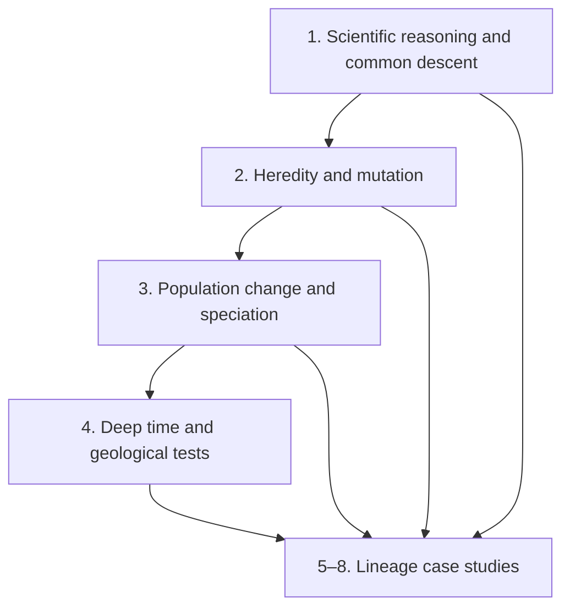

# Course map

This series builds a cumulative case. Erika first defines the claim and the rules for testing it, then explains how inherited variation changes populations, establishes the timescale on which those changes accumulate, and finally tests common descent against four difficult anatomical transitions.

> **Study route:** use this page to choose a topic, the short documents in
> `docs/` to revise across lessons, and each lesson folder for the complete
> caption-grounded account. The [timestamped transcript
> index](../sources/timestamped-transcript-index.md) is the fastest route to the
> surrounding words in the livestream; the [course roadmap](../ROADMAP.md)
> separates recorded lessons from Erika's original plan and future estimates.
> Keep the [full glossary](../GLOSSARY.md) and [technical
> appendix](../APPENDIX.md) open when a definition, equation, unit or lineage
> summary would otherwise interrupt revision.

## How the lessons depend on one another

The arrows are logical dependencies, not a claim that only one topic matters. A fossil sequence needs a chronology; a proposed anatomical transition needs inherited variation and developmental mechanisms; and all of those observations need a clear rule for what would support or undermine the explanation.

## The eight recorded lessons

| Lesson | Complete livestream | What the lesson contributes | Detailed notes |
| --- | --- | --- | --- |
| 1. History of evolutionary thought | [Watch (3:31:01)](https://www.youtube.com/watch?v=XoE8jajLdRQ) | Defines scientific testing, historical inference, nested classification, common descent and Darwin's natural selection. | [Lesson 1](../lessons/01-history-of-thought/README.md) |
| 2. Inheritance and mutation | [Watch (4:32:29)](https://www.youtube.com/watch?v=9uQWss3w8x0) | Connects Mendelian inheritance to chromosomes, DNA, mutation, regulation and novel variation. | [Lesson 2](../lessons/02-mutations/README.md) |
| 3. Natural selection, drift and speciation | [Watch (4:17:13)](https://www.youtube.com/watch?v=K2JCO6eXans) | Follows variants through populations using selection, drift and gene flow, then explains reproductive isolation. | [Lesson 3](../lessons/03-natural-selection/README.md) |
| 4. Age of the Earth | [Watch (4:40:59)](https://www.youtube.com/watch?v=dTVFcr4GCMk) | Builds deep time from strata, annual archives, isotope systems and independent calibration; tests apparent anomalies. | [Lesson 4](../lessons/04-age-of-earth/README.md) |
| 5. Whales | [Watch (4:05:21)](https://www.youtube.com/watch?v=fnY58Y8FJBQ) | Tests a land-to-sea transition using ears, ankles, limbs, development, genes, isotopes, geography and fossil order. | [Lesson 5](../lessons/05-whales/README.md) |
| 6. Birds | [Watch (4:59:22)](https://www.youtube.com/watch?v=vhOyNiv6PTY) | Tests the placement of birds within theropod dinosaurs using nested anatomy, feathers, development and flight mechanics. | [Lesson 6](../lessons/06-birds/README.md) |
| 7. Mammals | [Watch (5:26:35)](https://www.youtube.com/watch?v=TuWlGUq5Wi4) | Follows mammalian jaw, ear, teeth, palate, posture and physiology through synapsid history. | [Lesson 7](../lessons/07-mammals/README.md) |
| 8. Tetrapods | [Watch (5:41:14)](https://www.youtube.com/watch?v=aJofeBRFwvI) | Places tetrapods inside lobe-finned vertebrates and tests the transition with fossils, developmental genetics and a targeted discovery. | [Lesson 8](../lessons/08-tetrapods/README.md) |

## The conceptual spine

### 1. Define what is being explained

Evolution is population-level inherited change through generations. Common descent adds the historical claim that lineages converge on ancestral populations when followed backwards. Erika frames the problem as explaining diversity, clustered similarity and unequal degrees of resemblance—not the origin of the universe or the first life ([lesson 1, 55:20–56:43](https://www.youtube.com/watch?v=XoE8jajLdRQ&t=3320s)). Revise this foundation in [What evolution means](01-what-evolution-means.md).

### 2. Identify the source and transmission of variation

Darwin had no correct molecular account of heredity. The second lesson moves from Mendel's numerical inheritance patterns to chromosomes, meiosis, DNA copying, gene expression and mutation. Its central distinction is that recombination reshuffles existing alleles, whereas mutation changes the inherited sequence ([1:16:52](https://www.youtube.com/watch?v=9uQWss3w8x0&t=4612s)). Revise the mechanism in [Variation and selection](03-variation-and-selection.md).

### 3. Follow variants through populations

Mutation does not guarantee adaptation. Natural selection changes frequencies when inherited variants affect reproductive contribution; drift changes them through chance sampling; gene flow transfers them between populations. Erika explicitly treats these as different mechanisms rather than synonyms ([lesson 3, 36:40–37:56](https://www.youtube.com/watch?v=K2JCO6eXans&t=2200s)). Reduced gene flow allows differences and reproductive barriers to accumulate.

### 4. Establish an independently tested chronology

A long timescale is not assumed because evolution needs one. Annual tree, ice and sediment records, relative geological order, radiometric systems, astronomical cycles and historical eruptions cross-check one another. Erika's tree-ring/carbon-14 test starts with a prediction made before looking at the measurements ([2:24:37](https://www.youtube.com/watch?v=dTVFcr4GCMk&t=8677s)). Revise the network in [Deep time and converging evidence](05-deep-time-and-converging-evidence.md).

### 5. Demand agreement across independent evidence

The four case studies ask the same high-level question: does one ancestry model explain classification, fossil order, anatomy, development, genomes and ecology together? Erika states this demanding standard before the whale evidence ([lesson 5, 38:00–39:20](https://www.youtube.com/watch?v=fnY58Y8FJBQ&t=2280s)). Use [Reading evolutionary evidence](06-reading-the-evidence.md) before attempting the case studies.

*Darwin's 1837 “I think” sketch is a compact image of the course's organising idea: inherited history produces branches, not a ladder of progress. [Wikimedia Commons source](https://commons.wikimedia.org/wiki/File:Darwin_Tree_1837.png), public domain.*

## Case-study comparison

| Case | Relationship being tested | Especially diagnostic observations | Best revision page |
| --- | --- | --- | --- |
| Whales | Cetaceans within even-toed hoofed mammals | Cetacean involucrum with artiodactyl ankle; land-to-sea isotope and limb sequence; tooth and hind-limb development | [Whales](case-studies/whales.md) |
| Birds | Living birds within theropod dinosaurs | Furcula, wrist, hand, pelvis and feather mosaics; embryonic teeth and pelvis; ordered flight characters | [Birds](case-studies/birds.md) |
| Mammals | Crown mammals within mammaliaforms, cynodonts, therapsids and synapsids | Double jaw joint; jaw bones becoming middle-ear ossicles; palate, teeth, posture and metabolic proxies | [Mammals](case-studies/mammals.md) |
| Tetrapods | Digited vertebrates within Sarcopterygii | One-bone/two-bones appendage pattern; air breathing in water; *Tiktaalik* prediction; aquatic digits | [Tetrapods](case-studies/tetrapods.md) |

## A practical revision loop

1. Read the relevant overview and explain its main diagram without looking back at the prose.
2. Answer the active-recall questions from memory.
3. Use the timestamp beside any weak point to hear Erika's explanation in context.
4. Open the linked detailed lesson note for the full examples, qualifications and Will Duffy exchange.
5. Reconstruct the case as **claim → prediction → observation → limitation**, rather than memorising a list of fossil names.

Finish with the [revision checklist](revision/checklist.md) and use the [glossary](revision/glossary.md) whenever a technical word is doing more work than its everyday meaning suggests.
