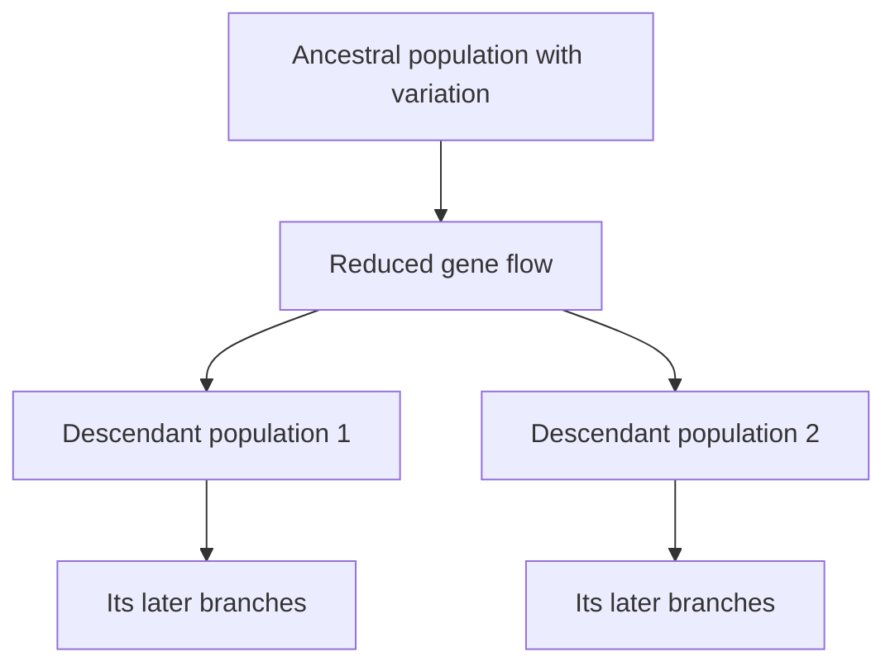

# What evolution means

[Course map](00-course-map.md) · [History and reasoning](02-history-and-reasoning.md) · [Variation and selection](03-variation-and-selection.md) · [Glossary](revision/glossary.md)

Evolution is **change in inherited characteristics in a population across generations**. In population-genetic language, it can be measured as a change in allele frequencies. Erika's historical summary adds a second scale: populations form lineages, lineages diverge, and tracing those branches backwards leads to shared ancestral populations ([56:31–56:43](https://www.youtube.com/watch?v=XoE8jajLdRQ&t=3391s)).

This definition is deliberately narrower than many arguments about “evolution.” It identifies what changes, what can be inherited and what unit persists through time.

## The four parts of the definition

| Part | Meaning | Why it matters |
| --- | --- | --- |
| **Population** | A connected set of organisms whose inherited variants can pass into later generations. | An individual can develop, learn or acclimatise, but it does not change the population's gene pool by doing so. |
| **Inherited** | The difference must be transmissible through reproduction, normally through germline DNA. | A scar or a trained muscle is an acquired individual change, not an inherited evolutionary change. |
| **Change** | Variants become more or less common, new variants arise, or lineages gain and lose traits over generations. | Evolution does not require every change to create a dramatic new structure. |
| **Generations** | Descendants inherit a modified statistical distribution from their parents' generation. | Selection and drift work through differential contribution, not an adult transforming because it needs to. |

Erika makes the population level explicit when she defines evolution as change in allele frequencies across generations ([lesson 3, 33:20–36:20](https://www.youtube.com/watch?v=K2JCO6eXans&t=2000s)). A dark-colour allele rising from 10% to 60% is evolution even if the population is still given the same species name.

## From inheritance to a branching history

Offspring resemble their parents but are not identical. Mutation supplies new sequence variation; recombination creates new combinations of existing variants; selection, drift and gene flow alter how variants are distributed. If two populations cease exchanging genes, their histories can diverge.

The fork is not one animal giving birth to a member of a sharply different modern species. Every child belongs to a population continuous with its parents. Small differences accumulate along separate chains of reproduction until distant descendants can be recognisably different or reproductively isolated. Erika uses changing languages to make this gradual boundary problem intuitive ([lesson 3, 2:49:40–2:53:13](https://www.youtube.com/watch?v=K2JCO6eXans&t=10180s)).

## Descent with modification and common descent are related but distinct

**Descent with modification** says inherited populations change. **Common descent** says different lineages connect through earlier populations. **Universal common ancestry** extends the tree to all known life. Erika separates these from natural selection when listing Darwin's five propositions ([2:22:20](https://www.youtube.com/watch?v=XoE8jajLdRQ&t=8540s)):

1. descent with modification;
2. common descent;
3. multiplication of species;
4. gradual accumulation of much change; and
5. natural selection as one mechanism.

Natural selection can operate even if the question under discussion is only short-term change in one population. Conversely, a common-descent claim requires historical evidence—nested traits, genetics, development and fossil order—not merely the observation that selection occurs.

*Darwin's first evolutionary-tree sketch. The branch points represent shared ancestry; the tips are not ranked from inferior to superior. [Wikimedia Commons source](https://commons.wikimedia.org/wiki/File:Darwin_Tree_1837.png), public domain.*

## How to read a tree without turning it into a ladder

A phylogenetic tree is a hypothesis about relationships. Read it from branch points, not from left-to-right visual position.

- A **node** represents a shared ancestral population.
- Two branches sharing a more recent node are more closely related than branches whose connection lies deeper.
- A living species at one tip is normally a cousin, not the ancestor of another living tip.
- Rotating branches around a node does not change the relationships.
- A short-looking branch is not “less evolved,” and a tip drawn at the top is not the goal of the tree.

Thus humans did not descend from living chimpanzees, whales did not descend from living hippos, and tetrapods did not descend from living lungfish. Each pair shares an earlier population. Erika corrects the hippo-to-whale caricature directly in lesson 7 ([18:46–20:02](https://www.youtube.com/watch?v=TuWlGUq5Wi4&t=1126s)).

## Nested groups follow from ancestry

A descendant does not leave every ancestral group when it acquires new traits. A human is simultaneously an animal, chordate, tetrapod, mammal, primate and ape. A whale is still a mammal and tetrapod despite losing external hind limbs. A bird is still a theropod dinosaur despite acquiring a shortened tail and specialised wing.

This nesting is why scientific and everyday labels can feel different. “Fish” often means an aquatic vertebrate with fins, but that everyday set excludes tetrapod descendants and is therefore not a complete clade. Erika's more precise statement is that tetrapods are nested within the lobe-finned vertebrate lineage, Sarcopterygii ([lesson 8, 2:46:23–2:48:32](https://www.youtube.com/watch?v=aJofeBRFwvI&t=9983s)).

## Mechanisms do different jobs

| Mechanism | What it contributes | What it does not imply |
| --- | --- | --- |
| Mutation | New heritable sequence variants | Mutations appear because an organism requests them |
| Recombination | New combinations of parental alleles | New DNA “letters” are created by shuffling alone |
| Natural selection | Non-random frequency change when variants affect reproductive success | Evolution always means improvement |
| Genetic drift | Chance sampling changes representation, especially in small populations | Every fixed trait was adaptive |
| Gene flow | Moves alleles between populations | Connected populations must remain identical |

Erika groups mutation, gene flow, drift and selection as mechanisms of evolutionary change early in lesson 3 ([36:40–37:56](https://www.youtube.com/watch?v=K2JCO6eXans&t=2200s)). Selection is important, but it is not a synonym for evolution.

## “Fitness” is contextual, not a ranking of worth

Biological fitness is relative reproductive contribution in a specified environment. A dark pocket mouse can be better camouflaged on lava and more conspicuous on pale sand; the sign of the advantage reverses with the substrate ([lesson 2, 2:13:43–2:14:49](https://www.youtube.com/watch?v=9uQWss3w8x0&t=8023s)). A trait may improve survival but reduce mating success, or aid one life stage while costing another.

Natural selection therefore has no foresight. Erika's finch example begins with birds that already vary. When food conditions change, some beak variants obtain more food and contribute more descendants; the environment does not instruct an individual bird to reshape its beak ([2:27:15–2:28:37](https://www.youtube.com/watch?v=XoE8jajLdRQ&t=8835s)).

## Speciation is a process, not a single birth

Species definitions are useful measurement rules, but no one rule covers living sexual organisms, asexual microbes and fossils. The biological species concept asks about gene exchange; morphological and lineage concepts answer different questions. Hybrid zones and ring species show intermediate degrees of isolation rather than clean universal borders ([lesson 3, 2:44:40–2:45:37](https://www.youtube.com/watch?v=K2JCO6eXans&t=9880s)).

Geographic separation can reduce gene flow. Mutation, drift and different selection then act independently; behavioural, mechanical, gametic or hybrid-fertility barriers may accumulate. If the barrier disappears, the populations may fuse, maintain a hybrid zone or remain separate depending on how much isolation evolved ([2:56:20–2:59:59](https://www.youtube.com/watch?v=K2JCO6eXans&t=10580s)).

## What evolution does not claim by itself

| Common misunderstanding | Correction |
| --- | --- |
| “Evolution explains the origin of the universe.” | Cosmology is a different field and question. |
| “Evolution and abiogenesis are the same claim.” | Evolution in this course concerns inherited change after reproducing life exists; origin-of-life research asks how the first such systems arose. |
| “One modern kind turns into another modern kind.” | Living groups are usually cousin branches; populations diverge from earlier populations. |
| “Every trait is selected and every lineage improves.” | Drift, trade-offs, changing environments, loss and extinction are all expected. |
| “Macro-evolution needs a second mechanism.” | Large-scale patterns are branching, extinction and accumulated population change considered over longer intervals. |
| “Accepting a natural mechanism settles purpose or theology.” | Erika separates a scientifically testable account of sequence and mechanism from philosophical or theological interpretation ([lesson 1, 30:21–33:01](https://www.youtube.com/watch?v=XoE8jajLdRQ&t=1821s)). |

## A compact answer to memorise

> Evolution is inherited population change across generations. Mutation and recombination generate or rearrange variation; selection, drift and gene flow change its distribution. When populations become sufficiently isolated, their lineages can diverge and branch. Common descent predicts that those branches will form a nested pattern across anatomy, development, genomes, geography and the fossil record.

## Active recall

1. Why can an individual acclimatise without evolving?
2. Separate descent with modification, common descent, speciation and natural selection.
3. Why are two living species normally cousins rather than ancestor and descendant?
4. Give an example in which the same phenotype changes fitness when the environment changes.
5. Why do fuzzy species boundaries fit gradual lineage divergence?
6. Explain why losing a visible trait does not remove a lineage from its ancestral clade.

For the full treatment, use [Lesson 1: classification and ancestry](../lessons/01-history-of-thought/02-classification-and-ancestry.md), [Lesson 3: mechanisms](../lessons/03-natural-selection/01-mechanisms.md) and [Lesson 3: divergence and speciation](../lessons/03-natural-selection/03-divergence-and-speciation.md).
