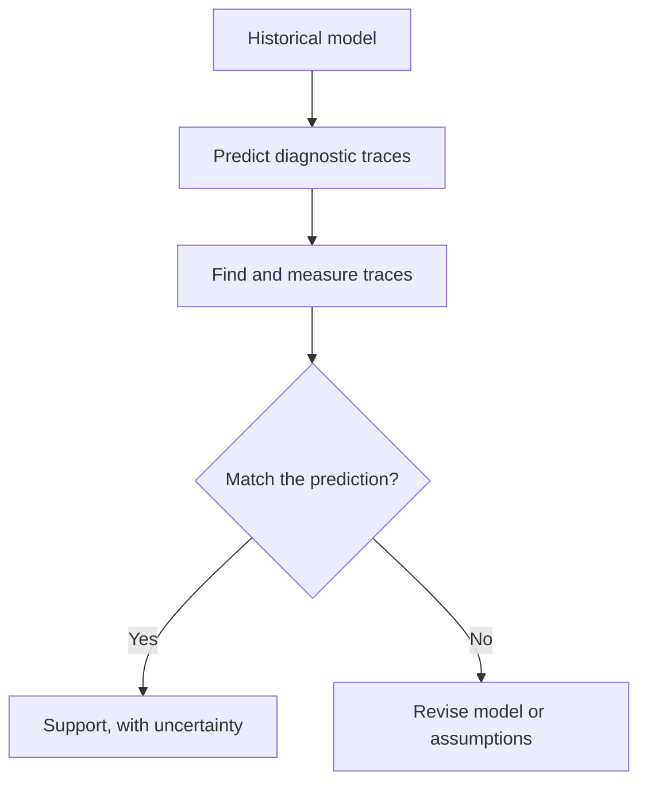
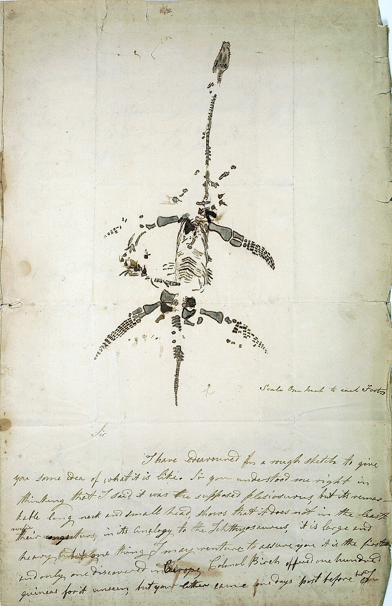

# History and scientific reasoning

[Course map](00-course-map.md) · [What evolution means](01-what-evolution-means.md) · [Reading evidence](06-reading-the-evidence.md) · [Full lesson 1](../lessons/01-history-of-thought/README.md)

The history lesson is not a parade of people who became progressively “more correct.” Erika uses it to show which observations had to be explained and how explanations become scientific: state a causal model, expose it to possible failure, compare it with alternatives and revise it when the evidence demands.

## Science has a limited but powerful remit

Erika defines science as a way of acquiring knowledge about observable phenomena through natural causal explanations ([29:49–30:36](https://www.youtube.com/watch?v=XoE8jajLdRQ&t=1789s)). The restriction is methodological. If a claim is defined so that no natural observation can count for or against it, science cannot discriminate it from alternatives. That is different from declaring every non-scientific question meaningless or false.

Her working requirements are:

| Requirement | Practical question |
| --- | --- |
| Observable consequences | What trace, measurement or repeated pattern should the cause produce? |
| Independent checking | Could another investigator repeat the observation or audit the specimen and method? |
| Falsifiability | Which possible result would count against the explanation? |
| Provisional conclusions | What new evidence would justify revision? |

“Falsifiable” does not mean false. It means the model takes an evidential risk. Erika's tomato example makes this concrete: if fertiliser A is proposed to improve growth, equal performance or better growth under B must be permitted to undermine that hypothesis ([33:45–36:16](https://www.youtube.com/watch?v=XoE8jajLdRQ&t=2025s)).

*A conclusion produces new observations rather than ending inquiry. Diagram by Thebiologyprimer, [Wikimedia Commons source](https://commons.wikimedia.org/wiki/File:The_Scientific_Method_%28simple%29.png), [CC0](https://creativecommons.org/publicdomain/zero/1.0/).*

## Hypothesis, theory and law do different work

- A **hypothesis** is a specific, testable proposed explanation.
- A **theory** is a broad explanatory framework joining many tested observations.
- A **law** describes a regular relationship, often mathematically.

Erika contrasts the terms at [38:01–38:24](https://www.youtube.com/watch?v=XoE8jajLdRQ&t=2281s). A theory does not graduate into a law; explanation and description are different jobs. Calling evolution “only a theory” imports the everyday meaning of guess into a technical context.

## Historical science still makes risky predictions

Past events cannot be rerun, but they can leave present traces. The test is whether a model constrains **what**, **where** and **when** investigators should observe before they search.

Erika's key example is *Tiktaalik*. Researchers used the expected interval between known fish-like and tetrapod-like fossils, the environment needed to preserve the animal and the predicted anatomical mosaic to target Arctic rocks. The discovery matched those constraints ([41:12–41:32](https://www.youtube.com/watch?v=XoE8jajLdRQ&t=2472s)); the foundational descriptions are Daeschler, Shubin and Jenkins on [the body plan](https://doi.org/10.1038/nature04639) and Shubin, Daeschler and Jenkins on [the pectoral fin](https://doi.org/10.1038/nature04637).

The logic also appears in geology, forensics and pathology. Modern earthquakes, impacts, infections and injuries create diagnostic patterns; old traces can be compared against them. The inference is strongest when rival causes predict different traces and several independent observations converge.

## Before evolutionary theory: fixity, hierarchy and purpose

Plato's essentialism treated variation as departure from an ideal form. Aristotle's hierarchy arranged forms but did not have one form becoming another. Later versions of the Great Chain of Being placed creation in a ranked order rather than a branching genealogy ([58:20–1:00:03](https://www.youtube.com/watch?v=XoE8jajLdRQ&t=3500s)). Erika also notes traditions outside this simple European sequence—Zhuang Zhou on transformation, non-literal readings in Augustine, and discussions of variation and adaptation in Islamic scholarship—while carefully distinguishing such precedents from a modern mechanism of evolution ([1:00:20–1:02:24](https://www.youtube.com/watch?v=XoE8jajLdRQ&t=3620s)).

Natural theology, represented by William Paley's watch analogy, interpreted biological complexity as purposeful construction ([1:03:40–1:04:20](https://www.youtube.com/watch?v=XoE8jajLdRQ&t=3820s)). Erika's methodological objection is not that design is philosophically impossible. It is that apparent design alone does not specify an observation that distinguishes direct construction from complexity produced by natural processes. A scientific design model would need its own discriminating predictions.

## Fossils split three questions that are often collapsed

1. Do species become extinct?
2. Is Earth old enough to contain a long history?
3. Do lineages transform?

Georges Cuvier accepted extinction and repeated catastrophes while retaining species fixity. Jean-Baptiste Lamarck accepted transformation but proposed an incorrect simple mechanism of inherited use and disuse. Their positions show why accepting one part of the later synthesis does not logically establish the rest.

Mary Anning's marine reptiles intensified the extinction problem because they were large, distinctive organisms with no familiar living match ([1:33:40–1:34:06](https://www.youtube.com/watch?v=XoE8jajLdRQ&t=5620s)).

*Anning's own letter and drawing, not a modern restoration. Mary Anning via the Wellcome Collection, [Wikimedia Commons source](https://commons.wikimedia.org/wiki/File:Mary_Anning_Plesiosaurus.jpg), public domain.*

Cuvier compared bones and teeth with known anatomy and tracked fossil assemblages by layer and locality. Different communities and settings led him to repeated catastrophes rather than one flood ([1:36:24–1:38:41](https://www.youtube.com/watch?v=XoE8jajLdRQ&t=5784s)). His conclusion was historically limited, but the comparative method mattered.

## Geology supplied time before Darwin supplied a mechanism

James Hutton reasoned from ordinary erosion, deposition and ancient unconformities. Charles Lyell collected modern and fossil ripple marks, mud cracks, uplift and erosion into a wider case that the same physical laws operate through time. Erika introduces uniformitarian reasoning at [1:48:20–1:49:00](https://www.youtube.com/watch?v=XoE8jajLdRQ&t=6500s).

Modern **actualism** does not claim every process is slow or every rate constant. Eruptions, landslides, floods and impacts can be rapid. The question is whether the observed deposit carries the expected signature of that process ([1:52:00–1:53:00](https://www.youtube.com/watch?v=XoE8jajLdRQ&t=6720s)). “A catastrophe happened somewhere” is not evidence that every stratum formed in the same catastrophe.

## Classification revealed a pattern before common descent explained it

Linnaeus formalised nested taxonomy while believing he was cataloguing fixed creation. Yet organisms repeatedly fell into groups within groups. Erika's ostrich–dog–human comparison shows broad shared chordate characters, a mammalian grouping of dog and human, and then separation into Carnivora and Primates ([1:28:40–1:29:20](https://www.youtube.com/watch?v=XoE8jajLdRQ&t=5320s)). Linnaeus retained humans with apes because he could find no anatomical rule that coherently excluded them ([1:30:40](https://www.youtube.com/watch?v=XoE8jajLdRQ&t=5440s)).

Common descent supplies a causal explanation for this hierarchy: descendants inherit broad ancestral traits while later modifications diagnose narrower branches. Convergence can affect individual characters, so the inference comes from repeated suites and, today, their agreement with genomic trees.

## Darwin and Wallace join population pressure to inheritance

Darwin's *Beagle* observations did not produce natural selection in one flash. Lyell supplied a geological framework; a Chilean earthquake and uplifted marine shells showed landscapes changing; South American fossils documented extinction and succession; Galápagos birds combined island variation with mainland resemblance ([2:07:31–2:15:20](https://www.youtube.com/watch?v=XoE8jajLdRQ&t=7651s)).

Malthus supplied the population pressure: organisms can produce more offspring than limited resources support. Darwin combined that fact with variation and inheritance. If some inherited differences affect reproductive success, their representation can change ([2:23:40–2:28:37](https://www.youtube.com/watch?v=XoE8jajLdRQ&t=8620s)).

Alfred Russel Wallace independently reached a similar mechanism after studying geographical distributions in the Malay Archipelago. Wallace's Line—different faunas occupying comparable roles on either side—showed that geographic history could matter as much as apparent fit to an environment ([2:19:14–2:20:36](https://www.youtube.com/watch?v=XoE8jajLdRQ&t=8354s)). The joint 1858 presentation and Darwin's 1859 *Origin* mark a convergence of reasoning, not a solitary revelation.

## Scrutiny and correction are part of the evidence

Peer review does not guarantee truth. It exposes methods and inferences to relevant expertise. Erika's grant example shows a reviewer identifying a missing power analysis that could have left a study unable to support its intended statistics ([47:30–48:18](https://www.youtube.com/watch?v=XoE8jajLdRQ&t=2850s)).

The *Homo naledi* burial dispute is her live example. A burial interpretation was challenged on taphonomic, geochemical and sedimentological grounds; Erika presents the disagreement as science operating through criticism rather than authority ([52:55–54:21](https://www.youtube.com/watch?v=XoE8jajLdRQ&t=3175s)). Compare the revised [burial proposal](https://doi.org/10.7554/eLife.89106) with the [critical assessment](https://doi.org/10.1016/j.jhevol.2023.103464).

The habit to learn is proportional confidence: identify the exact claim, check the original specimen and methods, distinguish observation from interpretation, and state what remains unresolved.

## A revision framework for any historical claim

| Step | Question |
| --- | --- |
| Define | What exact historical relationship or event is proposed? |
| Predict | What anatomy, date, distribution or chemical trace should follow? |
| Observe | What was measured, and how was it preserved or sampled? |
| Compare | Could another model predict the same result? What extra pattern distinguishes them? |
| Cross-check | Do independent methods with different failure modes agree? |
| Calibrate confidence | Is this direct observation, a supported inference, a tentative reconstruction or an unresolved anomaly? |

## Active recall

1. Why does “science cannot test this claim” not mean “the claim is false”?
2. Reconstruct the *Tiktaalik* discovery as a risky historical prediction.
3. Separate Cuvier's views on extinction, geological history and transformation.
4. Why does actualism include both slow erosion and rapid catastrophes?
5. Which observations did Darwin combine with Malthus's population argument?
6. Why is correction of a published interpretation a feature rather than an automatic failure of science?
