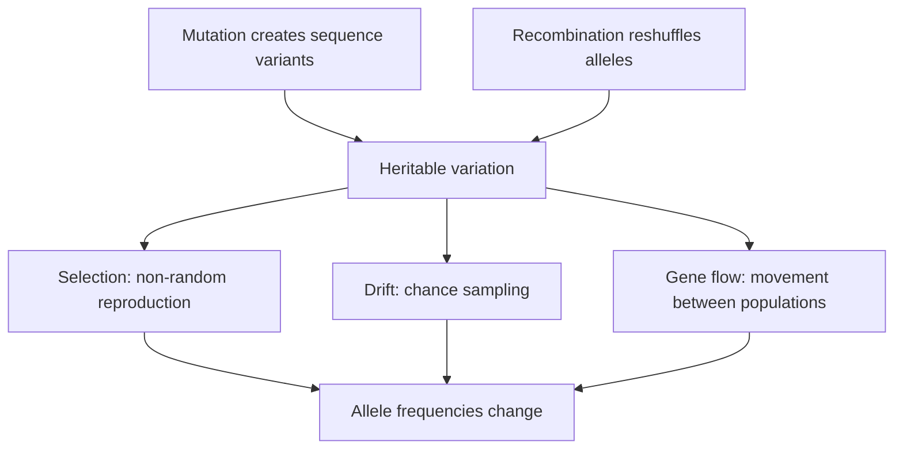

# Variation, mutation and selection

[Course map](00-course-map.md) · [What evolution means](01-what-evolution-means.md) · [Deep time](05-deep-time-and-converging-evidence.md) · [Full lesson 2](../lessons/02-mutations/README.md) · [Full lesson 3](../lessons/03-natural-selection/README.md)

Evolution needs heritable variation, but variation and adaptation are not the same thing. Erika's second lesson explains how inherited differences arise and are transmitted; the third explains what happens to those differences in populations. The core causal order is:

Mutation supplies new sequence; selection does not summon the mutation an organism needs. The environment affects the **consequence** of a variant, not its purposeful production ([lesson 8 review, 1:15:01–1:18:05](https://www.youtube.com/watch?v=aJofeBRFwvI&t=4501s)).

## Heredity had to be explained

Darwin's mechanism required offspring to inherit useful differences, but his pangenesis proposal was wrong. Erika returns to two unresolved questions: why do offspring resemble their parents, and where do new variants originate? ([lesson 2, 40:12–41:59](https://www.youtube.com/watch?v=9uQWss3w8x0&t=2412s)).

Mendel's pea crosses showed that inherited factors do not simply blend away. In a simple dominant/recessive locus, crossing two heterozygotes predicts a 1:2:1 genotype ratio and a 3:1 phenotype ratio ([49:08–49:31](https://www.youtube.com/watch?v=9uQWss3w8x0&t=2948s)).

*The square displays probabilities across many fertilisations, not a guarantee that every four offspring contain the exact ratio. Diagram by Madeleine Price Ball, [source](https://commons.wikimedia.org/wiki/File:Punnett_square_mendel_flowers.svg), [CC0](https://creativecommons.org/publicdomain/zero/1.0/).*

Learn the terms precisely:

- An **allele** is a sequence variant at a locus.
- A **genotype** describes the variants an organism carries.
- A **phenotype** is a measured outcome produced through genotype, development and environment.
- **Dominant** means expressed in a heterozygote; it does not mean adaptive, common, stronger or newer.
- **Segregation** describes the separation of allele copies into gametes.
- **Independent assortment** is the simple expectation for unlinked loci; linkage can change the ratio.

Many traits are polygenic, pleiotropic or environmentally influenced. Mendel's clean characters demonstrate testable inheritance, not a universal rule that every phenotype maps to one dominant/recessive pair ([52:53–53:40](https://www.youtube.com/watch?v=9uQWss3w8x0&t=3173s)).

## Cells connect pedigrees to chromosomes

Chromosomes package DNA. **Mitosis** makes body-cell lineages; **meiosis** reduces chromosome number to form gametes; crossing over during meiosis creates new combinations of parental alleles. Erika's card-shuffle analogy is useful: recombination can deal a combination never seen before, but it has not invented a new card ([1:16:52–1:17:31](https://www.youtube.com/watch?v=9uQWss3w8x0&t=4612s)). Mutation changes the sequence itself.

Because DNA is inherited, relationship becomes testable. The same comparisons that recover recorded family pedigrees can be extended to dog breeds, canids and broader branches. Erika asks a separate-ancestry model to specify where that nested genetic convergence should stop and why ([1:20:51–1:23:20](https://www.youtube.com/watch?v=9uQWss3w8x0&t=4851s)).

## DNA structure makes copying possible

The two DNA strands have complementary base pairing: adenine with thymine, guanine with cytosine. Separating the strands allows each to guide synthesis of a partner. Erika introduces this molecular hierarchy at [1:01:26–1:03:02](https://www.youtube.com/watch?v=9uQWss3w8x0&t=3686s).

*Public-domain diagram by Jerome Walker, derived from Michael Ströck; [Wikimedia Commons source](https://commons.wikimedia.org/wiki/File:DNA_double_helix_horizontal.png).*

Do not equate “gene” with “one visible trait.” A genome contains protein-coding regions, regulatory sequences, repeats and mobile-element-derived regions. Protein-coding DNA is a small fraction of the human genome in Erika's overview, while non-coding sequence can still regulate where and when genes are expressed ([1:03:54–1:05:00](https://www.youtube.com/watch?v=9uQWss3w8x0&t=3834s)). Conversely, biochemical activity alone does not show that every base is indispensable. Large “gene desert” deletions in mice produced no detected phenotype under the reported measures, a result Erika uses to test the stronger claim that all such sequence is essential ([1:06:14–1:07:01](https://www.youtube.com/watch?v=9uQWss3w8x0&t=3974s)); see [Nóbrega et al. (2004)](https://pubmed.ncbi.nlm.nih.gov/15496924/).

## From DNA to protein—and where substitutions matter

During **transcription**, selected DNA is copied into RNA. During **translation**, the ribosome reads messenger-RNA codons and builds a peptide. A codon is a three-base unit; several codons can specify the same amino acid. Erika explains translation at [1:31:47–1:34:08](https://www.youtube.com/watch?v=9uQWss3w8x0&t=5507s) and codon redundancy at [1:42:28](https://www.youtube.com/watch?v=9uQWss3w8x0&t=6148s). This redundancy means a substitution may be synonymous, may change one amino acid, or may create/erase a stop signal depending on its position.

“Coding” is not the only route to phenotypic change. A regulatory mutation can alter the time, place or amount of gene expression; because developmental regulators control downstream networks, a small regulatory change may coordinate several anatomical effects.

## Mutation is a category, not one kind of typo

| Scale | Example effect | Revision caution |
| --- | --- | --- |
| Base substitution | Synonymous, amino-acid change, stop change or altered regulation | Effect depends on sequence and context. |
| Insertion/deletion | Adds or removes bases; can shift a coding frame | Size alone does not determine harm. |
| Duplication | Creates an extra copy of a gene or larger region | Copies can retain, divide, lose or acquire functions. |
| Rearrangement | Inversion, translocation or other reorganisation | Can change dosage, linkage or regulation. |
| Chromosome-number change | Alters whole chromosome complements | Consequences vary sharply among lineages and developmental systems. |

A mutation is heritable in the evolutionary sense when it reaches the germ line. A somatic mutation can matter medically to one person but normally does not enter the next generation. Erika defines mutation and separates somatic from germline change at [1:43:33–1:43:50](https://www.youtube.com/watch?v=9uQWss3w8x0&t=6213s), then discusses mutation scale at [1:44:14](https://www.youtube.com/watch?v=9uQWss3w8x0&t=6254s).

Gene duplication is especially important because one copy can preserve an old role while the other is released to accumulate changes. The copies may split an ancestral function (**subfunctionalisation**), acquire a new one (**neofunctionalisation**) or lose function. Erika introduces the duplication logic at [2:08:01–2:08:58](https://www.youtube.com/watch?v=9uQWss3w8x0&t=7681s).

## Effects are contextual and include trade-offs

Mutation effects are not permanent moral labels. The same allele can be beneficial, neutral or harmful under different diets, pathogens, climates or genetic backgrounds.

| Example from Erika | What changes | Why context matters |
| --- | --- | --- |
| Lactase persistence | Regulatory variants maintain adult **LCT** expression | Milk is a valuable resource in dairying populations; see [Tishkoff et al. (2007)](https://doi.org/10.1038/ng1946) and [1:57:43–1:58:32](https://www.youtube.com/watch?v=9uQWss3w8x0&t=7063s). |
| CCR5-Δ32 | A 32-base deletion reduces a cell-surface route used by some HIV strains | It is not universal immunity and can have other consequences; see [Samson et al. (1996)](https://pubmed.ncbi.nlm.nih.gov/8751444/) and [1:59:34](https://www.youtube.com/watch?v=9uQWss3w8x0&t=7174s). |
| Sickle-cell allele | Changes haemoglobin; heterozygotes can gain malaria protection | Homozygous disease and heterozygote advantage must not be collapsed into “sickle cell is beneficial.” |
| Pocket-mouse coat colour | **MC1R** or **Agouti** variants can darken fur | Dark is camouflaged on lava and conspicuous on sand ([2:13:43–2:14:49](https://www.youtube.com/watch?v=9uQWss3w8x0&t=8023s)); see [Hoekstra et al. (2006)](https://doi.org/10.1126/science.1126121). |

The Bajau diving example joins genotype, physiology and ecology: variation near **PDE10A** is associated with larger spleens, which can release oxygenated red cells during repeated breath-hold diving ([2:11:39–2:12:18](https://www.youtube.com/watch?v=9uQWss3w8x0&t=7899s)); see [Ilardo et al. (2018)](https://pubmed.ncbi.nlm.nih.gov/29677510/). The claim is population-level adaptation, not that diving during one lifetime enlarges inherited DNA.

## New functions can be reconstructed, not merely asserted

Antifreeze proteins are Erika's strongest molecular examples. Antarctic notothenioids possess an antifreeze glycoprotein gene assembled through recruitment and repeat expansion from material related to a relocated trypsinogen gene. Comparative sequences expose homologous pieces and rearrangement ([2:20:09–2:20:54](https://www.youtube.com/watch?v=9uQWss3w8x0&t=8409s)); see [Chen, DeVries and Cheng (1997)](https://pmc.ncbi.nlm.nih.gov/articles/PMC20523/).

Arctic cod reached similar ice-binding chemistry by a different genomic route: expansion of a short non-coding seed sequence followed by acquisition of expression and secretion machinery ([2:21:07–2:21:46](https://www.youtube.com/watch?v=9uQWss3w8x0&t=8467s)); see [Baalsrud et al. (2018)](https://pmc.ncbi.nlm.nih.gov/articles/PMC5850335/). Similar function therefore does not automatically imply the same recent ancestry.

## Four mechanisms change populations

| Mechanism | Test to ask | Characteristic consequence |
| --- | --- | --- |
| Mutation | Did a new heritable variant arise? | Adds raw sequence variation. |
| Natural selection | Did variants systematically differ in reproductive success? | Non-random frequency change relative to that environment. |
| Genetic drift | Could chance sampling explain the change, especially in a small group? | Frequencies wander; alleles can fix or disappear regardless of advantage. |
| Gene flow | Did migrants or gametes move between populations? | Transfers alleles and often reduces divergence. |

The **Hardy–Weinberg equilibrium** is a null model for no evolution at a simple locus under idealised conditions: no selection, mutation, migration, drift or non-random mating. Departures tell researchers that at least one assumption may be violated; equilibrium is not a claim that real populations never change ([lesson 3, 1:01:20–1:04:00](https://www.youtube.com/watch?v=K2JCO6eXans&t=3680s)).

## Natural selection is differential reproduction

Selection requires:

1. individuals vary;
2. some variation is heritable;
3. more offspring are produced than all can contribute equally;
4. variants affect survival, mating or reproduction in the current conditions; and
5. those differences change the next generation's distribution.

Survival alone is not fitness. An animal may live a long time and leave no descendants. A small average reproductive difference can move a population without every less-suited individual dying.

Erika's Galápagos finch account is powerful because the Grants measured beaks, survival and offspring across changing drought conditions. A drought altered seed availability, favouring larger, deeper beaks; later conditions could reverse the direction. The trait distribution moved rather than every bird changing its beak ([lesson 3, 42:03–55:43](https://www.youtube.com/watch?v=K2JCO6eXans&t=2523s)).

*John Gould's historical plate helped establish that Darwin's varied island birds were finches. [Wikimedia Commons source](https://commons.wikimedia.org/wiki/File:Darwin%27s_finches_by_Gould.jpg), public domain.*

Other field examples test different links:

- Replicated peppered-moth studies connect background, predation and frequency change rather than relying on staged textbook photographs ([1:05:20–1:20:51](https://www.youtube.com/watch?v=K2JCO6eXans&t=3920s)).
- Pocket mice show similar dark phenotypes arising through different genetic routes on different lava flows ([1:35:40–1:38:02](https://www.youtube.com/watch?v=K2JCO6eXans&t=5740s)).
- Hurricanes changed the measured distribution of anole toe-pad and limb traits by preferentially removing weaker grippers ([1:40:03–1:41:03](https://www.youtube.com/watch?v=K2JCO6eXans&t=6003s)).
- Intensive ivory hunting reversed the reproductive value of tusks and increased tusklessness in a studied elephant population ([1:42:36–1:45:07](https://www.youtube.com/watch?v=K2JCO6eXans&t=6156s)).

## Drift and founder effects are not weak selection

Drift is sampling. A small group founding an island may carry allele frequencies unlike the source population simply because it is a small sample. Subsequent chance reproduction can amplify the difference. Erika distinguishes drift, founder effects and bottlenecks at [lesson 3, 2:22:40–2:27:20](https://www.youtube.com/watch?v=K2JCO6eXans&t=8560s).

*External teaching diagram by Professor marginalia, [Wikimedia Commons source](https://commons.wikimedia.org/wiki/File:Founder_effect_with_drift.jpg), [CC BY-SA 3.0](https://creativecommons.org/licenses/by-sa/3.0/).*

Loss of diversity matters because future environments can only select among variants available or newly produced. Drift can remove a useful allele before the environment in which it would help arrives.

## Isolation turns population change into branching

Geographic barriers reduce gene flow. Each side then receives its own mutations, drift samples independently, and selection may differ. Reproductive barriers can arise at the stages of encounter, mate recognition, mechanical compatibility, fertilisation, development and hybrid fertility ([lesson 3, 2:41:40–2:43:55](https://www.youtube.com/watch?v=K2JCO6eXans&t=9700s)).

The boundary is expected to be fuzzy. Ring species, hybrid zones and rare fertile hybrids show degrees of connection. This does not make population structure imaginary; it means a human label is being placed on a continuous historical process.

## Active recall

1. Why does Mendelian inheritance not imply that every phenotype is controlled by one dominant/recessive locus?
2. Contrast recombination with mutation.
3. Why can the same mutation change from beneficial to harmful without its DNA sequence changing?
4. Explain the different genomic origins of Antarctic and Arctic fish antifreeze proteins.
5. Use a field example to separate natural selection from individual change.
6. Why is a founder effect drift rather than weak selection?
7. List three stages at which reproductive isolation can arise.

Continue with [Deep time and converging evidence](05-deep-time-and-converging-evidence.md), or open the full notes on [inheritance](../lessons/02-mutations/01-inheritance-and-variation.md), [DNA and mutation](../lessons/02-mutations/02-dna-and-mutation.md), [selection](../lessons/03-natural-selection/02-selection-in-populations.md) and [speciation](../lessons/03-natural-selection/03-divergence-and-speciation.md).
