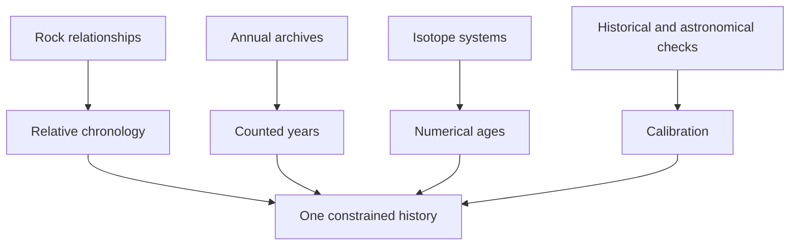
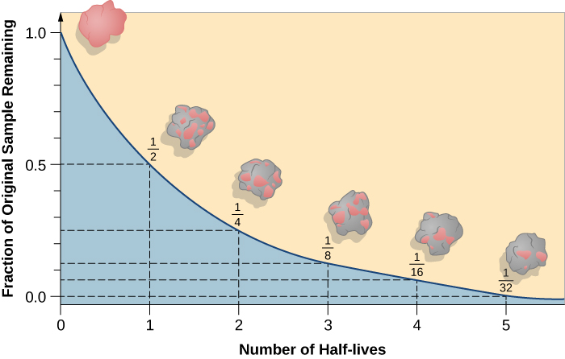
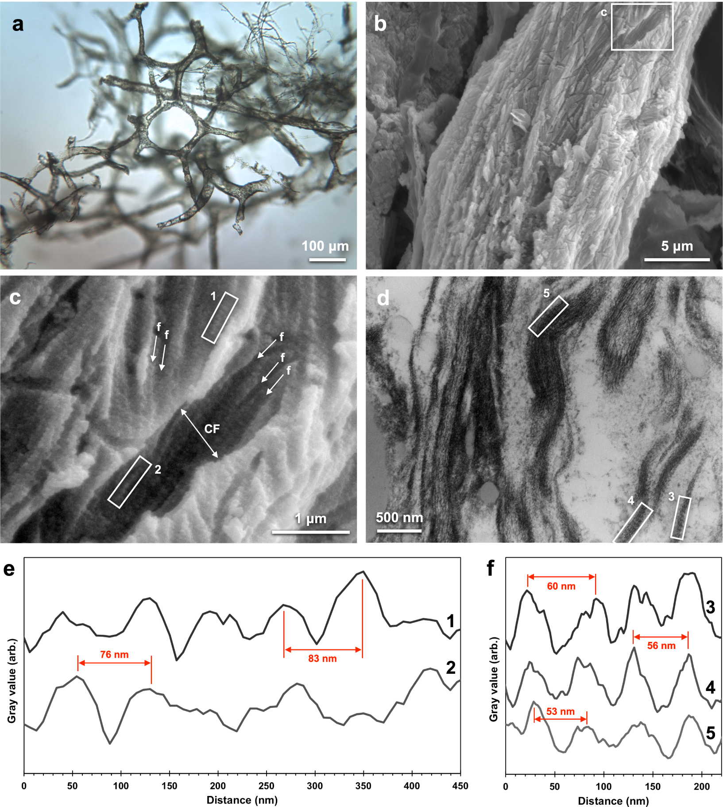

# Deep time and converging evidence

[Course map](00-course-map.md) · [Variation and selection](03-variation-and-selection.md) · [Reading evidence](06-reading-the-evidence.md) · [Full lesson 4](../lessons/04-age-of-earth/README.md)

Erika's case for an old Earth does not rest on one isotope, one assumed slow rate or a circular appeal to fossils. It is a network of observations with different physical bases and different failure modes: sedimentary order, annual archives, isotope decay, historical eruptions, astronomical cycles, plate movement and the chemistry of exceptional preservation.

The strength lies in **consilience**: agreement between methods that would not all fail in the same way.

## Rates require boundary conditions

An elapsed time can be estimated from a rate only when the starting state, ending state and relevant conditions are understood. Erika's hourglass and pool examples introduce that limitation ([33:23](https://www.youtube.com/watch?v=dTVFcr4GCMk&t=2003s)). A modern deposition rate cannot be applied blindly to a rock if water depth, sediment supply or interruptions differed.

Geologists therefore combine constraints. A single structure may supply only a minimum age; several structures can narrow the range. Erika compares this with skeletal age estimation, where growth plates, wisdom teeth and cranial sutures constrain different stages ([34:47](https://www.youtube.com/watch?v=dTVFcr4GCMk&t=2087s)).

## Actualism recognises both ordinary processes and catastrophes

“The present is the key to the past” means that the same physical and chemical laws apply. Modern ripples, ashfalls, landslides, floods and erosion provide comparison patterns for ancient deposits. It does **not** mean every rate is constant or every process slow.

Erika explicitly replaces a crude uniform-rate picture with **actualism** at [54:08](https://www.youtube.com/watch?v=dTVFcr4GCMk&t=3248s). The Nebraska ashfall beds, for example, combine volcanic ash with chronic respiratory pathology in the buried animals; those independent traces support a rapid local disaster ([51:38](https://www.youtube.com/watch?v=dTVFcr4GCMk&t=3098s)). Recognising one rapid bed does not make overlying reefs, dunes and soils part of the same instant.

## Relative dating orders events before a number is calculated

- **Superposition:** in an undisturbed sedimentary sequence, lower beds were deposited before upper beds.
- **Cross-cutting relationships:** an intrusion or fault is younger than the units it cuts.
- **Unconformities:** an eroded surface post-dates truncated rock and pre-dates the units laid over it.
- **Index fossils:** widespread, recognisable species restricted to a limited interval can correlate separated strata.

Erika introduces cross-cutting logic at [1:26:06](https://www.youtube.com/watch?v=dTVFcr4GCMk&t=5166s). None of these rules by itself supplies “4.5 billion years”; they build an order that numerical clocks can independently test.

*The column records repeated changes in formation and depositional setting. Karlstrom, Crossey, Mathis and Bowman, [“Telling Time at Grand Canyon National Park: 2020 Update”](https://doi.org/10.36967/nrr-2285173); [source image](https://commons.wikimedia.org/wiki/File:2021_Revised_NPS_Geologic_Stratigraphic_Column_of_the_Grand_Canyon.jpg), U.S. federal public domain.*

At the Grand Canyon, Erika moves from marine Bright Angel Shale with trilobites and burrows to cross-bedded sandstone with dunes and terrestrial tracks, then back to marine units ([1:35:04–1:35:35](https://www.youtube.com/watch?v=dTVFcr4GCMk&t=5704s)). Fossils, sedimentary structures and geometry jointly indicate changing environments and relative sea level—not a stack interpreted from fossils alone.

## Fossilisation is selective

Death is not enough. Rapid burial, low oxygen, mineral-rich water or other unusual conditions must interrupt normal scavenging and decay. Hard parts are overrepresented; soft tissues and upland organisms are underrepresented. Erika describes burial, lithification and mineralisation at [44:24–47:02](https://www.youtube.com/watch?v=dTVFcr4GCMk&t=2664s).

This incompleteness changes the correct test. A missing fossil is weak evidence by itself because preservation and discovery are sparse. A robust contradiction would be a securely contextualised organism in a geological interval that reverses major established ordering—not a loose bone placed into older sediment.

## Annual archives count time without beginning from radiometric dates

| Archive | Annual signal | How errors are checked |
| --- | --- | --- |
| Tree rings | Seasonal growth width and chemistry | Overlap many living, dead and subfossil trees; compare weather and isotope patterns. |
| Ice cores | Seasonal dust, frost and isotopic differences | Count visible and instrumental cycles; match volcanic ash horizons. |
| Varves | Summer/winter sediment couplets with different pollen, organisms and minerals | Compare chemistry, other cores and radiocarbon-bearing organic material. |

Erika openly discusses missing and double tree rings before describing the overlapping central-European chronology of roughly 12,000 years ([1:05:12–1:06:49](https://www.youtube.com/watch?v=dTVFcr4GCMk&t=3912s)). Lake Suigetsu contains about 31,000 visually counted varves in the segment she discusses; their recurring seasonal composition is evidence that they are not arbitrary thin bands from one flood ([1:15:11–1:18:59](https://www.youtube.com/watch?v=dTVFcr4GCMk&t=4511s)).

An annual sequence can be internally counted before it is anchored to an external calendar. This distinction between a **floating** and an **anchored** chronology prevents circularity: internal duration and calendar placement are separate inferences.

## Radiometric dating measures an isotope system and an event

An unstable parent isotope decays into a daughter product with a constant probability per unit time. The half-life is the time over which half of a large parent population decays. After one half-life, one half remains; after two, one quarter; after three, one eighth. Erika uses carbon-14's roughly 5,700-year half-life to teach the exponential pattern ([2:09:31–2:10:32](https://www.youtube.com/watch?v=dTVFcr4GCMk&t=7771s)).

*The interval labels apply to any radioactive parent; for carbon-14 each step is about 5,700 years. Andrew Fraknoi, David Morrison and Sidney Wolff/Rice University, [source](https://commons.wikimedia.org/wiki/File:OSC_Astro_07_03_Decay_%281%29.jpg), [CC BY 4.0](https://creativecommons.org/licenses/by/4.0/).*

The clock is not simply “radiation in a rock.” Researchers choose a mineral, parent–daughter system and geological event. Crystallisation or cooling may close an igneous mineral to exchange; later heating can reset it. The number must be interpreted as the age of that event, not automatically the age of every component in the sample ([2:22:18](https://www.youtube.com/watch?v=dTVFcr4GCMk&t=8538s)).

## Carbon-14 has a limited, specific job

Living organisms exchange carbon with the environment; after death, replenishment stops. Because carbon-14 has a short half-life, it is useful for appropriate organic material to roughly 50,000–60,000 years, not dinosaur-age rock ([2:16:18–2:20:12](https://www.youtube.com/watch?v=dTVFcr4GCMk&t=8178s)).

A very old sample can still produce a finite-looking result because trace modern carbon—from handling, roots, microbes, groundwater or laboratory background—dominates when genuine carbon-14 has fallen below useful detection. Erika's key point is that a test can output a number while being unable to date the target event ([2:17:24–2:19:46](https://www.youtube.com/watch?v=dTVFcr4GCMk&t=8244s)).

The inverse problem occurs when a long-half-life system is used on a very recent eruption: too little daughter product has accumulated. Erika compares this to weighing a grain of sand on a truck scale ([2:39:31](https://www.youtube.com/watch?v=dTVFcr4GCMk&t=9571s)). Method suitability is determined by resolution and sample behaviour, not by whether the expected age is welcome.

## Calibration is a prediction, not a rescue

If tree rings represent counted years and carbon-14 decay is understood, separately sampled rings should follow the predicted decay curve. Erika sets up that test at [2:24:37](https://www.youtube.com/watch?v=dTVFcr4GCMk&t=8677s) and shows agreement at [2:26:31](https://www.youtube.com/watch?v=dTVFcr4GCMk&t=8791s).

Lake Suigetsu adds a third method: counted varves, dated organic material and overlapping tree chronology agree where all three exist, while the varves extend beyond the tree sequence ([2:27:12](https://www.youtube.com/watch?v=dTVFcr4GCMk&t=8832s)). Greenland ice layers and Icelandic ash provide another comparison between layer counts and dated volcanic material ([2:28:42](https://www.youtube.com/watch?v=dTVFcr4GCMk&t=8922s)).

These are not repeated readings from one device. Growth, sedimentation, snowfall and nuclear decay would require different errors to manufacture the same pattern.

## Longer cross-checks

Earth's orbital eccentricity, axial tilt and precession change the distribution of sunlight. Climate-sensitive oxygen-isotope records should preserve those cycles, with northern and southern hemispheres responding in predictably different seasonal directions. Erika compares cave records from Brazil and China and reports the expected inverted response aligned to the same orbital cycles ([2:29:31–2:31:30](https://www.youtube.com/watch?v=dTVFcr4GCMk&t=8971s)).

Plate movement provides another physical clock. Distances on the seafloor, magnetic patterns, rock ages and present GPS rates can be compared. Historical eruptions calibrate short intervals: the AD 79 Vesuvius event is independently dated by texts and archaeology, and argon–argon analysis agrees within uncertainty ([2:40:45](https://www.youtube.com/watch?v=dTVFcr4GCMk&t=9645s)).

The oldest terrestrial rocks and minerals provide minima. Erika gives the Acasta Gneiss near four billion years and Jack Hills zircons near 4.3–4.4 billion years ([3:12:58](https://www.youtube.com/watch?v=dTVFcr4GCMk&t=11578s)). Meteorites formed in the same early Solar System history converge around 4.5 billion years, supplying the standard age estimate for Earth ([3:14:22–3:14:36](https://www.youtube.com/watch?v=dTVFcr4GCMk&t=11662s)).

## Test the consequences of alternative models

A proposed accelerated radioactive decay must do more than compress isotope ages. The same decay releases energy; Erika emphasises that the implied heat would melt or vaporise large portions of Earth unless an independently testable removal mechanism is supplied ([2:56:29–2:58:55](https://www.youtube.com/watch?v=dTVFcr4GCMk&t=10589s)). A model comparison includes all physical consequences, not only the desired date.

Likewise, rapid laboratory formation of a crystal shows possibility under those laboratory conditions; it does not establish that a natural specimen formed under the same temperature, pressure, solution chemistry and starting state.

## Dinosaur “soft tissue” is an anomaly to explain, not suppress

Erika accepts that ancient fossils can preserve altered biological remnants. Schweitzer and colleagues reported flexible vessel-like structures and cell-shaped remnants after demineralising protected *T. rex* bone ([3:01:11](https://www.youtube.com/watch?v=dTVFcr4GCMk&t=10871s)); see [Schweitzer et al. (2005)](https://doi.org/10.1126/science.1108397).

*Actual microscopy, not a life reconstruction. Figure 2 from Boatman et al., [“Mechanisms of soft tissue and protein preservation in Tyrannosaurus rex”](https://doi.org/10.1038/s41598-019-51680-1), [CC BY 4.0](https://creativecommons.org/licenses/by/4.0/). The image shows the analysed material; it does not date it by appearance.*

“Soft tissue” must not be inflated into fresh flesh. The remnants are altered, cross-linked and chemically stabilised. Erika presents:

- oxidative and thermal cross-linking into resistant polymers—Wiemann et al. [2018](https://doi.org/10.1038/s41467-018-07013-3) ([3:04:56–3:05:30](https://www.youtube.com/watch?v=dTVFcr4GCMk&t=11096s));
- iron-mediated stabilisation, including ostrich-vessel experiments—Schweitzer et al. [2014](https://doi.org/10.1098/rspb.2013.2741) ([3:08:13–3:08:57](https://www.youtube.com/watch?v=dTVFcr4GCMk&t=11293s));
- experimental chemical correspondence between treated modern collagen and dinosaur material—Boatman et al. [2019](https://doi.org/10.1038/s41598-019-51680-1) ([3:09:52–3:10:20](https://www.youtube.com/watch?v=dTVFcr4GCMk&t=11392s)); and
- a synthesis joining these mechanisms—Anderson [2023](https://doi.org/10.1016/j.earscirev.2023.104367) ([3:10:50](https://www.youtube.com/watch?v=dTVFcr4GCMk&t=11450s)).

The experiments demonstrate mechanisms capable of changing degradation rates and producing observed chemistry; they do not run for millions of years. Their credibility comes from testable chemical predictions combined with independent dating, not from assuming preservation is impossible or automatically timeless.

## Anomaly checklist

1. What exactly was observed: fresh tissue, altered protein fragments, mineralised shape or chemical residue?
2. What event does the proposed clock date?
3. Is the method operating within its useful range?
4. Could contamination or open-system behaviour produce the result?
5. What additional consequences follow from the alternative explanation?
6. Do independent records agree with one another?
7. What experiment would distinguish the preservation or rate models?

## Active recall

1. Why does actualism not require a constant rate?
2. Distinguish relative from numerical dating using an intrusion through sedimentary beds.
3. What makes tree-ring, varve and carbon-14 agreement genuinely cross-disciplinary?
4. Why can carbon-14 produce a number for material outside its valid age range?
5. What event might an igneous mineral date?
6. State what the *T. rex* preservation experiments demonstrate and what they leave unproven.
7. Why must accelerated-decay models account for heat?
