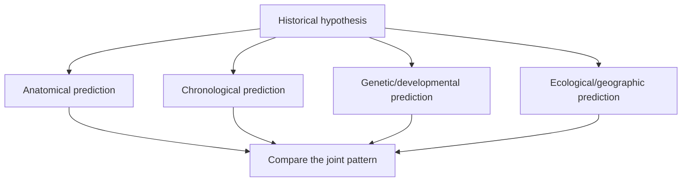
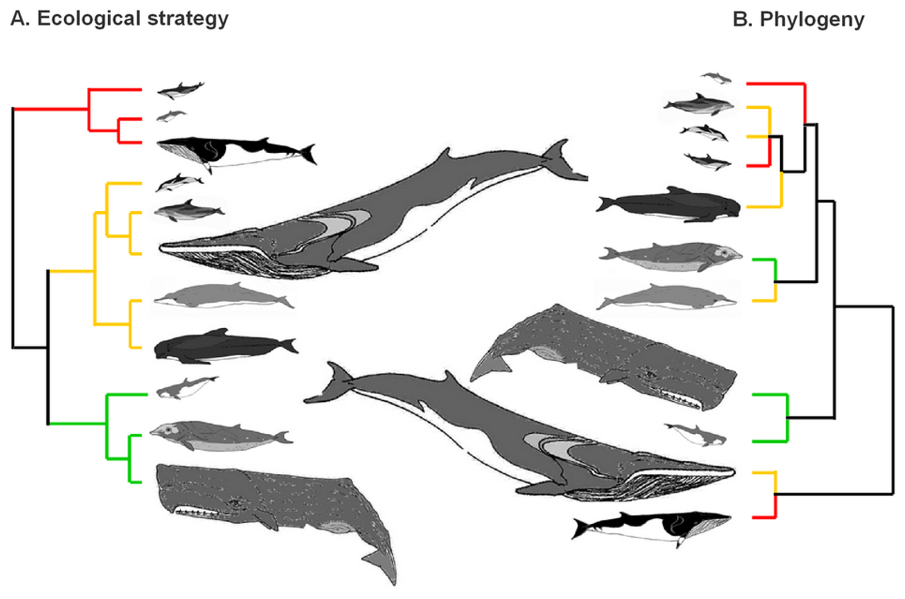

# Reading evolutionary evidence

[Course map](00-course-map.md) · [Deep time](05-deep-time-and-converging-evidence.md) · [Case studies](case-studies/whales.md) · [Revision checklist](revision/checklist.md)

The course does not argue that one fossil, similarity or experiment “proves evolution.” Erika's method is to turn an ancestry claim into multiple predictions, identify what was actually observed, and compare how well competing models explain the combined pattern.

## Start by naming the claim

“Evolution” can refer to several propositions. Ask which one is being tested:

- a population changed in measured allele frequency;
- a trait was shaped by selection rather than drift;
- two populations are becoming reproductively isolated;
- two lineages share an ancestor;
- a fossil lies near a particular branch; or
- a dated sequence records an anatomical transition.

Evidence for one proposition may support another only when the connecting reasoning is stated. Observing selection today demonstrates a mechanism; it does not by itself establish the whale family tree. Erika makes that separation before the whale case: mutation, selection and geological time are necessary background, while common descent still makes additional predictions ([lesson 5, 38:00–39:20](https://www.youtube.com/watch?v=fnY58Y8FJBQ&t=2280s)).

## Use claim → prediction → observation → limit

| Stage | Question | Whale example |
| --- | --- | --- |
| Claim | What relationship is proposed? | Cetaceans descend from within even-toed hoofed mammals. |
| Prediction | What should be found if that is true? | Early cetaceans should combine whale-defining anatomy with retained artiodactyl traits. |
| Observation | What specimen or measurement exists? | Several archaeocetes possess a cetacean involucrum and double-pulley astragalus. |
| Limit | What does the observation not establish? | It does not prove that the named fossil is the literal direct ancestor of living whales. |

This structure prevents both overclaiming and dismissal. A fossil can strongly constrain a relationship without being a proved parent species.

## Separate observation, inference and reconstruction

These levels are easy to blur:

1. **Observation:** preserved bones, an isotope ratio, a DNA sequence, a measured shape or a photographed microscopic structure.
2. **Inference:** locomotion reconstructed from joints, habitat inferred from isotopes, relationship inferred from a character matrix.
3. **Restoration:** an artist or museum adds missing posture, muscle, skin, colour or soft tissue.

Erika's *Rodhocetus* audit shows why the distinction matters. An early restoration included a fluke not preserved in the fossil; later limb material led researchers to revise the swimming reconstruction. The correction changed an inference, not the existence or every character of the specimen ([lesson 7, 50:05–56:10](https://www.youtube.com/watch?v=TuWlGUq5Wi4&t=3005s)).

A useful response to an image is therefore: **Which pixels show specimen material, which show preparation or mounting, and which show interpretation?**

## Independence is more important than the length of a list

Ten measurements of the same bone are not ten independent lines of evidence. Strong consilience joins observations whose main assumptions and failure modes differ.

| Evidence route | What it tests | Typical limitation |
| --- | --- | --- |
| Comparative anatomy | Distribution of homologous character suites | Convergence can affect individual traits. |
| Fossils and stratigraphy | Character combinations through ordered time | Preservation and sampling are incomplete. |
| Development | Capacity and sequence of inherited growth programmes | An experiment does not recreate a whole extinct organism. |
| Genomics | Nested inherited sequence patterns | Alignment, horizontal transfer and model choice require care. |
| Biogeography | Isolation, dispersal and historical geography | Ranges change and are incompletely sampled. |
| Functional biomechanics | What a structure could plausibly do | Function does not alone establish ancestry. |
| Isotopes and microstructure | Diet, habitat, temperature or locomotor ecology | Calibration and alteration must be tested. |

Agreement is especially informative when each route could have contradicted the others. Whale genomes could have placed cetaceans outside artiodactyls; complete early ankles could have lacked the artiodactyl form; freshwater isotopes could have followed rather than preceded marine specialisation. They do not.

## Read nested hierarchy from whole character suites

One spectacular similarity may be convergent. Wings group bats and birds for the practical purpose “animals that fly,” but mammalian hair, milk, jaw and ear anatomy place bats with mammals, while feathers, wrist, pelvis and archosaur anatomy place birds with theropods.

Erika's rule is to record many characters, compare their distributions and test whether repeated nested subsets emerge ([lesson 8, 30:14–34:17](https://www.youtube.com/watch?v=aJofeBRFwvI&t=1814s)). Molecular evidence adds an independent inheritance record for living organisms; fossils still require anatomy because ancient DNA is normally unavailable.

*The left panel groups cetaceans by an ecological analysis; the right represents phylogenetic relationships. Both can answer legitimate questions, but evolutionary classification specifically tests inherited history. Figure from Spitz et al. (2012), [source](https://commons.wikimedia.org/wiki/File:Branching_diagrams_showing_the_ecological_and_evolutionary_relationships_among_cetaceans.png), [CC BY 2.5](https://creativecommons.org/licenses/by/2.5/).*

## Homology is a tested relationship, not “looks similar”

Homologous structures derive from the same structure in an ancestor, although their current functions can differ. A human arm, whale flipper and bird wing share the tetrapod one-bone/two-bones/wrist/digits organisation while serving manipulation, swimming and flight. An analogous structure performs a similar function through a different historical route.

Evidence for homology can include:

- relative position and connections to neighbouring structures;
- embryonic origin and developmental signalling;
- intermediate fossil conditions;
- the structure's distribution on independently inferred trees; and
- corresponding genes and regulatory pathways.

No one criterion is infallible. Their agreement makes the identification robust.

## A transitional fossil is a mosaic in the relevant time

Erika defines a transitional species morphologically and chronologically: it has a predicted combination of older and newer traits and occurs in a relevant interval ([lesson 5, 1:09:48](https://www.youtube.com/watch?v=fnY58Y8FJBQ&t=4188s)). “Transitional” does not mean:

- literally half of one modern animal and half of another;
- imperfectly adapted to its own environment;
- the proved direct ancestor of the next named fossil; or
- every feature being intermediate at once.

Evolution predicts branches. Side branches can preserve informative mosaics, and an ancestral population can coexist with a descendant branch. Overlapping ranges are therefore not automatically contradictory. The test is the ordered distribution of character states across the tree.

## Fossil order is probabilistic but constraining

Preservation is patchy, so an expected lineage can have gaps. Yet incompleteness is not permission for any order. A securely embedded mammal fossil in genuinely Cambrian rock would conflict with the established appearance of vertebrates and mammals. Erika accepts this kind of risky prediction while emphasising provenance: a loose or reworked fossil is not equivalent to an organism fossilised within the bed ([lesson 8, 42:02–42:53](https://www.youtube.com/watch?v=aJofeBRFwvI&t=2522s)).

The Zachełmie tetrapod trackways are a good example of proportionate revision. Their digit impressions pre-date *Tiktaalik*, so they undermine a tidy claim that *Tiktaalik* lies on the direct ancestral line. They do not pre-date all lobe-finned vertebrates and therefore do not reverse the broader source lineage ([lesson 8, 3:39:59–3:45:43](https://www.youtube.com/watch?v=aJofeBRFwvI&t=13199s)). Good models absorb difficult evidence by revising the detailed tree, not by pretending the evidence is irrelevant.

## Developmental experiments test capacity, not the whole history

Examples across the series include:

- chicken embryos developing archosaur-like first-generation teeth in the *talpid2* mutant ([Harris et al. 2006](https://doi.org/10.1016/j.cub.2005.12.047));
- early signalling changes producing a more dinosaur-like chicken snout and palate ([Bhullar et al. 2015](https://doi.org/10.1111/evo.12684));
- zebrafish variants producing extra integrated pectoral-fin bones ([Hawkins et al. 2021](https://doi.org/10.1016/j.cell.2021.01.003)); and
- dolphin hind-limb buds initiating and then losing the signalling needed for continued growth ([Thewissen et al. 2006](https://www.pnas.org/doi/10.1073/pnas.0602920103)).

These experiments establish that inherited developmental systems can produce relevant coordinated changes. They do not transform one modern species into an extinct adult or prove the precise historical path by themselves. Fossils provide the historical order; development supplies mechanistic plausibility.

## Functional similarity and historical residue answer different objections

Similar tasks can favour similar functional solutions, so strict common design and common descent can both accommodate some useful similarity. Erika therefore asks whether functional and non-functional regions recover the same nested relationships ([lesson 5, 1:23:23–1:26:53](https://www.youtube.com/watch?v=fnY58Y8FJBQ&t=5003s)). In whales, examples include disabled tooth genes alongside embryonic tooth development ([1:56:14](https://www.youtube.com/watch?v=fnY58Y8FJBQ&t=6974s)), pseudogenised smell pathways ([2:21:56](https://www.youtube.com/watch?v=fnY58Y8FJBQ&t=8516s)), and disabled hair genes retained after near-complete hair loss ([2:27:52–2:28:11](https://www.youtube.com/watch?v=fnY58Y8FJBQ&t=8872s)).

Her manuscript analogy is useful: two thrillers may independently have similar plots, but the same unusual typographical errors at the same positions suggest copying from a shared text ([lesson 5, 1:24:39](https://www.youtube.com/watch?v=fnY58Y8FJBQ&t=5079s)). This does not mean all non-coding DNA is useless. It means an inherited change with no relevant shared function can carry historical information.

## Audit quotations and labels at the exact level used

The mammal lesson's source audit distinguishes the cetacean **involucrum** from a disputed definition or damaged preservation of the **sigmoid process**. Treating uncertainty about one as uncertainty about the other changes the proposition ([lesson 7, 27:38–39:01](https://www.youtube.com/watch?v=TuWlGUq5Wi4&t=1658s)).

When checking a claim:

1. write the exact proposition;
2. find the original paper, specimen description or dataset;
3. read the material before and after the quotation;
4. identify whether the statement concerns observation, diagnosis or restoration;
5. check whether later material revised the conclusion; and
6. decide how much of the larger argument actually depends on the disputed point.

## Compare complete models

A rival explanation is not strong merely because it can be imagined after the observation. It should state what it predicts, what would count against it and where its explanatory rule applies.

| Question | Common descent predicts | A strict separate-ancestry model must specify |
| --- | --- | --- |
| Why do traits form nested suites? | Inheritance plus modification along branches | Why reusable design repeatedly mimics one genealogy |
| Why do disabled changes recover the same tree? | They are inherited historical residue | Why unused changes share the functional hierarchy |
| Why are mosaics time ordered? | Derived states accumulate within branches | Why separate creations appear in the predicted order |
| Where does ancestry stop? | Where multiple datasets cease recovering a relationship | An independently detectable boundary, not one drawn after seeing the data |

The comparison concerns strict ancestry discontinuity, not whether a deity could intend or guide common descent. Erika explicitly allows theological interpretations while keeping the scientific models testable ([lesson 5, 1:20:30–1:20:46](https://www.youtube.com/watch?v=fnY58Y8FJBQ&t=4830s)).

## Evidence-quality checklist

- Is the claim stated narrowly enough to test?
- Was the observation measured on a real specimen, and is its context secure?
- Is the method being used within its calibrated range?
- Does the evidence concern ancestry, function, chronology or mechanism?
- Are purportedly independent lines genuinely independent?
- Were predictions stated before the decisive observation?
- Can the alternative explain the same full pattern without ad hoc exceptions?
- Is uncertainty local to one branch or destructive of the overall pattern?
- What result would change the conclusion?

## Active recall

1. Use one case study to write claim → prediction → observation → limitation.
2. Why is an outdated life restoration not the same as a fraudulent fossil?
3. Distinguish homology, analogy and superficial resemblance.
4. Why can a side branch be transitional?
5. What did the Zachełmie tracks change, and what did they leave intact?
6. What can a developmental experiment establish that a fossil cannot—and vice versa?
7. Why is shared non-functional sequence potentially more discriminating than shared functional sequence?

Apply the framework to [whales](case-studies/whales.md), [birds](case-studies/birds.md), [mammals](case-studies/mammals.md) and [tetrapods](case-studies/tetrapods.md).
