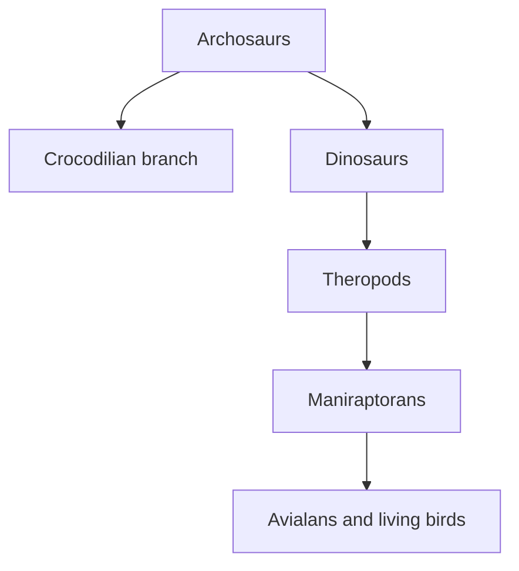
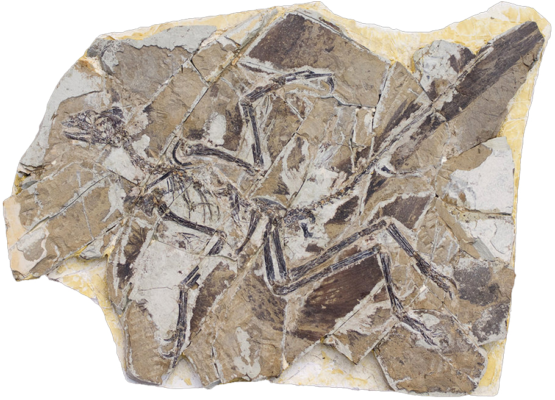

# Case study: birds are living dinosaurs

[Course map](../00-course-map.md) · [How to read evidence](../06-reading-the-evidence.md) · [Full bird lesson](../../lessons/06-birds/README.md) · [Will Duffy Q&A](../../lessons/06-birds/will-duffy-qa.md)

“Birds are dinosaurs” is a phylogenetic claim: living birds are the surviving branch of theropod dinosaurs. It does not mean a living bird descended from a living *Tyrannosaurus*, or that every dinosaur had the complete anatomy of a modern flying bird.

Erika tests the relationship through nested anatomical suites, fossil order, feathers, embryonic development and the gradual assembly of flight-related structures.

## Predictions before inspecting the fossils

If birds arose within theropods, the evidence should show:

- birds retaining broad archosaur and dinosaur characters;
- closer theropod branches carrying progressively larger subsets of the avian suite;
- early birds combining flight or feathers with teeth, long tails, grasping hands and other older states;
- feathers appearing before the complete powered-flight apparatus;
- living bird development retaining modifiable older pathways; and
- fossil characters appearing in an ordered geological distribution.

Erika states this anatomy–genetics–development–fossil programme at [1:23:35](https://www.youtube.com/watch?v=vhOyNiv6PTY&t=5015s).

The nested labels accumulate. A living sparrow is an avialan, maniraptoran, theropod, dinosaur and archosaur at the same time.

## Begin with a suite, not one defining feature

Living birds combine feathers, bipedality, hollow bones, an S-shaped neck, a furcula, a semilunate wrist, fused hand elements, specialised shoulder and sternum, a shortened tail with pygostyle, a backward-directed pubis and a toothless keratinous beak. They also share hard-shelled eggs, gizzards, four-chambered hearts and directional airflow ([1:20:16–1:23:04](https://www.youtube.com/watch?v=vhOyNiv6PTY&t=4816s)).

No single item should be treated as a timeless definition. Flightless birds remain birds; feathers occur in non-avian theropods; toothed early birds remain birds. The relationship is recovered from the distribution of the full character set.

## The archosaur foundation

Birds and crocodilians share older archosaur biology, including four-chambered hearts, gizzards and unidirectional airflow ([1:28:20–1:29:20](https://www.youtube.com/watch?v=vhOyNiv6PTY&t=5300s)). Those traits do not turn crocodiles into birds. They locate both branches within a broader inherited group, while newer traits diagnose dinosaurs, theropods and avialans.

This is how nested classification differs from a checklist. A trait can be ancestral to a large group, modified in one branch and lost in another without erasing the wider ancestry.

## Early bird groups preserve character mosaics

### Modern birds and near-crown forms

Neornithes contains living birds. Erika discusses recognisably modern shorebirds, landfowl and roller-like birds from Fossil Butte, and *Asteriornis* near the crown before the end-Cretaceous extinction ([1:29:43–1:30:33](https://www.youtube.com/watch?v=vhOyNiv6PTY&t=5383s)). Modern-looking birds existing alongside non-avian dinosaurs does not make older avialans modern; branching histories contain simultaneous lineages.

### Toothed ornithurines

*Ichthyornis* and *Hesperornis* have hollow bones, a furcula, mobile shoulder, fused pelvis and bird-like locomotor traits, while retaining teeth and gastralia. In some forms teeth are reduced toward the front and a vascularised premaxilla indicates a keratinous beak over part of the jaw ([1:34:08–1:35:51](https://www.youtube.com/watch?v=vhOyNiv6PTY&t=5648s)). Beak plus teeth is a predicted mosaic, not a contradiction.

### Pygostylians and side-branch beaks

Confuciusornithids were feathered, toothless and capable of flight, but their flatter sternum and less mobile shoulder imply weaker powered flight than many living birds ([1:46:09–1:50:12](https://www.youtube.com/watch?v=vhOyNiv6PTY&t=6369s)). Erika treats their beak as a separate detailed construction, reminding us that a familiar function can evolve on a side branch.

## *Archaeopteryx*: both avialan and theropod

*The original Berlin specimen of* Archaeopteryx lithographica, *not a cast. Photograph by H. Raab (Vesta), [source](https://commons.wikimedia.org/wiki/File:Archaeopteryx_lithographica_%28Berlin_specimen%29.jpg), [CC BY-SA 3.0](https://creativecommons.org/licenses/by-sa/3.0/).*

Multiple specimens preserve a stable mixture ([1:54:05–1:55:31](https://www.youtube.com/watch?v=vhOyNiv6PTY&t=6845s)). Bird-side features include asymmetrical flight feathers, hollow bones, furcula, S-shaped neck, semilunate wrist, a shoulder capable of a downstroke and bipedality. Retained theropod features include teeth, gastralia, a long rigid bony tail, three separate grasping fingers and a less modern pelvis ([1:56:00–1:57:09](https://www.youtube.com/watch?v=vhOyNiv6PTY&t=6960s)).

Erika interprets its asymmetrical feathers and shoulder as supporting powered flight, but less capable than strong modern flyers ([2:00:28–2:01:44](https://www.youtube.com/watch?v=vhOyNiv6PTY&t=7228s)). “Could it fly?” and “Where does it sit on the tree?” are related but distinct questions.

## Feathers precede powered flight

Non-avian theropods preserve simple filaments, down-like coverings and more complex feathers. Erika discusses *Sinosauropteryx*, *Dilong*, *Sciurumimus* and the large, ground-dwelling *Yutyrannus* ([2:29:29–2:30:24](https://www.youtube.com/watch?v=vhOyNiv6PTY&t=8969s)). A large insulated animal is evidence that feathers had useful non-flight functions.

*Filamentous integument is visible around the body. Photograph by Sam / Olai Ose / Skjaervoy, [source](https://commons.wikimedia.org/wiki/File:Sinosauropteryxfossil.jpg), [CC BY-SA 2.0](https://creativecommons.org/licenses/by-sa/2.0/).*

Where “fuzz” might be degraded collagen, researchers test microstructure, keratin chemistry, pigment-bearing melanosomes and comparisons with known tissues. Erika addresses the collagen alternative at [2:42:23](https://www.youtube.com/watch?v=vhOyNiv6PTY&t=9743s). The conclusion is specimen-specific and analytical, not simply “it looks feathery.”

Useful feather functions before flight include insulation, display, brooding, shading young, balance and controlled descent. Selection has no foresight: a structure must contribute in its current context before descendants co-opt it for another task.

## Flight anatomy can accumulate through useful intermediate roles

Erika presents three non-exclusive routes at [2:04:00](https://www.youtube.com/watch?v=vhOyNiv6PTY&t=7440s):

| Route | Immediate use of a partial aerodynamic surface | Livestream example |
| --- | --- | --- |
| Ground-up/cursorial | Balance, manoeuvring, stronger leaps or stabilising on prey | A raptor flaps while controlling a monitor lizard ([2:05:20](https://www.youtube.com/watch?v=vhOyNiv6PTY&t=7520s)). |
| Wing-assisted incline running | Flapping adds traction and lift while juveniles run up steep surfaces | Young chickens and pheasants climb before they can fly ([2:06:34](https://www.youtube.com/watch?v=vhOyNiv6PTY&t=7594s)). |
| Trees-down/arboreal | Larger surface area aids parachuting, controlled falling and gliding | Young birds survive falls using incomplete wings ([2:05:58](https://www.youtube.com/watch?v=vhOyNiv6PTY&t=7558s)). |

The complete modern shoulder, keel and triosseal canal are not required for every useful stage. Some living flightless birds lack the complete canal, and fossil avialans show partial arrangements ([2:09:40–2:10:23](https://www.youtube.com/watch?v=vhOyNiv6PTY&t=7780s)).

## Different fossils separate gliding from powered flight

*Anchiornis* had long feathers on fore- and hindlimbs but lacked a shoulder upstroke suitable for powered flight in Erika's comparison; the four aerodynamic surfaces supported gliding. *Archaeopteryx* had a more capable shoulder and asymmetrical feathers consistent with limited powered flight ([2:07:46–2:08:14](https://www.youtube.com/watch?v=vhOyNiv6PTY&t=7666s)).

*Specimen YFGP-T5199 of* Anchiornis huxleyi. *Image by Johan Lindgren and colleagues, [source](https://commons.wikimedia.org/wiki/File:Anchiornis_huxleyi_YFGP-T5199.jpg), [CC BY 4.0](https://creativecommons.org/licenses/by/4.0/).*

These are different branches with different performance, not a race from “less evolved” to “more evolved.” They show that aerodynamic feathers, gliding and powered flapping can be anatomically separated.

## Development retains older capacities

### Teeth

Chicken embryos normally suppress adult teeth, but the *talpid2* mutant produces structures comparable with first-generation alligator teeth ([1:36:33–1:37:01](https://www.youtube.com/watch?v=vhOyNiv6PTY&t=5793s)); see Harris et al., [“The Development of Archosaurian First-Generation Teeth in a Chicken Mutant”](https://doi.org/10.1016/j.cub.2005.12.047). The embryo is not becoming an alligator; homologous archosaur machinery remains modifiable.

### Beak and palate

Changing FGF and WNT signalling in early chicken facial development coordinates a more dinosaur-like snout and palate. Measured skull shapes fall toward the sampled non-avian-dinosaur/modern-bird overlap ([1:37:17–1:38:54](https://www.youtube.com/watch?v=vhOyNiv6PTY&t=5837s)); see Bhullar et al. [2015](https://doi.org/10.1111/evo.12684).

### Pelvis

Japanese quail embryos pass through pelvis configurations comparable with earlier dinosaurian states before reaching the hatchling form. Erika presents this as later developmental steps being added, not an embryo literally repeating adult ancestors ([2:20:28–2:22:52](https://www.youtube.com/watch?v=vhOyNiv6PTY&t=8428s)); see Griffin et al. [2022](https://doi.org/10.1038/s41586-022-04982-w).

### Scale and feather programmes

Scales and feathers begin from embryonic placodes. Transient Sonic Hedgehog activation can redirect normally scale-forming chicken foot skin toward feathers ([2:33:45–2:35:01](https://www.youtube.com/watch?v=vhOyNiv6PTY&t=9225s)); see Cooper and Milinkovitch [2023](https://doi.org/10.1126/sciadv.adg9619). Wu et al. tested multiple feather-associated regulatory modules in chicken and alligator scale regions, producing different intermediate feather-related traits—not one magic gene creating a full feather coat ([2:36:27–2:37:03](https://www.youtube.com/watch?v=vhOyNiv6PTY&t=9387s)); see [Wu et al. 2018](https://doi.org/10.1093/molbev/msx295).

These experiments demonstrate developmental capacity and coordinated pathways. Fossils remain necessary to establish historical order.

## Quantitative and behavioural traces

Sacral vertebrae increase broadly through the nested sequence: about three in early dinosaurs, lower intermediate counts in maniraptorans and early avialans, roughly 7–10 in stem pygostylians, and 11–23 in modern birds ([2:40:54–2:41:42](https://www.youtube.com/watch?v=vhOyNiv6PTY&t=9654s)). The prediction is group-level direction with branching variation, not exactly one new vertebra per named fossil.

Behaviour and soft anatomy also leave traces:

- *Citipati* preserved over a nest supports brooding posture ([2:23:30](https://www.youtube.com/watch?v=vhOyNiv6PTY&t=8610s)).
- *Caudipteryx* preserves a gastrolith concentration at the gizzard region ([2:24:02](https://www.youtube.com/watch?v=vhOyNiv6PTY&t=8642s)).
- Troodontids preserved with heads tucked beside forelimbs support a bird-like sleeping posture ([2:24:46](https://www.youtube.com/watch?v=vhOyNiv6PTY&t=8686s)).
- Quill knobs on a well-preserved forearm indicate large feather attachments, while a damaged surface may fail to preserve them ([2:16:26–2:17:26](https://www.youtube.com/watch?v=vhOyNiv6PTY&t=8186s)).

Each observation answers a different question; none replaces the full anatomical tree.

## Why birds remain dinosaurs

Birds retain the theropod suite: hollow bones, furcula, S-shaped neck, bipedal hind limbs, four-toed feet and the modified hand/wrist pattern. They also meet Erika's broader dinosaur criteria, including an open acetabulum, limbs beneath the body and at least three sacral vertebrae ([2:46:40–2:48:49](https://www.youtube.com/watch?v=vhOyNiv6PTY&t=10000s)).

Acquiring feathers suitable for flight, a pygostyle or a toothless beak adds narrower identities; it does not erase inherited membership. “Birds are dinosaurs” has the same cladistic logic as “whales are mammals.”

## What would weaken the model?

- Secure early birds repeatedly preceding archosaurs and theropods in geological time.
- Bird anatomy failing to nest within the theropod character suite when complete specimens are compared.
- Feathers, hand/wrist, pelvis and shoulder traits appearing in no directional or nested order.
- Developmental and genomic relationships consistently grouping birds outside archosaurs.
- Purported feather chemistry repeatedly proving to be unrelated tissue across the key specimens.

Uncertainty over whether one avialan glided or flapped, or whether one beak evolved convergently, changes a branch detail rather than the whole pattern.

## Exam-ready synthesis

> Birds are classified within theropod dinosaurs because their complete anatomy retains the dinosaur and theropod character suites, while fossils show feathers, hands, tails, teeth, pelvises and flight structures in ordered mosaics. *Archaeopteryx* combines aerodynamic feathers and limited flight anatomy with teeth, a long bony tail and grasping fingers. Non-avian feathers precede powered flight, and living embryos retain experimentally modifiable tooth, beak, pelvis and skin-appendage pathways. The evidence is a nested history, not resemblance to one “half-bird.”

## Active recall

1. Why do shared gizzards and airflow make birds and crocodilians archosaurs without making crocodilians birds?
2. List four bird-side and four retained theropod traits in *Archaeopteryx*.
3. What evidence distinguishes a feather interpretation from degraded collagen?
4. Give an immediate use for feathered forelimbs under each flight-origin hypothesis.
5. What do developmental experiments establish, and why are fossils still required?
6. Explain “birds are dinosaurs” without using the word “similar.”
