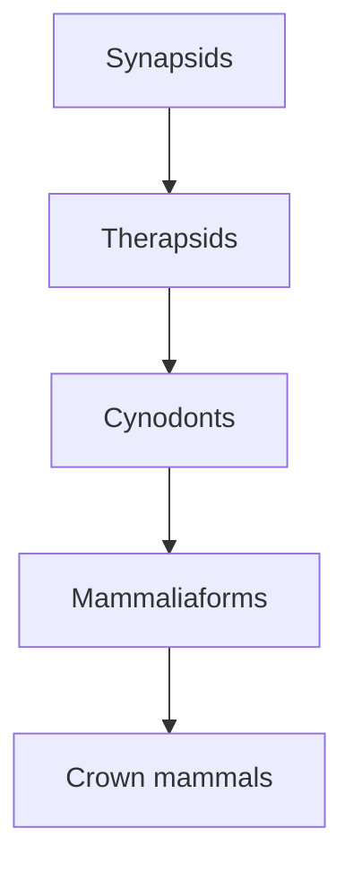
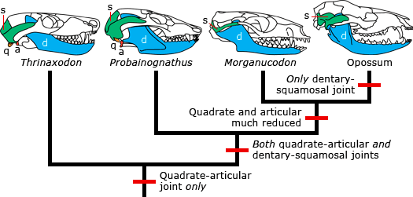
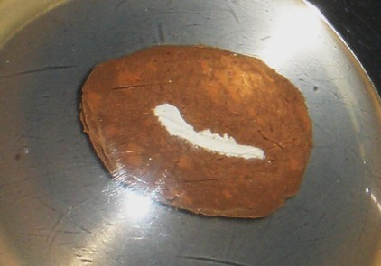
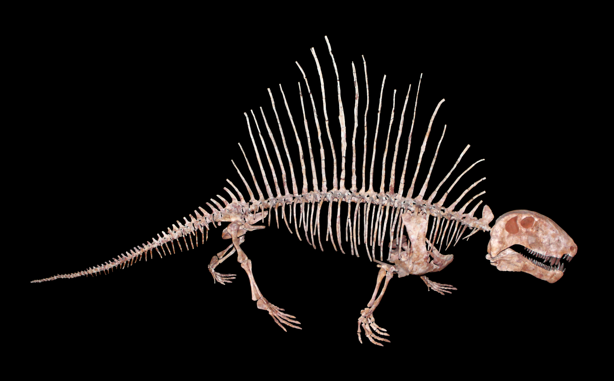
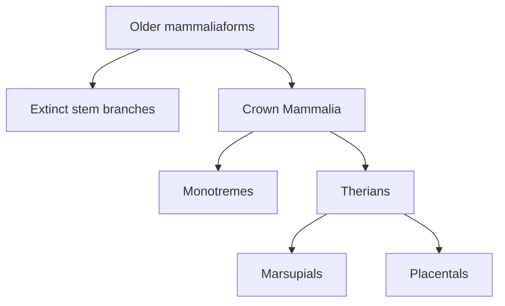

# Case study: mammals and synapsid ancestry

[Course map](../00-course-map.md) · [How to read evidence](../06-reading-the-evidence.md) · [Full mammal lesson](../../lessons/07-mammals/README.md) · [Will Duffy Q&A](../../lessons/07-mammals/will-duffy-qa.md)

Mammals are not defined by “furry animals that give live birth.” Erika builds Mammalia from a suite of inherited features, then follows changes in jaws, ears, teeth, palate, posture, braincase, skin and physiology through mammaliaforms, cynodonts, therapsids and earlier synapsids.

## The nested claim

These are groups within groups, not replacement stages. Every crown mammal is also a mammaliaform, cynodont, therapsid and synapsid. Erika states that cumulative relationship at [3:34:20](https://www.youtube.com/watch?v=TuWlGUq5Wi4&t=12860s).

## Recognise a mammal from a character suite

Erika introduces the main traits at [2:36:42–2:43:32](https://www.youtube.com/watch?v=TuWlGUq5Wi4&t=9402s):

| Character | Mammalian condition | Evidential value |
| --- | --- | --- |
| Hair | Keratin filaments used for insulation, protection or sensation | Distinctive living-mammal integument; fossil evidence varies. |
| Milk | Mammary secretion nourishes young | Shared by monotremes, marsupials and placentals; usually inferred in fossils. |
| Three middle-ear ossicles | Malleus, incus and stapes transmit sound | Links adult anatomy, embryology and the fossil jaw sequence. |
| Dentary–squamosal jaw joint | The dentary articulates with the squamosal | Replaces the ancestral quadrate–articular load-bearing joint. |
| Secondary palate | Bony division between nasal and oral spaces | Supports breathing while processing food and suckling. |
| Heterodont teeth | Incisors, canines, premolars and molars differ | Records specialised food processing. |
| Synapsid temporal opening | One opening behind the orbit, heavily remodelled in mammals | Places mammals on the deeper synapsid branch. |
| Upright posture | Limbs support the body from beneath | Appears gradually through therapsid and cynodont history. |
| Expanded braincase | More rounded internal cavity | Can be studied with skull endocasts. |
| Endothermy | Internally regulated, comparatively stable temperature | Requires proxies such as bone, isotopes and inner-ear anatomy. |

Usually giving live birth is not universal. Platypuses and echidnas lay eggs but remain mammals because they carry the larger suite ([2:38:14](https://www.youtube.com/watch?v=TuWlGUq5Wi4&t=9494s)). Monotremes are living branches with their own long history, not unfinished stages on the way to placentals.

## The jaw-to-ear transition is a functional sequence

Non-mammalian amniotes have several lower-jaw bones; the **articular** contacts the skull's **quadrate** to form the jaw joint. Living mammals use the enlarged **dentary** against the **squamosal**. The quadrate and articular are homologous to the mammalian incus and malleus; with the stapes, they form the three-ossicle middle ear ([2:39:38](https://www.youtube.com/watch?v=TuWlGUq5Wi4&t=9578s); [2:49:56–2:50:52](https://www.youtube.com/watch?v=TuWlGUq5Wi4&t=10196s)).

*The dentary–squamosal contact enlarges while the articular–quadrate pair becomes smaller and eventually leaves the jaw articulation. `a` = articular, `d` = dentary, `q` = quadrate, `s` = squamosal. UC Museum of Paleontology, [source and explanation](https://evolution.berkeley.edu/what-are-evograms/jaws-to-ears-in-the-ancestors-of-mammals/), [CC BY-NC-SA 4.0](https://creativecommons.org/licenses/by-nc-sa/4.0/).*

The key is **functional overlap**. Evolution does not propose that an adult's working jaw bones suddenly moved into its ear. A newer dentary–squamosal articulation enlarged while the ancestral joint still functioned; later, the reduced older elements specialised in sound transmission.

## Three independent views identify the same bones

### Comparative anatomy

Position, attachments and relationships to neighbouring structures connect the mammalian malleus and incus to the articular and quadrate of other amniotes. Changed function does not erase identity.

### Development

Very immature marsupials expose a temporary connection between the jaw and future ear elements before the adult arrangement develops. Erika compares a newborn and adult opossum with a bearded dragon and the cynodont *Thrinaxodon* ([2:52:21–2:53:23](https://www.youtube.com/watch?v=TuWlGUq5Wi4&t=10341s)). Development does not literally replay adult ancestors, but it reveals how the inherited attachment can be modified. Erika also notes that altering one developmental gene can retain or sever the connection without inventing a new organ from nothing ([2:54:21](https://www.youtube.com/watch?v=TuWlGUq5Wi4&t=10461s)).

### Fossils

Across synapsids, therapsids, cynodonts, *Morganucodon* and later mammals, post-dentary bones become smaller while the dentary–squamosal joint expands ([2:55:07](https://www.youtube.com/watch?v=TuWlGUq5Wi4&t=10507s)). The sampled taxa are branches, but their anatomical states form the expected sequence. For technical reviews, see Anthwal, Joshi and Tucker, [“Evolution of the mammalian middle ear and jaw”](https://doi.org/10.1111/brv.12020), and Luo, [“Transformation and diversification in early mammal evolution”](https://doi.org/10.1038/nature06277).

## *Morganucodon*: both joints at once

*Morganucodon* possessed the dentary–squamosal contact and retained the quadrate–articular joint. This double joint records the functional bridge: the new articulation existed before the old elements fully detached into the auditory chain ([2:48:02](https://www.youtube.com/watch?v=TuWlGUq5Wi4&t=10082s)).

*A real fossil specimen at the Natural History Museum, London—not a life reconstruction and not claimed as the direct ancestor of living mammals. Photograph by Ghedoghedo, [source](https://commons.wikimedia.org/wiki/File:Morganucodon_watsoni.JPG), [CC BY-SA 3.0](https://creativecommons.org/licenses/by-sa/3.0/).*

Its other traits form a mosaic: heterodont teeth, secondary palate, synapsid opening, more upright limbs and rounded braincase alongside probable egg laying and inferred hair, milk and endothermy ([2:48:38](https://www.youtube.com/watch?v=TuWlGUq5Wi4&t=10118s)). It is not a living reptile with one mammal feature glued on, nor a modern placental missing a few parts.

## Teeth and palate change food processing and nursing

Heterodont teeth divide cutting, piercing, shearing and grinding among different tooth forms ([2:41:31](https://www.youtube.com/watch?v=TuWlGUq5Wi4&t=9691s)). Through cynodont history, teeth become more differentiated and occlusion more precise. A secondary palate permits breathing while the mouth processes food and provides anatomy compatible with suckling ([2:40:02](https://www.youtube.com/watch?v=TuWlGUq5Wi4&t=9602s)).

Milk does not normally fossilise, so Erika treats lactation as an inference. In *Morganucodon*, three clues converge ([3:01:45–3:02:49](https://www.youtube.com/watch?v=TuWlGUq5Wi4&t=10905s)):

1. rapid juvenile growth recorded in bone;
2. only two tooth generations, avoiding continual replacement during nursing; and
3. a secondary palate supporting suckling while breathing.

The conclusion is “lactation is plausible and supported,” not “milk was directly recovered.” Erika also distinguishes mammary secretion from simply calling milk sweat; caseins have their own evolutionary history, parts of which remain unresolved ([3:00:31–3:01:26](https://www.youtube.com/watch?v=TuWlGUq5Wi4&t=10831s)).

## Hair and whiskers require proportional inference

Whiskers are richly innervated. Canals and pits in the muzzle carry nerves and vessels; comparable pitting in some cynodonts supports vibrissae ([3:06:25](https://www.youtube.com/watch?v=TuWlGUq5Wi4&t=11185s)). That observation does not alone prove a dense whole-body fur coat.

Hair, scales and feathers all begin from embryonic placodes. Their mature structures differ, but regulatory changes can redirect a shared developmental starting system ([3:08:19](https://www.youtube.com/watch?v=TuWlGUq5Wi4&t=11299s)). This is a mechanism for modification, not an adult scale physically peeling into a hair.

## *Dimetrodon* is on the mammal side of the amniote tree

*Despite its common placement in toy dinosaur sets,* Dimetrodon *is an early synapsid. Photograph by H. Zell at the State Museum of Natural History Karlsruhe, [source](https://commons.wikimedia.org/wiki/File:Dimetrodon_incisivum_01.jpg), [CC BY-SA 3.0](https://creativecommons.org/licenses/by-sa/3.0/).*

Early synapsids such as *Dimetrodon* and *Edaphosaurus* possess the single temporal opening and early tooth differentiation, but lack the full mammalian jaw, ear, palate and brain condition ([3:32:25](https://www.youtube.com/watch?v=TuWlGUq5Wi4&t=12745s)). Their limited mammal-side suite is expected near the base of the branch.

“Mammal-like reptile” is outdated shorthand that can hide the relationship. These animals are non-mammalian synapsids, more closely related to mammals than to dinosaurs. Therapsids add changing posture and teeth; cynodonts add further jaw, palate and physiological specialisations; mammaliaforms approach the crown combination.

## Soft physiology leaves proxies

### Braincase

A fossil brain is rare, but the internal skull cavity preserves an endocast. Erika contrasts the elongate crocodilian condition with the more rounded mouse and *Hadrocodium* braincases ([2:57:12](https://www.youtube.com/watch?v=TuWlGUq5Wi4&t=10632s)). The observation is skull geometry; brain expansion is the inference.

### Endothermy

Erika uses three proxy types rather than a “fossil thermometer” ([3:29:23](https://www.youtube.com/watch?v=TuWlGUq5Wi4&t=12563s)):

- semicircular-canal dimensions related to endolymph behaviour at different body temperatures;
- rapidly deposited, vascularised fibrolamellar bone associated with growth and metabolism; and
- oxygen-isotope patterns that can distinguish stable internal temperatures from close tracking of the environment.

Together they suggest graded acquisition rather than every mammalian physiological feature appearing with the first synapsid. The inner-ear analysis Erika references is Araújo et al., [“Inner ear biomechanics reveals a Late Triassic origin for mammalian endothermy”](https://doi.org/10.1038/s41586-022-04963-z).

## Mammals were diverse during the Mesozoic

Mammals did not begin after non-avian dinosaurs disappeared. Erika discusses Mesozoic diggers, swimmers, gliders and predators occupying small-bodied niches ([2:31:31–2:33:53](https://www.youtube.com/watch?v=TuWlGUq5Wi4&t=9091s)). A fossil mammal with juvenile dinosaur remains in its abdomen supplies direct dietary evidence; see Hu et al., [“Large Mesozoic mammals fed on young dinosaurs”](https://doi.org/10.1038/nature03102).

Living mammals occupy three surviving branches in Erika's overview: monotremes, marsupials and placentals ([2:44:33](https://www.youtube.com/watch?v=TuWlGUq5Wi4&t=9873s)). They are not progress stages. The crown includes their last common ancestor and all descendants; stem mammaliaforms lie closer to that crown than to another living group but outside it.

## Extinction prunes; it does not rank

Mass extinctions remove branches and change ecological opportunity. The end-Permian event favoured small, burrowing survivors under severe food and climate stress; Erika calls the post-crisis dominance of small forms the Lilliput effect ([3:22:32–3:25:21](https://www.youtube.com/watch?v=TuWlGUq5Wi4&t=12152s)). The end-Cretaceous event later removed non-avian dinosaurs and many mammal branches, after which surviving mammals radiated into newly open niches ([2:48:25](https://www.youtube.com/watch?v=TuWlGUq5Wi4&t=10105s)).

Survivors are not “more evolved.” Survival depends on ecology, geography, body size and chance; extinct lineages had also been evolving until they disappeared.

## What would weaken the model?

- The quadrate/articular and malleus/incus proving developmentally and anatomically unrelated.
- Complete fossils showing no ordered reduction of post-dentary bones or no double-joint stage.
- Mammalian character suites appearing outside synapsids without a coherent convergent explanation.
- Genomic trees placing living mammals outside the anatomical amniote relationships.
- Physiological proxies consistently contradicting the proposed sequence when independently calibrated.

Uncertainty about the precise onset of lactation or the placement of one stem fossil is local. The jaw–ear transformation, nested skull anatomy and broader character distribution are the pattern-level case.

## Exam-ready synthesis

> Mammals are specialised synapsids, not former reptiles that jumped into a new category. The fossil record shows the dentary enlarging and contacting the squamosal while the ancestral articular–quadrate joint shrinks; *Morganucodon* retains both working joints, and development connects those jaw elements with the mammalian malleus and incus. Teeth, palate, posture, braincase, hair proxies and metabolic evidence change in correlated mosaics through therapsids, cynodonts and mammaliaforms. Living monotremes, marsupials and placentals are surviving branches, not stages of progress.

## Active recall

1. Why can an egg-laying platypus remain unambiguously mammalian?
2. Name the ancestral and mammalian jaw joints and their bones.
3. Why is *Morganucodon* having both joints more informative than a simple row of skulls?
4. What three fossil clues support lactation, and why is the conclusion inferential?
5. What can muzzle pits establish and what can they not establish?
6. Place synapsid, therapsid, cynodont, mammaliaform and crown mammal in nested order.
7. Why does surviving a mass extinction not make a lineage “more evolved”?
