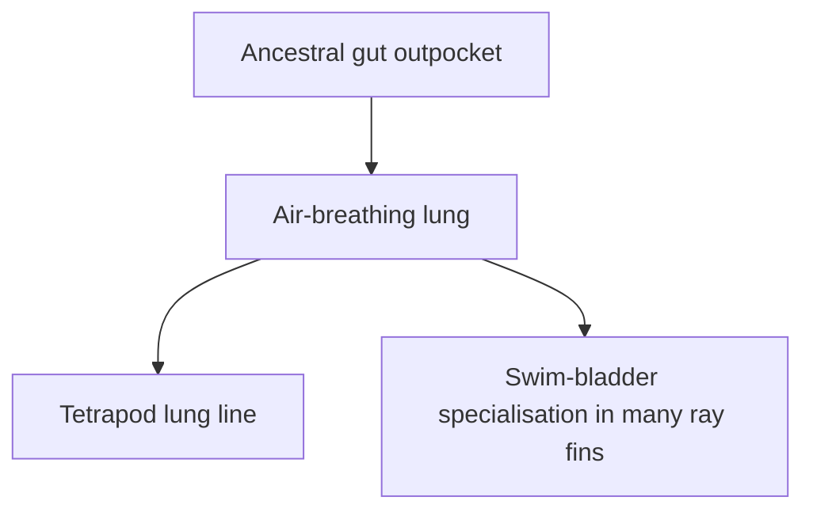
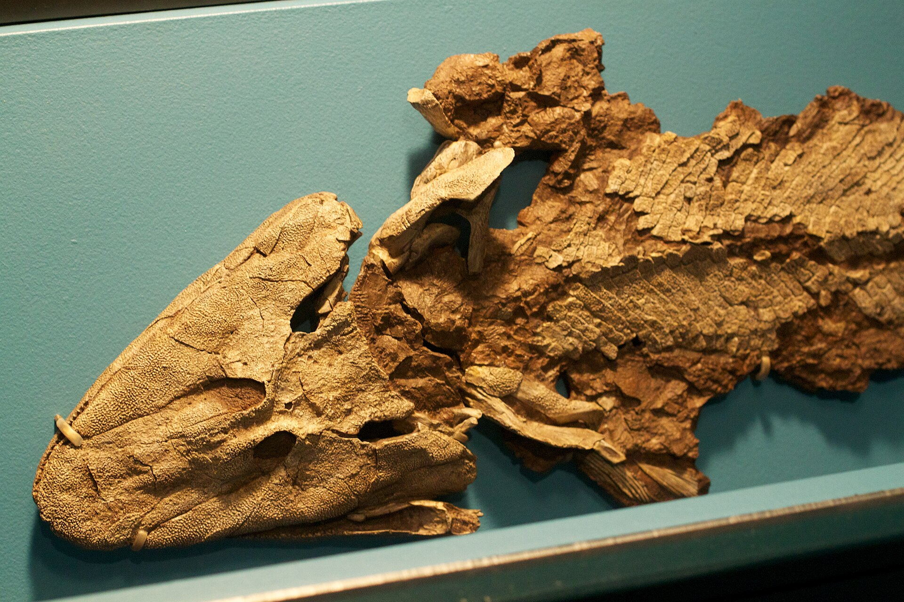
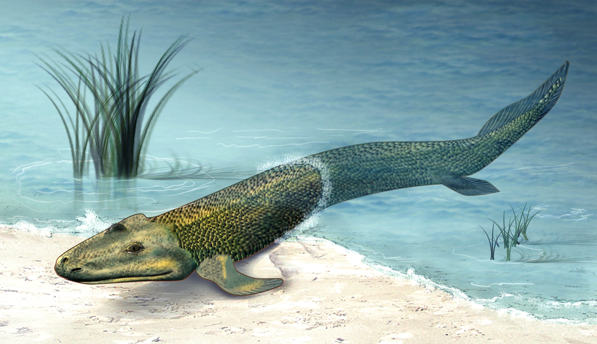
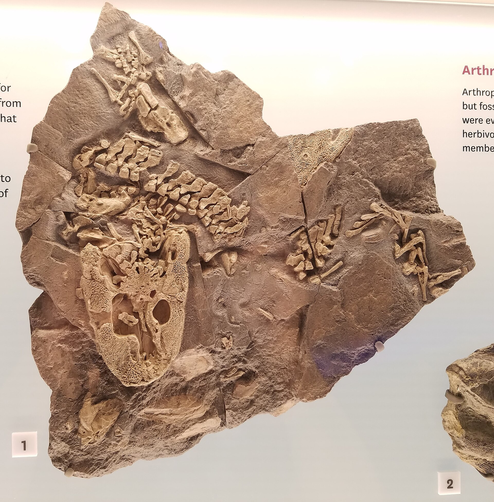
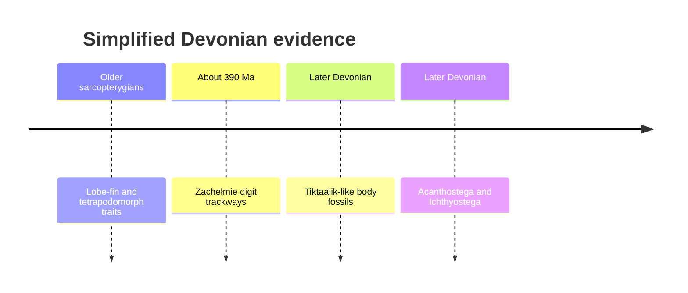

# Case study: tetrapods within lobe-finned vertebrates

[Course map](../00-course-map.md) · [How to read evidence](../06-reading-the-evidence.md) · [Full tetrapod lesson](../../lessons/08-tetrapods/README.md) · [Will Duffy Q&A](../../lessons/08-tetrapods/will-duffy-qa.md)

Tetrapods are vertebrates descended from within Sarcopterygii, the lobe-finned branch. The claim is not that a modern aquarium fish became a salamander. It predicts that anatomy, genes, development, Devonian environments and dated fossils will place digited vertebrates inside a particular branch of bony fish.

## Start with the inherited appendage pattern

Tetrapod forelimbs share the sequence humerus → radius and ulna → carpals → digits; hind limbs share femur → tibia and fibula → tarsals → digits. Descendants can fuse, lengthen, reduce or lose elements, but the relative arrangement remains recognisable ([2:43:08–2:43:50](https://www.youtube.com/watch?v=aJofeBRFwvI&t=9788s)).

A whale flipper, bird wing, horse foreleg and human arm perform different jobs. Their homology is tested from arrangement, connections, development, fossils and the wider tree—not from shared function.

## Why “fish” needs clarification

The everyday word groups aquatic vertebrates while excluding land-dwelling descendants. Once tetrapods are removed, “fish” does not describe one complete clade. Erika separates jawless vertebrates, cartilaginous fishes, ray-finned fishes and lobe-finned vertebrates at [2:46:23–2:48:32](https://www.youtube.com/watch?v=aJofeBRFwvI&t=9983s).

| Branch | Added condition emphasised in the lesson | Example outside the next branch |
| --- | --- | --- |
| Vertebrates | Vertebral/craniate body plan | Other chordates |
| Jawed vertebrates | Jaws | Lamprey |
| Bony vertebrates | Bony internal skeleton | Shark |
| Sarcopterygians | Paired lobed appendage joining through a single proximal bone | Ray-finned salmon |
| Tetrapod lineage | Digited appendage ancestry and descendant suite | Living lungfish branch |

Most living fish species are ray-finned actinopterygians. Living sarcopterygians include coelacanths, lungfishes **and tetrapods**. Humans are not descended from living lungfish; both branches share an older sarcopterygian population. Anatomy and living genomes independently place lungfish and coelacanth branches closer to tetrapods than to ray-finned fishes ([2:52:14](https://www.youtube.com/watch?v=aJofeBRFwvI&t=10334s)).

## Tetrapod is an ancestry category

Erika's simplified definition is a vertebrate sarcopterygian belonging to the four-limbed, digited lineage ([2:51:06](https://www.youtube.com/watch?v=aJofeBRFwvI&t=10266s)). Snakes, whales and caecilians remain tetrapods after reducing or losing visible limbs. Their development, genomes and remaining anatomy place them inside limbed branches.

Trait loss therefore cannot be used to move an organism wherever its current silhouette looks most convenient. A whale and shark are both streamlined, but the whale retains lungs, milk, mammalian ears, embryonic hind-limb initiation and a mammalian genome ([2:51:43](https://www.youtube.com/watch?v=aJofeBRFwvI&t=10303s)).

## Air breathing was useful before land walking

Oxygen-poor, warm or stagnant water favours gulping atmospheric air while an animal remains aquatic. Early sarcopterygians retained gills while likely possessing vascular air-breathing sacs, inferred from anatomy and comparison with lungfish ([2:58:42](https://www.youtube.com/watch?v=aJofeBRFwvI&t=10722s)).

Erika corrects the familiar direction “lungs evolved from swim bladders.” In the model she presents, an ancestral ventral air-breathing organ preceded the specialised buoyancy organ of many ray-finned fishes ([3:01:57](https://www.youtube.com/watch?v=aJofeBRFwvI&t=10917s)). Basal ray-finned lineages with lungs, shared developmental genes, corresponding blood supply and fossil order support a branching homology.

An adult lung does not convert into an adult swim bladder. Descendant embryos modify a shared outgrowth in different directions.

## Fossils assemble the limb and head in mosaics

### *Eusthenopteron*

This fish-like sarcopterygian retains gills but has skull-roof relationships closer to later tetrapods and a pectoral fin containing a humerus followed by radius- and ulna-like elements. It lacks a wrist and digits and could not walk ([2:57:00–2:58:08](https://www.youtube.com/watch?v=aJofeBRFwvI&t=10620s)). It records an early portion of the appendage pattern, not “a tetrapod with the end missing.”

### *Panderichthys*

*Panderichthys* adds a flatter skull and distal forefin elements interpreted from CT data as wrist precursors. Its hind fin and vertebral column remain less specialised; biomechanical work permits limited belly-dragging but not a weight-bearing push-up ([3:05:45–3:08:15](https://www.youtube.com/watch?v=aJofeBRFwvI&t=11145s)). Forelimb and hind-limb systems need not change in lockstep.

### *Tiktaalik*

Researchers used the ages of known fish-like and tetrapod-like fossils, Devonian environments and maps of exposed rocks to target the Canadian Arctic. The search could have failed in location, preservation or anatomy. Instead it recovered an animal of the expected age and environment with a flattened head, eyes high on the skull, a neck, detached shoulder girdle, humerus, radius, ulna and enlarged wrist-like elements ending in fin rays ([3:08:50–3:11:41](https://www.youtube.com/watch?v=aJofeBRFwvI&t=11330s)).

*The skull and preserved skeleton are evidence; missing body outline and soft anatomy are reconstructions. Photograph credited to Matt/Mira Mechtley, [source](https://commons.wikimedia.org/wiki/File:Tiktaalik_Field_Museum.jpg), [CC BY-SA 2.0](https://creativecommons.org/licenses/by-sa/2.0/).*

Large muscle attachments and articulating joints allowed the forefin to flex and raise the front body. The hind appendage and pelvis were much weaker, so Erika explicitly rejects a modern four-legged gait ([3:11:41–3:12:32](https://www.youtube.com/watch?v=aJofeBRFwvI&t=11501s)). The foundational papers are Daeschler, Shubin and Jenkins on [the body plan](https://pubmed.ncbi.nlm.nih.gov/16598249/) and Shubin, Daeschler and Jenkins on [the pectoral fin](https://pubmed.ncbi.nlm.nih.gov/16598250/) (2006).

*Zina Deretsky's evidence-guided life restoration for the U.S. National Science Foundation. It is an artist's conception, not the fossil. [Source](https://commons.wikimedia.org/wiki/File:Tiktaalik_roseae_life_restor.jpg), U.S. federal public domain.*

Selection need not anticipate land. Supporting the front body could aid manoeuvring in shallow water, breathing at the surface or negotiating vegetation ([3:31:40–3:32:24](https://www.youtube.com/watch?v=aJofeBRFwvI&t=12700s)).

## Development makes the transformation testable

Fish fins and tetrapod limb buds use conserved regulatory networks. Hox genes help specify regional identity; Sonic Hedgehog gradients contribute to front–back pattern and digit identity. Moving a signalling centre in a chick embryo can produce mirror-image digits, showing that a regulatory change coordinates multiple structures ([3:19:03–3:29:02](https://www.youtube.com/watch?v=aJofeBRFwvI&t=11943s)).

Naturally occurring zebrafish mutants in the *vav2/waslb* pathway produce extra pectoral-fin bones that articulate, form joints and integrate with muscle ([3:29:43](https://www.youtube.com/watch?v=aJofeBRFwvI&t=12583s)); see Hawkins et al., [“Latent developmental potential to form limb-like skeletal structures in zebrafish”](https://doi.org/10.1016/j.cell.2021.01.003). The experiment does not turn a zebrafish into a tetrapod. It tests the narrower claim that small regulatory changes can elaborate an existing endoskeleton in an integrated way.

## Digits first functioned in water

*Acanthostega* and *Ichthyostega* have necks, tetrapod-like skull roofing, regionalised vertebrae, robust appendages and true digits, while retaining gills, lateral-line systems and other aquatic traits ([3:32:55–3:35:08](https://www.youtube.com/watch?v=aJofeBRFwvI&t=12775s)). Their limbs could not support a later terrestrial gait; *Acanthostega* retains a large tail fin.

*A museum cast, with missing material visibly incomplete. Photograph by Neil Pezzoni at the Smithsonian's Deep Time hall, [source](https://commons.wikimedia.org/wiki/File:Acanthostega_Deep_Time.jpg), [CC BY-SA 4.0](https://creativecommons.org/licenses/by-sa/4.0/).*

Digits can grip vegetation, brace in currents and pull an animal along the bottom. Erika uses aquatic salamanders to show these immediate functions ([3:34:38](https://www.youtube.com/watch?v=aJofeBRFwvI&t=12878s)). Later co-option for weight-bearing is **exaptation**, not evidence that digits were built in advance for land.

Digit number was initially variable: *Acanthostega* had eight, *Ichthyostega* seven and *Tulerpeton* six in Erika's account ([3:37:02](https://www.youtube.com/watch?v=aJofeBRFwvI&t=13022s)). Five digits became widespread later; pentadactyly was not a prerequisite for entering the tetrapod lineage.

## *Pederpes* and a terrestrial gait

*Pederpes* combines robust girdles, weight-bearing joints, a more land-compatible rib cage, absence of a preserved gill-cover apparatus and a five-digit terrestrial foot ([3:35:48–3:36:52](https://www.youtube.com/watch?v=aJofeBRFwvI&t=12948s)). It occurs within Romer's Gap, an interval once poor in tetrapod body fossils. See Clack, [“An early tetrapod from ‘Romer's Gap’”](https://doi.org/10.1038/nature00824).

Potential advantages of shallow-water and land use include avoiding large aquatic predators and accessing terrestrial arthropods ([3:38:18](https://www.youtube.com/watch?v=aJofeBRFwvI&t=13098s)). Erika presents these as ecological opportunities, not a single proved cause.

## Difficult evidence: the Zachełmie trackways

Digit-bearing trackways from Poland are roughly 390 million years old in the chronology Erika discusses—older than *Tiktaalik* and the familiar digited body fossils ([3:39:59–3:40:41](https://www.youtube.com/watch?v=aJofeBRFwvI&t=13199s)). See Niedźwiedzki et al., [“Tetrapod trackways from the early Middle Devonian period of Poland”](https://doi.org/10.1038/nature08623), and the later environmental analysis by [Qvarnström et al. (2018)](https://www.nature.com/articles/s41598-018-19220-5).

The tracks overturn a tidy direct-ancestor ladder: a digited branch existed before *Tiktaalik*, which may represent a later-surviving side branch near the radiation. They do **not** place tetrapods before lobe-finned vertebrates as a whole ([3:41:24–3:45:43](https://www.youtube.com/watch?v=aJofeBRFwvI&t=13284s)).

Erika calls this one of the strongest out-of-place challenges she has encountered because it makes the previous story less tidy ([3:40:41](https://www.youtube.com/watch?v=aJofeBRFwvI&t=13241s)). Preserving that caveat is better science than forcing *Tiktaalik* to remain the direct ancestor.

## Transitional does not mean direct ancestor

*Tiktaalik* retains an informative mosaic and was found by a successful time–place–anatomy prediction. The older tracks change its exact genealogical status, not its anatomy. *Archaeopteryx*, *Basilosaurus* and *Tiktaalik* can all illuminate a transition as side branches ([3:44:47–3:45:43](https://www.youtube.com/watch?v=aJofeBRFwvI&t=13487s)).

Likewise, a living coelacanth is not an unevolved survivor identical to its ancient relatives. Coelacanth species change through layers, and living lineages continue accumulating genetic differences even when stabilising selection preserves a broadly similar body plan ([3:45:57–3:47:10](https://www.youtube.com/watch?v=aJofeBRFwvI&t=13557s)).

## What would weaken the model?

- Tetrapod genomes consistently grouping with ray-finned fish rather than sarcopterygians.
- Digited tetrapods securely preceding all jawed or bony vertebrates.
- The one-bone/two-bones pattern proving unrelated across fossils, embryos and living tetrapods.
- The targeted *Tiktaalik* rocks yielding an incompatible age, environment or anatomy.
- Developmental systems for fins and limbs showing no homology when tested across genes and embryology.

The Zachełmie tracks weaken a simple branch order and direct-ancestor claim; they do not meet those broader contradictions.

## Exam-ready synthesis

> Tetrapods are nested within Sarcopterygii because their appendages, skulls, lungs, genes and development share the lobe-finned pattern. Fossils add the tetrapod suite in mosaics: *Eusthenopteron* has proximal limb bones; *Panderichthys* adds a flatter skull and wrist precursors; *Tiktaalik* has a neck and weight-bearing forefin but no digits or terrestrial gait; *Acanthostega* has digits while remaining aquatic; and *Pederpes* is more compatible with land walking. Older Zachełmie tracks require an earlier digited branch, so the series is a bush rather than a direct ladder.

## Active recall

1. Write the tetrapod appendage sequence from proximal to distal.
2. Why is “humans are sarcopterygians” more precise than “humans are fish”?
3. What observations connect lungs with the ancestral organ underlying many swim bladders?
4. What did the *Tiktaalik* search predict about time, environment and anatomy?
5. Why do *Acanthostega*'s digits not demonstrate land walking?
6. What does the zebrafish mutant establish and leave unproven?
7. What did the Zachełmie tracks overturn, and what broader order remains?
