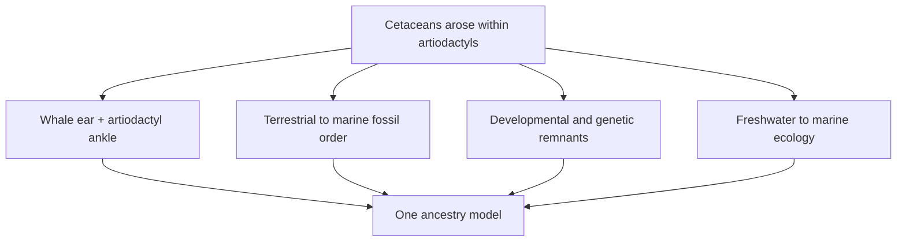

# Case study: whales from terrestrial artiodactyls

[Course map](../00-course-map.md) · [How to read evidence](../06-reading-the-evidence.md) · [Full whale lesson](../../lessons/05-whales/README.md) · [Will Duffy Q&A](../../lessons/05-whales/will-duffy-qa.md)

Cetaceans are a demanding test of common descent. Living whales are fully aquatic mammals with flippers, flukes, dorsal nostrils and no external hind limbs. Erika asks whether descent from terrestrial even-toed hoofed mammals predicts one coherent record across anatomy, fossil order, geography, development, genomes, bone density and isotopes.

## The hypothesis and its risky predictions

Genomes place living cetaceans within Artiodactyla, with hippopotamuses as their closest living relatives. This does **not** mean a living hippo turned into a whale. Both are surviving branches from an earlier population. Erika corrects that distinction explicitly at [lesson 7, 18:46–20:02](https://www.youtube.com/watch?v=TuWlGUq5Wi4&t=1126s).

Before touring the fossils, the ancestry model predicts:

1. early cetaceans should combine whale-defining anatomy with retained artiodactyl traits;
2. forms with greater terrestrial competence should precede fully marine forms;
3. freshwater or near-shore ecologies should precede worldwide oceanic dispersal;
4. living whales should retain developmental and genetic traces of altered terrestrial structures; and
5. independent habitat measurements should agree with the anatomical sequence.

Erika states the need for agreement among taxonomy, morphology, development, palaeontology and genetics at [38:00–39:20](https://www.youtube.com/watch?v=fnY58Y8FJBQ&t=2280s).

## Two bones constrain two relationships

The **involucrum** is a thickened medial wall of the tympanic bulla. Erika treats it as the diagnostic cetacean ear feature, linked to underwater hearing and absent from seals, otters and sirenians ([1:41:10](https://www.youtube.com/watch?v=fnY58Y8FJBQ&t=6070s)).

The **double-pulley astragalus** is an ankle form characteristic of artiodactyls. When both structures occur in one early cetacean, the ear identifies the whale branch while the ankle retains its deeper hoofed-mammal relationship. *Basilosaurus* preserves both even though its tiny hind limbs no longer supported walking ([2:05:51](https://www.youtube.com/watch?v=fnY58Y8FJBQ&t=7551s)). Protocetids, *Ambulocetus* and *Pakicetus* repeat the combination in increasingly land-capable bodies.

One “magic bone” does not carry the argument. The importance is the repeated **mosaic** of independent character systems.

## Read the sequence as branches, not a ladder

Erika teaches from modern whales backwards ([lesson 5, 1:49:50](https://www.youtube.com/watch?v=fnY58Y8FJBQ&t=6590s)); evolutionary change runs in the opposite time direction. The named forms are sampled branches, not a proved parent-to-child chain.

| Broad group | Approximate condition emphasised by Erika | Relationship signal |
| --- | --- | --- |
| Neocetes | Fully aquatic; flippers, fluke and dorsal blowhole; external hind limbs absent | Modern cetacean ear; toothed- and baleen-whale specialisations |
| Basilosaurids | Fully marine and fluked; tiny complete hind limbs; intermediate nostril position | Involucrum plus artiodactyl ankle ([1:58:47–2:05:51](https://www.youtube.com/watch?v=fnY58Y8FJBQ&t=7127s)) |
| Protocetids | Mostly aquatic; large hind limbs; variable pelvic attachment and swimming ability | Whale ear, double-pulley ankle and sometimes small hooves ([2:12:48–2:22:46](https://www.youtube.com/watch?v=fnY58Y8FJBQ&t=7968s)) |
| Remingtonocetids | Semi-aquatic near-shore or river specialists; forward nostrils and large limbs | Whale ear with sensory adaptations for turbid water ([2:25:43–2:27:03](https://www.youtube.com/watch?v=fnY58Y8FJBQ&t=8743s)) |
| Ambulocetids | Amphibious, weight-bearing limbs and powerful swimming | Cetacean ear plus artiodactyl ankle and foot ([2:29:20–2:30:22](https://www.youtube.com/watch?v=fnY58Y8FJBQ&t=8960s)) |
| Pakicetids | Mostly terrestrial walking body, forward nostrils and unspecialised tail | Diagnostic early whale ear with artiodactyl ankle and hooves ([2:31:45–2:33:12](https://www.youtube.com/watch?v=fnY58Y8FJBQ&t=9105s)) |
| Raoellids such as *Indohyus* | Small terrestrial/wading near-relatives | Cetacean-like ear region, artiodactyl foot and dense ballast bones ([2:36:59–2:38:51](https://www.youtube.com/watch?v=fnY58Y8FJBQ&t=9419s)) |

*Mounted skeletons of* Pakicetus *(lower right),* Ambulocetus *(lower left) and the fully aquatic* Cynthiacetus *(upper). The display helps compare locomotor proportions; it is not a literal genealogy. Photograph by Macrophyseter at the Muséum national d'Histoire naturelle, [source](https://commons.wikimedia.org/wiki/File:MNHN_whale_evolution.png), [CC BY 4.0](https://creativecommons.org/licenses/by/4.0/).*

## *Pakicetus*: a terrestrial body with a whale ear

Pakicetids walked competently on land. Their nostrils remained forward and their tails were not specialised as flukes. *Pakicetus* nevertheless has the involucrum, cetacean-like semicircular canals and a cetacean-shaped incus, along with a double-pulley ankle and hoofed terminal digits ([2:31:45](https://www.youtube.com/watch?v=fnY58Y8FJBQ&t=9105s)).

*Brown shapes mark recovered skeletal material; the grey silhouette is an interpretive aid. It must not be mistaken for fossilised skin or a complete articulated skeleton. Reconstruction by Conty after Gingerich and Thewissen and colleagues, [source and references](https://commons.wikimedia.org/wiki/File:Pakicetus_fossil.png), [CC BY 3.0](https://creativecommons.org/licenses/by/3.0/).*

This material helped displace an older mesonychid hypothesis. Once diagnostic ears and ankles were recovered, early cetaceans fitted artiodactyl ancestry more closely, in agreement with living-whale genetics. Revision after new bones is exactly what a testable phylogeny should permit ([2:33:12](https://www.youtube.com/watch?v=fnY58Y8FJBQ&t=9192s)).

## *Ambulocetus*: weight-bearing and aquatic

*Ambulocetus* had powerful limbs, a mobile elbow, forward nostrils, differentiated teeth and a paddle-like tail. It could support its weight on land but also possessed the cetacean involucrum, dense ear anatomy, a double-pulley astragalus and hoof-tipped toes ([2:29:20–2:30:22](https://www.youtube.com/watch?v=fnY58Y8FJBQ&t=8960s)).

*The photograph shows specimen material arranged for display, not an articulated life pose. Photograph by Akrasia25, [source](https://commons.wikimedia.org/wiki/File:Ambulocetus_Skeleton_with_Hans_Thewissen.jpg), [CC BY-SA 4.0](https://creativecommons.org/licenses/by-sa/4.0/).*

The original diagnosis is Thewissen et al., [“Fossil evidence for the origin of aquatic locomotion in archaeocete whales”](https://doi.org/10.1126/science.263.5144.210) (1994). Erika's later source audit shows that a shortened quotation omitted the character suite used to diagnose the animal ([lesson 7, 43:00–46:21](https://www.youtube.com/watch?v=TuWlGUq5Wi4&t=2580s)).

## Limbs, pelvis and locomotion change in stages

The transition is not simply “legs shrink.” Several functional relationships change:

- *Maiacetus* retained a pelvis connected to the spine and a head-first foetus, consistent with substantial terrestrial competence and coming ashore to give birth ([2:19:35](https://www.youtube.com/watch?v=fnY58Y8FJBQ&t=8375s)).
- *Georgiacetus* had a detached pelvis and could no longer transmit comparable body weight through the hind limbs ([2:22:46](https://www.youtube.com/watch?v=fnY58Y8FJBQ&t=8566s)).
- Basilosaurids retained a complete but tiny pelvis, femur, tibia, fibula, ankle and digits that no longer formed a weight-bearing connection ([2:03:57](https://www.youtube.com/watch?v=fnY58Y8FJBQ&t=7437s)).
- Living whales usually retain internal pelvic elements used as muscle anchors rather than walking limbs.

Changed function does not erase homology. The identity follows position, connections, development and intermediate fossil conditions.

## Soft structures leave hard and developmental traces

### Baleen and teeth

Early mysticetes show teeth, then teeth together with jaw evidence for baleen attachment, then reduced tooth roots and stronger baleen evidence. Living baleen whales have baleen and no erupted teeth ([1:54:31](https://www.youtube.com/watch?v=fnY58Y8FJBQ&t=6871s)).

Their embryos begin tooth development and normally reabsorb it; disabled tooth genes remain, and rare unerupted tooth structures occur ([1:56:14](https://www.youtube.com/watch?v=fnY58Y8FJBQ&t=6974s)). Fossil sockets, embryonic development and pseudogenes are independent consequences of the same proposed loss.

### Hind limbs

Dolphin embryos initiate hind-limb buds. Erika describes two developmental interruptions: the apical ectodermal ridge and **FGF8** expression are not maintained, and **SHH** signalling required for later distal patterning is absent ([2:07:44–2:09:00](https://www.youtube.com/watch?v=fnY58Y8FJBQ&t=7664s)). The relevant experimental study is Thewissen et al., [“Developmental basis for hind-limb loss in dolphins and origin of the cetacean bodyplan”](https://www.pnas.org/doi/10.1073/pnas.0602920103).

### Smell and hair

Living cetaceans retain many disabled chemoreception genes while fossil nasal anatomy indicates smell reduction in early forms ([2:21:56–2:22:23](https://www.youtube.com/watch?v=fnY58Y8FJBQ&t=8516s)). Newborn whales can retain a few snout hairs; remingtonocetid facial nerve openings support larger whiskers in near-shore ancestors. Blubber is an elaboration of ordinary mammalian subcutaneous fat, not a tissue unrelated to mammalian anatomy ([2:27:52–2:28:11](https://www.youtube.com/watch?v=fnY58Y8FJBQ&t=8872s)).

## Ecology changes in the same direction

### Geography

Earlier land-biased cetaceans cluster around Indo-Pakistan. More aquatic protocetids spread farther, and fully marine groups become worldwide. Erika connects dispersal capacity to this expanding geography at [2:13:05](https://www.youtube.com/watch?v=fnY58Y8FJBQ&t=7985s) and [2:26:13](https://www.youtube.com/watch?v=fnY58Y8FJBQ&t=8773s).

### Bone density

*Indohyus* and *Pakicetus* have unusually thick cortical limb bone, comparable in function to ballast in living bottom-wading mammals. Later active swimmers shift toward lighter, more porous internal construction ([2:39:00–2:41:13](https://www.youtube.com/watch?v=fnY58Y8FJBQ&t=9540s)). See Thewissen et al., [“Whales originated from aquatic artiodactyls in the Eocene epoch of India”](https://www.nature.com/articles/nature06343).

### Stable isotopes

Oxygen-18 and carbon-13 ratios distinguish freshwater from marine inputs. *Pakicetus*, *Nalacetus* and early *Ambulocetus* samples plot with freshwater conditions; *Ambulocetus* spans toward marine values; later neocetes plot with marine animals ([2:41:41–2:42:50](https://www.youtube.com/watch?v=fnY58Y8FJBQ&t=9701s)). Chemistry therefore tests habitat independently of whether a skeleton “looks aquatic.”

## Why direct ancestry is not required

A transitional fossil is dated and possesses the expected character mosaic. It may be a close side branch rather than the literal parent population. *Indohyus* is slightly too young in Erika's account to be the direct ancestor, yet its anatomy and ecology model a near-relative of the source population ([2:36:59](https://www.youtube.com/watch?v=fnY58Y8FJBQ&t=9419s)).

Overlapping fossil ranges are expected because a branch does not require its close relatives to vanish. Dogs arose within wolf populations while wolves survived; likewise, a derived archaeocete can coexist with a surviving more terrestrial branch ([1:16:24](https://www.youtube.com/watch?v=fnY58Y8FJBQ&t=4584s)).

## What would weaken the model?

- Living cetacean genomes consistently placing whales outside mammals or artiodactyls.
- Complete early cetacean ankles lacking the predicted artiodactyl pattern.
- Proposed whale fossils lacking the diagnostic cetacean ear suite.
- Fully derived neocetes securely preceding the terrestrial and amphibious forms.
- Freshwater and marine isotope order consistently reversing the anatomical sequence.
- Developmental and disabled-gene evidence recovering an incompatible ancestry.

A changed tail reconstruction or movement of one fossil to a neighbouring branch is local uncertainty, not a pattern-level failure. Erika asks the model-comparison question directly at [2:45:18](https://www.youtube.com/watch?v=fnY58Y8FJBQ&t=9918s): if this coordinated record is insufficient, what further observation would count?

## Exam-ready synthesis

> Cetacean common descent is supported by more than an ordered row of fossils. Genomes place living whales within artiodactyls; early whales combine a diagnostic cetacean involucrum with artiodactyl ankles and hooves; terrestrial competence declines while marine specialisations, geographic range and marine isotope values increase; and embryos and pseudogenes retain traces of teeth, hind limbs, hair and smell. The named fossils are usually sampled side branches, but their dated mosaics jointly fit one land-to-sea ancestry model.

## Active recall

1. Why are the involucrum and double-pulley astragalus especially informative together?
2. Contrast *Pakicetus*, *Ambulocetus*, a protocetid and a basilosaurid in locomotor anatomy.
3. How do baleen-whale embryos and tooth pseudogenes complement the fossil jaw sequence?
4. What do bone density and stable isotopes test that ear anatomy does not?
5. Why can *Indohyus* remain useful if it is not a direct ancestor?
6. Give one local uncertainty and one observation that would seriously contradict the full model.
