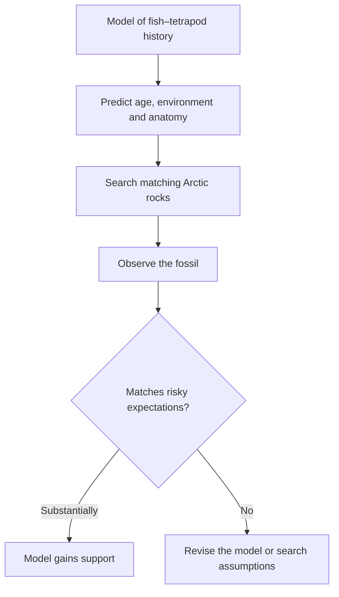
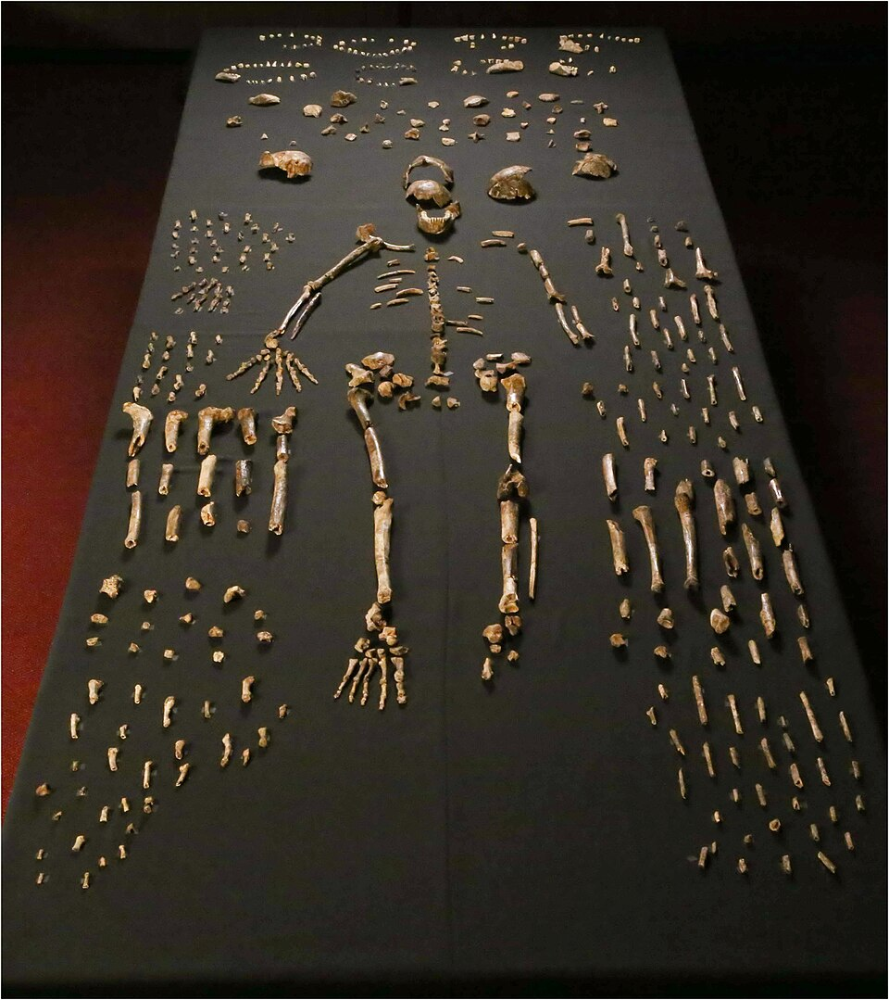

# Explaining life scientifically

## What you should learn

By the end of this note, you should be able to:

- explain Erika's Popper-influenced account of what makes an investigation scientific;
- distinguish an observation, hypothesis, test, theory and law;
- explain why evidence can support a claim without proving it permanently;
- show how a claim about the past can generate testable observations in the present; and
- state the main patterns that evolutionary theory is intended to explain.

## 1. Science is a method with a limited remit

Erika begins with science as a **way of knowing**: a means of acquiring knowledge about the world around us, rather than a synonym for everything that is true or meaningful ([29:49](https://www.youtube.com/watch?v=XoE8jajLdRQ&t=1789s)). In the account she uses for this introductory lesson, science seeks **natural causal explanations for observable phenomena**. Her examples are deliberately ordinary: why lightning tends to strike higher places and why humans sweat when it is hot ([30:06](https://www.youtube.com/watch?v=XoE8jajLdRQ&t=1806s); [30:12](https://www.youtube.com/watch?v=XoE8jajLdRQ&t=1812s)). The investigator looks for causes whose effects can be observed, compared and tested.

This restriction is methodological. Ghosts, miracles and other events defined as supernatural are outside the method because science cannot set up a repeatable natural test for them ([30:21](https://www.youtube.com/watch?v=XoE8jajLdRQ&t=1821s); [30:36](https://www.youtube.com/watch?v=XoE8jajLdRQ&t=1836s)). Erika is careful about the inference: **“science cannot investigate this” does not mean “this is false” or “the question is worthless.”** It means another kind of reasoning would be needed. Science is not intended to answer every philosophical question, a point she returns to while showing a diagram of questions inside and outside its scope ([32:42](https://www.youtube.com/watch?v=XoE8jajLdRQ&t=1962s); [33:01](https://www.youtube.com/watch?v=XoE8jajLdRQ&t=1981s)).

### Four working requirements

| Requirement in Erika's account | What it demands | What it rules out |
|---|---|---|
| **Natural causal explanation** | Relate an observable effect to processes that can be investigated ([30:06](https://www.youtube.com/watch?v=XoE8jajLdRQ&t=1806s)). | Ending an investigation with an untestable supernatural cause. |
| **Observable regularity** | Repeat tests and determine whether a result is consistent enough to predict other cases ([30:46](https://www.youtube.com/watch?v=XoE8jajLdRQ&t=1846s)). | Treating one unique result as a dependable general rule. |
| **Independent observation** | Let investigators in different places and times repeat or challenge the work ([31:07](https://www.youtube.com/watch?v=XoE8jajLdRQ&t=1867s)). | Accepting a backyard experiment solely because its original investigator reports success. |
| **Falsifiability** | Specify observations that could show an explanation to be wrong ([31:24](https://www.youtube.com/watch?v=XoE8jajLdRQ&t=1884s)). | A claim that interprets every possible result as confirmation. |

The final requirement is especially important. “Falsifiable” does not mean “already false”; it means that the claim takes an evidential risk. If fertiliser A is claimed to improve tomato growth, equal growth under A and B—or better growth under B—must be allowed to count against that claim. If no outcome could count against it, no experiment can discriminate it from alternatives.

Science is also **provisional**. Erika describes this as a strength, not an embarrassment: claims remain open to rejection or reinterpretation if new data appear, which lets scientific knowledge adapt instead of becoming fixed by authority ([31:35](https://www.youtube.com/watch?v=XoE8jajLdRQ&t=1895s); [31:49](https://www.youtube.com/watch?v=XoE8jajLdRQ&t=1909s)). “Science changes” can therefore mean that the correction process is working.

## 2. From a question to a tested explanation

Erika presents the scientific method as the same basic pattern of inquiry whether the example is Galileo assessing a model or an early ape striking rocks together: ask what will happen, investigate, propose an answer, test it, analyse the result and report the conclusion ([33:08](https://www.youtube.com/watch?v=XoE8jajLdRQ&t=1988s); [33:20](https://www.youtube.com/watch?v=XoE8jajLdRQ&t=2000s)). It is not merely a classroom checklist. Reporting matters because independent scrutiny is impossible if the method and results remain private.

*This CC0 diagram makes the cycle visible: a conclusion produces new observations and questions rather than ending inquiry forever. Diagram by Thebiologyprimer, [source file](https://commons.wikimedia.org/wiki/File:The_Scientific_Method_%28simple%29.png), [CC0 1.0 public-domain dedication](https://creativecommons.org/publicdomain/zero/1.0/).*

### Worked example: Erika's tomato plants

1. **Observation:** this year's tomato plants grew less well than last year's ([33:45](https://www.youtube.com/watch?v=XoE8jajLdRQ&t=2025s); [34:00](https://www.youtube.com/watch?v=XoE8jajLdRQ&t=2040s)).
2. **Question:** why did the yield change?
3. **Candidate cause:** the fertiliser changed between the two years ([34:05](https://www.youtube.com/watch?v=XoE8jajLdRQ&t=2045s)).
4. **Hypothesis:** fertiliser A produces better results than fertiliser B ([34:26](https://www.youtube.com/watch?v=XoE8jajLdRQ&t=2066s)).
5. **Test:** use multiple plants, control relevant conditions, assign fertilisers and compare growth ([35:42](https://www.youtube.com/watch?v=XoE8jajLdRQ&t=2142s); [35:54](https://www.youtube.com/watch?v=XoE8jajLdRQ&t=2154s)).
6. **Possible falsifiers:** both groups grow equally well, or B performs better than A ([36:01](https://www.youtube.com/watch?v=XoE8jajLdRQ&t=2161s)).
7. **Possible support:** A repeatedly produces greater growth under the tested conditions ([36:16](https://www.youtube.com/watch?v=XoE8jajLdRQ&t=2176s)).

The last qualification matters. One result supports the hypothesis **for that experiment**; it does not establish that A is categorically superior in every soil, climate or plant variety. Confidence becomes stronger through repeated tests and independent observers across space and time ([36:32](https://www.youtube.com/watch?v=XoE8jajLdRQ&t=2192s); [37:26](https://www.youtube.com/watch?v=XoE8jajLdRQ&t=2246s)). Erika therefore prefers “support” or “reject” to “prove”: permanent proof would conflict with the provisional character of empirical science ([37:07](https://www.youtube.com/watch?v=XoE8jajLdRQ&t=2227s)).

Not every falsifiable sentence is a useful scientific hypothesis. “Erika's dog is purple” can be checked and rejected by looking, but it explains no phenomenon and advances no investigation ([35:04](https://www.youtube.com/watch?v=XoE8jajLdRQ&t=2104s); [35:18](https://www.youtube.com/watch?v=XoE8jajLdRQ&t=2118s)). A productive hypothesis connects an observation to a proposed cause and opens a route to further testing.

### Hypothesis, theory and law are not promotion levels

In everyday speech, “theory” often means a hunch. In science, Erika uses the terms differently:

- A **hypothesis** is a provisional, testable explanation of a particular phenomenon ([34:34](https://www.youtube.com/watch?v=XoE8jajLdRQ&t=2074s)).
- A **theory** is a broad framework explaining **why** a body of phenomena occurs. Germ theory, general relativity and evolutionary theory are her examples ([38:01](https://www.youtube.com/watch?v=XoE8jajLdRQ&t=2281s); [38:19](https://www.youtube.com/watch?v=XoE8jajLdRQ&t=2299s)).
- A **law** describes **what** regular relationship occurs, often in mathematical form; she contrasts conservation of energy and gravitation with explanatory theories ([38:04](https://www.youtube.com/watch?v=XoE8jajLdRQ&t=2284s); [38:24](https://www.youtube.com/watch?v=XoE8jajLdRQ&t=2304s)).

A theory does not become a law after collecting enough evidence. The terms identify different jobs. This is why “evolution is only a theory” mistakes the colloquial meaning for the scientific one—an error Will explicitly asks creationists not to use ([38:43](https://www.youtube.com/watch?v=XoE8jajLdRQ&t=2323s); [38:52](https://www.youtube.com/watch?v=XoE8jajLdRQ&t=2332s)).

## 3. Historical claims can make risky predictions

Erika accepts “historical” and “observational” science as convenient labels, but rejects the idea that they use different standards. Both connect hypotheses to observations, theories and laws; the difference is whether the immediate subject is a past event or a process being watched now ([40:00](https://www.youtube.com/watch?v=XoE8jajLdRQ&t=2400s); [40:26](https://www.youtube.com/watch?v=XoE8jajLdRQ&t=2426s)). Directly watching the originating event is not required. What matters is whether the event would leave consequences that can be independently detected.

Her central evolutionary example is the search for *Tiktaalik*. A team used evolutionary expectations to identify rocks of the appropriate age and environment for an animal morphologically intermediate between lobe-finned fishes and early tetrapods. They then searched those rocks and found the predicted kind of fossil ([41:12](https://www.youtube.com/watch?v=XoE8jajLdRQ&t=2472s); [41:24](https://www.youtube.com/watch?v=XoE8jajLdRQ&t=2484s); [41:32](https://www.youtube.com/watch?v=XoE8jajLdRQ&t=2492s)). The important point is not “a fossil was found somewhere.” The model constrained **where and what to look for before discovery**. The resulting anatomy was reported in the 2006 primary papers on [the tetrapod-like body plan](https://doi.org/10.1038/nature04639) and [the pectoral fin](https://doi.org/10.1038/nature04637).

Erika gives parallel examples so the logic is not mistaken for something unique to evolution:

- Modern earthquakes leave characteristic stress fractures; comparable fractures in older rocks can support an inference to a past earthquake ([42:32](https://www.youtube.com/watch?v=XoE8jajLdRQ&t=2552s)).
- Observed impact craters provide a causal comparison for old craters on the Moon and other bodies ([42:52](https://www.youtube.com/watch?v=XoE8jajLdRQ&t=2572s)).
- Plants have environmental tolerances. Fossils of warmth-dependent plants therefore provide evidence about earlier local conditions ([43:16](https://www.youtube.com/watch?v=XoE8jajLdRQ&t=2596s); [43:27](https://www.youtube.com/watch?v=XoE8jajLdRQ&t=2607s)).
- In forensics, the shape of an injury can be compared with injuries caused by known weapons; in pathology, transmission observed at gatherings can support a reconstruction of an earlier infection event ([45:45](https://www.youtube.com/watch?v=XoE8jajLdRQ&t=2745s); [46:08](https://www.youtube.com/watch?v=XoE8jajLdRQ&t=2768s)).

These inferences are not all equally certain merely because they share a form. Their strength depends on how diagnostic the trace is, whether rival causes were tested, and whether several independent traces converge.

### Evidence weighting: Will's mammoth example

Will recalls a claim that tropical flora had been found in the mouth of a frozen Siberian mammoth but openly says he has not verified it ([43:38](https://www.youtube.com/watch?v=XoE8jajLdRQ&t=2618s); [44:03](https://www.youtube.com/watch?v=XoE8jajLdRQ&t=2643s)). Erika does not invent an immediate rebuttal. She says she has not heard that example and would need to investigate it. She then poses the correct comparative question: if one reported specimen contained tropical material while many mammoths contain location-appropriate Arctic plants, what climate model explains **the whole dataset**, and how reliable is the exceptional report? ([44:27](https://www.youtube.com/watch?v=XoE8jajLdRQ&t=2667s); [44:35](https://www.youtube.com/watch?v=XoE8jajLdRQ&t=2675s); [44:55](https://www.youtube.com/watch?v=XoE8jajLdRQ&t=2695s)).

This is a useful revision habit: do not turn an unverified anecdote into a fact, but do not dismiss it merely because it is surprising. Locate the specimen and publication, check identification and context, and compare it with the full body of evidence.

## 4. Scrutiny is part of the method

Peer review is Erika's example of organised criticism. Specialists examine whether methods, analysis and conclusions are rigorous before publication ([46:50](https://www.youtube.com/watch?v=XoE8jajLdRQ&t=2810s)). She describes selective journals rejecting many submissions and uses her own grant review to show what expert scrutiny can add: a reviewer noticed that her proposed dental study lacked a power analysis demonstrating that its sample size could support a statistically meaningful result ([47:07](https://www.youtube.com/watch?v=XoE8jajLdRQ&t=2827s); [47:30](https://www.youtube.com/watch?v=XoE8jajLdRQ&t=2850s); [48:18](https://www.youtube.com/watch?v=XoE8jajLdRQ&t=2898s)). The lesson is not that reviewers are infallible. It is that exposing a study to relevant expertise reveals assumptions the authors may have missed.

Expertise must also match the subject. Erika's objection to a geologist reviewing specialist genetics is not an insult to geologists; it is that expertise in one field does not automatically qualify someone to audit another field's detailed methods ([50:33](https://www.youtube.com/watch?v=XoE8jajLdRQ&t=3033s); [50:49](https://www.youtube.com/watch?v=XoE8jajLdRQ&t=3049s); [51:06](https://www.youtube.com/watch?v=XoE8jajLdRQ&t=3066s)). A claim capable of overturning a large, well-supported framework should withstand scrutiny from the people best equipped to test its evidence.

### A live dispute: did *Homo naledi* bury its dead?

Erika uses the *Homo naledi* burial debate to show correction happening in public. A team proposed deliberate burial; critics answered that the presented evidence did not establish burial or rock art, and another critique focused on sedimentology ([52:55](https://www.youtube.com/watch?v=XoE8jajLdRQ&t=3175s); [53:00](https://www.youtube.com/watch?v=XoE8jajLdRQ&t=3180s); [53:06](https://www.youtube.com/watch?v=XoE8jajLdRQ&t=3186s)). The disagreement turns on fine-grained taphonomic, geochemical and depositional evidence—not a vote about which conclusion feels more appealing ([53:47](https://www.youtube.com/watch?v=XoE8jajLdRQ&t=3227s); [53:51](https://www.youtube.com/watch?v=XoE8jajLdRQ&t=3231s)). Erika says she remained unconvinced at the time of the stream, while presenting the exchange as science functioning through criticism ([54:18](https://www.youtube.com/watch?v=XoE8jajLdRQ&t=3258s); [54:21](https://www.youtube.com/watch?v=XoE8jajLdRQ&t=3261s)).

*Dinaledi skeletal specimens used in the original anatomical diagnosis of* Homo naledi. *The central arrangement is a composite of bones from multiple individuals, not one complete skeleton. Image by the Lee Roger Berger research team, from the open-access [species description](https://doi.org/10.7554/eLife.09560), [source file](https://commons.wikimedia.org/wiki/File:Homo_naledi_skeletal_specimens.jpg), [CC BY 4.0](https://creativecommons.org/licenses/by/4.0/). The image documents the species; it does not by itself establish deliberate burial.*

For the dispute Erika names, compare the revised [burial proposal](https://doi.org/10.7554/eLife.89106) with Martinón-Torres and colleagues' [critical assessment](https://doi.org/10.1016/j.jhevol.2023.103464). The revision question is not “which side published last?” but “which observations distinguish deliberate burial from natural deposition?”

## 5. What evolutionary theory is trying to explain

After establishing the method, Erika identifies the observations that motivate evolutionary theory:

- the extraordinary diversity of organisms living today and known from the past ([55:20](https://www.youtube.com/watch?v=XoE8jajLdRQ&t=3320s); [55:49](https://www.youtube.com/watch?v=XoE8jajLdRQ&t=3349s));
- clusters of organisms that share many features—cats, dog-like animals, primates and hoofed mammals ([55:55](https://www.youtube.com/watch?v=XoE8jajLdRQ&t=3355s); [56:00](https://www.youtube.com/watch?v=XoE8jajLdRQ&t=3360s));
- unequal degrees of similarity among those clusters; and
- where humans fit in the same biological pattern ([56:16](https://www.youtube.com/watch?v=XoE8jajLdRQ&t=3376s); [56:20](https://www.youtube.com/watch?v=XoE8jajLdRQ&t=3380s)).

Her compact answer is population-based. Groups of organisms form lineages; lineages change in relation to changing environments; and some yield new species. Run that history backward and daughter lineages converge on ancestral populations, ultimately to a last universal common ancestor, with humans included in the same history ([56:31](https://www.youtube.com/watch?v=XoE8jajLdRQ&t=3391s); [56:40](https://www.youtube.com/watch?v=XoE8jajLdRQ&t=3400s); [56:43](https://www.youtube.com/watch?v=XoE8jajLdRQ&t=3403s)). Erika closes this setup with Theodosius Dobzhansky's 1973 statement that biology becomes intelligible “in the light of evolution,” identifying him as a theistic evolutionist involved in the modern synthesis ([56:59](https://www.youtube.com/watch?v=XoE8jajLdRQ&t=3419s); [57:04](https://www.youtube.com/watch?v=XoE8jajLdRQ&t=3424s)).

This explanation begins with reproducing populations and heritable variation. It is not, by itself, a theory of the origin of the universe, a moral philosophy, a proof against God or a complete account of the origin of the first life. Those may be important questions, but confusing them with descent among populations prevents the evolutionary claim from being tested on its own terms.

## Revision checkpoint

- **Scope:** science investigates observable phenomena with natural, testable causes.
- **Status of evidence:** results support or undermine claims; they do not make empirical knowledge unrevisable.
- **Vocabulary:** hypotheses propose particular explanations; theories explain broad patterns; laws describe regular relationships.
- **Past events:** the event need not be repeated if it predicts diagnostic traces that can be checked now.
- **Quality control:** replication, relevant expert review and comparison of alternatives matter more than prestige alone.
- **Evolution's target:** explain diversity, nested resemblance, lineage change and common ancestry among populations.

## Active recall

1. Give an example of a meaningful question that science may be unable to test. Why is “untestable” different from “false”?
2. In the tomato example, list two results that would falsify the original hypothesis and one that would support it.
3. Why does a theory never “graduate” into a law in Erika's account?
4. Reconstruct the *Tiktaalik* example as a prediction rather than merely a fossil discovery.
5. What additional checks would you make before using the tropical-flora mammoth claim as evidence?
6. In the *Homo naledi* dispute, why is sedimentological context more informative than simply displaying the bones?
7. State Erika's population-and-lineage summary of evolutionary theory without implying that individuals change because they consciously need to.
