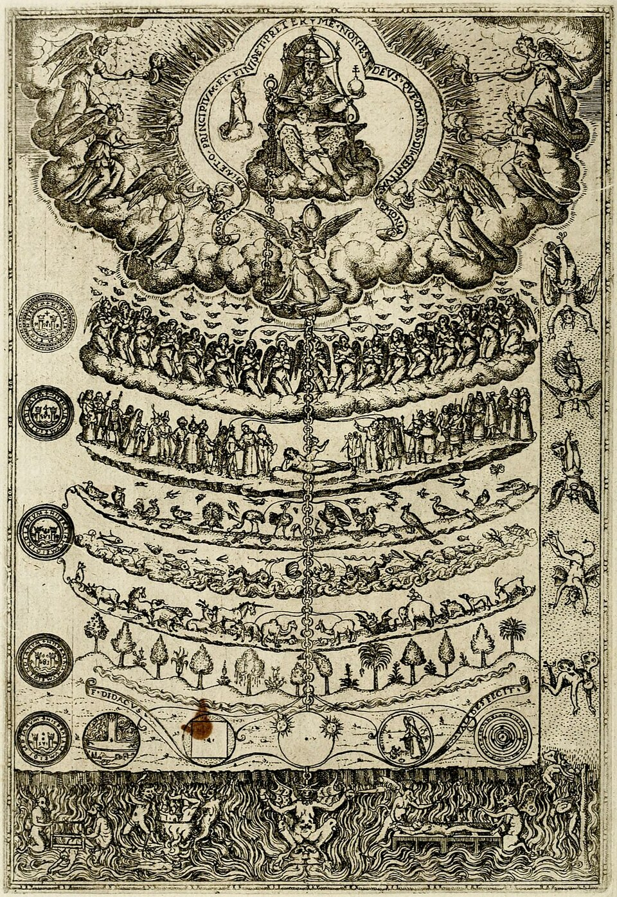
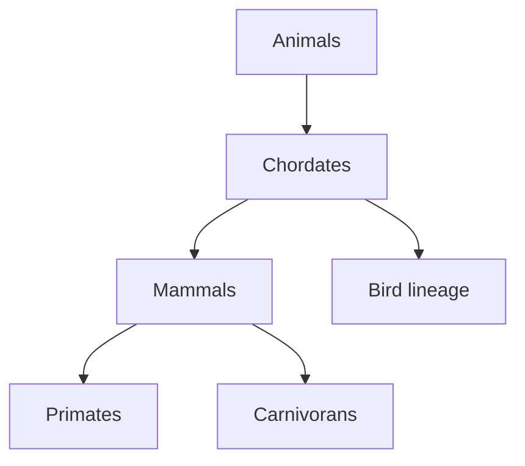

# Classification, species and ancestry

## What you should learn

- How essentialism and the “great chain of being” differ from population thinking.
- Why fossils and extinction challenged a fixed, complete creation.
- How Linnaean groups nest and why a branching history predicts that pattern.
- Why species are useful categories without having one perfect boundary.

## From fixed essences to changing populations

Erika begins the intellectual history with Plato's **essentialism**. On this view, a cat, horse or chair has an ideal, unchanging essence; differences between real examples are imperfect deviations from that ideal. Applied to organisms, variation is noise rather than the material from which populations change ([58:20](https://www.youtube.com/watch?v=XoE8jajLdRQ&t=3500s)). Aristotle arranged fixed forms into the *scala naturae* or great chain of being, with inanimate matter, plants, animals and humans in an ordered hierarchy ([59:40](https://www.youtube.com/watch?v=XoE8jajLdRQ&t=3580s)). Neither view is a modern evolutionary tree: a hierarchy of value or complexity is not a genealogy.

Erika expands the contrast by explaining that Plato treated living and even some non-living things as possessing a set of unchanging characteristics; departures from the ideal were “aberrant,” not raw material from which populations could change ([58:20](https://www.youtube.com/watch?v=XoE8jajLdRQ&t=3500s); [58:34](https://www.youtube.com/watch?v=XoE8jajLdRQ&t=3514s); [58:46](https://www.youtube.com/watch?v=XoE8jajLdRQ&t=3526s)). Aristotle's ordering retained that fixity: forms occupied positions but did not turn into the forms above or below them ([59:44](https://www.youtube.com/watch?v=XoE8jajLdRQ&t=3584s); [1:00:03](https://www.youtube.com/watch?v=XoE8jajLdRQ&t=3603s)). Population thinking reverses the emphasis. Individual variation becomes expected, inherited differences can change in frequency, and a species is no longer defined by proximity to one timeless perfect specimen.

*A later Christian representation of the Great Chain of Being from Diego de Valadés's* Rhetorica christiana *(1579). It visualises a ranked cosmos, not descent through branching ancestors. Image: Diego de Valadés, [source file](https://commons.wikimedia.org/wiki/File:The_Great_Chain_of_Being_%281579%29.jpg), [public domain](https://creativecommons.org/publicdomain/mark/1.0/).*

Erika stresses that the history was not exclusively Greek or European. The Daoist thinker Zhuang Zhou described nature as continually transforming and entertained environmentally related change in organisms ([1:00:20](https://www.youtube.com/watch?v=XoE8jajLdRQ&t=3620s)). Augustine did not treat the six-day creation as a simple modern literal chronology, while thinkers during the Islamic Golden Age discussed variation, adaptation and possible continuity between humans and other animals ([1:01:00](https://www.youtube.com/watch?v=XoE8jajLdRQ&t=3660s); [1:01:40](https://www.youtube.com/watch?v=XoE8jajLdRQ&t=3700s)). These were not modern evolutionary theories, but they show that fixity was never the only imaginable framework.

The distinctions deserve care. Erika presents Zhuang Zhou's thought as congenial to change because Daoism sees humans and nature in continuing transformation ([1:00:27](https://www.youtube.com/watch?v=XoE8jajLdRQ&t=3627s); [1:00:37](https://www.youtube.com/watch?v=XoE8jajLdRQ&t=3637s)). She describes Augustine as permitting change in **forms** and reading the six days non-literally—not as proposing natural selection or a modern species concept ([1:01:03](https://www.youtube.com/watch?v=XoE8jajLdRQ&t=3663s); [1:01:20](https://www.youtube.com/watch?v=XoE8jajLdRQ&t=3680s)). Nasir al-Din al-Tusi and Ibn Khaldun enter the lesson because they discussed variation, adaptation and a possible connection between humans and other animals; Erika notes that thinkers living around non-human primates had observations unavailable to many Europeans ([1:01:46](https://www.youtube.com/watch?v=XoE8jajLdRQ&t=3706s); [1:02:08](https://www.youtube.com/watch?v=XoE8jajLdRQ&t=3728s); [1:02:24](https://www.youtube.com/watch?v=XoE8jajLdRQ&t=3744s)). These are precedents for asking about transformation, not claims that Darwin's theory had already been formulated.

## Fossils force a historical question

In the seventeenth and eighteenth centuries, investigators such as Robert Hooke, Nicolas Steno and John Ray helped establish that fossils were once-living organisms rather than “sports of nature” ([1:19:00](https://www.youtube.com/watch?v=XoE8jajLdRQ&t=4740s)). Early flood geologists tried to fit the record to catastrophe, often while already allowing a gap or long “days.” Hutton's observations of slow erosion and deposition then indicated far more time than a short chronology could contain ([1:22:00](https://www.youtube.com/watch?v=XoE8jajLdRQ&t=4920s)).

That history is more nuanced than “religion versus geology.” Hooke, Steno and Ray worked within natural-theological traditions while making an organic case for fossils ([1:19:19](https://www.youtube.com/watch?v=XoE8jajLdRQ&t=4759s); [1:19:26](https://www.youtube.com/watch?v=XoE8jajLdRQ&t=4766s)). Erika says they regarded the geological column as too extensive and varied to attribute straightforwardly to one flood ([1:20:06](https://www.youtube.com/watch?v=XoE8jajLdRQ&t=4806s); [1:20:14](https://www.youtube.com/watch?v=XoE8jajLdRQ&t=4814s)). The early diluvialists she names—Thomas Burnet, John Woodward and William Whiston—did invoke a global flood, but also placed additional time in a gap or interpreted the creation “days” non-literally ([1:20:34](https://www.youtube.com/watch?v=XoE8jajLdRQ&t=4834s); [1:20:49](https://www.youtube.com/watch?v=XoE8jajLdRQ&t=4849s); [1:21:20](https://www.youtube.com/watch?v=XoE8jajLdRQ&t=4880s)).

Hutton joined a known historical timescale to a much larger landscape. Hadrian's Wall remained comparatively little eroded, whereas the surrounding valleys recorded vastly more erosion ([1:22:19](https://www.youtube.com/watch?v=XoE8jajLdRQ&t=4939s); [1:22:52](https://www.youtube.com/watch?v=XoE8jajLdRQ&t=4972s); [1:23:04](https://www.youtube.com/watch?v=XoE8jajLdRQ&t=4984s)). He then documented deposition, erosion and sedimentation as continuing processes ([1:23:13](https://www.youtube.com/watch?v=XoE8jajLdRQ&t=4993s)). The comparison did not calculate the modern numerical age of Earth; it showed why a few thousand years were not evidently enough.

Mary Anning's large marine reptiles sharpened the difficulty: these were not merely familiar species preserved in stone but organisms unlike anything known alive ([1:33:40](https://www.youtube.com/watch?v=XoE8jajLdRQ&t=5620s)). Georges Cuvier compared fossils across locations and strata and established extinction as a real phenomenon. Because distinct fossil communities appeared in different settings and layers, he favoured repeated catastrophes followed by repopulation rather than a single flood ([1:36:20](https://www.youtube.com/watch?v=XoE8jajLdRQ&t=5780s); [1:38:40](https://www.youtube.com/watch?v=XoE8jajLdRQ&t=5920s)). Cuvier still defended species fixity: accepting extinction and deep history did not automatically entail evolution.

*Mary Anning's 26 December 1823 letter and drawing announcing the fossil now called* Plesiosaurus dolichodeirus. *This is historical evidence made by Anning herself, not a modern reconstruction. Image: Mary Anning, via the Wellcome Collection, [source file](https://commons.wikimedia.org/wiki/File:Mary_Anning_Plesiosaurus.jpg), [public domain](https://creativecommons.org/publicdomain/mark/1.0/).*

The theological pressure point was the **plenitude of creation**: if creation was complete and “very good,” many thinkers assumed an entire form could not disappear. Erika uses Thomas Jefferson's expectation that mammoth-like animals might still live in the unexplored West to show how seriously this was held ([1:32:55](https://www.youtube.com/watch?v=XoE8jajLdRQ&t=5575s); [1:33:15](https://www.youtube.com/watch?v=XoE8jajLdRQ&t=5595s)). Small shells could be imagined as surviving somewhere; a 12–13-foot marine reptile without a close living match made that answer much harder ([1:33:41](https://www.youtube.com/watch?v=XoE8jajLdRQ&t=5621s); [1:33:48](https://www.youtube.com/watch?v=XoE8jajLdRQ&t=5628s); [1:34:06](https://www.youtube.com/watch?v=XoE8jajLdRQ&t=5646s)).

Cuvier's case was cumulative. He compared unfamiliar teeth and bones with museum specimens, tracked which fossils occurred together by layer and locality, and concluded that many represented lost forms ([1:36:24](https://www.youtube.com/watch?v=XoE8jajLdRQ&t=5784s); [1:37:18](https://www.youtube.com/watch?v=XoE8jajLdRQ&t=5838s); [1:38:19](https://www.youtube.com/watch?v=XoE8jajLdRQ&t=5899s)). Because settings and assemblages differed, he rejected one universal catastrophe in favour of repeated catastrophes ([1:38:34](https://www.youtube.com/watch?v=XoE8jajLdRQ&t=5914s); [1:38:41](https://www.youtube.com/watch?v=XoE8jajLdRQ&t=5921s)). His repopulations still preserved fixity. Thus three questions must be kept separate: **Did extinction occur? Is Earth deep in time? Do lineages transform?** Cuvier could answer yes, yes and no.

Jean-Baptiste Lamarck did argue that forms transform. His proposed mechanism—the inheritance of characteristics acquired through use and disuse—was wrong in the simple form taught here: stretching does not rewrite inherited neck length, and muscular parents do not produce muscular babies merely because they trained ([1:40:40](https://www.youtube.com/watch?v=XoE8jajLdRQ&t=6040s); [1:41:40](https://www.youtube.com/watch?v=XoE8jajLdRQ&t=6100s)). His historical importance is that he offered a natural process for species change and forced later thinkers to specify a better mechanism.

## Linnaeus and nested classification

Carl Linnaeus wanted to catalogue a fixed creation. He formalised binomial names and the familiar hierarchy—kingdom, phylum, class, order, family, genus and species ([1:24:20](https://www.youtube.com/watch?v=XoE8jajLdRQ&t=5060s)). Yet the organisms he classified fell into **nested groups**: a leopard is in *Panthera*, but remains a cat, carnivoran, mammal and animal. A more specific category does not erase the broader categories it inherits ([1:25:00](https://www.youtube.com/watch?v=XoE8jajLdRQ&t=5100s)).

Erika walks through an ostrich, a dog and a human. All three share the traits used to group animals and chordates. At the class level, dog and human remain together as mammals while the ostrich branches elsewhere; at the order level, dog and human separate into Carnivora and Primates ([1:28:40](https://www.youtube.com/watch?v=XoE8jajLdRQ&t=5320s); [1:29:20](https://www.youtube.com/watch?v=XoE8jajLdRQ&t=5360s)). Linnaeus even grouped humans with apes because he could find no anatomical character that justified excluding humans from that cluster ([1:30:40](https://www.youtube.com/watch?v=XoE8jajLdRQ&t=5440s)).

A branching genealogy explains this structure: descendants inherit the broad traits of their ancestors, while later modifications diagnose smaller branches. It is not a ladder from “lower” to “higher.” Every living branch has been evolving for the same time since its shared ancestor.

## The species problem is expected, not concealed

Will raises the biological species concept: if a species is defined by the ability to produce fertile offspring, how can it cover asexual organisms or fossils, and what about recognised species that hybridise? ([1:25:40](https://www.youtube.com/watch?v=XoE8jajLdRQ&t=5140s); [1:26:40](https://www.youtube.com/watch?v=XoE8jajLdRQ&t=5200s)). Erika agrees that no single species definition works universally. Lions and tigers, some sturgeon and paddlefish, and even distantly classified elephants can complicate a simple fertility rule. Fossils cannot be breeding-tested at all.

Her answer is that “species” remains a useful human label for discussing populations and lineages, but nature need not provide a perfectly sharp border ([1:27:00](https://www.youtube.com/watch?v=XoE8jajLdRQ&t=5220s)). Under evolutionary theory, gradual divergence makes fuzzy boundaries unsurprising: neighbouring populations may exchange genes while sufficiently separated descendants no longer do. The lack of a universal cut-off is therefore not the absence of population structure; it is a warning not to mistake a naming convention for an immutable natural essence.

### Common confusion

- **Nested groups are not based on one striking similarity.** Wings can evolve independently; the stronger pattern is a repeated hierarchy of many characters.
- **Common ancestry does not say one modern species turned into another modern species.** Humans did not descend from living chimpanzees; the lineages share earlier ancestral populations.
- **A difficult species boundary does not make every organism the same species.** It means different research questions may require reproductive, genetic, ecological or lineage-based concepts.

## Active recall

1. Why did extinction create a problem for the plenitude and fixity of creation?
2. Explain why a human can acquire a more specific classification without ceasing to be a mammal.
3. How does evolutionary population thinking predict ambiguity at a species boundary?
