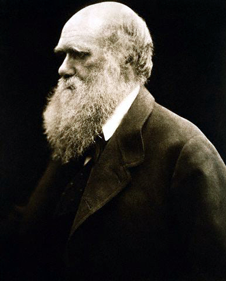

# From natural theology to Darwin and Wallace

## What you should learn

- Why apparent design is not, by itself, a scientific discriminator.
- How Hutton and Lyell connected present processes to deep geological time.
- Which observations on the *Beagle* shaped Darwin's reasoning.
- Darwin's five linked claims and the observational case for natural selection.

## Paley's design argument and its limit

William Paley's natural theology compared organisms with a watch: complex, purpose-like organisation invites an inference to an intelligent maker ([1:03:40](https://www.youtube.com/watch?v=XoE8jajLdRQ&t=3820s); [1:04:20](https://www.youtube.com/watch?v=XoE8jajLdRQ&t=3860s)). Darwin initially admired this reasoning. Erika's objection is not “design is disproved”; it is that apparent design alone supplies no test that separates divine construction from complexity produced by ordinary processes.

She uses primary succession as the key example. Mosses and lichens colonise a new volcanic island, then plants and animals arrive, interact, and gradually form an interdependent ecosystem ([1:05:40](https://www.youtube.com/watch?v=XoE8jajLdRQ&t=3940s); [1:09:00](https://www.youtube.com/watch?v=XoE8jajLdRQ&t=4140s)). Natural arches and the Giant's Causeway also form ordered structures without human manufacture. Will replies that a designer may have programmed the organisms and rules. Erika accepts that as a philosophical possibility but asks for a prediction that distinguishes it from the natural process observed. Without that discriminator, teleology is not a competing scientific mechanism ([1:08:00](https://www.youtube.com/watch?v=XoE8jajLdRQ&t=4080s); [1:12:40](https://www.youtube.com/watch?v=XoE8jajLdRQ&t=4360s)).

## Deep time becomes an empirical conclusion

James Ussher famously calculated a creation around 4004 BCE using biblical genealogies and extra-biblical chronology. Erika notes that its inclusion in editions of the King James Bible made this one chronology culturally influential, even though other theological chronologies differed ([1:13:40](https://www.youtube.com/watch?v=XoE8jajLdRQ&t=4420s); [1:15:00](https://www.youtube.com/watch?v=XoE8jajLdRQ&t=4500s)).

During the Enlightenment, geology challenged a young Earth independently of Darwin. Hutton compared the limited erosion of a dated Roman wall with the enormous valleys around it and documented slow deposition, erosion and sedimentation ([1:22:20](https://www.youtube.com/watch?v=XoE8jajLdRQ&t=4940s); [1:23:00](https://www.youtube.com/watch?v=XoE8jajLdRQ&t=4980s)). Charles Lyell then assembled many cases in which present processes explain ancient features: modern and fossil mud cracks, ripple marks, uplift and erosion. His **uniformitarianism** held that the same natural laws operate through time ([1:48:20](https://www.youtube.com/watch?v=XoE8jajLdRQ&t=6500s); [1:49:00](https://www.youtube.com/watch?v=XoE8jajLdRQ&t=6540s)).

Modern geology is not committed to “everything is always slow.” Erika calls the modern position **actualism**: use processes observed today, including local catastrophes such as eruptions, landslides, floods and impacts, and identify their characteristic traces ([1:52:00](https://www.youtube.com/watch?v=XoE8jajLdRQ&t=6720s); [1:53:00](https://www.youtube.com/watch?v=XoE8jajLdRQ&t=6780s)). A catastrophe can have global consequences without every part of the event occurring everywhere. The evidential question for a proposed global flood is consequently not whether floods occur, but whether one flood's diagnostic signature explains the entire geological column.

## Darwin's route to common descent

Thomas Malthus argued that populations can increase faster than their resources. Darwin later applied this population pressure to organisms: more offspring are produced than can all survive and reproduce ([1:46:00](https://www.youtube.com/watch?v=XoE8jajLdRQ&t=6360s)).

Erika makes Malthus's role more specific. His *Essay on the Principle of Population* warned that population growth could outrun food production, bringing famine, disease and a crash; he also stressed that poor people would feel the shortage first ([1:46:12](https://www.youtube.com/watch?v=XoE8jajLdRQ&t=6372s); [1:46:34](https://www.youtube.com/watch?v=XoE8jajLdRQ&t=6394s); [1:47:28](https://www.youtube.com/watch?v=XoE8jajLdRQ&t=6448s)). Darwin's biological use was not a political endorsement. It supplied a missing inference: if organisms produce more young than available resources can support, a “struggle for existence” follows even when no animals literally fight.

Darwin joined the *Beagle* voyage in 1831 after studying natural history and reading Lyell. He observed an earthquake rapidly altering the Chilean landscape, shells far inland that indicated uplifted sea beds, and South American fossils unlike living mammals ([2:06:20](https://www.youtube.com/watch?v=XoE8jajLdRQ&t=7580s); [2:08:20](https://www.youtube.com/watch?v=XoE8jajLdRQ&t=7700s)). The Galápagos birds were especially important. Darwin did not initially recognise them all as finches; after specialists classified them, he confronted a graded range of beaks suited to different foods and a resemblance to a more general mainland finch ([2:10:40](https://www.youtube.com/watch?v=XoE8jajLdRQ&t=7840s); [2:13:20](https://www.youtube.com/watch?v=XoE8jajLdRQ&t=8000s)).

The voyage was intended to last two years but lasted five, charting coastlines while Darwin collected animals, fossils and geological observations and served as Captain FitzRoy's gentleman companion ([2:05:20](https://www.youtube.com/watch?v=XoE8jajLdRQ&t=7520s); [2:06:24](https://www.youtube.com/watch?v=XoE8jajLdRQ&t=7584s); [2:07:13](https://www.youtube.com/watch?v=XoE8jajLdRQ&t=7633s)). A last-minute copy of Lyell's *Principles of Geology* gave him a framework for interpreting what he saw ([2:07:31](https://www.youtube.com/watch?v=XoE8jajLdRQ&t=7651s)). The Chilean earthquake showed rapid local change, while shells far inland supported uplift of former sea beds ([2:08:29](https://www.youtube.com/watch?v=XoE8jajLdRQ&t=7709s); [2:08:50](https://www.youtube.com/watch?v=XoE8jajLdRQ&t=7730s)). These observations helped Darwin combine slow accumulated processes with real catastrophes rather than treating them as mutually exclusive.

The South American *Toxodon* skull mattered because Darwin could not fit it neatly among living mammals; it belonged to an extinct order with no close living representative ([2:09:27](https://www.youtube.com/watch?v=XoE8jajLdRQ&t=7767s); [2:09:49](https://www.youtube.com/watch?v=XoE8jajLdRQ&t=7789s); [2:10:05](https://www.youtube.com/watch?v=XoE8jajLdRQ&t=7805s)). The island birds produced a different puzzle. Only after their return were the very different specimens recognised as finches, spanning beaks from extremely thick to warbler-like ([2:10:54](https://www.youtube.com/watch?v=XoE8jajLdRQ&t=7854s); [2:11:22](https://www.youtube.com/watch?v=XoE8jajLdRQ&t=7882s)). Erika's lesson is cumulative: geology supplied time and change, fossils supplied succession and extinction, and biogeography supplied a spatial pattern that branching descent could explain together.

That distribution suggested a testable historical sequence: a mainland population colonises islands, descendant populations diverge under different conditions, and their shared ancestry explains both resemblance and modification. Extending the reasoning backward makes separate branches converge on shared ancestors ([2:14:20](https://www.youtube.com/watch?v=XoE8jajLdRQ&t=8060s); [2:15:20](https://www.youtube.com/watch?v=XoE8jajLdRQ&t=8120s)). In 1837 Darwin sketched a branching tree under the cautious words “I think.”

*Darwin's first evolutionary-tree sketch. Image: [“Darwin Tree 1837,” Wikimedia Commons](https://commons.wikimedia.org/wiki/File:Darwin_Tree_1837.png), public domain.*

## Wallace and publication

Darwin spent roughly two decades developing the idea while publishing other natural-history work. Alfred Russel Wallace independently studied geographic distributions in the Malay Archipelago, including the divide now called Wallace's Line, and arrived at a closely similar mechanism ([2:17:00](https://www.youtube.com/watch?v=XoE8jajLdRQ&t=8220s); [2:19:20](https://www.youtube.com/watch?v=XoE8jajLdRQ&t=8360s)). Wallace sent Darwin his manuscript in 1858; their ideas were presented jointly, and Darwin published *On the Origin of Species* in 1859 ([2:20:20](https://www.youtube.com/watch?v=XoE8jajLdRQ&t=8420s); [2:21:00](https://www.youtube.com/watch?v=XoE8jajLdRQ&t=8460s)).

Wallace's route was materially different from Darwin's. Without a gentleman's income, he planned to finance fieldwork by collecting duplicate specimens for museums. A fire destroyed the collections from his first major expedition while he and the crew waited for rescue at sea ([2:17:07](https://www.youtube.com/watch?v=XoE8jajLdRQ&t=8227s); [2:17:53](https://www.youtube.com/watch?v=XoE8jajLdRQ&t=8273s); [2:18:18](https://www.youtube.com/watch?v=XoE8jajLdRQ&t=8298s)). He tried again in the Malay Archipelago, ultimately collecting over 125,000 specimens and observing Wallace's Line: primates on one side, marsupials on the other, with different animals filling comparable ecological roles ([2:19:14](https://www.youtube.com/watch?v=XoE8jajLdRQ&t=8354s); [2:19:24](https://www.youtube.com/watch?v=XoE8jajLdRQ&t=8364s); [2:19:46](https://www.youtube.com/watch?v=XoE8jajLdRQ&t=8386s)). Geographic history, not simply “perfect design for a niche,” could explain why the occupants changed across the boundary.

The 1858 manuscript was titled *On the Tendency of Varieties to Depart Indefinitely from the Original Type*. Darwin's reaction was that Wallace's text so closely matched his 1842 sketch that Wallace could scarcely have made a better abstract ([2:20:19](https://www.youtube.com/watch?v=XoE8jajLdRQ&t=8419s); [2:20:27](https://www.youtube.com/watch?v=XoE8jajLdRQ&t=8427s); [2:20:36](https://www.youtube.com/watch?v=XoE8jajLdRQ&t=8436s)). Their joint presentation therefore matters as independent convergence on a mechanism, while *Origin* supplied Darwin's extended evidential argument.

*Charles Darwin, photographed by Julia Margaret Cameron. Image: [Wikimedia Commons](https://commons.wikimedia.org/wiki/File:Charles_Darwin_by_Julia_Margaret_Cameron.jpg), public domain.*

## Darwin's five connected propositions

Erika separates Darwin's theory into five claims ([2:22:20](https://www.youtube.com/watch?v=XoE8jajLdRQ&t=8540s)):

1. **Descent with modification:** populations change through generations.
2. **Common descent:** trace lineages backward and they converge on ancestral populations.
3. **Multiplication of species:** one lineage can branch into recognisably distinct daughter lineages.
4. **Gradualism:** much accumulated change is built from smaller changes over generations.
5. **Natural selection:** inherited variants differ in reproductive success in a particular environment.

These claims should not be collapsed. Natural selection is a mechanism of change; common descent is a relationship among lineages; speciation is a branching outcome.

## The observations behind natural selection

Darwin reasoned from five observations. First, organisms can produce far more offspring than survive—frogs lay many eggs, yet Earth is not covered in frogs. Second, populations are often roughly stable because resources are limited, creating a struggle for existence ([2:23:40](https://www.youtube.com/watch?v=XoE8jajLdRQ&t=8620s); [2:24:40](https://www.youtube.com/watch?v=XoE8jajLdRQ&t=8680s)). Third, individuals vary in resource-acquiring traits. Fourth, some of that variation is inherited. Fifth, environments change ([2:25:00](https://www.youtube.com/watch?v=XoE8jajLdRQ&t=8700s); [2:26:00](https://www.youtube.com/watch?v=XoE8jajLdRQ&t=8760s)).

Put together, individuals bearing an inherited advantage tend, on average, to leave more descendants. The environment does not give a bird the beak it needs; birds already vary, and resource conditions alter which variants reproduce more. If conditions change, the favoured range can change too ([2:27:00](https://www.youtube.com/watch?v=XoE8jajLdRQ&t=8820s)). Erika calls this “natural filtration” to resist the misleading image of a conscious selector ([2:28:20](https://www.youtube.com/watch?v=XoE8jajLdRQ&t=8900s)).

Erika's changing-food example makes the causal order explicit. Under dry conditions, hard nuts may favour thicker beaks. If the habitat becomes moist, shells soften while fungi and grubs become more abundant; birds already carrying slightly different beaks may then acquire more food and leave more offspring ([2:27:15](https://www.youtube.com/watch?v=XoE8jajLdRQ&t=8835s); [2:27:29](https://www.youtube.com/watch?v=XoE8jajLdRQ&t=8849s); [2:27:43](https://www.youtube.com/watch?v=XoE8jajLdRQ&t=8863s)). The birds do not decide to reshape their beaks. Differential survival and reproduction change the statistical composition of later generations ([2:27:46](https://www.youtube.com/watch?v=XoE8jajLdRQ&t=8866s); [2:27:59](https://www.youtube.com/watch?v=XoE8jajLdRQ&t=8879s)). “Filtration” also avoids implying that every less-suited organism dies: it may survive yet reproduce less often than competitors with a contextual advantage ([2:28:21](https://www.youtube.com/watch?v=XoE8jajLdRQ&t=8901s); [2:28:37](https://www.youtube.com/watch?v=XoE8jajLdRQ&t=8917s)).

Darwin illustrated the mechanism with artificial selection: humans have produced very different pigeon and dog breeds by repeatedly choosing inherited traits. In nature, reproductive differences play the choosing role without foresight ([2:30:40](https://www.youtube.com/watch?v=XoE8jajLdRQ&t=9040s)). Fitness therefore means relative reproductive contribution in an environment—not strength, moral worth, intelligence or survival alone.

### Common confusion

- Natural selection does not claim that every organism lacking an advantage dies immediately; a small reproductive difference accumulates statistically.
- Evolution is not progress toward perfection. A useful trait can carry costs, and selection works with inherited variation already available.
- Darwin did not know the molecular basis of heredity. His pangenesis proposal was wrong, leaving genetics as an essential later addition ([2:33:20](https://www.youtube.com/watch?v=XoE8jajLdRQ&t=9200s); [2:37:20](https://www.youtube.com/watch?v=XoE8jajLdRQ&t=9440s)).

## Active recall

1. What observation would distinguish “this looks designed” from a scientific design mechanism?
2. How does actualism allow both slow erosion and catastrophic flooding?
3. Reconstruct Darwin's natural-selection argument from offspring number, resources, variation, inheritance and changing environments.
4. Why was Wallace's paper historically important even though Darwin had developed a similar idea privately?
