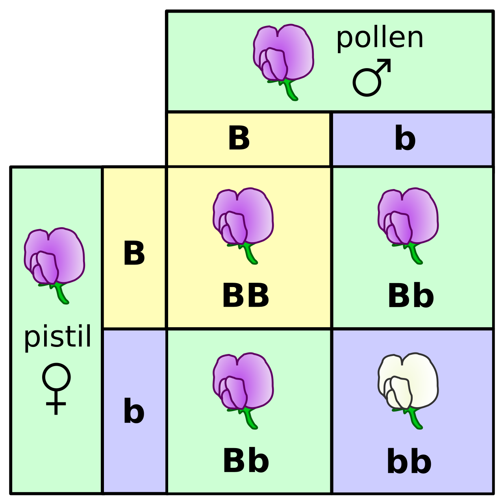
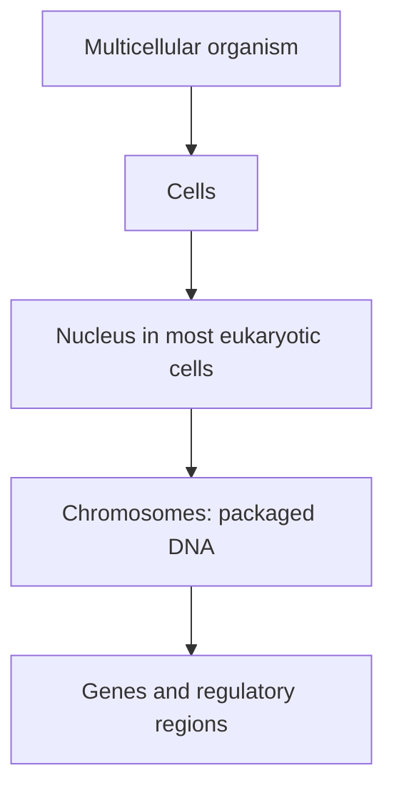
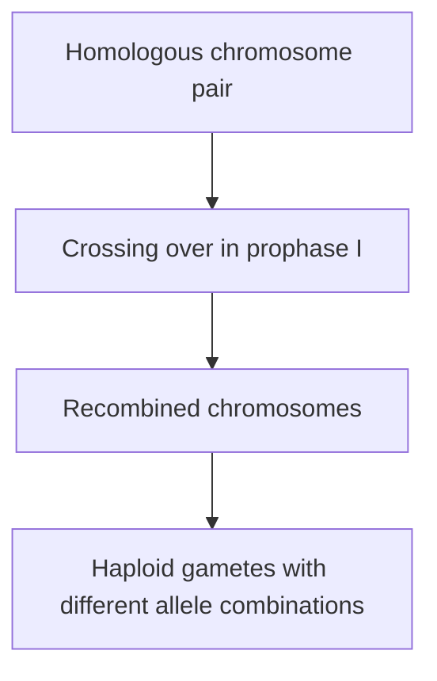

# Inheritance and variation

## What you should learn

- Why Darwin and Wallace's mechanism required a separate theory of heredity.
- What Mendel actually observed, and how genotype, phenotype, dominance and segregation explain his crosses.
- Where Mendelian examples stop being sufficient.
- How chromosomes, mitosis, meiosis and recombination connect inheritance to cell biology.
- Why the same logic used to test a recorded pedigree can also test relationships among species.

## The problem Darwin left open

Erika resumes the historical story at Darwin's death in 1882. By then, an old Earth and evolution by natural selection were both in scientific circulation. What was still missing was the mechanism that connected one generation to the next ([40:12](https://www.youtube.com/watch?v=9uQWss3w8x0&t=2412s)). Natural selection says that variants affecting survival and reproduction can change in frequency, but that claim immediately raises two questions:

1. **How is a useful variant transmitted?** If a finch has a beak suited to a food source, what makes its offspring resemble it?
2. **Where does a new variant come from?** If the island finches descended from a less-specialised ancestral population, how did distinct beak forms first appear?

Erika formulates those questions explicitly while returning to Darwin's finches ([41:17](https://www.youtube.com/watch?v=9uQWss3w8x0&t=2477s); [41:34](https://www.youtube.com/watch?v=9uQWss3w8x0&t=2494s)). Family resemblance was obvious long before genetics—siblings normally resemble one another more than either resembles a stranger—but observation alone did not identify the physical carrier or the rules of transmission ([41:59](https://www.youtube.com/watch?v=9uQWss3w8x0&t=2519s)). The ideas proposed by Leeuwenhoek, Lamarck and Darwin did not solve that mechanism ([42:17](https://www.youtube.com/watch?v=9uQWss3w8x0&t=2537s)).

## Why Mendel's peas were unusually informative

Gregor Mendel conducted his crosses between 1856 and 1863 at the Augustinian abbey in Brno. Erika adds a useful historical detail: he had wanted to study mice, but the abbey did not welcome a breeding colony, so he used peas instead ([42:47](https://www.youtube.com/watch?v=9uQWss3w8x0&t=2567s); [43:23](https://www.youtube.com/watch?v=9uQWss3w8x0&t=2603s)). Peas turned out to be an excellent model because they can self-fertilise, true-breeding lines can be maintained, deliberate crosses are manageable, and several of the variants Mendel chose are visually discrete ([43:40](https://www.youtube.com/watch?v=9uQWss3w8x0&t=2620s)).

The characters Erika lists from the slide include seed shape, seed colour, flower position, flower colour, pod shape, pod colour and plant height ([43:51](https://www.youtube.com/watch?v=9uQWss3w8x0&t=2631s); [44:01](https://www.youtube.com/watch?v=9uQWss3w8x0&t=2641s)). The value of these examples is methodological: a round seed is easy to distinguish from a wrinkled seed, so counting offspring is less ambiguous than measuring a continuously varying character.

Across seven years of crosses, Mendel found three patterns that heredity had to explain:

- Offspring varied, but the variants recurred in **consistent numerical ratios** ([44:35](https://www.youtube.com/watch?v=9uQWss3w8x0&t=2675s)).
- Opposing characters did not simply blend. Crossing yellow and green lines did not yield permanently yellow-green intermediates ([44:48](https://www.youtube.com/watch?v=9uQWss3w8x0&t=2688s)).
- One alternative could conceal another in the first generation, while the concealed alternative reappeared later; both parents nevertheless contributed hereditary material ([45:01](https://www.youtube.com/watch?v=9uQWss3w8x0&t=2701s); [45:15](https://www.youtube.com/watch?v=9uQWss3w8x0&t=2715s)).

## Translate the observations into modern terms

An **allele** is a variant of a gene. The pair of alleles carried by an individual at a simple diploid locus is part of its **genotype**; the observed character is its **phenotype** ([45:25](https://www.youtube.com/watch?v=9uQWss3w8x0&t=2725s); [45:40](https://www.youtube.com/watch?v=9uQWss3w8x0&t=2740s)). These words answer different questions: genotype describes what variants are present, while phenotype describes what develops and is measured.

In Erika's seed-colour example, yellow is treated as dominant and green as recessive. A green seed must therefore carry two recessive alleles. A yellow seed is ambiguous from appearance alone: it could be homozygous dominant or heterozygous, because one dominant allele is enough to conceal the recessive phenotype ([46:37](https://www.youtube.com/watch?v=9uQWss3w8x0&t=2797s); [47:20](https://www.youtube.com/watch?v=9uQWss3w8x0&t=2840s)). **Dominant** here means “expressed in the heterozygote”; it does not mean stronger, healthier, newer or more frequent in a population.

### Work through the two crosses

First cross a homozygous dominant parent with a homozygous recessive parent. Each first-generation offspring receives one allele from each parent, so all are heterozygous and show the dominant phenotype ([47:50](https://www.youtube.com/watch?v=9uQWss3w8x0&t=2870s); [48:46](https://www.youtube.com/watch?v=9uQWss3w8x0&t=2926s)). Now cross two of those heterozygotes. The four equally represented cells in the Punnett square are:

| Genotype class | Expected fraction | Phenotype in this example |
| --- | ---: | --- |
| Homozygous dominant | 1/4 | Yellow |
| Heterozygous | 2/4 | Yellow |
| Homozygous recessive | 1/4 | Green |

That gives a **1:2:1 genotype ratio** but a **3:1 phenotype ratio** ([49:08](https://www.youtube.com/watch?v=9uQWss3w8x0&t=2948s); [49:31](https://www.youtube.com/watch?v=9uQWss3w8x0&t=2971s)). The square predicts probabilities across many fertilisations. It does not guarantee that every four offspring will contain exactly one of each cell in the diagram.

*This real teaching diagram shows the same logic with purple and white flowers: each heterozygous parent supplies either allele, producing a 1:2:1 genotype ratio and 3:1 phenotype ratio. Diagram by Madeleine Price Ball (Madprime), [“Punnett square mendel flowers”](https://commons.wikimedia.org/wiki/File:Punnett_square_mendel_flowers.svg), dedicated to the public domain under [CC0 1.0](https://creativecommons.org/publicdomain/zero/1.0/). The local PNG is an unaltered Commons render.*

## Mendel's laws—and their domain

Erika summarises three laws beginning at [49:56](https://www.youtube.com/watch?v=9uQWss3w8x0&t=2996s):

| Law | What it says in the simple model | What to remember |
| --- | --- | --- |
| **Segregation** | A diploid individual has two alleles at a locus; one enters each gamete. | Fertilisation restores a pair. |
| **Independent assortment** | Alleles at different unlinked loci sort independently. | Linkage on the same chromosome can make observed ratios depart from the simplest dihybrid prediction. |
| **Dominance** | In the examples Mendel selected, one allele can conceal another in a heterozygote. | Not all allele interactions are complete dominance. |

At [51:16](https://www.youtube.com/watch?v=9uQWss3w8x0&t=3076s), Erika points to a dihybrid cross: two characters can be followed at once, and independent assortment supplies a testable combined ratio. Her larger point is not that every trait is Mendelian; it is that inheritance can generate quantitative predictions.

The limitation appears in the history. Mendel published *Experiments on Plant Hybridization* in 1866, but it received only a handful of citations and Darwin never read it ([52:12](https://www.youtube.com/watch?v=9uQWss3w8x0&t=3132s); [52:36](https://www.youtube.com/watch?v=9uQWss3w8x0&t=3156s)). Part of the difficulty was generalisation: Mendel had selected characters that behaved cleanly, while many traits do not map one-to-one onto a dominant/recessive pair ([52:53](https://www.youtube.com/watch?v=9uQWss3w8x0&t=3173s)). His results were independently rediscovered around 1900 and then credited to him ([53:40](https://www.youtube.com/watch?v=9uQWss3w8x0&t=3220s)). An English translation of Mendel's original paper is available through the [Electronic Scholarly Publishing Project](https://www.esp.org/foundations/genetics/classical/gm-65.pdf).

Use the modern distinctions carefully:

- **Polygenic:** many genes contribute to one phenotype. Eye colour is Erika and Will's example; it cannot be predicted reliably with a single blue/brown Punnett square ([1:00:26](https://www.youtube.com/watch?v=9uQWss3w8x0&t=3626s); [1:00:44](https://www.youtube.com/watch?v=9uQWss3w8x0&t=3644s)).
- **Pleiotropic:** one gene affects more than one phenotype.
- **Environmentally influenced:** the same genotype can develop differently under different conditions.

These are extensions of inheritance, not failures of heredity.

## Locate heredity inside the cell

Genetics then had to be connected to cytology. Erika builds a physical hierarchy at [55:20](https://www.youtube.com/watch?v=9uQWss3w8x0&t=3320s) and [57:41](https://www.youtube.com/watch?v=9uQWss3w8x0&t=3461s):

Prokaryotic cells lack a membrane-bound nucleus and usually hold their main chromosome in a circular form; eukaryotic cells contain a nucleus and other membrane-bound organelles ([55:25](https://www.youtube.com/watch?v=9uQWss3w8x0&t=3325s); [55:39](https://www.youtube.com/watch?v=9uQWss3w8x0&t=3339s)). The nucleus contains nearly all of a eukaryotic cell's genetic material, chromosomes package DNA with proteins, and a gene is a DNA region that contributes to a functional product or regulation—not simply a label for a visible trait ([56:40](https://www.youtube.com/watch?v=9uQWss3w8x0&t=3400s); [57:51](https://www.youtube.com/watch?v=9uQWss3w8x0&t=3471s)).

Human somatic cells normally contain 46 chromosomes organised as 23 pairs, with one member of each homologous pair inherited through each parent ([58:13](https://www.youtube.com/watch?v=9uQWss3w8x0&t=3493s); [58:55](https://www.youtube.com/watch?v=9uQWss3w8x0&t=3535s)). Will notices that a slide says 48; Erika immediately corrects it to 46 and explains the source of the error: other great apes normally have 48, while humans normally have 46 ([59:27](https://www.youtube.com/watch?v=9uQWss3w8x0&t=3567s); [59:46](https://www.youtube.com/watch?v=9uQWss3w8x0&t=3586s)).

## Mitosis, meiosis and recombination

The chromosome count explains why body-cell division and gamete production differ. Erika contrasts them between [1:13:49](https://www.youtube.com/watch?v=9uQWss3w8x0&t=4429s) and [1:16:36](https://www.youtube.com/watch?v=9uQWss3w8x0&t=4596s):

| Process | Starting cell in Erika's human example | Products | Evolutionary relevance |
| --- | --- | --- | --- |
| **Mitosis** | Diploid somatic cell | Two ideally matching diploid daughter cells | Growth and tissue maintenance; a mutation remains in that cell lineage unless it occurs in a germline precursor. |
| **Meiosis** | Diploid germline precursor | Four haploid products | Reduces chromosome number so egg and sperm can restore the diploid number at fertilisation. |
| **Recombination** | Paired homologous chromosomes during prophase I | Chromosomes with exchanged segments | Creates new combinations of existing parental alleles. |

Recombination is the first source of variation Erika treats in detail. Homologous chromosomes exchange corresponding segments during prophase I, so the resulting gametes are not simple intact copies of a maternal or paternal chromosome ([1:16:52](https://www.youtube.com/watch?v=9uQWss3w8x0&t=4612s); [1:17:31](https://www.youtube.com/watch?v=9uQWss3w8x0&t=4651s)). Her deck-of-cards analogy is exact in one respect: shuffling can generate a combination never previously dealt, but it has not invented a new card ([1:16:54](https://www.youtube.com/watch?v=9uQWss3w8x0&t=4614s)). **Mutation**, covered in the next note, changes the sequence itself.

## Heredity turns relationship into a testable pattern

Once DNA is inherited consistently, a powerful cross-check becomes possible: a tree inferred from genetic similarity should recover a pedigree recorded from births. Erika notes that this principle underlies paternity testing, forensic comparison and commercial genetic genealogy ([1:18:15](https://www.youtube.com/watch?v=9uQWss3w8x0&t=4695s); [1:19:16](https://www.youtube.com/watch?v=9uQWss3w8x0&t=4756s)). Her Golden State Killer example illustrates the logic: a crime-scene profile can identify close relatives in a database and thereby narrow the family tree ([1:19:21](https://www.youtube.com/watch?v=9uQWss3w8x0&t=4761s)).

The method does not change when the comparison crosses a species name. Erika walks outward in nested steps:

1. Sequence data can confirm a documented dog's immediate pedigree ([1:20:51](https://www.youtube.com/watch?v=9uQWss3w8x0&t=4851s)).
2. The same comparisons recover relationships among breeds and agree with their known breeding histories ([1:21:17](https://www.youtube.com/watch?v=9uQWss3w8x0&t=4877s)).
3. All domestic dogs group genetically closer to wolves than to cats, and dogs group closer to wolves than to coyotes ([1:21:43](https://www.youtube.com/watch?v=9uQWss3w8x0&t=4903s); [1:22:17](https://www.youtube.com/watch?v=9uQWss3w8x0&t=4937s)).
4. Broader comparisons place dogs, wolves, coyotes, foxes, maned wolves and bush dogs inside a nested canid tree ([1:22:26](https://www.youtube.com/watch?v=9uQWss3w8x0&t=4946s)).

Universal common ancestry predicts that the nesting continues into broader groups rather than ending at an independently created boundary. Erika therefore asks a competing separate-ancestry model to identify **where** the genetic tree should stop converging and **why that boundary should occur there** ([1:23:01](https://www.youtube.com/watch?v=9uQWss3w8x0&t=4981s); [1:23:20](https://www.youtube.com/watch?v=9uQWss3w8x0&t=5000s)). That is a prediction question, not the claim that a single similarity percentage proves a family tree.

## Common confusions to avoid

- A **trait** is not necessarily a **gene**. Phenotypes can depend on multiple loci, regulation, development and environment.
- Dominant does not mean adaptive, and recessive does not mean defective.
- A Punnett square describes expected probabilities, not a fixed quota in each small family.
- Recombination reshuffles existing variants; mutation creates new sequence variants.
- Phylogenetic evidence is not “organism A looks a bit like organism B.” Erika's argument concerns a nested pattern reproduced across sequence comparisons.

## Active recall

1. What two missing mechanisms did Darwin's finch example require?
2. Derive both the genotype and phenotype ratios for a heterozygote × heterozygote cross.
3. Why did Mendel's success with discrete pea characters not make every phenotype a one-gene dominant/recessive trait?
4. Contrast the products and roles of mitosis, meiosis and recombination.
5. What observation would distinguish a universally nested ancestry model from multiple lineages with genuinely independent origins?
