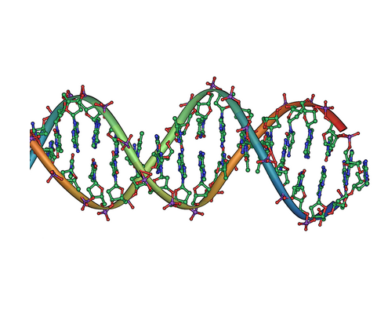
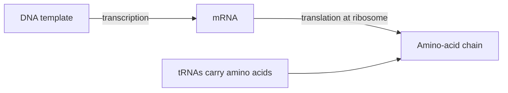
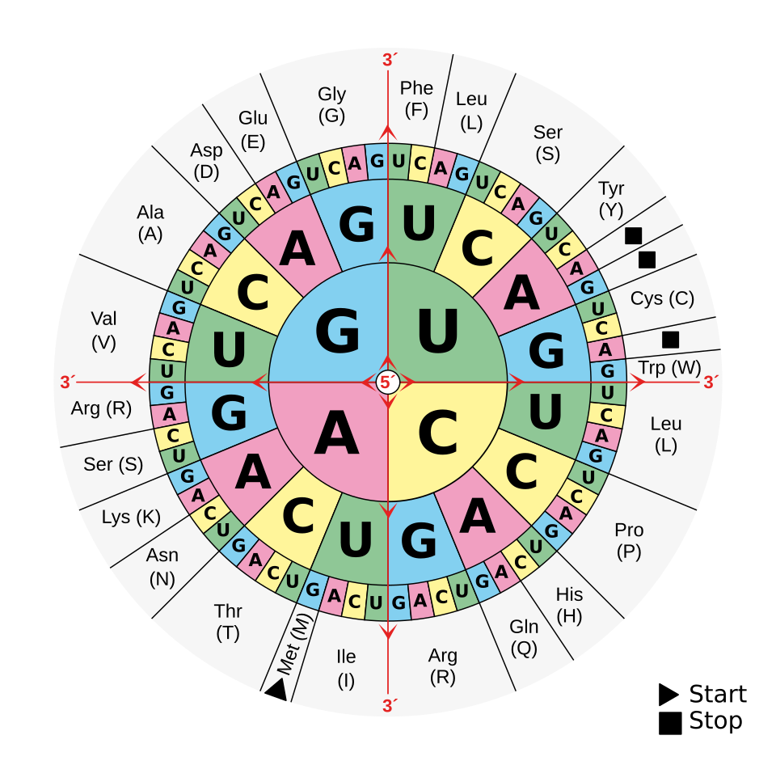
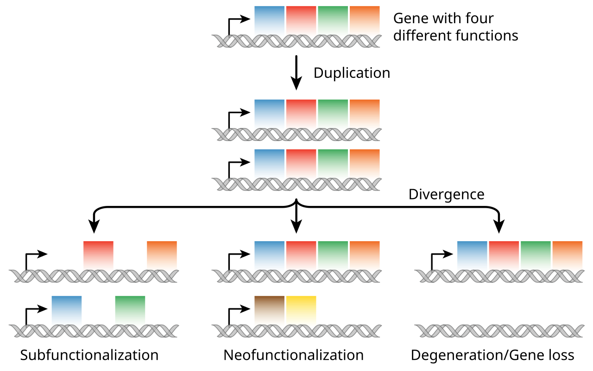

# DNA, genes and mutation

## What you should learn

- How DNA's complementary structure permits copying.
- How genome, chromosome, gene, coding sequence and regulatory sequence differ.
- How replication differs from transcription and translation.
- Why the genetic code's redundancy changes the consequences of some substitutions.
- What makes a DNA change heritable, and how substitutions, indels, rearrangements and duplications differ.

## Read the molecular hierarchy correctly

DNA stands for **deoxyribonucleic acid**. Erika describes it as a molecule containing instructions involved in building and maintaining an organism, together with the capacity to be copied before cell division ([1:01:26](https://www.youtube.com/watch?v=9uQWss3w8x0&t=3686s)). It is not useful to imagine every piece of DNA as a separate instruction for a visible feature. A genome includes protein-coding regions, regulatory regions, repeats, mobile-element-derived sequence and regions with no demonstrated organism-level function.

*DNA double-helix diagram by Jerome Walker, derived from work by Michael Ströck. [Source file](https://commons.wikimedia.org/wiki/File:DNA_double_helix_horizontal.png), released into the public domain by the author.*

The outside rails of the helix are sugar–phosphate backbones. The rungs are pairs of nitrogenous bases held together by hydrogen bonds ([1:01:44](https://www.youtube.com/watch?v=9uQWss3w8x0&t=3704s); [1:02:07](https://www.youtube.com/watch?v=9uQWss3w8x0&t=3727s)). In DNA, adenine pairs with thymine, while guanine pairs with cytosine ([1:02:31](https://www.youtube.com/watch?v=9uQWss3w8x0&t=3751s)). A base plus its sugar and phosphate is a **nucleotide**. Because the two strands are complementary, the sequence of either strand specifies what can pair with it—an essential feature for replication.

Erika gives the human haploid genome as roughly 3.2 billion base pairs and notes how tightly it must be packed into chromosomes ([1:03:02](https://www.youtube.com/watch?v=9uQWss3w8x0&t=3782s)). **Haploid** means one copy of each chromosome; a typical diploid body cell has two homologous sets and therefore more than six billion base pairs before replication. The **genome** is the complete DNA complement, while a **gene** is a bounded DNA region contributing to a functional product. The same cell can contain a gene without actively expressing it.

## Coding is not the same as functional

Erika's slide places protein-coding DNA at about 2% of the human genome ([1:03:54](https://www.youtube.com/watch?v=9uQWss3w8x0&t=3834s); [1:04:45](https://www.youtube.com/watch?v=9uQWss3w8x0&t=3885s)). Protein-coding sequence supplies amino-acid recipes, but non-coding regions can still regulate when, where and how strongly a product is made ([1:05:00](https://www.youtube.com/watch?v=9uQWss3w8x0&t=3900s)). This helps explain how muscle and skin cells can carry essentially the same genome while using different parts of it for local work ([1:04:29](https://www.youtube.com/watch?v=9uQWss3w8x0&t=3869s)). Therefore:

- **non-coding** does not mean “known to do nothing”;
- **biochemical activity** does not automatically prove that a sequence is required for organismal fitness;
- **no detected phenotype** means none under the measurements and conditions tested, not none under every possible condition.

The lesson then asks how much of the non-coding genome is indispensable. Erika points to a direct perturbation: researchers removed megabase-scale “gene desert” intervals from mice ([1:06:14](https://www.youtube.com/watch?v=9uQWss3w8x0&t=3974s); [1:06:26](https://www.youtube.com/watch?v=9uQWss3w8x0&t=3986s)). Mice homozygous for the deletions were viable and were not detectably different from wild-type littermates in the reported measures of morphology, reproductive fitness, growth, longevity and general homeostasis ([1:06:50](https://www.youtube.com/watch?v=9uQWss3w8x0&t=4010s); [1:07:01](https://www.youtube.com/watch?v=9uQWss3w8x0&t=4021s)). The source is [Nóbrega *et al.* (2004), “Megabase deletions of gene deserts result in viable mice”](https://pubmed.ncbi.nlm.nih.gov/15496924/).

What does that establish? It strongly challenges the prediction that every removed base is individually essential. It does **not** show that all non-coding DNA is dispensable, nor that an unmeasured effect could not exist. Erika makes the model comparison explicit during Will's “junk DNA” discussion: accumulated neutral duplicates and sequence are expected under evolution, whereas a claim that nearly the whole genome is functional has difficulty accommodating large deletions with no reported loss of viability or reproduction ([1:09:20](https://www.youtube.com/watch?v=9uQWss3w8x0&t=4160s); [1:11:10](https://www.youtube.com/watch?v=9uQWss3w8x0&t=4270s); [1:12:24](https://www.youtube.com/watch?v=9uQWss3w8x0&t=4344s)).

## DNA replication: copying the archive

Cells spend much of the cell cycle growing and copying DNA during interphase; division comes later ([1:13:40](https://www.youtube.com/watch?v=9uQWss3w8x0&t=4420s); [1:14:37](https://www.youtube.com/watch?v=9uQWss3w8x0&t=4477s)). Before either mitosis or meiosis, DNA must be replicated. Erika's simplified sequence is:

1. **Helicase opens the helix.** It breaks the hydrogen bonds between paired bases, exposing the templates ([1:25:05](https://www.youtube.com/watch?v=9uQWss3w8x0&t=5105s); [1:25:16](https://www.youtube.com/watch?v=9uQWss3w8x0&t=5116s)).
2. **Complementary nucleotides are added.** Each exposed G is paired with C, each A with T, and so forth. Different enzymes handle the leading and lagging strands; Erika deliberately leaves those details outside the lesson ([1:25:32](https://www.youtube.com/watch?v=9uQWss3w8x0&t=5132s); [1:25:49](https://www.youtube.com/watch?v=9uQWss3w8x0&t=5149s)).
3. **The copies are proofread.** Repair systems correct many, but not all, copying errors ([1:26:03](https://www.youtube.com/watch?v=9uQWss3w8x0&t=5163s)).
4. **Two double helices result.** Each contains one pre-existing strand and one newly synthesised strand, so replication is **semiconservative** ([1:26:29](https://www.youtube.com/watch?v=9uQWss3w8x0&t=5189s)).

Replication makes DNA from DNA. Erika contrasts that with protein synthesis using a cookbook analogy: replication copies the entire recipe book; expression uses one selected recipe to make a product ([1:26:43](https://www.youtube.com/watch?v=9uQWss3w8x0&t=5203s); [1:27:13](https://www.youtube.com/watch?v=9uQWss3w8x0&t=5233s)).

## From selected DNA to a peptide

RNA is usually single-stranded and uses uracil rather than thymine. In the pairing exercise Erika presents, DNA A therefore corresponds to RNA U, while G still pairs with C ([1:27:35](https://www.youtube.com/watch?v=9uQWss3w8x0&t=5255s); [1:28:00](https://www.youtube.com/watch?v=9uQWss3w8x0&t=5280s)). Protein synthesis can then be divided into two stages.

### 1. Transcription

Only the relevant DNA region is opened. Messenger RNA is assembled as a complementary copy of that template, then leaves the nucleus for the cytoplasm ([1:28:28](https://www.youtube.com/watch?v=9uQWss3w8x0&t=5308s); [1:29:15](https://www.youtube.com/watch?v=9uQWss3w8x0&t=5355s)). It is helpful to say **mRNA carries a transcript**, not that the chromosome itself leaves the nucleus.

### 2. Translation

At a ribosome, the mRNA is read in consecutive three-base units called **codons**. Transfer RNAs pair with the exposed codons and carry associated amino acids; the ribosome joins those amino acids into a growing peptide ([1:31:47](https://www.youtube.com/watch?v=9uQWss3w8x0&t=5507s); [1:32:33](https://www.youtube.com/watch?v=9uQWss3w8x0&t=5553s)). Erika compares the ribosome to a ticket muncher that receives a long strip in order, while tRNAs deliver what each triplet specifies ([1:31:55](https://www.youtube.com/watch?v=9uQWss3w8x0&t=5515s)).

Erika works through a short sequence rather than asking viewers to memorise the full cellular machinery. The study skill is to preserve direction and roles: make the RNA complement, divide it into codons in the correct reading frame, then use the code table to identify amino acids ([1:30:40](https://www.youtube.com/watch?v=9uQWss3w8x0&t=5440s); [1:33:45](https://www.youtube.com/watch?v=9uQWss3w8x0&t=5625s); [1:34:08](https://www.youtube.com/watch?v=9uQWss3w8x0&t=5648s)).

*Standard RNA codon chart, arranged as a “codon sun.” Read an mRNA codon 5′→3′ from the centre outward: first base, second base, then third base. Diagram by Mouagip, [“Aminoacids table,” Wikimedia Commons](https://commons.wikimedia.org/wiki/File:Aminoacids_table.svg), released by the author into the public domain.*

## Redundancy changes the effect of a substitution

There are 20 standard amino acids used in the lesson but more possible three-base codons, so several codons specify the same amino acid. Erika uses proline: CCU, CCC, CCA and CCG all encode it ([1:42:28](https://www.youtube.com/watch?v=9uQWss3w8x0&t=6148s); [1:43:02](https://www.youtube.com/watch?v=9uQWss3w8x0&t=6182s)). This **degeneracy** or redundancy means a base substitution can have several different outcomes:

| Outcome | What changed? | Immediate coding consequence |
| --- | --- | --- |
| Synonymous | Codon changes to another for the same amino acid | Protein sequence is unchanged. |
| Missense | Codon specifies a different amino acid | One position in the peptide changes. |
| Nonsense | Codon becomes a stop | Translation may end early. |
| Regulatory | Change is outside the translated codon sequence | Amount, timing or location of expression may change. |

Redundancy buffers some substitutions; it does not make mutations harmless. A synonymous substitution is specifically synonymous at the amino-acid level and may still affect splicing, RNA stability or expression.

Will asks why a three-letter codon maps to one amino acid. Erika separates the **origin of the genetic code** from what the lesson is testing: because the basic code is shared across known life, asking how that coding system first arose is an abiogenesis question; evolution here concerns inherited change after such a system exists ([1:37:15](https://www.youtube.com/watch?v=9uQWss3w8x0&t=5835s); [1:38:03](https://www.youtube.com/watch?v=9uQWss3w8x0&t=5883s)). A paper mentioned in the live chat is Francis Crick's [“The Origin of the Genetic Code” (1968)](https://doi.org/10.1016/0022-2836%2868%2990392-6); Erika is clear that she had not read it during the stream ([1:38:21](https://www.youtube.com/watch?v=9uQWss3w8x0&t=5901s)).

## What qualifies as a mutation?

At [1:43:33](https://www.youtube.com/watch?v=9uQWss3w8x0&t=6213s), Erika introduces mutation as the second major source of variation after recombination and stresses the durable criterion: a mutation is a **permanent change in DNA sequence**. Her spoken definition also mentions an error during protein synthesis. For revision, keep the distinction precise: a transient transcription or translation error does not itself rewrite DNA and is not inherited as a DNA mutation; a replication error that escapes repair can become one.

Location then determines evolutionary heritability. A mutation in a somatic skin or muscle cell may affect that cell's descendants within the body. To enter the next generation, it normally must occur in a germline lineage that contributes DNA to an egg or sperm ([1:43:47](https://www.youtube.com/watch?v=9uQWss3w8x0&t=6227s); [1:43:50](https://www.youtube.com/watch?v=9uQWss3w8x0&t=6230s)). Mutation supplies new alleles; recombination supplies new arrangements of existing alleles.

Erika also cautions against treating “the mutation rate” as one uniform number. Mutation probabilities differ among species, regions of a genome and molecular contexts ([1:44:49](https://www.youtube.com/watch?v=9uQWss3w8x0&t=6289s); [1:45:00](https://www.youtube.com/watch?v=9uQWss3w8x0&t=6300s)). **Probabilistic** does not mean causeless; copying chemistry, sequence context, radiation, reactive molecules and repair all affect probability. It means a useful mutation is not produced because an organism anticipates a future need.

## Mutation scale and mechanism

| Mutation | Physical change | Important consequence to check |
| --- | --- | --- |
| Substitution | One nucleotide is replaced | Could be synonymous, missense, nonsense or regulatory. |
| Insertion or deletion | Nucleotides are added or removed | In a coding region, a length not divisible by three can shift the reading frame. |
| Duplication | A DNA segment is copied | May change dosage immediately and gives one copy freedom to diverge. |
| Inversion | A segment is reversed | Can disrupt a sequence or change its regulatory neighbourhood. |
| Translocation/relocation | Sequence moves to a different genomic site | May place it under different regulatory control. |
| Large deletion | A segment is lost | Effect ranges from undetectable in a redundant region to lethal if essential functions are removed. |

Erika begins with the scale contrast: one base can change, or hundreds to thousands of bases can be inserted, deleted, duplicated or moved ([1:44:14](https://www.youtube.com/watch?v=9uQWss3w8x0&t=6254s); [1:44:34](https://www.youtube.com/watch?v=9uQWss3w8x0&t=6274s)). Physical size does not predict fitness effect by itself.

## Why duplication matters

Erika uses a language analogy at [2:08:01](https://www.youtube.com/watch?v=9uQWss3w8x0&t=7681s): duplicating “cat” initially gives another copy of the same word, comparable to increasing gene dosage. A later substitution can make one copy differ—her “cat/sat” example—without erasing the original ([2:08:58](https://www.youtube.com/watch?v=9uQWss3w8x0&t=7738s)). The analogy is not a molecular mechanism, but it isolates the evolutionary logic: redundancy lets one copy preserve an ancestral role while the other accumulates changes.

*Three possible fates after duplication: copies may divide the ancestral tasks (**subfunctionalisation**), one may acquire a different function (**neofunctionalisation**), or one may degenerate. Vector diagram by Smedlib, based on Veryhuman, [“Evolution fate duplicate genes – vector”](https://commons.wikimedia.org/wiki/File:Evolution_fate_duplicate_genes_-_vector.svg), licensed [CC BY-SA 4.0](https://creativecommons.org/licenses/by-sa/4.0/). The local PNG is the Commons SVG rendered on white; the content is unchanged.*

Duplication is opportunity, not a promise. Most duplicates need not become helpful innovations. The point is narrower and testable: a route exists by which a lineage can retain an old function while sequence or regulation in a spare copy changes.

## Common confusions to avoid

- Replication, transcription and translation have different outputs: DNA, RNA and peptide respectively.
- “Non-coding” is not synonymous with “non-functional,” but neither is detectable biochemical activity proof of organism-level necessity.
- A translation mistake is not automatically a heritable mutation.
- “Random mutation” does not mean every site changes at an equal rate.
- A duplicate is not automatically a new function; it may raise dosage, divide an old task, decay or diverge.

## Active recall

1. Why does base complementarity make semiconservative replication possible?
2. What exactly did the mouse gene-desert deletion experiment test, and what did it leave untested?
3. Trace information from an exposed DNA template through mRNA, tRNA and a peptide.
4. Give four distinct consequences a one-base substitution could have.
5. Why is germline location necessary for most mutations to contribute to evolution across generations?
6. Explain why duplication can permit neofunctionalisation without requiring immediate loss of the ancestral function.
