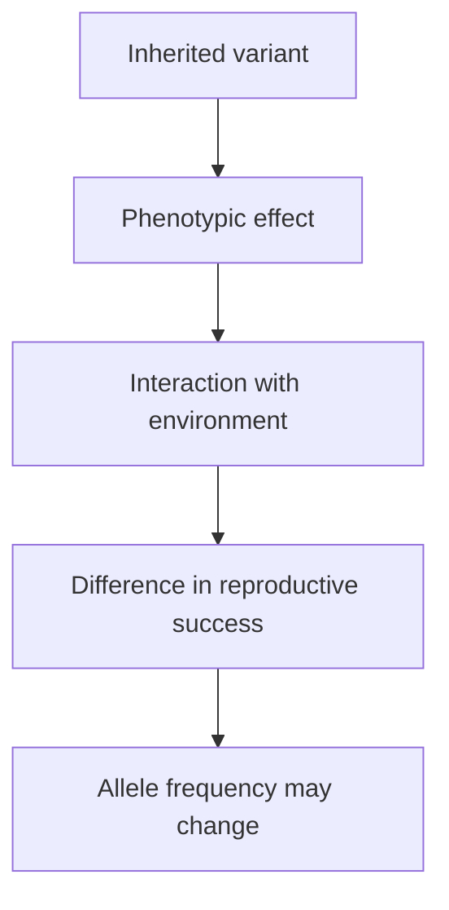
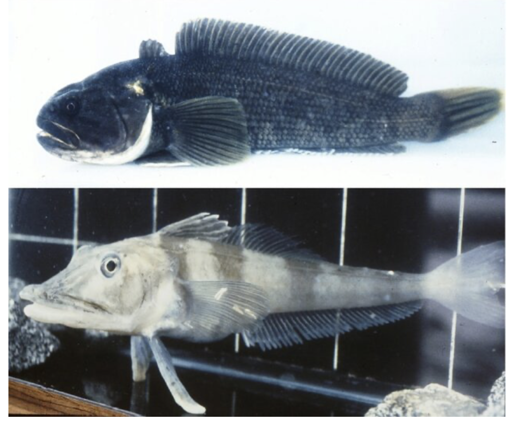

# Mutation effects and case studies

## What you should learn

- Why “beneficial,” “neutral” and “harmful” describe fitness effects in a context, not three molecular kinds of mutation.
- How one sequence change can have large downstream effects while a large deletion can have little detected effect.
- What the lesson's human, fish, insect and primate examples actually demonstrate.
- How comparative sequences and developmental experiments test proposed routes to novelty.
- Where Erika's classroom shorthand needs qualification.

## Judge effects through reproductive context

Erika first separates a mutation's **physical size** from its **fitness effect**. Much DNA can change with no phenotype detected, while a single-base change in a critical sequence can disrupt an entire pathway ([1:45:17](https://www.youtube.com/watch?v=9uQWss3w8x0&t=6317s); [1:45:57](https://www.youtube.com/watch?v=9uQWss3w8x0&t=6357s)). In evolutionary biology, fitness is an individual's realised contribution of descendants to later generations. A variant can therefore be:

- **harmful** if it lowers survival or reproduction in the relevant setting;
- **beneficial** if carriers, on average, leave more descendants there;
- **effectively neutral** if its effect on reproductive success is negligible.

This is not a moral ranking and it is not identical to comfort or longevity. Erika's deliberately extreme deer thought experiment makes the distinction: an exceptionally strong, predator-resistant deer still has realised fitness of zero if it dies accidentally before reproducing ([1:47:03](https://www.youtube.com/watch?v=9uQWss3w8x0&t=6423s); [1:47:31](https://www.youtube.com/watch?v=9uQWss3w8x0&t=6451s)). The advantageous phenotype may improve an expectation, but chance still affects an individual's realised outcome.

Polydactyly and heterochromia serve as her classroom examples of variants that may have little direct effect on reproduction ([1:47:58](https://www.youtube.com/watch?v=9uQWss3w8x0&t=6478s); [1:48:50](https://www.youtube.com/watch?v=9uQWss3w8x0&t=6530s)). She then changes only the cultural environment: if differently coloured eyes produce prestige and more mating opportunities, the phenotype could become advantageous; if they provoke persecution, it could become severely disadvantageous ([1:49:01](https://www.youtube.com/watch?v=9uQWss3w8x0&t=6541s); [1:49:32](https://www.youtube.com/watch?v=9uQWss3w8x0&t=6572s)). The sequence has not altered between scenarios—the fitness relationship has.

### The fox example: environment moves the optimum

Erika applies the same principle to fur length. In a temperate forest, unusually long-haired kits risk overheating in summer and unusually short-haired kits risk cold stress in winter, so an intermediate can be favoured ([1:52:06](https://www.youtube.com/watch?v=9uQWss3w8x0&t=6726s); [1:52:26](https://www.youtube.com/watch?v=9uQWss3w8x0&t=6746s)). If the habitat becomes hot and arid, short fur may improve cooling; if it becomes colder, long fur may become advantageous ([1:52:45](https://www.youtube.com/watch?v=9uQWss3w8x0&t=6765s); [1:53:07](https://www.youtube.com/watch?v=9uQWss3w8x0&t=6787s)). Asking whether “long fur is a good mutation” is therefore incomplete. The revision question is: **in which environment, genetic background and life history?**

## Small sequence change, large phenotype

Erika's “cat” to “cap” analogy is intended to answer a narrow information question: replacing one symbol can change what a sequence conveys ([1:53:40](https://www.youtube.com/watch?v=9uQWss3w8x0&t=6820s); [1:54:25](https://www.youtube.com/watch?v=9uQWss3w8x0&t=6865s)). DNA is not English, so the biological result must be traced through regulation, RNA and protein chemistry. The analogy establishes possibility, not effect size or usefulness.

Her first disease slide groups Tay–Sachs, cystic fibrosis and haemophilia as examples of “point mutations” ([1:55:06](https://www.youtube.com/watch?v=9uQWss3w8x0&t=6906s)). Use it as a pathway lesson, not a catalogue of one uniquely causal base for each disease: all three disorders can arise from multiple different pathogenic variants, and the common cystic-fibrosis variant ΔF508 is a three-base deletion. The mechanisms Erika describes are the important part:

- In **Tay–Sachs**, loss of functional HEXA enzyme permits damaging lipid accumulation in nervous tissue, producing neurodegeneration ([1:55:26](https://www.youtube.com/watch?v=9uQWss3w8x0&t=6926s); [1:55:56](https://www.youtube.com/watch?v=9uQWss3w8x0&t=6956s)).
- **CFTR** variants can produce abnormally thick secretions, with especially serious effects in the lungs ([1:56:11](https://www.youtube.com/watch?v=9uQWss3w8x0&t=6971s); [1:56:53](https://www.youtube.com/watch?v=9uQWss3w8x0&t=7013s)).
- Different coagulation-factor variants can cause forms of **haemophilia**, reducing effective blood clotting ([1:57:11](https://www.youtube.com/watch?v=9uQWss3w8x0&t=7031s)).

The common inference is that a local sequence change can alter a molecule whose normal role sits upstream of many physiological consequences ([1:57:33](https://www.youtube.com/watch?v=9uQWss3w8x0&t=7053s)).

## Human variants presented as beneficial

The next examples are valuable, but preserve their molecular details rather than treating them all as identical point mutations.

| Example | What Erika emphasises | Revision qualification and source |
| --- | --- | --- |
| Lactase persistence | Continued adult milk digestion supplies a rich food source to dairying populations ([1:57:43](https://www.youtube.com/watch?v=9uQWss3w8x0&t=7063s); [1:58:32](https://www.youtube.com/watch?v=9uQWss3w8x0&t=7112s)). | Well-studied variants lie in regulatory sequence within **MCM6** and affect nearby **LCT** expression; distinct populations carry different persistence-associated variants. See [Tishkoff *et al.* (2007)](https://doi.org/10.1038/ng1946). |
| CCR5 resistance | A changed cell-surface route can impede HIV entry ([1:59:34](https://www.youtube.com/watch?v=9uQWss3w8x0&t=7174s)). | The classic **CCR5-Δ32** allele is a 32-base deletion, not a single-base substitution. It reduces susceptibility to particular HIV strains but is not universal protection. See [Samson *et al.* (1996)](https://pubmed.ncbi.nlm.nih.gov/8751444/). |
| APOA1 Milano | Erika describes reduced arterial fatty deposits and cardiovascular risk ([1:59:59](https://www.youtube.com/watch?v=9uQWss3w8x0&t=7199s)). | This is an amino-acid-changing APOA1 variant; association with a phenotype does not make it advantageous in every environment or genotype. |

Erika's larger argument survives those qualifications: small inherited changes can produce a measurable new physiological opportunity. None of them claims that one substitution produces an entire new body plan.

## Sickle-cell: the trade-off must be stated precisely

A substitution in **HBB** replaces glutamate with valine in beta-globin. That molecular change can make haemoglobin polymerise under low-oxygen conditions, distorting red blood cells and contributing to vessel blockage and organ damage ([2:00:28](https://www.youtube.com/watch?v=9uQWss3w8x0&t=7228s); [2:01:04](https://www.youtube.com/watch?v=9uQWss3w8x0&t=7264s); [2:02:01](https://www.youtube.com/watch?v=9uQWss3w8x0&t=7321s)). Two sickle alleles can cause severe sickle-cell disease. One sickle allele plus one typical allele can reduce the risk of severe *Plasmodium falciparum* malaria while avoiding much of the homozygous disease burden—the classic **heterozygote advantage** Erika introduces at [2:02:27](https://www.youtube.com/watch?v=9uQWss3w8x0&t=7347s) and [2:03:02](https://www.youtube.com/watch?v=9uQWss3w8x0&t=7382s).

During this lesson Erika overstates the effect as complete malaria immunity ([2:01:11](https://www.youtube.com/watch?v=9uQWss3w8x0&t=7271s); [2:02:41](https://www.youtube.com/watch?v=9uQWss3w8x0&t=7361s)). The accurate revision statement is protection against **severe malaria**, strongest in heterozygotes—not inability to become infected. Her population-level prediction is still the key lesson: if malaria supplies the advantage, sickle alleles should be maintained more often in populations with intense historical malaria exposure, while their costs dominate elsewhere ([2:03:16](https://www.youtube.com/watch?v=9uQWss3w8x0&t=7396s); [2:04:04](https://www.youtube.com/watch?v=9uQWss3w8x0&t=7444s)). When two carriers have children, Mendelian segregation also creates the serious one-in-four risk of a child inheriting two sickle alleles ([2:04:34](https://www.youtube.com/watch?v=9uQWss3w8x0&t=7474s)).

## Repeated ecological opportunities

Erika gives several compact examples of mutations exposing or improving a resource:

- Substitutions in toxin targets have evolved repeatedly in reptiles, mammals and arthropods that consume toxic prey. Resistance opens food that competitors cannot safely use ([2:05:10](https://www.youtube.com/watch?v=9uQWss3w8x0&t=7510s); [2:05:52](https://www.youtube.com/watch?v=9uQWss3w8x0&t=7552s)).
- **FGF5** variants can lengthen mammalian fur; whether that helps depends on climate ([2:06:30](https://www.youtube.com/watch?v=9uQWss3w8x0&t=7590s); [2:06:39](https://www.youtube.com/watch?v=9uQWss3w8x0&t=7599s)).
- **MC1R** and **Agouti** variation changes coat colour. A dark pocket mouse is conspicuous on pale sand but camouflaged on dark lava, so the same colour can reverse sign across adjacent substrates ([2:13:43](https://www.youtube.com/watch?v=9uQWss3w8x0&t=8023s); [2:14:24](https://www.youtube.com/watch?v=9uQWss3w8x0&t=8064s); [2:14:49](https://www.youtube.com/watch?v=9uQWss3w8x0&t=8089s)). See the field and genetic analysis in [Hoekstra *et al.* (2006)](https://doi.org/10.1126/science.1126121).

The order is important: mutations arise; the environment filters their phenotypic consequences. The mouse does not generate dark pigment because it recognises black rock.

## Larger and duplicated changes

Erika next moves from substitutions to changes in copy number and regulation. Her language exercise—duplicate “cat,” then mutate one copy to build a different sentence—illustrates how duplication can preserve an old element while a second copy changes ([2:08:08](https://www.youtube.com/watch?v=9uQWss3w8x0&t=7688s); [2:09:01](https://www.youtube.com/watch?v=9uQWss3w8x0&t=7741s)). The case studies show different outcomes:

- Gain-of-function variants in **LRP5** can produce unusually high bone density. Erika frames the possible advantage as resistance to fractures in a physically dangerous life, while noting that its value could be lower in another ecology ([2:10:02](https://www.youtube.com/watch?v=9uQWss3w8x0&t=7802s); [2:10:28](https://www.youtube.com/watch?v=9uQWss3w8x0&t=7828s)). The high-bone-mass pedigree is described by [Boyden *et al.* (2002)](https://doi.org/10.1056/NEJMoa013444).
- In the Bajau, selected variation near **PDE10A** is associated with larger spleens and a stronger diving response. Erika connects that physiology to prolonged marine foraging ([2:11:39](https://www.youtube.com/watch?v=9uQWss3w8x0&t=7899s); [2:11:53](https://www.youtube.com/watch?v=9uQWss3w8x0&t=7913s); [2:12:18](https://www.youtube.com/watch?v=9uQWss3w8x0&t=7938s)). See [Ilardo *et al.* (2018)](https://pubmed.ncbi.nlm.nih.gov/29677510/).
- A **DEC2/BHLHE41** variant is associated with naturally short sleep in a studied family ([2:13:24](https://www.youtube.com/watch?v=9uQWss3w8x0&t=8004s)). See [He *et al.* (2009)](https://doi.org/10.1126/science.1174443).
- A duplicated **RNASE1** gene in colobine monkeys subsequently changed in ways associated with their leaf-rich, foregut-fermenting diet ([2:15:08](https://www.youtube.com/watch?v=9uQWss3w8x0&t=8108s); [2:15:44](https://www.youtube.com/watch?v=9uQWss3w8x0&t=8144s)). See [Zhang, Zhang & Rosenberg (2002)](https://doi.org/10.1038/ng852).
- An ancestral opsin duplication in catarrhine primates produced a spare copy that diverged in wavelength sensitivity, expanding colour discrimination without erasing the older sensitivities ([2:16:29](https://www.youtube.com/watch?v=9uQWss3w8x0&t=8189s); [2:17:03](https://www.youtube.com/watch?v=9uQWss3w8x0&t=8223s)). Erika contrasts this with howler monkeys, whose routine trichromacy arose through a separate duplication history—convergence on a similar sensory outcome ([2:17:37](https://www.youtube.com/watch?v=9uQWss3w8x0&t=8257s)).

## Antifreeze proteins: reconstruct the source sequence

Antarctic notothenioid fish live in seawater cold enough to freeze ordinary fish tissues. Their antifreeze glycoproteins bind incipient ice crystals and inhibit their growth ([2:18:45](https://www.youtube.com/watch?v=9uQWss3w8x0&t=8325s); [2:19:06](https://www.youtube.com/watch?v=9uQWss3w8x0&t=8346s)). This gave the lineage access to an ecological opportunity as polar waters cooled, but usefulness alone is not the evidence for origin.

*Representative Antarctic notothenioids: red-blooded Antarctic rockcod (*Notothenia coriiceps*, top) and white-blooded blackfin icefish (*Chaenocephalus aceratus*, bottom). The photograph illustrates the group discussed, not the antifreeze molecule itself. Photographs by H. William Detrich, reproduced from Schartl (2013), [“Two Notothenioidei”](https://commons.wikimedia.org/wiki/File:Two_Notothenioidei.png), licensed [CC BY 3.0](https://creativecommons.org/licenses/by/3.0/).*

The stronger inference comes from comparative sequence evidence. In Antarctic notothenioids, repeated tripeptide-coding units were recruited into an antifreeze glycoprotein gene related to a relocated pancreatic trypsinogen gene. Comparing antifreeze-bearing species with relatives identifies homologous pieces, rearrangement and repeat expansion rather than merely observing a useful finished protein ([2:20:09](https://www.youtube.com/watch?v=9uQWss3w8x0&t=8409s); [2:20:33](https://www.youtube.com/watch?v=9uQWss3w8x0&t=8433s); [2:20:54](https://www.youtube.com/watch?v=9uQWss3w8x0&t=8454s)). The paper shown is [Chen, DeVries & Cheng (1997), “Evolution of antifreeze glycoprotein gene from a trypsinogen gene in Antarctic notothenioid fish”](https://pmc.ncbi.nlm.nih.gov/articles/PMC20523/).

Arctic cod reached a similar ice-binding product by a different genomic route. Erika describes a nine-nucleotide non-coding seed sequence that expanded into repeated codons and acquired the regulatory features needed for an expressed, secreted protein ([2:21:07](https://www.youtube.com/watch?v=9uQWss3w8x0&t=8467s); [2:21:29](https://www.youtube.com/watch?v=9uQWss3w8x0&t=8489s); [2:21:46](https://www.youtube.com/watch?v=9uQWss3w8x0&t=8506s)). Whole-genome comparisons support a **de novo** origin in codfishes rather than inheritance of the notothenioid trypsinogen-derived gene: [Baalsrud *et al.* (2018)](https://pmc.ncbi.nlm.nih.gov/articles/PMC5850335/). Similar chemistry therefore need not imply the same molecular ancestry.

## Developmental switches can alter body-plan elements

Hox genes help assign identities along the developing body axis. Erika compares relatively similar fore- and hindwings in dragonflies with modified wing pairs in more derived insects: beetle forewings form protective elytra, while fly hindwings form balancing **halteres** that act like gyroscopes ([2:22:15](https://www.youtube.com/watch?v=9uQWss3w8x0&t=8535s); [2:23:01](https://www.youtube.com/watch?v=9uQWss3w8x0&t=8581s); [2:23:37](https://www.youtube.com/watch?v=9uQWss3w8x0&t=8617s)). If these appendages are modified versions of homologous developmental structures, changing the relevant regulation predicts transformations between their identities.

That prediction is observed with **Ultrabithorax (Ubx)**. Rare homeotic mutants transform the hindwing-derived halteres toward another wing pair. Experimental manipulation can reproduce that direction, and altered expression in the opposite direction can transform wing identity toward haltere identity ([2:24:13](https://www.youtube.com/watch?v=9uQWss3w8x0&t=8653s); [2:24:49](https://www.youtube.com/watch?v=9uQWss3w8x0&t=8689s); [2:25:09](https://www.youtube.com/watch?v=9uQWss3w8x0&t=8709s)). Four visible wings do not make the fly fitter: without normal halteres, flight control is worse. The experiment establishes developmental connectivity, while population persistence remains a selection question. The paper named on Erika's slide is [Slattery *et al.* (2011)](https://doi.org/10.1371/journal.pone.0014686).

She then compares the experiment with the fossil sequence: early flying insects display the broadly similar fore- and hindwing condition, while later lineages modify those serially homologous parts ([2:26:13](https://www.youtube.com/watch?v=9uQWss3w8x0&t=8773s); [2:26:24](https://www.youtube.com/watch?v=9uQWss3w8x0&t=8784s)). The experiment does not recreate that history by itself; it demonstrates that altering conserved regulatory machinery can produce the predicted anatomical direction.

## Vertebrate examples: fins, pelvis and cortex

Erika closes with three examples at increasing anatomical scale:

1. Altering conserved **Vav2/WASL and Hox-associated pathways** in zebrafish changes the internal patterning of paired fins and produces distal skeletal elements compared developmentally with the radius/ulna region of tetrapod limbs ([2:26:45](https://www.youtube.com/watch?v=9uQWss3w8x0&t=8805s); [2:27:02](https://www.youtube.com/watch?v=9uQWss3w8x0&t=8822s)). This demonstrates latent developmental homology; it is not the whole fish-to-tetrapod transition.
2. Humans have a short, broad ilium with a growth orientation unlike the tall, narrow condition in other apes. Erika describes regulatory-network changes and a roughly 90-degree reorientation of the growth plate that generate the human pattern, then notes that early hominin fossils with evidence of bipedalism show the short, broad ilium ([2:28:17](https://www.youtube.com/watch?v=9uQWss3w8x0&t=8897s); [2:29:07](https://www.youtube.com/watch?v=9uQWss3w8x0&t=8947s); [2:29:35](https://www.youtube.com/watch?v=9uQWss3w8x0&t=8975s)). The referenced paper is [Senevirathne *et al.* (2025), “The evolution of hominin bipedalism in two steps”](https://doi.org/10.1038/s41586-025-09399-9).
3. Human-specific **ARHGAP11B** arose by duplication and sequence change from **ARHGAP11A**. Adding ARHGAP11B during fetal marmoset development increased neural progenitor production, cortical size and folding ([2:30:19](https://www.youtube.com/watch?v=9uQWss3w8x0&t=9019s); [2:30:55](https://www.youtube.com/watch?v=9uQWss3w8x0&t=9055s); [2:31:13](https://www.youtube.com/watch?v=9uQWss3w8x0&t=9073s)). See [Heide *et al.* (2020)](https://doi.org/10.1126/science.abb2401). This supports one feasible contributor to cortical expansion, not a one-gene explanation of the entire human brain.

## What the collection establishes

Across the examples, mutation can change an amino acid, alter regulation, increase dosage, duplicate a gene, relocate sequence, expand a repeat, recruit non-coding DNA or modify a developmental switch. Erika summarises that range at [2:31:43](https://www.youtube.com/watch?v=9uQWss3w8x0&t=9103s) and [2:32:02](https://www.youtube.com/watch?v=9uQWss3w8x0&t=9122s). The collective answer is that inherited DNA change can generate new phenotypic variation, including new molecular functions.

The examples do not show that every mutation spreads, that a laboratory phenotype is automatically viable in nature, or that mutation alone determines a new species. Erika ends by handing those questions to the other mechanisms—selection, drift and gene flow—and asks what, physically, remains beyond mutation's reach ([2:32:22](https://www.youtube.com/watch?v=9uQWss3w8x0&t=9142s); [2:33:54](https://www.youtube.com/watch?v=9uQWss3w8x0&t=9234s); [2:34:10](https://www.youtube.com/watch?v=9uQWss3w8x0&t=9250s)).

## Common confusions to avoid

- A large mutation need not have a large effect; a one-base mutation need not have a small effect.
- “Beneficial” always abbreviates a specific fitness relationship.
- A laboratory manipulation tests developmental capacity. Fossil order, heritability, viability and population spread are additional tests.
- Similar adaptations can arise through homologous sequence or independently through different genomic routes; comparative sequence distinguishes them.
- Erika sometimes groups molecularly different variants under “point mutation.” Preserve the biological example, but use the corrected mutation class above.

## Active recall

1. Use the fox example to explain why fitness belongs to a variant–environment relationship.
2. Why is sickle-cell best understood as heterozygote advantage rather than a simply good allele?
3. What sequence comparisons connect Antarctic notothenioid antifreeze to trypsinogen, and why is the Arctic cod case different?
4. What does a Ubx manipulation establish that a fossil does not, and vice versa?
5. For each of the pelvis and ARHGAP11B studies, state the narrow mechanistic result without turning it into a one-change explanation of human evolution.
