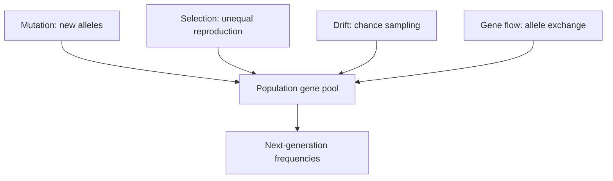
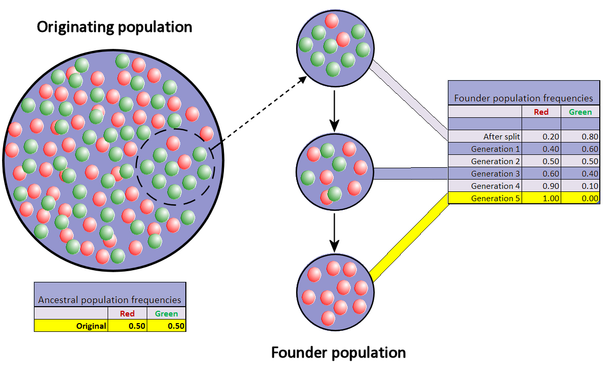

# The mechanisms of evolutionary change

## What you should learn

- Why populations evolve but individuals do not.
- The distinct roles of mutation, selection, drift and gene flow.
- How Hardy–Weinberg equilibrium supplies a no-evolution baseline.
- Why founder effects and bottlenecks are strongest in small populations.

## Evolution is change in a population's gene pool

An individual develops and ages, but it does not change the inherited variants with which it entered the population into those of a new population. Evolution is measured across generations as a change in allele frequencies ([33:20](https://www.youtube.com/watch?v=K2JCO6eXans&t=2000s)). Individuals form populations; several populations may make a species. If black cats leave more descendants than orange cats, the next generation can contain a larger proportion of black-colour alleles even if population size stays constant ([35:40](https://www.youtube.com/watch?v=K2JCO6eXans&t=2140s); [36:20](https://www.youtube.com/watch?v=K2JCO6eXans&t=2180s)).

Erika makes the scale distinction explicit: an organism is born with its inherited set of characteristics, whereas a population changes because the individuals surviving and reproducing in one generation are not necessarily a representative sample of the previous generation ([33:33](https://www.youtube.com/watch?v=K2JCO6eXans&t=2013s)). The useful revision hierarchy is therefore:

| Level | What can happen at that level? | What is inherited? |
| --- | --- | --- |
| Individual | Development, acclimatisation, injury and death | Its alleles can be copied into offspring |
| Population | The relative abundance of alleles changes across generations | The population's gene pool is resampled each generation |
| Species or lineage | Populations diverge, exchange genes or become reproductively isolated | Accumulated population changes form a historical pattern |

“Beneficial” also has no meaning without an environment. Erika compares the medium coat of a red fox with the longer coat of an Arctic fox and the short coat and large ears of a fennec: a mutation extending fur could help in cold conditions but overheat an animal in the environment where its present coat is already effective ([34:55](https://www.youtube.com/watch?v=K2JCO6eXans&t=2095s); [35:15](https://www.youtube.com/watch?v=K2JCO6eXans&t=2115s)). Variation is valuable to a population because it gives selection something to work with when conditions change; this is different from saying that every mutation helps its carrier ([34:34](https://www.youtube.com/watch?v=K2JCO6eXans&t=2074s)).

This definition does not require the change to be large, beneficial or permanent. It identifies the quantity being tracked. The debate about “micro” and “macro” evolution is therefore not whether allele frequencies change, but how population changes accumulate, branch and relate to larger historical patterns.

## Four mechanisms, four different jobs

Erika organises the lesson around four mechanisms ([36:40](https://www.youtube.com/watch?v=K2JCO6eXans&t=2200s); [37:20](https://www.youtube.com/watch?v=K2JCO6eXans&t=2240s)):

| Mechanism | What it does | Directional with respect to fitness? |
| --- | --- | --- |
| Mutation | Introduces a new sequence variant | No; not produced because it will be useful |
| Natural selection | Changes frequencies when inherited variants differ in reproductive output | Yes, in the current environment |
| Genetic drift | Changes frequencies through random sampling and events | No |
| Gene flow | Moves alleles between populations through migration and reproduction | Not inherently; it can help or oppose local adaptation |

The mechanisms operate together. A dark-colour mutation can be favoured on dark ground, lost when its first carrier dies by chance, or introduced into another population by migration. It is therefore a mistake to narrate every frequency change as an adaptation.

Mutation is the only one of the four that introduces a genuinely new allele in Erika's framework. She describes it as the “raw material” on which the other mechanisms act ([36:56](https://www.youtube.com/watch?v=K2JCO6eXans&t=2216s)). Mutation is random with respect to what an organism needs, although mutation rates need not be identical at every position in a genome ([37:16](https://www.youtube.com/watch?v=K2JCO6eXans&t=2236s); [37:36](https://www.youtube.com/watch?v=K2JCO6eXans&t=2256s)). Once a variant exists, its fate may be an increase, a decrease or effectively no change in fitness; selection, drift and gene flow then influence whether it spreads, remains rare or disappears ([37:56](https://www.youtube.com/watch?v=K2JCO6eXans&t=2276s)).

That division of labour prevents two common errors:

- The environment does not summon the mutation an organism needs. It alters the relative consequences of variants already appearing or present.
- A change need not be adaptive. Neutral variants can change through drift, while migration can move an allele even when it is poorly matched to the receiving habitat.

## Fitness is the link between genotype and descendants

Erika defines fitness as the success of a genotype at leaving descendants relative to other genotypes ([38:20](https://www.youtube.com/watch?v=K2JCO6eXans&t=2300s)). It combines surviving to reproductive age with producing offspring who themselves enter later generations. A fit individual is not necessarily strongest, longest lived or healthiest; if it leaves no descendants, its realised genetic contribution is zero.

The word **relative** is essential. In Erika's sandy-beach example, green and brown insects may both live and reproduce, but the more conspicuous form is eaten more often. If the better-camouflaged genotype leaves more children and grandchildren on average, it has higher fitness in that setting ([39:01](https://www.youtube.com/watch?v=K2JCO6eXans&t=2341s)). Fitness is therefore not a permanent score attached to an allele. Move the insects to green vegetation, change the predator or change the climate, and the comparison can reverse.

Selection is non-random with respect to that outcome, but not conscious. Drift remains possible: a well-adapted animal can drown, be stepped on or lose offspring to an unrelated storm. A fitness advantage changes the probability distribution across many births; it does not guarantee the fate of one carrier.

## Hardy–Weinberg: define stillness to detect movement

Population geneticists first needed a mathematical baseline for no evolution. Let *p* and *q* be the frequencies of two alleles. Under ideal conditions, genotype frequencies follow:

\[
p^2 + 2pq + q^2 = 1
\]

Erika introduces this at [1:01:20](https://www.youtube.com/watch?v=K2JCO6eXans&t=3680s) and works an example with *p* = 0.3 and *q* = 0.7 at [1:02:20](https://www.youtube.com/watch?v=K2JCO6eXans&t=3740s). The equation itself does not assert that nature is static. It says that frequencies remain predictable if no evolutionary forces disturb them.

The worked example separates allele frequencies from genotype frequencies:

| Genotype term | Calculation | Expected frequency |
| --- | --- | --- |
| $p^2$ | $0.3 \times 0.3$ | 0.09 |
| $2pq$ | $2 \times 0.3 \times 0.7$ | 0.42 |
| $q^2$ | $0.7 \times 0.7$ | 0.49 |
| Total | $0.09 + 0.42 + 0.49$ | 1.00 |

If the assumptions continue to hold, the same allele frequencies regenerate those genotype proportions after random mating. Erika's purpose is not to make learners memorise algebra for its own sake; it is to show how Mendelian inheritance and probability can specify what a population should look like when allele frequencies are not changing ([1:01:46](https://www.youtube.com/watch?v=K2JCO6eXans&t=3706s); [1:02:40](https://www.youtube.com/watch?v=K2JCO6eXans&t=3760s)).

The “five no's” are effectively: no mutation, no migration or gene flow, no natural selection, no non-random mating and no sampling drift (represented by an infinitely large population) ([1:03:00](https://www.youtube.com/watch?v=K2JCO6eXans&t=3780s)). Real populations violate these assumptions. That is why the model is useful: departures identify that at least one mechanism is acting and provide a basis for estimating its strength ([1:04:00](https://www.youtube.com/watch?v=K2JCO6eXans&t=3840s)).

Erika stresses that no natural population literally meets all five conditions: replication produces mutation, organisms have mate preferences, even deep-sea environments change, and real populations are finite ([1:03:40](https://www.youtube.com/watch?v=K2JCO6eXans&t=3820s)). A departure from equilibrium does not by itself identify *which* assumption failed. Researchers need ecological, demographic or genomic evidence to separate selection from migration, mutation, drift or non-random mating.

### Common confusion: equilibrium is a null model

Hardy–Weinberg equilibrium is like predicting a moving object's position if no force acts. Scientists do not expect the ideal conditions to hold perfectly; they compare observations with the baseline to detect and quantify change.

## Genetic drift: chance changes representation

Erika answers Will's “what if a rock falls on the best-adapted animal?” with **genetic drift**. A chance event can remove an allele regardless of its value. In a large population, one loss is a small sample; in a small one, it can radically change the available gene pool ([2:22:40](https://www.youtube.com/watch?v=K2JCO6eXans&t=8560s); [2:23:20](https://www.youtube.com/watch?v=K2JCO6eXans&t=8600s)).

Her moth thought experiment isolates the difference. On a dark, ash-covered background, a black moth may have the best camouflage. Yet if that first black carrier is stepped on, struck by a falling rock or drowned before reproducing, its advantage cannot be inherited; the grey form can dominate instead ([2:22:58](https://www.youtube.com/watch?v=K2JCO6eXans&t=8578s); [2:23:28](https://www.youtube.com/watch?v=K2JCO6eXans&t=8608s)). Selection describes systematic differences tied to phenotype. Drift describes sampling error and chance histories. Both can act during the same generation.

Two common patterns are:

- **Founder effect:** a small group colonises a new area. Its allele frequencies reflect the founders, not a perfect sample of the parent population. Erika imagines one striped moth among ten storm-blown colonists rather than one among one hundred mainland moths ([2:24:00](https://www.youtube.com/watch?v=K2JCO6eXans&t=8640s); [2:25:00](https://www.youtube.com/watch?v=K2JCO6eXans&t=8700s)).
- **Bottleneck effect:** catastrophe removes most of a population. The survivors' alleles seed later generations, whether or not those alleles caused survival ([2:26:40](https://www.youtube.com/watch?v=K2JCO6eXans&t=8800s); [2:27:20](https://www.youtube.com/watch?v=K2JCO6eXans&t=8840s)).

The arithmetic is the same in Erika's cartoons. A striped variant present in one moth out of 100 begins at 1%. If a storm carries ten moths to an island and the striped one happens to be among them, it begins the new population at 10% ([2:24:29](https://www.youtube.com/watch?v=K2JCO6eXans&t=8669s); [2:24:59](https://www.youtube.com/watch?v=K2JCO6eXans&t=8699s)). If a wildfire instead leaves ten of the original hundred and the striped moth happens to survive, its frequency also becomes 10% ([2:27:00](https://www.youtube.com/watch?v=K2JCO6eXans&t=8820s)). The founder effect samples organisms into a new population; the bottleneck samples survivors within a depleted one.

*Founder-effect diagram by Professor marginalia: the coloured balls represent two alleles, while the separated sample begins with frequencies produced by chance rather than by adaptive sorting. [Source file](https://commons.wikimedia.org/wiki/File:Founder_effect_with_drift.jpg), [CC BY-SA 3.0](https://creativecommons.org/licenses/by-sa/3.0/).*

Erika cites cheetahs as a population with exceptionally low genetic diversity consistent with a severe past bottleneck ([2:28:20](https://www.youtube.com/watch?v=K2JCO6eXans&t=8900s)). Humans also show evidence of bottlenecks but retain more diversity than cheetahs; increasingly fragmented late Neanderthal populations show rising homozygosity and falling diversity in ancient genomes ([2:30:20](https://www.youtube.com/watch?v=K2JCO6eXans&t=9020s); [2:31:20](https://www.youtube.com/watch?v=K2JCO6eXans&t=9080s); [2:32:20](https://www.youtube.com/watch?v=K2JCO6eXans&t=9140s)). These reconstructions use the pattern and distribution of sequence variation, not a visual guess about inbreeding.

She supplies several other scales of example. A small colonising population of bighorn sheep can carry less diversity than its mainland source, and an isolated human family can make a rare recessive condition much more common through repeated mating within a small gene pool ([2:25:29](https://www.youtube.com/watch?v=K2JCO6eXans&t=8729s); [2:25:59](https://www.youtube.com/watch?v=K2JCO6eXans&t=8759s)). Tasmanian devils undergoing transmissible facial cancer illustrate that a population crash and natural selection can overlap: the disease reduces numbers, while any heritable resistance can be favoured among survivors ([2:28:01](https://www.youtube.com/watch?v=K2JCO6eXans&t=8881s)). Calling the entire history “drift” would therefore discard the selective part.

### Why low diversity matters

A bottleneck does not merely change the frequency of one visible allele. It removes many variants at once. Erika connects late Neanderthal isolation with increasing homozygosity, reduced diversity and greater health costs as groups became smaller and more separated ([2:31:33](https://www.youtube.com/watch?v=K2JCO6eXans&t=9093s); [2:32:33](https://www.youtube.com/watch?v=K2JCO6eXans&t=9153s)). The revision point is not that every bottleneck guarantees extinction; it is that a narrower gene pool leaves fewer alternative variants and increases the chance that related individuals share harmful recessive alleles.

## Gene flow reconnects populations

Gene flow is the movement of alleles between populations when organisms migrate and reproduce. Erika imagines dark and pale mice separated by a river: if the river disappears and mating resumes, alleles cross the former boundary ([2:58:00](https://www.youtube.com/watch?v=K2JCO6eXans&t=10680s); [2:58:40](https://www.youtube.com/watch?v=K2JCO6eXans&t=10720s)). Gene flow usually reduces divergence by sharing variants, while also increasing variation within the receiving population.

Her friendship analogy is useful so long as it is not taken literally. Friends who move apart must keep communicating or their experiences and habits diverge; separated populations must keep exchanging genes if they are to remain genetically connected ([2:58:42](https://www.youtube.com/watch?v=K2JCO6eXans&t=10722s); [2:59:08](https://www.youtube.com/watch?v=K2JCO6eXans&t=10748s)). Gene flow is the biological “check-in”: it introduces variants from one local gene pool into another. Remove it for long enough and independent mutation, drift and selection can build reproductive barriers.

Hybrid zones are places where partially differentiated populations exchange genes. Mule deer and white-tailed deer, or differently patterned baboon species, can retain distinct ranges while occasionally hybridising at contact zones ([2:59:20](https://www.youtube.com/watch?v=K2JCO6eXans&t=10760s); [3:00:00](https://www.youtube.com/watch?v=K2JCO6eXans&t=10800s)). Speciation is therefore a process, not always an instantaneous and complete wall.

Gene flow can either slow divergence or import useful variation. Its effect is not inherently “good” or “bad”; it depends on what alleles arrive, how often migrants reproduce and whether local selection retains or removes those alleles. This is why the four mechanisms should be treated as simultaneous forces rather than four isolated chapters.

## Recap

- Mutation supplies variants.
- Selection sorts them by relative reproduction in context.
- Drift changes their representation by chance, especially in small populations.
- Gene flow exchanges them between populations and can slow divergence.
- Hardy–Weinberg equilibrium is the mathematical no-change reference against which these mechanisms are detected.

## Active recall

1. Why can selection and drift act on the same allele without contradiction?
2. Contrast a founder effect with a bottleneck using population sampling.
3. Which Hardy–Weinberg assumption does each of the four mechanisms violate?
4. Why can a disease-driven population crash contain both bottleneck drift and natural selection?
5. In Erika's moth example, what evidence would distinguish predation-based selection from a chance death?
