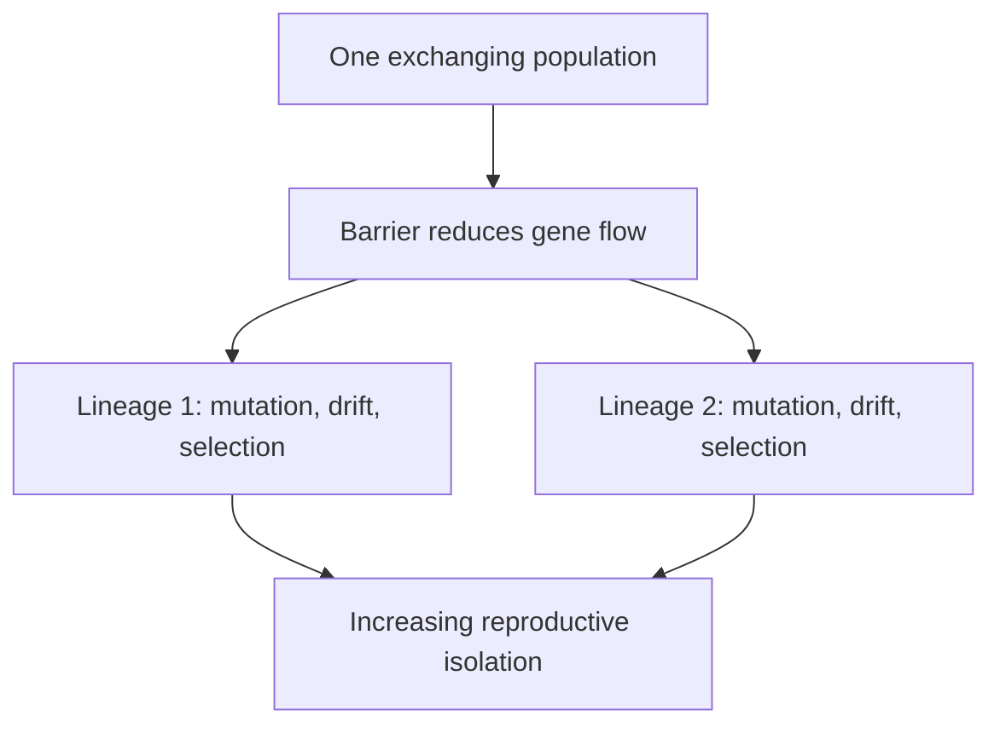
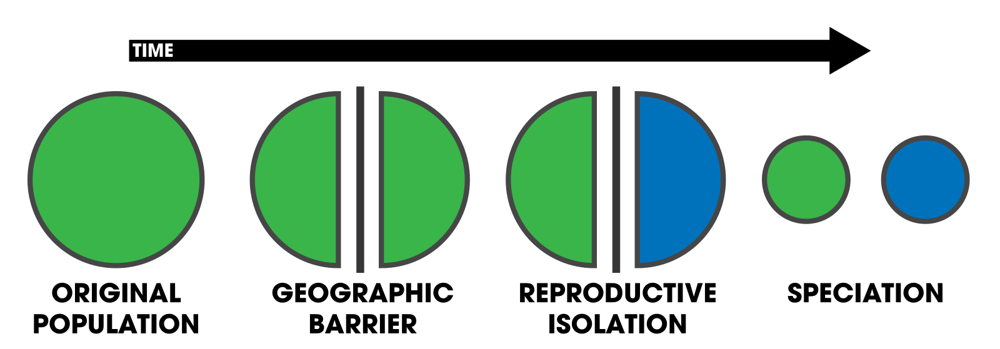
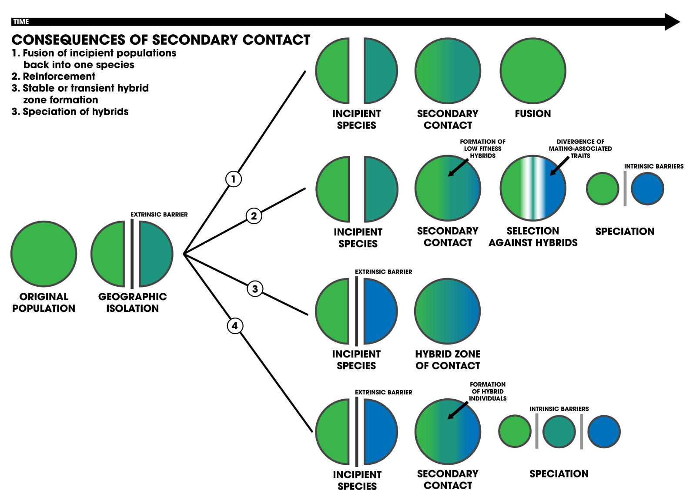

# Divergence and speciation

## What you should learn

- Why no single species concept works for every organism and fossil.
- How reproductive barriers accumulate when gene flow falls.
- Why language change is a useful analogy for lineage divergence.
- How gradualism and punctuated equilibrium describe compatible tempos.

## Species are lineages, not immutable boxes

Erika moves from individuals to populations, subspecies and species. A population is a connected group of individuals; a subspecies is a recognisable cluster of populations; the familiar **biological species concept** describes interbreeding populations reproductively isolated from other such groups ([2:36:20](https://www.youtube.com/watch?v=K2JCO6eXans&t=9380s); [2:37:20](https://www.youtube.com/watch?v=K2JCO6eXans&t=9440s); [2:38:00](https://www.youtube.com/watch?v=K2JCO6eXans&t=9480s)).

The levels are nested, not competing labels. Individuals make a local population; several populations that share distinguishing features may be recognised as a subspecies; populations connected by reproduction can be grouped as a species ([2:37:10](https://www.youtube.com/watch?v=K2JCO6eXans&t=9430s); [2:37:35](https://www.youtube.com/watch?v=K2JCO6eXans&t=9455s)). A subspecies can have a distinctive tail tuft, ear shape, face profile or geographical range while still exchanging genes with other populations in the species.

The definition works well for many living sexual organisms but fails as a universal rule. Lions and tigers, sheep and goats, polar and grizzly bears, and even camels and llamas can sometimes hybridise; asexual organisms do not mate; fossils cannot be breeding-tested ([2:39:40](https://www.youtube.com/watch?v=K2JCO6eXans&t=9580s); [2:40:20](https://www.youtube.com/watch?v=K2JCO6eXans&t=9620s)). A species concept is an operational tool, not a claim that nature always supplies sharp labels.

Erika first uses western and eastern meadowlarks to show why “could their gametes possibly fuse?” is not the same as “do they form one breeding population?” Their songs and behaviour differ, so they do not normally recognise one another as mates even where a laboratory intervention might conceivably produce offspring ([2:38:51](https://www.youtube.com/watch?v=K2JCO6eXans&t=9531s); [2:39:16](https://www.youtube.com/watch?v=K2JCO6eXans&t=9556s)). Conversely, rare hybridisation does not automatically erase stable ecological, behavioural and genomic differences between named lineages.

### A concept is a measurement rule

The biological species concept asks about present gene exchange. A morphological concept groups by anatomy. An evolutionary lineage concept asks whether a population maintains its own historical identity and fate. Each answers a different practical question. Trouble begins when one rule is expected to classify living sexual animals, asexual microbes and fragmentary fossils equally well.

## Reproductive isolation has several stages

Barriers can occur before or after mating ([2:41:40](https://www.youtube.com/watch?v=K2JCO6eXans&t=9700s); [2:42:20](https://www.youtube.com/watch?v=K2JCO6eXans&t=9740s)):

| Stage | Example mechanism |
| --- | --- |
| Encounter | Populations occupy different ranges, habitats or seasons |
| Recognition | Courtship songs or behaviours do not identify the other as a mate |
| Mechanical | Reproductive structures are incompatible |
| Gametic | Sperm and egg do not fuse successfully |
| Development | Hybrid embryos fail or miscarry |
| Hybrid fertility | Offspring survive but are partly or wholly sterile |

White-tailed and mule deer illustrate incomplete separation: they rarely meet, usually remain behaviourally distinct and produce hybrids with inconsistent fertility ([2:41:00](https://www.youtube.com/watch?v=K2JCO6eXans&t=9660s)). Horses and donkeys usually produce sterile mules, but rare fertile exceptions occur. This does not erase divergence; it shows that isolation can be strong without being absolute.

Erika's examples make the stages concrete:

- **Geographic or habitat isolation:** jaguars and leopards live on different continents, so even physiological compatibility would not create routine gene flow ([2:41:50](https://www.youtube.com/watch?v=K2JCO6eXans&t=9710s); [2:42:15](https://www.youtube.com/watch?v=K2JCO6eXans&t=9735s)).
- **Behavioural isolation:** meadowlark songs fail the recognition step before mating begins.
- **Mechanical isolation:** externally similar bushbabies can have highly divergent reproductive anatomy, functioning as a physical lock-and-key barrier ([2:42:40](https://www.youtube.com/watch?v=K2JCO6eXans&t=9760s); [2:43:05](https://www.youtube.com/watch?v=K2JCO6eXans&t=9785s)).
- **Gametic or developmental isolation:** sperm may be chemically rejected by an egg, cell division may not begin, or an embryo may later miscarry ([2:43:30](https://www.youtube.com/watch?v=K2JCO6eXans&t=9810s); [2:43:55](https://www.youtube.com/watch?v=K2JCO6eXans&t=9835s)).
- **Hybrid sterility:** horse and donkey reproduction usually yields a mule unable to continue the gene exchange into another generation, though Erika notes rare exceptions.

Isolation can therefore accumulate in layers. A pair may rarely meet, mate even more rarely, produce few viable offspring and pass almost no hybrid genes onward. That is substantial reproductive separation even though one exceptional hybrid exists.

## Ring species expose a process in progress

Erika uses a salamander ring around a geographic barrier. Population A can breed with neighbouring B, and B with C, but terminal A and C cannot. No choice of a single border captures every relationship ([2:44:40](https://www.youtube.com/watch?v=K2JCO6eXans&t=9880s); [2:45:20](https://www.youtube.com/watch?v=K2JCO6eXans&t=9920s)). Adjacent populations exchange enough genes to remain compatible; differences accumulate with distance until terminal forms are reproductively isolated.

The logical problem can be written as three observations:

| Test | Result in Erika's diagram | If the biological concept is forced into a sharp box |
| --- | --- | --- |
| A × B | Reproduces | A and B should be one species |
| B × C | Reproduces | B and C should be one species |
| A × C | Does not reproduce | A and C should be different species |

No single cut preserves all three statements. Erika identifies the western salamander example as a real ring-species pattern, where neighbouring forms around a barrier remain connected but the terminal forms have become isolated ([2:45:12](https://www.youtube.com/watch?v=K2JCO6eXans&t=9912s); [2:45:37](https://www.youtube.com/watch?v=K2JCO6eXans&t=9937s)).

This is why speciation does not require one parent to produce a child belonging to a clearly different modern species. Every child belongs to its parent's population, while small differences accumulate along different chains of reproduction.

## Fossils require a lineage concept

Fossil workers cannot observe mating. They compare anatomy, age, geography and continuity, often using an **evolutionary species concept**: an ancestral-descendant lineage that maintains a distinct tendency and fate ([2:46:20](https://www.youtube.com/watch?v=K2JCO6eXans&t=9980s); [2:47:40](https://www.youtube.com/watch?v=K2JCO6eXans&t=10060s)). Small skull differences may distinguish living non-interbreeding lineages, but large size differences can occur within one species. Fossil naming therefore remains a hypothesis open to revision, not direct access to reproductive behaviour.

Erika illustrates the ambiguity with a *Nanotyrannus*–*Tyrannosaurus rex* comparison: a viewer may see two broadly similar tyrannosaur skulls, while a taxonomist may focus on size and tooth-development differences ([2:46:30](https://www.youtube.com/watch?v=K2JCO6eXans&t=9990s); [2:46:35](https://www.youtube.com/watch?v=K2JCO6eXans&t=9995s)). Her point is methodological, not that the lesson resolves that disputed classification. Minute skull differences can correspond to distinct living wolf lineages, yet lions and tigers remain recognisably different while sometimes producing hybrids ([2:46:53](https://www.youtube.com/watch?v=K2JCO6eXans&t=10013s); [2:47:18](https://www.youtube.com/watch?v=K2JCO6eXans&t=10038s)). Anatomy is evidence, but the mapping from anatomical distance to reproductive isolation is not universal.

Will jokes that if only dog skeletons survived, their variation might generate many fossil species. Erika agrees the problem is real; even living dog breeds can be mechanically unable to mate without assistance ([2:48:00](https://www.youtube.com/watch?v=K2JCO6eXans&t=10080s)). The correct conclusion is cautious taxonomy, not that anatomy contains no ancestry information.

The dog example also shows why knowing ancestry changes classification. We know Chihuahuas and Great Danes belong to a recently connected domestic lineage despite extreme size differences; a palaeontologist with only scattered bones would lack that breeding and historical information ([2:47:43](https://www.youtube.com/watch?v=K2JCO6eXans&t=10063s); [2:48:08](https://www.youtube.com/watch?v=K2JCO6eXans&t=10088s)). Fossil species are therefore best treated as testable lineage hypotheses that can change with new specimens, growth-series data and stratigraphic context.

## Fuzzy boundaries are an evolutionary prediction

If species were created as permanently separate units, one might expect a consistent boundary between them. Evolution instead predicts intermediate degrees of gene flow, hybridisation and divergence. Erika cites a review estimating hybridisation or introgression in substantial fractions of named plant and animal species ([2:48:40](https://www.youtube.com/watch?v=K2JCO6eXans&t=10120s); [2:49:20](https://www.youtube.com/watch?v=K2JCO6eXans&t=10160s)). The difficulty of defining a universal species boundary is therefore not an ad hoc rescue; Darwin was already calling species difficult to define before publishing *Origin* ([2:53:20](https://www.youtube.com/watch?v=K2JCO6eXans&t=10400s)).

Erika gives the review's approximate figures as 25% of plant species and 10% of animal species being involved in some hybridisation or possible introgression, with deer, hares and canids among familiar examples ([2:49:00](https://www.youtube.com/watch?v=K2JCO6eXans&t=10140s); [2:49:25](https://www.youtube.com/watch?v=K2JCO6eXans&t=10165s)). These are not claims that one quarter of plants form one species. They show that named lineages can remain distinct while exchanging limited genetic material.

### Language as an analogy

Old English, Middle English and modern English change word by word. A Middle English speaker may partly understand both neighbours in time, while Old and modern speakers may not understand one another. No first baby suddenly spoke Italian instead of Latin; differences accumulated through connected speech communities ([2:49:40](https://www.youtube.com/watch?v=K2JCO6eXans&t=10180s); [2:50:40](https://www.youtube.com/watch?v=K2JCO6eXans&t=10240s); [2:51:40](https://www.youtube.com/watch?v=K2JCO6eXans&t=10300s)).

Erika follows the English word “ring” through forms that remain partly recognisable between neighbouring stages but become opaque across the full distance from Old English to the present ([2:50:41](https://www.youtube.com/watch?v=K2JCO6eXans&t=10241s); [2:51:06](https://www.youtube.com/watch?v=K2JCO6eXans&t=10266s); [2:51:32](https://www.youtube.com/watch?v=K2JCO6eXans&t=10292s)). Words also change at different rates, just as genomic regions do; one recognisable word does not make two entire languages mutually intelligible ([2:52:48](https://www.youtube.com/watch?v=K2JCO6eXans&t=10368s); [2:53:13](https://www.youtube.com/watch?v=K2JCO6eXans&t=10393s)).

The analogy maps words to inherited variants and mutual comprehension to reproductive compatibility. It is not exact—genes are not words and mating is not conversation—but it clarifies how neighbouring populations remain connected while distant descendants become incompatible ([2:52:00](https://www.youtube.com/watch?v=K2JCO6eXans&t=10320s); [2:52:40](https://www.youtube.com/watch?v=K2JCO6eXans&t=10360s)).

## How geographic separation produces branches

Suppose a river divides a forest population whose members do not readily swim. Once gene flow stops, mutations arising on one side are not automatically shared with the other. Different environments impose different selection, and drift samples each smaller population independently ([2:56:20](https://www.youtube.com/watch?v=K2JCO6eXans&t=10580s); [2:57:00](https://www.youtube.com/watch?v=K2JCO6eXans&t=10620s)). Reproductive barriers can accumulate as a by-product.

Erika calls the barrier-forming event **vicariance**. In her monkey example, a rerouted river splits a population whose members are poor swimmers. Each side now accumulates its own mutations; because the populations are no longer mating, those variants are not routinely copied across the river ([2:56:36](https://www.youtube.com/watch?v=K2JCO6eXans&t=10596s); [2:57:02](https://www.youtube.com/watch?v=K2JCO6eXans&t=10622s)). Drift also acts independently, and any environmental difference can impose different selection. The barrier does not itself “design” either daughter population; it removes the homogenising effect of gene flow.

*A geographic barrier divides one population; reproductive isolation then develops between the separated descendants. Diagram by Andrew Z. Colvin, [source file](https://commons.wikimedia.org/wiki/File:Allopatric_Speciation_Schematic.svg), [CC BY-SA 4.0](https://creativecommons.org/licenses/by-sa/4.0/). The local PNG is a direct render of the source SVG. This is an external teaching diagram, not a screenshot from Erika's slides.*

If a barrier divides the population into two substantial groups, the lesson calls the resulting process **allopatric speciation**. Erika then draws a river cutting off only a small part of a much larger parent population ([2:57:41](https://www.youtube.com/watch?v=K2JCO6eXans&t=10661s)); the isolated group can diverge while gene flow continues within the large parent population ([2:57:46](https://www.youtube.com/watch?v=K2JCO6eXans&t=10666s)).

> **Terminology correction for revision:** Erika calls this second diagram “parapatric” in the livestream, but the configuration she describes—a small, geographically isolated population at the edge of the parent range—is normally called **peripatric speciation**. **Parapatric speciation** normally refers to neighbouring populations diverging across adjoining ranges while some restricted gene flow remains between them. Preserve the distinction when answering an exam question; the correction concerns the label, not the isolation-and-divergence mechanism Erika is illustrating.

If a barrier later disappears, gene flow can merge variation, maintain a hybrid zone, or remain too weak to reverse isolation ([2:58:00](https://www.youtube.com/watch?v=K2JCO6eXans&t=10680s); [2:59:20](https://www.youtube.com/watch?v=K2JCO6eXans&t=10760s)).

Mule deer and white-tailed deer illustrate a contact zone: their ranges meet around the Rocky Mountains, and hybrids occur, but the lineages remain mostly distinct and male hybrids have inconsistent fertility ([2:59:34](https://www.youtube.com/watch?v=K2JCO6eXans&t=10774s); [2:59:59](https://www.youtube.com/watch?v=K2JCO6eXans&t=10799s)). Erika describes this as speciation still in progress. A hybrid zone records some gene flow; it does not prove unrestricted random mating across both ranges.

*External synthesis of secondary-contact outcomes: fusion, reinforcement, a stable hybrid zone, or formation of an additional hybrid lineage. Diagram by Andrew Z. Colvin, [source file](https://commons.wikimedia.org/wiki/File:Consequences_of_secondary_contact_Schematic.svg), [CC BY-SA 4.0](https://creativecommons.org/licenses/by-sa/4.0/). The local PNG is a direct render of the source SVG. Erika discusses renewed gene flow and hybrid zones; the four-outcome classification adds revision context and should not be mistaken for a slide shown in the stream.*

### Predict the outcome after contact

Use three questions: How much reproductive isolation accumulated? How fit are hybrids? How often do migrants mate? If isolation is weak, gene flow can fuse the populations. If hybrids form but have low fitness, selection can strengthen mate discrimination. If gene exchange remains restricted to a narrow region, a stable hybrid zone can persist. The livestream explicitly covers reconnection and hybrid zones; the downloaded diagram places those cases alongside the other standard outcomes.

## Pattern and tempo are separate questions

**Cladogenesis** is branching: one lineage gives rise to independently evolving descendants. **Anagenesis** is change along a single lineage ([3:00:20](https://www.youtube.com/watch?v=K2JCO6eXans&t=10820s)). These describe patterns.

Cladogenesis increases the number of independently evolving lineages; anagenesis replaces an earlier condition along one continuous line without a branching event. Neither word specifies whether change is fast or slow. That is a separate question about tempo ([3:00:24](https://www.youtube.com/watch?v=K2JCO6eXans&t=10824s); [3:00:49](https://www.youtube.com/watch?v=K2JCO6eXans&t=10849s)).

**Gradualism** describes slow, comparatively continuous change. **Punctuated equilibrium** describes longer periods of relative stasis interrupted by geologically rapid change, often following environmental disruption or population isolation ([3:01:00](https://www.youtube.com/watch?v=K2JCO6eXans&t=10860s); [3:01:40](https://www.youtube.com/watch?v=K2JCO6eXans&t=10900s); [3:02:20](https://www.youtube.com/watch?v=K2JCO6eXans&t=10940s)). Erika presents them as compatible: the tempo depends on environmental stability, available variation, generation time and selection strength.

Her contrast is ecological. A habitat becoming steadily warmer or drier can pull a trait distribution gradually. A volcanic eruption can abruptly change the background, food and survival conditions, causing a short, intense episode of selection followed by relative stability ([3:02:05](https://www.youtube.com/watch?v=K2JCO6eXans&t=10925s); [3:02:31](https://www.youtube.com/watch?v=K2JCO6eXans&t=10951s)). “Punctuated” refers to the pattern across geological time; the rapid interval can still contain many ordinary generations of birth, inheritance and differential reproduction.

### Common confusion

- Hybridisation does not necessarily make two lineages one species; it measures the degree of continuing gene flow.
- “Macro” evolution does not introduce a separate magical mechanism. It names branching and accumulated population change at larger scales, which must also be checked against genomes and fossils.
- Rapid in geology can still span many generations; punctuated equilibrium does not mean an adult transforms or a new phylum appears in one birth.

## Active recall

1. Why can the biological species concept fail even when two lineages are clearly distinct?
2. Use the language analogy to explain why there is no first member sharply separated from its parents.
3. How do selection, drift and gene flow behave after a geographic barrier appears and then disappears?
4. Contrast cladogenesis with anagenesis, and gradualism with punctuated equilibrium.
5. Arrange geographic, behavioural, mechanical, gametic and hybrid-fertility barriers from earliest to latest in reproduction.
6. Why does limited hybridisation show incomplete isolation without necessarily collapsing two species into one?
