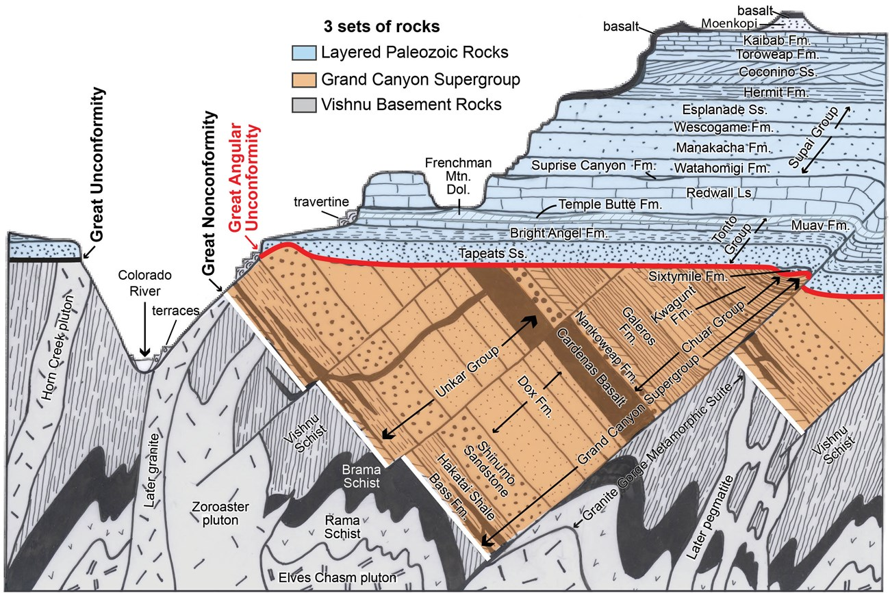

# Strata, fossils and relative time

## Learning goals

After this note, you should be able to explain how geologists reconstruct an **order of events without first knowing a numerical age**, why catastrophes and slow background processes can both be recognised, and how annual archives and sedimentary structures establish minimum timescales.

## 1. A rate is useful only when its conditions are understood

Erika begins with a simple relationship: if the starting state, ending state and rate are known, elapsed time can be estimated. Her hourglass, swimming-pool and tree-ring examples are deliberately ordinary. Each calculation works only if the relevant rate and boundary conditions are known ([33:23](https://www.youtube.com/watch?v=dTVFcr4GCMk&t=2003s)).

She then uses human skeletal age estimation to show why **several constraints are better than one**. A closed growth plate might establish that an individual exceeded one minimum age, erupted wisdom teeth another, and obliterated cranial sutures another. No single feature necessarily gives an exact birthday, yet together they rule out many ages and narrow the plausible range ([34:47](https://www.youtube.com/watch?v=dTVFcr4GCMk&t=2087s)). Geology often works in the same way: one structure may establish only a minimum, but multiple independent structures constrain a history.

## 2. Actualism includes catastrophes

Early geologists observed erosion, deposition and landscape change occurring in the present. Erika describes Hutton's reasoning from Hadrian's Wall: if a roughly two-thousand-year-old wall remained recognisable, erosion was not normally so fast that surrounding mountains could be only a few thousand years old ([37:43](https://www.youtube.com/watch?v=dTVFcr4GCMk&t=2263s)).

The phrase **“the present is the key to the past”** means that physical laws and processes observed now also apply to ancient traces. Modern ripple marks, for example, form under particular combinations of water depth, energy and sediment. Similar geometry preserved in rock is therefore evidence for similar conditions, not a mere assertion that every ancient rate was constant ([38:37](https://www.youtube.com/watch?v=dTVFcr4GCMk&t=2317s)).

Erika explicitly rejects a crude “everything was always slow” rule. Rivers change course, rates vary, and landslides, eruptions, floods and ashfalls can transform a local area rapidly. Modern geology uses **actualism**: ordinary processes operate, while real catastrophes are included where their physical and chemical traces occur ([54:08](https://www.youtube.com/watch?v=dTVFcr4GCMk&t=3248s)). A rapid deposit can be recognised as rapid; it does not license treating every other deposit as the same event.

## 3. The rock and fossil record

Erika distinguishes three rock families. Sedimentary rock forms when transported sediment accumulates, compacts and cements; igneous rock forms when magma or lava cools; metamorphic rock is pre-existing rock altered by intense heat or pressure ([41:04](https://www.youtube.com/watch?v=dTVFcr4GCMk&t=2464s)). These types cycle as surface rock is weathered, buried, heated, uplifted and exposed again.

Fossilisation is selective rather than automatic. Erika's basic sequence is: an organism dies, is buried quickly enough to avoid most scavenging and weathering, becomes more deeply buried as surrounding sediment lithifies, and is then mineralised or leaves a mineral-filled mould before eventually being exposed and discovered ([44:24](https://www.youtube.com/watch?v=dTVFcr4GCMk&t=2664s)). Burial can occur in mudslides, tar pits or other settings. Anoxic lake bottoms can inhibit organisms that normally break a carcass down, producing unusually detailed preservation ([47:02](https://www.youtube.com/watch?v=dTVFcr4GCMk&t=2822s)).

Local catastrophes leave diagnostic clues. Erika gives submarine slumps, collapsed dunes and the Nebraska ashfall beds as examples. In the ashfall case, both the ash and chronic respiratory pathology in animal bones support the reconstruction; the interpretation does not rest on a dramatic fossil pose alone ([51:38](https://www.youtube.com/watch?v=dTVFcr4GCMk&t=3098s)).

## 4. Annual archives: counted time before radiometric time

Tree rings record growth, usually one seasonal cycle per year in suitable climates. Erika notes the complications directly: drought can produce a missing ring and unusually favourable conditions can produce an extra ring. These are checked against many trees, historical weather information and isotope records rather than ignored ([1:05:12](https://www.youtube.com/watch?v=dTVFcr4GCMk&t=3912s)). Overlapping ring-width “barcodes” in living, dead and subfossil trees can be cross-dated. She presents a continuous central-European sequence reaching roughly 12,000 years, supported by many overlapping individuals rather than one tree ([1:06:49](https://www.youtube.com/watch?v=dTVFcr4GCMk&t=4009s)).

Ice cores contain seasonal couplets. In the example Erika describes, summer ice includes more dust and hoarfrost while winter ice differs visibly and chemically. Roughly 25,000 layers can be distinguished by eye in suitable cores; instrumental methods extend the record further ([1:10:53](https://www.youtube.com/watch?v=dTVFcr4GCMk&t=4253s)). Oxygen-16 and oxygen-18 ratios in the ice also preserve temperature information because the lighter isotope is preferentially carried through evaporation and snowfall during cold periods ([1:13:21](https://www.youtube.com/watch?v=dTVFcr4GCMk&t=4401s)).

**Varves** are annual sediment couplets in quiet lakes or fjords. Their summer and winter components differ in organic debris, pollen, microorganisms and sometimes crystal form. Erika uses Lake Suigetsu's visually countable sequence of about 31,000 years and a much longer Dead Sea sequence to show why “many layers formed in one flood” must explain the repeated seasonal chemistry, not merely the existence of thin layers ([1:15:11](https://www.youtube.com/watch?v=dTVFcr4GCMk&t=4511s)). She is careful to distinguish an anchored sequence from a “floating” one whose internal duration can be counted before its position on the wider calendar is independently fixed ([1:18:59](https://www.youtube.com/watch?v=dTVFcr4GCMk&t=4739s)).

## 5. Superposition orders events

The law of superposition states that in an undisturbed sedimentary sequence, lower layers were deposited before higher layers. Cross-cutting relationships add more information: an intrusion must be younger than the layers it cuts, while an erosional surface must post-date the units it truncates and pre-date whatever lies above it ([1:26:06](https://www.youtube.com/watch?v=dTVFcr4GCMk&t=5166s)). This creates a relative history even before any isotope is measured.

*2021 National Park Service stratigraphic column, from Karlstrom, Crossey, Mathis and Bowman, [“Telling Time at Grand Canyon National Park: 2020 Update”](https://doi.org/10.36967/nrr-2285173). [Source image](https://commons.wikimedia.org/wiki/File:2021_Revised_NPS_Geologic_Stratigraphic_Column_of_the_Grand_Canyon.jpg), U.S. federal government work/public domain.*

Erika uses the Grand Canyon to show that one locality can record changing environments ([1:35:04](https://www.youtube.com/watch?v=dTVFcr4GCMk&t=5704s)). The Bright Angel Shale contains marine traces such as trilobites and worm burrows ([1:35:07](https://www.youtube.com/watch?v=dTVFcr4GCMk&t=5707s)); higher cross-bedded sandstones record dunes and terrestrial tracks ([1:35:17](https://www.youtube.com/watch?v=dTVFcr4GCMk&t=5717s)); still higher units return to marine fossils. Erika interprets the sequence as a marine transgression—a rise in relative sea level across the landscape—because sedimentary geometry and fossil communities point in the same direction ([1:35:35](https://www.youtube.com/watch?v=dTVFcr4GCMk&t=5735s)).

## 6. Why some formations establish long minimum ages

Marine chalk is built from enormous numbers of microscopic calcium-carbonate skeletons that live, die, settle, compact and cement. The organisms' growth and settling are constrained by water temperature, acidity, pressure and turbulence. Erika compares the White Cliffs of Dover with the modern Bahama Banks, one of the fastest observed settings for marine carbonate accumulation ([1:36:05](https://www.youtube.com/watch?v=dTVFcr4GCMk&t=5765s)).

Her calculation is explicitly an **optimistic minimum**, not the formal date of the formation: apply a fast observed modern rate and ask how quickly the thickness could form. Rapidly deposited mudstone can display characteristic structures, while the biogenic chalk of Dover consists of repeated microscopic remains rather than an undifferentiated flood slurry ([1:38:06](https://www.youtube.com/watch?v=dTVFcr4GCMk&t=5886s)). Compaction and cementation add further time beyond accumulation. At the Capitan reef complex, a large fossil reef lies above roughly 1,500 metres of limestone, so a single rate cannot be applied to the reef while ignoring the sequence beneath it ([1:43:25](https://www.youtube.com/watch?v=dTVFcr4GCMk&t=6205s)).

The lesson's key inference is modest but powerful: even when Erika chooses fast observed rates and favourable assumptions, some formations still require far more than a few thousand years. Their full accepted ages come later from additional evidence, especially radiometric dating.

## Common mistakes to avoid

- **“Some layers form rapidly, therefore all layers did.”** Rate and depositional signature must be established for each structure.
- **“Uniformitarianism assumes a constant rate.”** Erika's actualism allows varying rates and catastrophes while retaining consistent physics and chemistry.
- **“A missing fossil disproves a lineage.”** Fossilisation and discovery are highly selective; the stronger test concerns the order and combination of the fossils that are preserved.
- **“Superposition provides a numerical age.”** It orders events; numerical dates require additional clocks.

## Quick self-test

1. What independent observations distinguish a seasonal couplet from two layers produced during one brief event?
2. How can an igneous intrusion and an erosional surface help order sedimentary layers?
3. Why is the Bahama Banks comparison an attempt to favour a young minimum rather than simply assume a slow rate?
