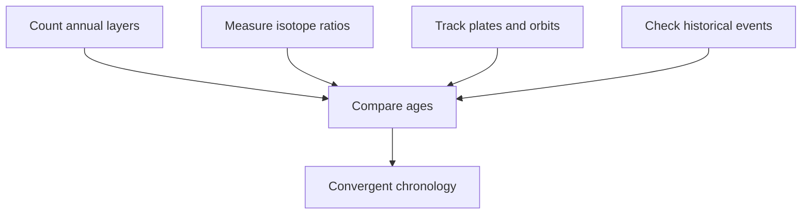
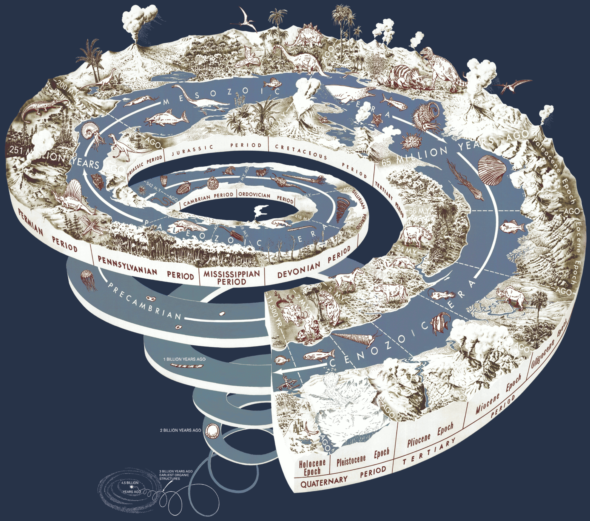

# Radiometric dating and cross-checks

## What you should learn

You should be able to describe what a radioactive clock measures, explain why different isotope systems have different useful ranges, and show how radiometric ages are tested against counted annual records, historical events, orbital cycles, plate movement and other isotope systems.

## 1. Relative time becomes absolute time

Superposition and index fossils can establish that one event preceded another. An index fossil is especially useful when it was widespread, common and restricted to a limited interval: the same species can correlate separated rock units even before either has a numerical age ([2:07:35](https://www.youtube.com/watch?v=dTVFcr4GCMk&t=7655s)). Absolute dating adds a number to this ordered framework.

Erika defines radiometric dating through the **radioactive-decay law**: for a particular unstable nuclide, the probability of decay per unit time is constant and independent of how long the individual nucleus has already existed ([2:09:31](https://www.youtube.com/watch?v=dTVFcr4GCMk&t=7771s)). This physical behaviour matters outside geology—in nuclear medicine and energy—so its study is not maintained only to support a geological timescale.

## 2. Parent, daughter and half-life

An unstable **parent** isotope spontaneously changes into a **daughter** product. The **half-life** is the time required for half of the parent atoms in a sufficiently large sample to decay. After one half-life, half remains; after two, one quarter; after three, one eighth. Erika illustrates the exponential pattern with carbon-14, whose half-life she rounds to about 5,700 years ([2:10:32](https://www.youtube.com/watch?v=dTVFcr4GCMk&t=7832s)).

*A generic half-life sequence: the labels count elapsed half-lives, so the diagram applies to any radioactive parent isotope. For carbon-14, each pictured interval represents roughly 5,700 years. Image by Andrew Fraknoi, David Morrison and Sidney Wolff/Rice University, [source file](https://commons.wikimedia.org/wiki/File:OSC_Astro_07_03_Decay_%281%29.jpg), [CC BY 4.0](https://creativecommons.org/licenses/by/4.0/).*

The relationship can be written as:

\[
N(t)=N_0\left(\frac{1}{2}\right)^{t/t_{1/2}}
\]

Here, \(N_0\) is the starting amount of parent, \(N(t)\) is the amount remaining, and \(t_{1/2}\) is the half-life. A mass spectrometer measures isotope ratios in the sample; the known decay relationship converts an appropriate ratio into elapsed time ([2:23:27](https://www.youtube.com/watch?v=dTVFcr4GCMk&t=8607s)).

### Common confusion: the clock is not “how much radiation is in a rock”

The date depends on a particular isotope system, mineral and geological event. For many igneous minerals, crystallisation and cooling establish or reset the relevant clock. The measured date therefore concerns that crystallisation or later thermal reset, not automatically every event the rock has ever experienced ([2:22:18](https://www.youtube.com/watch?v=dTVFcr4GCMk&t=8538s)).

## 3. Carbon-14 has a narrow job

Carbon-14 forms in the atmosphere and enters living systems through carbon dioxide, plants and food webs. While an organism lives, carbon is continually exchanged; after death, replenishment stops and the carbon-14 clock can be used ([2:16:18](https://www.youtube.com/watch?v=dTVFcr4GCMk&t=8178s)). Because its half-life is short, the method is useful for appropriate organic material up to roughly 50,000–60,000 years, not for obtaining the age of a dinosaur fossil tens of millions of years old ([2:20:12](https://www.youtube.com/watch?v=dTVFcr4GCMk&t=8412s)).

Will asks why a dinosaur sample containing reported biological material should not simply be carbon dated. Erika separates three issues:

1. most of a dinosaur bone is mineralised rock, with any surviving original biomolecule representing a minute and localised fraction;
2. after enough half-lives, genuine carbon-14 falls below the useful detection range;
3. tiny additions of modern carbon—from microbes, roots, groundwater, handling, background processes or instrument limits—can dominate the residual signal and return a finite but meaningless apparent age ([2:17:24](https://www.youtube.com/watch?v=dTVFcr4GCMk&t=8244s)).

Her criticism of Jack Horner's reported response to Will is also important. She says the better scientific answer would have been to explain that a test could produce a number, but that the number would not date the dinosaur unless the correct original material could be isolated and the method's range and contamination requirements were met ([2:19:46](https://www.youtube.com/watch?v=dTVFcr4GCMk&t=8386s)).

Appropriate carbon-14 targets are protected organic samples independently expected to fall inside the method's range: internal tree rings, short-lived plant remains, papyrus or carefully sampled material associated with historically recent deposits. Other isotope systems can first constrain a sample to the right broad range, after which carbon-14 can supply finer resolution ([2:20:57](https://www.youtube.com/watch?v=dTVFcr4GCMk&t=8457s)).

## 4. Choosing a clock that can resolve the interval

Long-half-life systems are valuable for old rocks but unsuitable for extremely young eruptions: too little daughter product has accumulated to measure cleanly. Erika compares this to weighing a grain of sand on a truck scale—the instrument may output something, but it is being used outside its resolving range ([2:39:31](https://www.youtube.com/watch?v=dTVFcr4GCMk&t=9571s)). The correct lesson is not that old rocks may be dated but known-age rocks may not. A sufficiently old historical eruption can be measured with a suitable isotope system.

Her example is the AD 79 eruption of Vesuvius. Roman accounts independently fix the event in historical time; an argon-argon analysis reported an age consistent with that calendar event ([2:40:45](https://www.youtube.com/watch?v=dTVFcr4GCMk&t=9645s)). For still more recent eruptions, organic material closely associated with an ash layer may instead be carbon dated—provided the researcher is dating the selected organic material, not pretending carbon-14 dates volcanic crystals ([2:44:07](https://www.youtube.com/watch?v=dTVFcr4GCMk&t=9847s)).

## 5. The decisive question: do independent clocks agree?

Erika does not ask the viewer to trust an isotope date in isolation. She first sets a prediction: if counted tree rings genuinely represent years and carbon-14 decay is understood, carbon dates from selected rings should follow the independently counted chronology. If either model is badly wrong, the points should depart systematically from the expected decay band ([2:24:37](https://www.youtube.com/watch?v=dTVFcr4GCMk&t=8677s)). The measured tree-ring samples fall along that expectation, with ordinary uncertainty rather than arbitrary agreement ([2:26:31](https://www.youtube.com/watch?v=dTVFcr4GCMk&t=8791s)).

Lake Suigetsu then extends the test. Varve counts and tree-ring sequences overlap for part of their records; organic material from the varves can also be carbon dated. In the overlap, tree counts, varve counts and carbon-14 agree, and the varve record continues beyond the tree sequence ([2:27:12](https://www.youtube.com/watch?v=dTVFcr4GCMk&t=8832s)). These are not three readings from one instrument: a growth pattern in wood, seasonal sediment deposition and nuclear decay have different principal failure modes.

Ice cores supply another cross-check. Icelandic eruptions distribute distinctive ash into Greenland ice. Researchers can count annual layers around an ash horizon and radiometrically date the volcanic material; the two estimates agree ([2:28:42](https://www.youtube.com/watch?v=dTVFcr4GCMk&t=8922s)).

## 6. Cross-checks far beyond carbon-14

Erika next uses Milankovitch cycles—the changing shape of Earth's orbit, axial tilt and precession. These astronomical cycles alter seasonality. If long ice, cave and marine records are real, climate-sensitive isotope ratios should preserve the predicted periodicity, and northern- and southern-hemisphere records should respond in opposite seasonal directions ([2:29:31](https://www.youtube.com/watch?v=dTVFcr4GCMk&t=8971s)). She presents oxygen-18 cave records from Brazil and China: the southern- and northern-hemisphere signals are inverted as predicted, yet remain aligned with the same eccentricity, precession and obliquity cycles ([2:31:30](https://www.youtube.com/watch?v=dTVFcr4GCMk&t=9090s)).

She then describes a 2025 comparison incorporating stable-carbon signals in cave deposits, Mediterranean pollen, marine cores dated with carbon and argon methods, and atmospheric or oxygen information from ice cores ([2:32:00](https://www.youtube.com/watch?v=dTVFcr4GCMk&t=9120s)). These independently constructed records converge on the same oxygen-fluctuation pattern ([2:32:23](https://www.youtube.com/watch?v=dTVFcr4GCMk&t=9143s)). As an additional check, the cave deposits were radiometrically dated rather than merely slid along the horizontal axis until their curves looked similar; their chronology still aligns with the ice and marine records ([2:32:43](https://www.youtube.com/watch?v=dTVFcr4GCMk&t=9163s)).

The stream audio does not state that 2025 paper's title, so it should not be assigned with false certainty. The closest identifiable match is Auriol *et al.* (2025), [“Building a coherent chronological framework for ice cores, marine sediment cores and speleothems over the last 640,000 years”](https://doi.org/10.5802/crgeos.318), which reviews the relevant ice-core, marine, pollen and uranium-thorium speleothem chronologies. Kaushal, Pérez-Mejías and Stoll's 2025 [speleothem perspective](https://doi.org/10.5194/cp-21-1633-2025) is another plausible slide source. Both are supplied for source-tracing; neither can be confirmed as Erika's exact slide from the spoken transcript alone.

Seafloor spreading provides a spatial prediction. New igneous crust forms at a mid-ocean ridge and is carried away on moving plates. Rocks should therefore become older with distance from the ridge, at a rate compatible with satellite measurements of plate motion. Erika shows the close fit between those independent estimates and adds a similar distance-age pattern in the Hawaiian island chain using potassium-argon dates ([2:33:21](https://www.youtube.com/watch?v=dTVFcr4GCMk&t=9201s)).

Different radiometric systems can also date the same event. Erika cites 187 specimens from four locations near the end-Cretaceous boundary analysed by multiple methods; the estimates cluster tightly relative to the immense age and half-lives involved ([2:35:21](https://www.youtube.com/watch?v=dTVFcr4GCMk&t=9321s)). Agreement does not mean every sample always works. It means disturbances are investigated as disturbances rather than allowed to redefine every other concordant result.

## 7. Assumptions are test conditions

Erika lists the essential questions openly: What was the starting parent-daughter condition? Has the decay rate remained stable? Is the selected method suitable for the sample and interval? Were the ratios measured accurately? ([2:36:32](https://www.youtube.com/watch?v=dTVFcr4GCMk&t=9392s)). Mineralogy, internal agreement, geological context and comparison with other clocks help reveal open-system behaviour or later heating.

Experiments have tried to alter decay rates with temperature, pressure, gravity, irradiation, electromagnetic fields and particle bombardment. Erika reports that extreme conditions produced, at most, small changes in the cases she discusses—not the many orders of magnitude needed to compress hundreds of millions of years into thousands ([2:38:04](https://www.youtube.com/watch?v=dTVFcr4GCMk&t=9484s)). This conclusion is then tested indirectly by the cross-checks above: if clocks with different physical bases agree, an unrecognised large, coordinated rate change becomes increasingly implausible.

## 8. From the oldest rocks to the age of Earth

The Acasta Gneiss contains some of the oldest intact terrestrial rocks, around four billion years old in Erika's account. Older detrital zircons from the Jack Hills survive recycling and yield ages around 4.3–4.4 billion years ([3:12:58](https://www.youtube.com/watch?v=dTVFcr4GCMk&t=11578s)). These are minimum ages for cooled solid material, not necessarily the moment Earth first assembled.

*The U.S. Geological Survey's “Geologic Time Spiral,” by Graham, Newman and Stacy (2008). The spiral is a scale overview rather than the evidence used to calculate any one boundary. [Source image and report](https://commons.wikimedia.org/wiki/File:Geological_time_spiral.png), U.S. federal government work/public domain.*

Earth's earliest material was extensively molten, so its radiometric clocks were not yet closed. Erika therefore turns from the oldest surviving terrestrial minerals to meteorites, material formed during the same early Solar System history ([3:14:22](https://www.youtube.com/watch?v=dTVFcr4GCMk&t=11662s)). Meteorite measurements converge at roughly 4.5 billion years, providing the standard estimate for Earth's age ([3:14:36](https://www.youtube.com/watch?v=dTVFcr4GCMk&t=11676s)).

## Active recall

1. Why can carbon-14 return a finite-looking number for material too old to date reliably?
2. What does the Vesuvius example test that an unknown-age rock cannot test by itself?
3. Why is tree ring + varve + carbon-14 agreement stronger than three repeats of one carbon-14 measurement?
4. What event does an igneous mineral's clock usually date?
5. Why are meteorites relevant when the oldest surviving Earth rocks are younger than Earth itself?

## Further reading

- [USGS overview of radiometric time](https://pubs.usgs.gov/gip/geotime/age.html)
- [International Commission on Stratigraphy's current chart](https://stratigraphy.org/chart)
