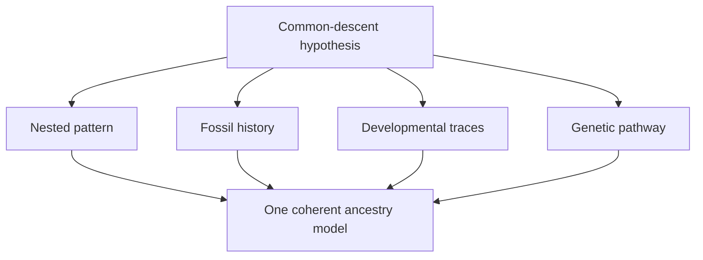

# Framework: nested hierarchy and prediction

## What you should learn

Before evaluating a list of whale fossils, you need to know what common descent predicts. You should be able to explain nested hierarchy, distinguish a transitional form from a direct ancestor, and show why chronology, anatomy, development and genetics are complementary tests rather than interchangeable illustrations.

## 1. What remains to be demonstrated after mechanisms and time

Erika starts from the previous lessons: mutation supplies variation; natural selection, drift and gene flow alter populations; and geology provides an immense timescale. Those conclusions do **not** automatically establish that every living group shares ancestry. Common descent makes additional predictions that must be checked independently ([38:00](https://www.youtube.com/watch?v=fnY58Y8FJBQ&t=2280s)).

She organises the remaining case into four questions:

1. **Pattern:** Do organisms form consistent family trees?
2. **Traces:** Do anatomy and development retain evidence of earlier conditions?
3. **History:** Do defining traits emerge in the fossil record in a coherent order?
4. **Pathway:** Can genetic and developmental changes plausibly generate those traits?

Erika states the demanding version explicitly: if all tetrapods descend from lobe-finned fish, taxonomy, morphology, ontogeny, palaeontology and genetics must independently converge on that relationship ([39:20](https://www.youtube.com/watch?v=fnY58Y8FJBQ&t=2360s)). The whale lesson is the first major case study of this programme.

## 2. Nested hierarchy

Taxonomic groups are nested like increasingly specific addresses. An organism can be a eukaryote, animal, chordate, mammal, primate and hominid at the same time. Entering a narrower group does not erase membership in the broader one. Erika works down the hierarchy by traits: chordates share a notochord and other developmental features; mammals share hair, milk production, three middle-ear bones and a dentary-squamosal jaw joint; primates add another suite ([43:01](https://www.youtube.com/watch?v=fnY58Y8FJBQ&t=2581s)).

The inference uses **suites of characters**, not one eye-catching similarity. Pangolins have scales, but their complete anatomy and development place them with mammals rather than reptiles. A convergent or modified trait can be unusual while the larger character set retains the nested signal ([49:24](https://www.youtube.com/watch?v=fnY58Y8FJBQ&t=2964s)).

The language analogy returns here. French is simultaneously Gallo-Romance, Western Romance, Italo-Western and ultimately descended from Latin. Each narrower group inherits the history of the broader one ([50:24](https://www.youtube.com/watch?v=fnY58Y8FJBQ&t=3024s)). Biological classification is similar, with an added causal claim: inherited changes accumulated along branches of descent.

**Image note.** A useful visual warning about “a hierarchy” versus “the ancestry hierarchy.” Panel A groups living cetaceans by an ecological cluster analysis; panel B shows their phylogenetic relationships. Different questions can yield different legitimate groupings, but evolutionary classification specifically asks which branching pattern best fits inherited characters. Figure from Spitz *et al.* (2012), [source and full description](https://commons.wikimedia.org/wiki/File:Branching_diagrams_showing_the_ecological_and_evolutionary_relationships_among_cetaceans.png), [CC BY 2.5](https://creativecommons.org/licenses/by/2.5/). This modern-cetacean figure supplements Erika's explanation; it was not presented as the fossil sequence in the livestream.

### Common confusion: anything can be sorted into boxes

Vehicles can be classified into water, air and land types, then by number of wheels. That hierarchy was imposed by a designer choosing reusable features; there is no inherited chain of vehicle reproduction. Living organisms and languages are different because successive versions are connected through time and carry both functional changes and inherited historical residue ([51:14](https://www.youtube.com/watch?v=fnY58Y8FJBQ&t=3074s)).

## 3. Genetic similarity as a record of relatedness

Within known pedigrees, closer relatives share more of their genomes on average because they inherited DNA from more recent common ancestors. Erika uses Will and a hypothetical brother: among many unrelated people, the brother should share the greatest genomic fraction because both inherited from the same parents; recombination and new mutations explain the differences ([59:24](https://www.youtube.com/watch?v=fnY58Y8FJBQ&t=3564s)).

Will asks whether the simplified rule means that 98% similarity indicates a closer relationship than 97%. Erika says yes as a broad whole-genome principle, while warning that biology has qualifications and that comparing selected regions is not the same as comparing complete genomes. She knows no animal case in which a full-genome comparison makes an ordinary sibling less similar than a random stranger; organisms with horizontal gene transfer would require special treatment ([1:00:34](https://www.youtube.com/watch?v=fnY58Y8FJBQ&t=3634s)).

The prediction scales outward. Dog breeds are more similar to one another than to wolves; dogs and wolves are more similar to each other than either is to coyotes; those canids are more similar to each other than to foxes; carnivorans are more similar to one another than to humans. The key question is whether the relationship suddenly stops at a creation boundary or continues as one nested distribution ([1:04:45](https://www.youtube.com/watch?v=fnY58Y8FJBQ&t=3885s)).

## 4. Functional and non-functional sequence

Strict common design can explain some functional similarity: similar bodies may need similar working genes. Erika therefore proposes a stronger comparison. The same family tree should appear in functional regions **and** in inherited sequence differences that do not perform the shared function ([1:07:29](https://www.youtube.com/watch?v=fnY58Y8FJBQ&t=4049s)).

Her manuscript analogy is precise. Two thrillers may independently share plot elements, just as two organisms may share useful design features. If they also contain the same unusual typographical errors at the same positions, copying or revision from a common source becomes a better explanation. Shared non-functional sequence changes are analogous to inherited typos: their nested placement records history rather than a common task ([1:24:39](https://www.youtube.com/watch?v=fnY58Y8FJBQ&t=5079s)).

This does not require claiming that a fixed percentage of every genome is forever functionless. The test concerns regions or mutations for which no relevant shared function explains their precise distribution. Erika notes that estimates of total functionality can change while the logic of inherited, nested sequence markers remains.

## 5. What “transitional fossil” means

A transitional species links proposed ancestral and descendant groups **morphologically and chronologically**. It should occur in a relevant interval and carry an expected mosaic of older and newer traits ([1:09:48](https://www.youtube.com/watch?v=fnY58Y8FJBQ&t=4188s)). Erika's invented *Sillytherium–Tridactyltherium–Goobertherium* sequence illustrates the logic: the middle fossil occurs between older and younger forms, has an intermediate number of digits, begins to show the later skull condition, and retains a distinctive tail shared across the group.

Additional evidence could strengthen the relationship without turning the series into a literal parent-child chain. If the later form temporarily develops extra digits in the womb, if the earlier form has rudimentary roots of the later tusks, or if several intermediate species show different combinations, development and morphology would reinforce the temporal pattern ([1:12:54](https://www.youtube.com/watch?v=fnY58Y8FJBQ&t=4374s)).

### Transitional does not mean “the discovered direct ancestor”

Fossil species are usually treated as sampled relatives near an ancestral population. Direct ancestry is exceptionally difficult to prove without descendants' genomes. Also, an ancestral species need not go extinct when a branch splits: dogs descend from wolf populations while wolves remain alive. Therefore, overlapping fossil ranges do not by themselves erase a relationship; the first appearances and distribution of derived traits matter ([1:16:24](https://www.youtube.com/watch?v=fnY58Y8FJBQ&t=4584s)).

A row of modern dog breeds ordered by snout length is not a transitional series. All are contemporaneous variants with the same underlying canine structures; ordering them visually does not show that one breed produced the next. Historical pug skulls, by contrast, can document change through time because dated specimens from one lineage show a directional alteration ([1:17:42](https://www.youtube.com/watch?v=fnY58Y8FJBQ&t=4662s)).

## 6. Competing hypotheses

Erika distinguishes common descent from **strict common design**. The word “strict” matters because a theistic evolutionist can regard common descent itself as designed. Strict common design says that some branches only appear related and do not meet at a biological ancestor ([1:20:30](https://www.youtube.com/watch?v=fnY58Y8FJBQ&t=4830s)).

Both hypotheses can accommodate some physical similarity. To distinguish them, ask whether one continuous method—whole suites of anatomy and genome sequence—works within accepted created groups and then continues across the proposed boundary without a detectable discontinuity ([1:21:09](https://www.youtube.com/watch?v=fnY58Y8FJBQ&t=4869s)). A strict design model needs a positive rule identifying where ancestry stops and explaining why functional and non-functional evidence continues to nest beyond it.

## 7. Predictions before inspecting the whale sequence

If whales arose within terrestrial artiodactyls, Erika's framework predicts:

- all whales will remain mammals and will nest genetically within even-toed hoofed mammals;
- early cetaceans will carry uniquely cetacean traits while retaining terrestrial and artiodactyl features;
- more terrestrial forms will occur earlier, with increasingly marine specialisations appearing through the Eocene;
- living embryos and genomes will retain traces of altered ancestral structures;
- anatomy, stable isotopes and geography will agree about the shift from land and freshwater to the sea.

If those observations appear in no order, if the supposed cetacean traits do not unite the fossils, or if genetic relationships contradict the anatomical series, the proposed history would be weakened. That is why the fossils are a test rather than merely an attractive parade.

## Active recall

1. Why is a pangolin's scale covering insufficient to classify it as a reptile?
2. What extra information does a non-functional shared sequence change provide?
3. Why may a transitional fossil overlap in time with a more derived fossil?
4. What is wrong with arranging living dog breeds into an “evolutionary” row?
5. State one prediction that strict common design makes differently from common descent.
