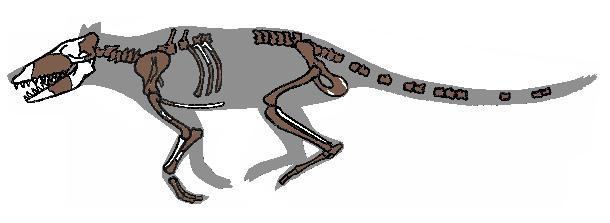

# Whale fossils and anatomy

## What you should learn

You should be able to follow the major anatomical changes from modern whales back toward terrestrial artiodactyl relatives, identify the evidence that makes an early fossil a cetacean, and explain why the case rests on a combination of traits rather than one “magic bone.”

## 1. What makes a living whale unusual?

Most mammals retain a recognisable four-limbed terrestrial body plan, differentiated teeth and forward nostrils. Modern cetaceans are extensively modified: a streamlined fusiform body, no external hind limbs, a stiff forelimb functioning as a flipper, nostrils on top of the skull, a horizontal tail fluke, and either similar-looking teeth or baleen ([1:39:09](https://www.youtube.com/watch?v=fnY58Y8FJBQ&t=5949s)).

The most diagnostic skeletal feature Erika emphasises is the **involucrum**: a thick, dense medial wall of the tympanic bulla in the ear region. It helps acoustically isolate the ear for underwater hearing and, among living groups, is unique to cetaceans ([1:41:10](https://www.youtube.com/watch?v=fnY58Y8FJBQ&t=6070s)). Seals, otters, manatees and dugongs are aquatic mammals but do not possess this cetacean ear structure.

Tail flukes rarely fossilise, but their presence can be inferred. Fluked and paddle-tailed living mammals support their tails with differently proportioned caudal vertebrae. Fossil vertebrae can therefore be compared with known manatee, dugong and whale patterns ([1:43:24](https://www.youtube.com/watch?v=fnY58Y8FJBQ&t=6204s)). This illustrates a recurring method: soft anatomy is inferred only where it leaves a testable skeletal correlate.

Genetically, cetaceans nest within **Artiodactyla**, the even-toed hoofed mammals, with hippopotamuses as their closest living relatives. This was initially surprising because living hippos are themselves specialised. If the genomic relationship is historical, early cetaceans should retain artiodactyl characters even while acquiring the diagnostic cetacean ear ([1:47:29](https://www.youtube.com/watch?v=fnY58Y8FJBQ&t=6449s)).

## 2. Reading the sequence in the correct direction

Erika moves from familiar modern whales backwards through successively older groups. This teaching order is the reverse of the evolutionary direction. The archaeocetes span roughly ten million years of the Eocene and are treated as close relatives that document character combinations, not as a claim that every named genus is the literal parent of the next ([1:49:50](https://www.youtube.com/watch?v=fnY58Y8FJBQ&t=6590s)).

| Group | Locomotion and limbs | Nose and tail | Teeth | Key relationship signal |
| --- | --- | --- | --- | --- |
| Neocetes | fully aquatic; no external hind limbs; stiff elbow | dorsal blowhole; fluke | homodont teeth or baleen | modern cetacean ear |
| Basilosaurids | fully aquatic; tiny complete hind limbs; mobile elbow | intermediate nostrils; fluke | slight heterodonty | involucrum plus artiodactyl ankle |
| Protocetids | mostly aquatic; large hind limbs of varying function | forward/intermediate nostrils; paddle or fluke varies | heterodont | whale ear, double-pulley ankle, sometimes hooves |
| Remingtonocetids | semi-aquatic; some better on land than others | forward nostrils; paddle tail | heterodont | whale ear plus river-edge specialisations |
| Ambulocetids | amphibious; powerful weight-bearing limbs | forward nostrils; paddle tail | heterodont | whale ear and artiodactyl foot |
| Pakicetids | mostly terrestrial; competent walking limbs | forward nostrils; unspecialised tail | heterodont | early whale ear plus artiodactyl ankle and hooves |
| Raoellids such as *Indohyus* | terrestrial/wading | forward nostrils; unspecialised tail | heterodont | cetacean-like ear and heavy wading bones |

The table is a revision scaffold. Individual species vary, and overlapping group ranges are expected in a branching history.

## 3. Neocetes: recognisably modern whales

Neocetes include living toothed whales and baleen whales plus extinct members of those branches. Fossils from 18 and 11 million years ago already show fully aquatic bodies, no external hind limbs, dorsal nostrils, an involucrum and flukes ([1:51:19](https://www.youtube.com/watch?v=fnY58Y8FJBQ&t=6679s)).

Within early mysticetes, the fossil jaws record the shift from teeth to baleen. Erika describes an older form with teeth, an intermediate form with teeth and evidence for limited baleen attachment, a later form with reduced tooth roots and stronger baleen evidence, and living mysticetes with functional baleen but no erupted teeth ([1:54:31](https://www.youtube.com/watch?v=fnY58Y8FJBQ&t=6871s)). Baleen itself preserves poorly, but teeth leave sockets and baleen attachment leaves different vascular and bony traces.

Modern baleen-whale embryos begin tooth development, then normally reabsorb the structures before birth; the relevant tooth genes remain as disabled pseudogenes. Rare individuals preserve unerupted tooth structures ([1:56:14](https://www.youtube.com/watch?v=fnY58Y8FJBQ&t=6974s)). The fossil progression, embryology and disabled genes are three views of the same transition.

## 4. Basilosaurids: fully marine whales with hind legs

Basilosaurids, including *Basilosaurus* and *Dorudon*, lived roughly 43–34 million years ago. They were fully aquatic and fluked, had the involucrum, and could not walk on land. Yet their nostrils were not as far back as a modern blowhole, their teeth retained some differentiation, their elbows remained somewhat mobile, and small external hind limbs were present ([1:58:47](https://www.youtube.com/watch?v=fnY58Y8FJBQ&t=7127s)).

The hind limb is not just a vague protrusion. It contains a pelvis, femur, tibia, fibula, ankle bones and digits—the same serial components found in terrestrial mammal legs. The pelvis no longer formed a weight-bearing joint with the vertebral column, so these limbs were not for walking ([2:03:57](https://www.youtube.com/watch?v=fnY58Y8FJBQ&t=7437s)). Some living whales retain much more reduced pelvic bones, now serving as anchors for reproductive musculature. A changed function does not erase the historical correspondence.

Most strikingly, the basilosaurid ankle includes the **double-pulley astragalus**, a structure characteristic of artiodactyls. The involucrum identifies the animal as a cetacean; the astragalus places its retained hind limb within the artiodactyl pattern ([2:05:51](https://www.youtube.com/watch?v=fnY58Y8FJBQ&t=7551s)). These two constraints arise from separate anatomical systems.

## 5. Protocetids: marine commitment in progress

Protocetids lived roughly 47–35 million years ago. They were generally smaller and more amphibious than basilosaurids, with large hind limbs, mobile elbows, forward or intermediate nostrils, differentiated teeth and the cetacean involucrum. Some likely had paddled tails; more marine members may have supported flukes ([2:12:48](https://www.youtube.com/watch?v=fnY58Y8FJBQ&t=7968s)).

Their feet repeat the artiodactyl signal. *Rodhocetus* and *Artiocetus* preserve double-pulley astragali comparable with pronghorn and other even-toed ungulates ([2:14:44](https://www.youtube.com/watch?v=fnY58Y8FJBQ&t=8084s)). In *Maiacetus* and *Rodhocetus*, the terminal toe bones have the grooves and broad shape associated with small hooves rather than claws or flat nails ([2:15:56](https://www.youtube.com/watch?v=fnY58Y8FJBQ&t=8156s)). An animal can therefore have a whale ear, a semi-aquatic body and hoof-bearing artiodactyl feet simultaneously—the mosaic predicted during a transition.

One exceptionally preserved *Maiacetus* contains a foetus oriented head-first, like terrestrial mammals rather than tail-first as in living whales. Its pelvis still articulated with the spine and could transmit weight, consistent with coming ashore to give birth ([2:19:35](https://www.youtube.com/watch?v=fnY58Y8FJBQ&t=8375s)). A later protocetid such as *Georgiacetus* had a detached pelvis and could not bear comparable weight. The sequence records loss of terrestrial competence within the group ([2:22:46](https://www.youtube.com/watch?v=fnY58Y8FJBQ&t=8566s)).

## 6. Remingtonocetids: near-shore specialists

Remingtonocetids are older and geographically more restricted than the widely dispersed marine whales, occurring primarily around Indo-Pakistan and nearby regions. They had forward nostrils, differentiated teeth, large limbs and a cetacean ear, with species varying in their ability to move on land ([2:25:43](https://www.youtube.com/watch?v=fnY58Y8FJBQ&t=8743s)).

Their small eyes and large facial nerve openings suggest substantial whiskers and a lifestyle in turbid rivers or swamps, analogous in sensory role—not ancestry—to modern river dolphins. Modern newborn cetaceans retain a few hairs near the same region. Erika connects later hair loss with fully marine streamlining and the expansion of insulating blubber from ordinary mammalian subcutaneous fat ([2:27:03](https://www.youtube.com/watch?v=fnY58Y8FJBQ&t=8823s)).

## 7. *Ambulocetus*: a whale that could walk

*Photograph of* Ambulocetus *skeletal material laid out with palaeontologist Hans Thewissen. This is specimen material rather than a painted body reconstruction, although its arrangement in the photograph is not a life pose. Photograph by Akrasia25, [source file](https://commons.wikimedia.org/wiki/File:Ambulocetus_Skeleton_with_Hans_Thewissen.jpg), [CC BY-SA 4.0](https://creativecommons.org/licenses/by-sa/4.0/).*

*Ambulocetus* is known from a comparatively complete skeleton and occurs earlier than the groups above in Indo-Pakistan. It was amphibious, with powerful weight-bearing limbs, a mobile elbow, forward nostrils, differentiated teeth and a paddle-like tail. It also possessed the involucrum and other cetacean ear features ([2:29:20](https://www.youtube.com/watch?v=fnY58Y8FJBQ&t=8960s)).

Its double-pulley astragalus and hoof-tipped toes place it with artiodactyls, while its mandibular opening, ear density and semicircular canals align it with cetaceans adapted to spending substantial time in water ([2:30:22](https://www.youtube.com/watch?v=fnY58Y8FJBQ&t=9022s)). The combination—not a reconstruction of its outer appearance—is why it matters.

## 8. *Pakicetus*: terrestrial body, diagnostic whale ear

*Reconstruction diagram by Conty, after Gingerich and colleagues (1983) and Thewissen and colleagues (2001). Brown shapes mark recovered skeletal material; the grey body silhouette and the placement of missing portions are interpretive aids, not fossilised soft tissue. [Source file and references](https://commons.wikimedia.org/wiki/File:Pakicetus_fossil.png), [CC BY 3.0](https://creativecommons.org/licenses/by/3.0/).*

Pakicetids were small, mostly terrestrial animals with walking limbs, forward nostrils, an unspecialised tail and differentiated teeth. They could rotate the forearm more than later whales. Nevertheless, *Pakicetus* has the involucrum, cetacean-like semicircular canals and a cetacean-shaped incus in the middle ear ([2:31:45](https://www.youtube.com/watch?v=fnY58Y8FJBQ&t=9105s)). It also carries the artiodactyl double-pulley ankle and hoofed terminal digits.

This discovery changed an earlier hypothesis. Mesonychids had once been favoured as whale relatives, partly because of their teeth and hoof-like feet. Once pakicetid ankles and ears were known, the artiodactyl relationship better explained the combined characters; genetic data also placed living whales within artiodactyls. Erika uses this correction as a strength of the method: a family tree is revised when a newly recovered character discriminates between alternatives ([2:33:12](https://www.youtube.com/watch?v=fnY58Y8FJBQ&t=9192s)).

## 9. *Indohyus* and raoellids: a model for the near-relative

Raoellids such as *Indohyus* are not presented as direct whale ancestors. Their known fossils are slightly too young for that role. They are close relatives resembling the kind of small artiodactyl population from which pakicetids may have arisen ([2:36:59](https://www.youtube.com/watch?v=fnY58Y8FJBQ&t=9419s)).

*Indohyus* combines a terrestrial body, artiodactyl foot and involucrum with unusually thick cortical limb bone. Dense limbs function as ballast in living wading mammals, including hippos, helping an animal walk along the bottom rather than float. The comparison is ecological evidence rather than an argument that *Indohyus* is a hippo or a whale ([2:38:51](https://www.youtube.com/watch?v=fnY58Y8FJBQ&t=9531s)). It shows how an initially terrestrial lineage could spend increasing time in shallow water before the later shift to active swimming.

## The anatomical through-line

Moving forward through time, the record shows:

- terrestrial weight-bearing limbs becoming large amphibious paddles, then reduced non-weight-bearing legs, then internal pelvic remnants;
- forward nostrils shifting toward an intermediate position and finally a dorsal blowhole;
- an unspecialised tail becoming a paddle and then a fluke;
- differentiated mammalian teeth becoming more similar, or being supplemented and replaced by baleen;
- the diagnostic cetacean ear appearing in the earliest named whales and becoming increasingly specialised;
- artiodactyl ankles and small hooves persisting while still anatomically available to observe.

No one specimen contains every intermediate condition. The force of the series is the **ordered distribution of multiple independent characters**.

## Active recall

1. Why are the involucrum and astragalus more informative together than either alone?
2. How can researchers infer a fluke when soft tissue is absent?
3. What does the attached pelvis of *Maiacetus* imply that the detached pelvis of *Georgiacetus* does not?
4. Why did *Pakicetus* alter the old mesonychid hypothesis?
5. Why is *Indohyus* useful even though Erika says it is too young to be the direct ancestor?
