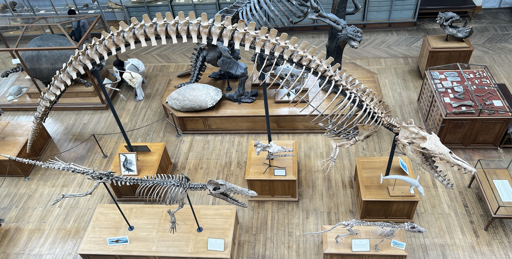

# Testing the whale history with independent evidence

## What you should learn

The fossil skeletons are only one part of Erika's case. You should be able to explain how geological order, geography, living-whale development, altered genes, bone density and stable isotopes test the same land-to-sea history from different directions. You should also be able to distinguish an observation from the interpretation placed on it.

## 1. Turn the history into predictions

Erika sets a deliberately demanding standard. Modern cetaceans differ so radically from terrestrial mammals that, if they descended from land mammals, the history ought to be recoverable in considerable detail—not merely asserted from a vague resemblance ([1:47:29](https://www.youtube.com/watch?v=fnY58Y8FJBQ&t=6449s)). The genetic result is unusually specific: living whales nest within even-toed hoofed mammals, with hippopotamuses as their closest living relatives. That creates predictions before the fossil series is considered:

- early cetaceans should retain artiodactyl characters as well as whale characters;
- the oldest forms should be more capable on land than later fully marine forms;
- freshwater and near-shore stages should precede worldwide oceanic dispersal;
- living development and genomes should preserve traces of structures lost during the transition;
- physiological adaptations should correspond to increasing commitment to life underwater.

Erika dates the main archaeocete transition to roughly ten million years during the Eocene, a warmer interval with higher sea levels than today ([1:49:50](https://www.youtube.com/watch?v=fnY58Y8FJBQ&t=6590s)). The test is not whether every year is represented by a fossil. It is whether the observations that do survive occur in the combinations and order those predictions require.

## 2. Geological order and geography

The groups overlap in time, which is expected in a branching history. A new branch does not require the population from which it arose—or close relatives of that population—to vanish immediately. Erika makes the point with dogs and wolves before applying it to archaeocetes: moving back through the record, the first appearance of each more terrestrial whale group is older even though later survivors overlap with more aquatic groups ([2:25:50](https://www.youtube.com/watch?v=fnY58Y8FJBQ&t=8750s)).

Geography changes with locomotor ability. The earlier, more land-biased forms are concentrated around Indo-Pakistan. Remingtonocetids are largely restricted to that region, with finds in Egypt, and occur in swamp or marsh settings ([2:26:13](https://www.youtube.com/watch?v=fnY58Y8FJBQ&t=8773s)). Early protocetids remain regionally restricted, whereas the protocetids most capable in water occur worldwide ([2:13:05](https://www.youtube.com/watch?v=fnY58Y8FJBQ&t=7985s)). Fully marine basilosaurids and neocetes have a correspondingly broad distribution.

*Museum display photographed by Macrophyseter: mounted skeletons of* Pakicetus *(lower right),* Ambulocetus *(lower left) and* Cynthiacetus *(upper) at the Muséum national d'Histoire naturelle. The display is a visual comparison, not a claim that the three species form a literal parent-to-child chain. [Source file](https://commons.wikimedia.org/wiki/File:MNHN_whale_evolution.png), [CC BY 4.0](https://creativecommons.org/licenses/by/4.0/).*

Read the pattern in two dimensions:

| Moving forward through time | Moving outward in geography |
| --- | --- |
| weight-bearing legs become swimming limbs, then tiny non-weight-bearing legs and internal pelvic remnants | Indo-Pakistan and freshwater margins broaden to coastal dispersal and then worldwide seas |
| forward nostrils move toward an intermediate position and eventually a dorsal blowhole | animals increasingly able to cross open water are found farther from the proposed region of origin |
| dense ballast bones suit bottom-wading; later skeletons suit active buoyancy control | freshwater isotope values give way to mixed and then marine values |

This joint temporal-geographic pattern is more informative than arranging animals by appearance alone.

## 3. Teeth, baleen and echolocation leave several kinds of trace

The baleen sequence shows why soft tissue can still be studied when it rarely fossilises. Erika describes an older mysticete with teeth only, forms in which teeth and baleen attachment co-occur, a later form with reduced tooth roots and greater emphasis on baleen, and modern mysticetes with baleen but no erupted teeth. Teeth leave sockets, while baleen attachment leaves a different vascular pattern on the jaw, allowing researchers to infer both in the same animal ([1:54:31](https://www.youtube.com/watch?v=fnY58Y8FJBQ&t=6871s)).

Living development supplies a second record. Modern baleen whales retain tooth-making genes, but Erika describes them as disabled pseudogenes. Tooth development begins before birth and normally stops; the structures are reabsorbed. In occasional specimens, unerupted, enamel-free teeth remain within the jaw crypt ([1:56:14](https://www.youtube.com/watch?v=fnY58Y8FJBQ&t=6974s)). The fossil jaw series, disabled genes and embryonic teeth are not repetitions of one observation: they are palaeontological, genetic and developmental consequences of the same proposed loss.

For toothed whales, the soft fatty **melon** helps focus sound during echolocation. Its presence alters the front of the skull, so the increasing concavity that accommodated it can be followed through fossil odontocetes such as *Squalodon*, *Waipatia* and *Livyatan* ([1:57:20](https://www.youtube.com/watch?v=fnY58Y8FJBQ&t=7040s)). Again, an inference about a soft organ is tied to a measurable skeletal correlate.

## 4. Hind-limb development identifies a mechanism of loss

Modern cetacean embryos initially form hind-limb buds. Erika shows an early pantropical spotted dolphin embryo with a visible bud and a later stage in which it has been reabsorbed ([2:07:44](https://www.youtube.com/watch?v=fnY58Y8FJBQ&t=7664s)). Very rarely, development continues far enough for a dolphin to be born with external hind flippers containing recognisable digits; she uses the Japanese dolphin Haruka as an example ([2:08:11](https://www.youtube.com/watch?v=fnY58Y8FJBQ&t=7691s)).

The crucial point is not simply that a bud appears. Researchers can observe where its developmental programme stops. Erika summarises the paper *Developmental basis for hind-limb loss in dolphins and origin of the cetacean bodyplan*:

1. the bud forms an apical ectodermal ridge and initially expresses **FGF8**, which supports limb growth;
2. the ridge and FGF8 expression are not maintained, so growth terminates;
3. **Sonic hedgehog (SHH)** signalling from the zone of polarising activity is absent in the dolphin hind-limb bud;
4. this absence is associated with failure to establish the later patterning needed for the distal limb.

Erika connects reduced SHH expression with the fossil reduction of distal limb elements around 41 million years ago and complete loss of its expression with further reduction near the origin of modern cetacean suborders around 34 million years ago ([2:09:00](https://www.youtube.com/watch?v=fnY58Y8FJBQ&t=7740s)). Her emphasis is that the body plan changes by altering when and where an inherited developmental system operates, rather than by producing a wholly unrelated body plan in one step. The [PNAS paper Erika displays](https://www.pnas.org/doi/10.1073/pnas.0602920103) provides the experimental detail.

## 5. Smell, hair and insulation retain the same history

The transition affected more than limbs. Erika compares the many active chemoreception genes in a cow with far fewer active copies in cetaceans—fewer than one hundred in the whale examples on her slide and as few as thirteen in a dolphin. She stresses that many copies remain in the genome but are switched off or pseudogenised ([2:21:56](https://www.youtube.com/watch?v=fnY58Y8FJBQ&t=8516s)). *Maiacetus* cannot supply ancient DNA, but its reduced nasal turbinates independently suggest that smell had already become less important ([2:22:23](https://www.youtube.com/watch?v=fnY58Y8FJBQ&t=8543s)). Fossil anatomy and modern sequence loss therefore point in the same direction without being the same measurement.

Newborn whales still carry a few hairs around the snout, in the region where remingtonocetids are inferred from nerve pits to have had large sensory whiskers ([2:27:52](https://www.youtube.com/watch?v=fnY58Y8FJBQ&t=8872s)). Erika links near-complete hair loss to reduced drag in a fully marine animal. The hair-making genes have not simply vanished without trace; disabled copies remain. At the same time, insulation shifted toward blubber. She describes blubber as an elaboration of the subcutaneous fat already present in mammals, not a brand-new tissue invented from nothing ([2:28:11](https://www.youtube.com/watch?v=fnY58Y8FJBQ&t=8891s)).

## 6. Diving physiology can be tested in living genomes

The ability to remain underwater creates challenges involving oxygen use, lung function, pressure and decompression. Erika summarises studies comparing genes associated with respiratory and cardiovascular function across mammals. In one analysis of 42 pulmonary-fibrosis-associated genes across 45 mammal species, she reports accelerated evolution in 21 cetacean versions and specific amino-acid substitutions in 14. A further comparison identified eight genes under positive selection among marine mammals and three whose evolutionary rates correlated with diving depth ([2:11:06](https://www.youtube.com/watch?v=fnY58Y8FJBQ&t=7866s)).

Do not memorise those counts as proof by themselves. Their revision value is the test design: genes already used in terrestrial mammal respiratory systems are compared across cetaceans with different diving demands. Both shared cetacean adaptations and convergent solutions in other marine mammals can then be identified. Erika explicitly notes that some diving adaptations use the same genes and others use different ones, which prevents “aquatic similarity” from being treated automatically as ancestry.

## 7. Bone density tests locomotion

Long bones contain heavy compact **cortical bone** around lighter **cancellous bone**. CT sections of *Indohyus* show extremely thick cortical walls and little cancellous interior. Erika interprets this as ballast for an animal that spent substantial time wading and walking along a river bottom ([2:39:00](https://www.youtube.com/watch?v=fnY58Y8FJBQ&t=9540s)). The inference is calibrated against living analogues: hippos also have thick-walled limb bones, while running animals such as deer and sheep have lighter construction ([2:39:49](https://www.youtube.com/watch?v=fnY58Y8FJBQ&t=9589s)).

*Pakicetus* shows still more cortical bone. Through later cetaceans, the balance shifts toward lighter and more internally porous bone as active swimmers regulate buoyancy instead of using heavy limbs to stand on a bottom ([2:41:01](https://www.youtube.com/watch?v=fnY58Y8FJBQ&t=9661s)). This is a functional sequence: dense bone is not labelled “primitive” merely because it is old; its mechanics suit a particular stage of aquatic use. The Nature paper [*Whales originated from aquatic artiodactyls in the Eocene epoch of India*](https://www.nature.com/articles/nature06343) integrates *Indohyus* ear, tooth, bone-density and isotope evidence.

## 8. Stable isotopes test where the animals lived

Food and water leave isotope ratios in mineralised tissue. Erika explains that oxygen-18 and carbon-13 values in fossil material can distinguish animals spending more time in freshwater from animals feeding and drinking in marine systems ([2:41:41](https://www.youtube.com/watch?v=fnY58Y8FJBQ&t=9701s)). Living marine cetaceans cluster with the marine comparison group, while sampled river dolphins fall in the freshwater category, providing a modern calibration ([2:42:21](https://www.youtube.com/watch?v=fnY58Y8FJBQ&t=9741s)).

The fossils then produce the predicted ecological order. Miocene neocetes and *Indocetus* plot with marine animals; *Pakicetus*, *Nalacetus* and the early *Ambulocetus* samples plot as freshwater; *Ambulocetus* spans the interval between the freshwater and marine groupings ([2:42:50](https://www.youtube.com/watch?v=fnY58Y8FJBQ&t=9770s)). Erika reads this as the chemical record of a shift from river-delta life to fully marine life, consistent with the changes inferred from limbs, ears and geographic spread.

## 9. Put the independent results together

At the close of the lecture, Erika summarises four converging supports: taxonomy places cetaceans within artiodactyls; anatomy and development retain the terrestrial-artiodactyl history; palaeontology orders the emergence of cetacean traits; and genetics identifies changes associated with hair loss, limb loss, diving, blubber and echolocation ([2:43:56](https://www.youtube.com/watch?v=fnY58Y8FJBQ&t=9836s)). Bone microstructure, stable isotopes and geography add ecological tests to that list.

A good revision answer should therefore avoid “there is a line of fossils, so whales evolved.” State the tested relationship instead:

> The artiodactyl-to-cetacean model predicts an ordered anatomical and ecological transition. Whale-specific ears and artiodactyl ankles occur together in early forms; terrestrial competence decreases through time; regional freshwater animals precede widespread marine ones; and development, pseudogenes, bone density and isotopes independently preserve the same direction of change.

## Active recall

1. Why does overlap between protocetids and basilosaurids not reverse their evolutionary order?
2. What two skeletal traces allow researchers to infer baleen and a melon even when the soft organ is absent?
3. At which two points does dolphin hind-limb development stop, according to Erika's account of FGF8 and SHH?
4. Why are disabled tooth, smell and hair genes different evidence from fossil teeth, turbinates and whisker pits?
5. Why does *Indohyus* bone density suggest wading rather than fast running?
6. How do the isotope results distinguish *Pakicetus* and early *Ambulocetus* from later marine whales?
