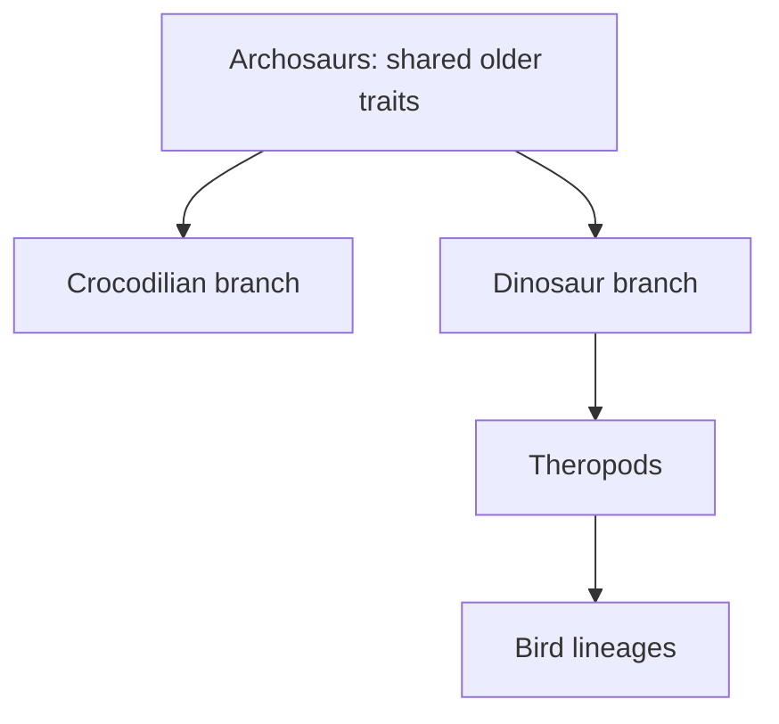

# Birds within dinosaurs: building the nested case

## Learning goals

After this note you should be able to:

- describe the suite of traits Erika uses to introduce living birds;
- explain why “birds are dinosaurs” is a claim about nested ancestry, not mere resemblance;
- follow the sequence from living birds through increasingly inclusive fossil groups; and
- distinguish a retained ancestral feature from a feature that defines modern birds alone.

## Start with living birds, but do not turn the list into a rigid definition

Erika begins with the striking diversity of living birds—filter-feeding flamingos, soaring raptors, hummingbirds, songbirds, waders, peacocks, flightless ostriches and penguins—before asking what they share ([1:19:35](https://www.youtube.com/watch?v=vhOyNiv6PTY&t=4775s)). The diversity matters: an ancestry-based group can contain radically different lifestyles.

She then builds a reference set of features found across living birds ([1:20:16](https://www.youtube.com/watch?v=vhOyNiv6PTY&t=4816s)):

| Feature | What Erika says it does or shows |
| --- | --- |
| Hollow bones | Part of the lightweight skeletal condition common among birds. |
| Three largely fused fingers | Combined with a semilunate carpal, the wrist can fold or “tuck” the wing. |
| Four-toed foot | Often three toes point forwards and one backwards, although exact arrangements vary. |
| Keeled sternum in strong flyers | Provides a large attachment surface for the flight muscles; it is not equally developed in every bird. |
| Rigid trunk and mobile shoulder | Stabilise the body while allowing a large wing stroke. |
| Backward-directed pubis | One component of the specialised bird pelvis. |
| S-shaped neck and furcula | Skeletal features that become important in comparisons with theropods. |
| Reduced tail ending in a pygostyle | Anchors tail feathers in living birds rather than forming a long bony tail. |
| Keratinous beak without adult teeth | A living-bird condition whose earlier history can be tested in fossils and embryos. |
| Feathers and bipedality | Widespread in birds, but, as the lesson later shows, not exclusive to crown birds. |

Erika adds non-skeletal biology. Birds usually incubate hard-shelled eggs in nests; they are endothermic, have a four-chambered heart and use a gizzard to process food ([1:21:48](https://www.youtube.com/watch?v=vhOyNiv6PTY&t=4908s)). Their respiratory system includes anterior and posterior air sacs that move air through the lungs in a directional cycle, rather than simply pulling the same air in and out as mammalian lungs do ([1:22:02](https://www.youtube.com/watch?v=vhOyNiv6PTY&t=4922s)). Stones swallowed into the gizzard can help grind food, performing part of the processing job that teeth perform in many other animals ([1:23:04](https://www.youtube.com/watch?v=vhOyNiv6PTY&t=4984s)).

The list is a starting comparison, not a rule that every bird must display every feature in the same form. Flightless birds, for example, remain birds. The question is how a large **suite** of characters is distributed across the tree.

## The prediction before the fossil tour

At [1:23:35](https://www.youtube.com/watch?v=vhOyNiv6PTY&t=5015s), Erika states what the dinosaur hypothesis should lead us to expect. Mechanisms and time are necessary, but the case should also include:

- a nested genetic and anatomical hierarchy;
- developmental traces of older character states;
- the ordered appearance of bird traits through geological time; and
- identifiable genetic pathways capable of modifying those traits.

This matters because the lesson is not an exercise in spotting a creature that “looks halfway.” A strong hypothesis predicts several connected patterns in advance.

## First nesting level: Archosauria

Genetic comparisons place birds and crocodilians together within Archosauria, closer to one another than either is to the comparison groups on Erika's tree ([1:28:20](https://www.youtube.com/watch?v=vhOyNiv6PTY&t=5300s)). The living anatomy is consistent with that placement: crocodilians and birds both have four-chambered hearts, gizzards and unidirectional airflow ([1:29:20](https://www.youtube.com/watch?v=vhOyNiv6PTY&t=5360s)).

Those three features do not make a crocodile a bird. They are older archosaur features inherited by both branches. This is the logic of nested characters: a trait may diagnose a broad ancestral grouping while newer traits distinguish branches within it.

## Walking backwards through bird groups

Erika organises the fossil evidence as nested groups, not a chain in which every named species is the parent of the next. She makes the same point using whales: an extinct group can branch away while sharing the defining features of the more inclusive group ([1:31:49](https://www.youtube.com/watch?v=vhOyNiv6PTY&t=5509s)).

### Neornithes: crown or modern birds

Living birds belong to Neornithes. Fossils around 52 million years old from Fossil Butte include recognisable shorebirds, landfowl and roller-like birds with the expected modern-bird suite ([1:29:43](https://www.youtube.com/watch?v=vhOyNiv6PTY&t=5383s)). Erika identifies *Asteriornis*, around 67 million years old, as an early member close to the crown group and stresses that its skull and skeleton are uncontroversially bird-like ([1:30:33](https://www.youtube.com/watch?v=vhOyNiv6PTY&t=5433s)).

This establishes that modern-looking birds already existed before the end-Cretaceous extinction. It does **not** imply that all older avialans looked modern.

### Ornithurae: recognisable birds retaining teeth and gastralia

Moving to a broader, older grouping, Erika discusses *Ichthyornis* and *Hesperornis*. They retain hollow bones, a mobile shoulder, a fused pelvis, backward pubis, furcula, feathers and flight-related anatomy, but also have teeth and gastralia—small “belly ribs” also known in crocodilians and non-avian dinosaurs ([1:34:08](https://www.youtube.com/watch?v=vhOyNiv6PTY&t=5648s)).

The teeth are not randomly distributed. Erika shows reduction toward the front of the jaw in these early birds and compares them with a toothless modern gull ([1:34:58](https://www.youtube.com/watch?v=vhOyNiv6PTY&t=5698s)). Small vascular marks on the premaxilla indicate that a keratinous beak covered part of the jaw even while teeth remained elsewhere ([1:35:22](https://www.youtube.com/watch?v=vhOyNiv6PTY&t=5722s)). This is a mosaic: beak plus teeth, not a fully modern beak appearing in one step.

Gastralia provide another nested clue. Erika points out that they occur in crocodilians, dinosaurs and some early toothed birds but are absent from the living birds she is discussing ([1:35:51](https://www.youtube.com/watch?v=vhOyNiv6PTY&t=5751s)). Their presence is therefore an inherited older condition, later lost along the crown-bird line.

### Pygostylia and early beaked side branches

At [1:46:09](https://www.youtube.com/watch?v=vhOyNiv6PTY&t=6369s), the lesson moves into Pygostylia, which includes living birds and extinct branches such as enantiornithines and confuciusornithids. These animals combine recognisably bird-like traits—feathers, hollow bones, a semilunate wrist, four-toed feet, a furcula and bipedality—with a longer pygostyle, gastralia, a less powerful shoulder or sternum in some members, and sometimes teeth.

The confuciusornithids are especially instructive. They were feathered and capable of flight, but their flatter sternum and less mobile shoulder imply weaker powered flight than that of many living birds ([1:47:54](https://www.youtube.com/watch?v=vhOyNiv6PTY&t=6474s)). Their toothless beak was not necessarily the direct precursor of the modern-bird beak: Erika presents it as a separately evolved beak with a different detailed construction ([1:50:12](https://www.youtube.com/watch?v=vhOyNiv6PTY&t=6612s)). A similar function or broad appearance can therefore arise on a side branch while the total character set still reveals the branch's placement.

## Archaeopteryx as a character mosaic

*The original Berlin specimen of* Archaeopteryx lithographica, *displayed at the Museum für Naturkunde—not a cast. Photograph by H. Raab (Vesta), [source file](https://commons.wikimedia.org/wiki/File:Archaeopteryx_lithographica_%28Berlin_specimen%29.jpg), [CC BY-SA 3.0](https://creativecommons.org/licenses/by-sa/3.0/).*

Erika introduces *Archaeopteryx* after progressively widening the bird group. The first specimens were found in Jurassic limestone shortly after *On the Origin of Species*, and their anatomy was compared both with birds and with small dinosaurs such as *Compsognathus* ([1:54:05](https://www.youtube.com/watch?v=vhOyNiv6PTY&t=6845s)). She notes that numerous specimens exist, so its character set is not being inferred from one fragment ([1:55:31](https://www.youtube.com/watch?v=vhOyNiv6PTY&t=6931s)).

Its bird-like features include hollow bones, feathers, a furcula, bipedality, an S-shaped neck, a semilunate wrist, a shoulder capable of a downstroke and asymmetrical flight feathers. Its retained older features include three separate grasping fingers, teeth, a long rigid bony tail, gastralia and a pelvis that is not fully in the modern condition ([1:56:00](https://www.youtube.com/watch?v=vhOyNiv6PTY&t=6960s)). Even the rear toe is less fully reversed than in the pigeon comparison Erika displays ([1:57:09](https://www.youtube.com/watch?v=vhOyNiv6PTY&t=7029s)).

This is why calling it “just a bird” or “just a dinosaur” misses the explanatory point. In a nested scheme, it can be both an avialan and a theropod. The mix is expected near a branching transition.

## Why birds remain theropods and dinosaurs

Erika's final classification challenge is practical: define a theropod in a way that includes animals such as *Tyrannosaurus* and *Velociraptor* but excludes birds, without choosing a single convenient feature and ignoring the remainder ([2:46:40](https://www.youtube.com/watch?v=vhOyNiv6PTY&t=10000s)). Birds have the theropod suite she has traced—hollow bones, a furcula, an S-shaped neck, bipedal hind limbs and four-toed feet—while progressively modified versions of the hand, pelvis, tail and feathers occur in closer fossil branches.

Birds also meet the broader dinosaur criteria Erika gives: an open acetabulum, limbs held beneath the body and at least three sacral vertebrae ([2:47:37](https://www.youtube.com/watch?v=vhOyNiv6PTY&t=10057s)). “Birds are dinosaurs” is therefore analogous to “whales are mammals”: later specialisation does not erase membership in inherited broader groups ([2:48:49](https://www.youtube.com/watch?v=vhOyNiv6PTY&t=10129s)).

## Common misconceptions

- **“Feathers define birds.”** Feathers occur in non-avian theropods, so they cannot by themselves draw the bird boundary.
- **“A fossil must be a direct ancestor to be transitional.”** Side branches can preserve informative combinations of ancestral and derived traits.
- **“Primitive means inferior.”** In the lesson it means retaining more of the earlier character state relative to a comparison group ([1:40:53](https://www.youtube.com/watch?v=vhOyNiv6PTY&t=6053s)).
- **“If one early bird had a beak, that beak must lead directly to modern beaks.”** Confuciusornithid beaks illustrate convergent or parallel modification on an extinct branch.

## Recap questions

1. Why do crocodilian gizzards and airflow support a broad archosaur grouping rather than make crocodiles birds?
2. Which features make *Ichthyornis* a mosaic rather than a modern gull with teeth added?
3. What is the difference between Neornithes, a broader avialan group, and Theropoda?
4. Explain “birds are dinosaurs” without using the word “similar.”
