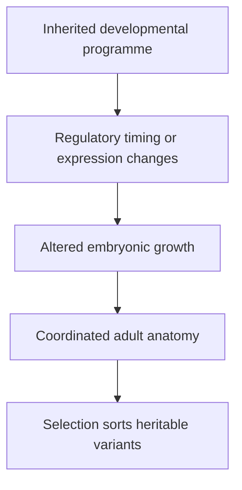
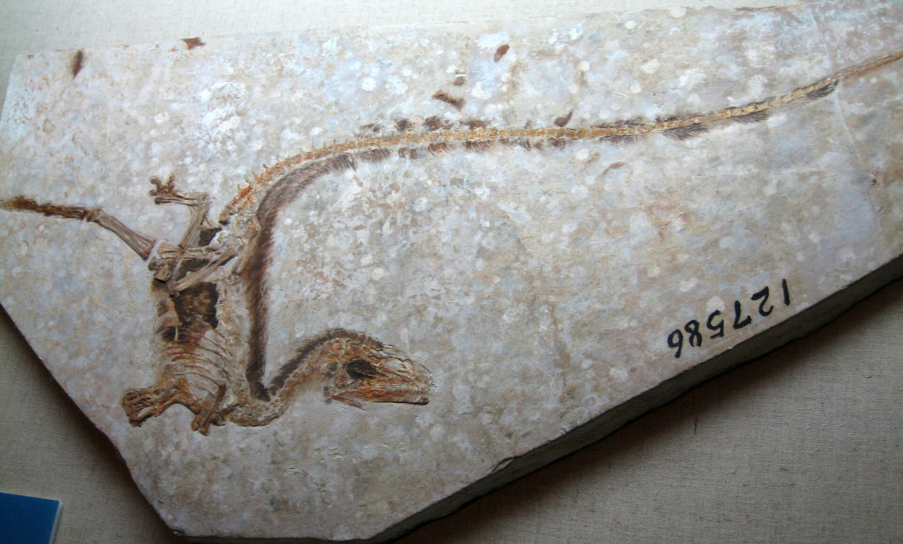

# Predictions and evidence: development, feathers and ordered traits

## Learning goals

Use this note to revise how Erika joins several independent lines of evidence. You should be able to explain what each observation contributes, what it does **not** establish alone, and why their agreement matters.

## Prediction 1: ancestral capacities should remain in development

The lesson does not claim that an embryo literally repeats adult evolutionary ancestors. Instead, developmental experiments test whether living birds still use inherited pathways capable of producing older anatomical states.

### Teeth can be experimentally reactivated

No living bird normally has adult teeth, but Erika explains that chicken embryos retain developmental capacity for tooth development. In the *talpid2* mutant, the developing structures resemble the first-generation teeth of alligators, the closest living comparison used in the lesson ([1:36:33](https://www.youtube.com/watch?v=vhOyNiv6PTY&t=5793s)). She reads the study's conclusion that these are recognisably archosaurian or crocodilian first-generation teeth in an avian embryo ([1:37:01](https://www.youtube.com/watch?v=vhOyNiv6PTY&t=5821s)). The primary source is Harris *et al.* (2006), [“The Development of Archosaurian First-Generation Teeth in a Chicken Mutant”](https://doi.org/10.1016/j.cub.2005.12.047). The point is not that a chicken is “turning into” an alligator. It is that related archosaurs retain homologous developmental machinery, with the bird programme normally suppressing or redirecting it.

### Small regulatory changes can alter beak and palate development

Erika then discusses experiments modifying FGF and WNT signalling early in chicken facial development. The treated embryos form a more dinosaur-like snout and palate rather than the normal bird beak ([1:37:17](https://www.youtube.com/watch?v=vhOyNiv6PTY&t=5837s)). She identifies Bhullar *et al.* (2015), [“A molecular mechanism for the origin of a key evolutionary innovation, the bird beak and palate”](https://doi.org/10.1111/evo.12684), and emphasises the authors' conclusion: changing a relatively small early region of gene expression produced coordinated changes in two distinct skeletal structures ([1:38:00](https://www.youtube.com/watch?v=vhOyNiv6PTY&t=5880s)).

A principal-component comparison of skull shape placed the experimental skulls in the overlap between sampled non-avian dinosaur and modern-bird morphologies ([1:38:54](https://www.youtube.com/watch?v=vhOyNiv6PTY&t=5934s)). This is stronger than saying the skull “looks reptilian”: landmarks were measured and the shapes compared statistically.

### The pelvis passes through earlier configurations

At [2:20:28](https://www.youtube.com/watch?v=vhOyNiv6PTY&t=8428s), Erika turns to the pelvis. Across the fossil comparison, the ilium lengthens, the pubis changes from a forward orientation in early dinosaurs through more vertical and backward-directed states, and fusion increasingly stabilises the pelvis and sacrum ([2:20:31](https://www.youtube.com/watch?v=vhOyNiv6PTY&t=8431s)). She identifies Griffin *et al.* (2022), [“The developing bird pelvis passes through ancestral dinosaurian conditions”](https://doi.org/10.1038/s41586-022-04982-w) ([2:20:58](https://www.youtube.com/watch?v=vhOyNiv6PTY&t=8458s)). Japanese quail embryos pass through comparable orientations before reaching the hatchling pelvis ([2:22:22](https://www.youtube.com/watch?v=vhOyNiv6PTY&t=8542s)).

Erika's stated interpretation follows the study: the quail chicks undergo dinosaurian phases comparable to preceding groups, suggesting that evolution of the avian pelvis involved adding later developmental steps ([2:22:52](https://www.youtube.com/watch?v=vhOyNiv6PTY&t=8572s)). That provides a plausible developmental route for a gradual fossil sequence; it is not a claim that every embryonic phase is a perfect miniature of a named dinosaur, nor the obsolete claim that an embryo literally “recapitulates” a sequence of adult ancestors.

## Prediction 2: feather evidence should survive more than visual inspection

*A* Sinosauropteryx *fossil with filamentous integument visible around the body. Photograph by Sam / Olai Ose / Skjaervoy, [Wikimedia Commons](https://commons.wikimedia.org/wiki/File:Sinosauropteryxfossil.jpg), CC BY-SA 2.0.*

Erika shows filamentous coverings in theropods including *Sinosauropteryx*, *Dilong* and *Sciurumimus*, then highlights the much larger *Yutyrannus*, whose simple down-like covering is discussed as insulation in a cold environment ([2:29:29](https://www.youtube.com/watch?v=vhOyNiv6PTY&t=8969s)). These are useful because they separate **feather origin** from **flight origin**: a large, ground-dwelling animal can benefit from insulation without flying.

Will asks how the material is distinguished from hair. Erika answers that feathers and hair differ in keratin chemistry and microstructure; feather filaments have branching structures rather than the structure of a single mammalian hair, and preserved melanosomes can sometimes be analysed ([2:31:31](https://www.youtube.com/watch?v=vhOyNiv6PTY&t=9091s)).

She later addresses the alternative that ambiguous “fuzz” might be decayed collagen. Researchers took that objection seriously and tested it. Pigment-bearing melanosomes and feather-associated chemistry support a feather interpretation where the external form alone was ambiguous, because collagen does not contain feather pigment structures ([2:42:23](https://www.youtube.com/watch?v=vhOyNiv6PTY&t=9743s)). The method is therefore:

1. identify the visible filament or vane;
2. compare its microscopic branching pattern;
3. test preserved chemistry and pigment bodies when possible; and
4. compare the result with unambiguous feathers and known decayed tissues.

## Prediction 3: the developmental path from scales to feathers should be tractable

Erika explains that scales, hair and feathers begin from placodes—thickened patches of embryonic skin that respond to signalling cascades ([2:33:45](https://www.youtube.com/watch?v=vhOyNiv6PTY&t=9225s)). Their mature differences are real, but the shared starting system makes transformation by regulatory change biologically testable.

In a chicken experiment, stage-specific transient activation of the Sonic Hedgehog pathway redirected normally scale-forming skin on the feet toward feather development ([2:34:40](https://www.youtube.com/watch?v=vhOyNiv6PTY&t=9280s)). Erika stresses that the result did not require a large genome-wide change: a transient change in one signalling pathway initiated a developmental cascade that produced feathers instead of scales ([2:35:01](https://www.youtube.com/watch?v=vhOyNiv6PTY&t=9301s)). The source is Cooper and Milinkovitch (2023), [“Transient agonism of the sonic hedgehog pathway triggers a permanent transition of skin appendage fate in the chicken embryo”](https://doi.org/10.1126/sciadv.adg9619).

She then describes Wu *et al.* (2018), [“Multiple Regulatory Modules Are Required for Scale-to-Feather Conversion”](https://doi.org/10.1093/molbev/msx295) ([2:36:27](https://www.youtube.com/watch?v=vhOyNiv6PTY&t=9387s)). Erika paraphrases this as putting feather genes into alligators. More precisely, the study identified candidate feather-associated regulatory genes and tested their expression in scale-forming regions of chickens **and alligators**. Different combinations induced different intermediate traits: some appendages were filamentous and comparable with simple fossil feather morphotypes, while others acquired characteristics of modern feathers ([2:37:03](https://www.youtube.com/watch?v=vhOyNiv6PTY&t=9423s)). The experiment did not insert one magic “feather gene” and grow a complete feather coat on an alligator. It showed that an archosaur scale-development system can respond to feather-associated regulatory modules.

Finally, the simplest experimental and fossil filaments appear earlier than the more complex branched and aerodynamic feather forms. Erika notes that hypothesised stages of feather development were proposed before some matching fossils were discovered ([2:37:58](https://www.youtube.com/watch?v=vhOyNiv6PTY&t=9478s)). That order is what a gradual-development model predicts.

## Prediction 4: skeletal counts should change in an ordered way

One of the lesson's clearest quantitative examples is the sacrum. Erika contrasts roughly three sacral vertebrae in early dinosaurs with 11–23 in modern birds and asks whether intermediate groups show an increase ([2:40:54](https://www.youtube.com/watch?v=vhOyNiv6PTY&t=9654s)). In her sequence:

- living and stem ornithurines have the high modern-bird range;
- stem pygostylians have about 7–10;
- stem avialans such as *Archaeopteryx* have about 5–6;
- maniraptorans and more basal theropods also have lower counts.

The force of the example is its direction through the nested sequence, not the idea that every species has one more vertebra than the last. Branching evolution permits variation and reversals, but the group-level accumulation follows the expected anatomical direction ([2:41:42](https://www.youtube.com/watch?v=vhOyNiv6PTY&t=9702s)).

## Prediction 5: behaviour and soft anatomy may leave indirect traces

The lecture gives several cases where behaviour is inferred from unusual preservation rather than imagined from a skeleton.

- *Citipati* was preserved crouched over a nest in a posture comparable to brooding birds ([2:23:30](https://www.youtube.com/watch?v=vhOyNiv6PTY&t=8610s)).
- A *Caudipteryx* specimen preserves a concentration of gastroliths where its gizzard had been, supporting food grinding with swallowed stones ([2:24:02](https://www.youtube.com/watch?v=vhOyNiv6PTY&t=8642s)).
- More than one troodontid specimen is preserved with the head tucked beside the forelimb and the tail curled around the body, resembling a bird sleeping posture ([2:24:46](https://www.youtube.com/watch?v=vhOyNiv6PTY&t=8686s)).
- Quill knobs on well-preserved dromaeosaur forearms occur where large feathers anchor in living birds ([2:16:26](https://www.youtube.com/watch?v=vhOyNiv6PTY&t=8186s)). Erika cautions that damaged cortical bone may not preserve the surface well enough in every specimen, so absence on a poor surface is not equivalent to evidence of absence ([2:17:26](https://www.youtube.com/watch?v=vhOyNiv6PTY&t=8246s)).

These examples are not interchangeable. A nesting pose supports a behavioural inference; quill knobs support an anatomical inference; neither alone specifies the animal's exact position in the tree. Their value grows when they agree with the broader character pattern.

## A worked evidence chain

Suppose the question is: **Were feathers genuinely present before powered flight?**

1. **Fossil order:** filamentous coverings occur in animals lacking the full flight apparatus ([2:02:29](https://www.youtube.com/watch?v=vhOyNiv6PTY&t=7349s)).
2. **Function in living birds:** feathers serve insulation, display, chick shading and other functions in birds that do not fly ([2:32:56](https://www.youtube.com/watch?v=vhOyNiv6PTY&t=9176s)).
3. **Development:** changing a small set of signals can redirect scale placodes toward feather-like appendages ([2:34:40](https://www.youtube.com/watch?v=vhOyNiv6PTY&t=9280s)).
4. **Material identification:** microstructure, keratin and melanosomes can distinguish feathers from hair or collagen in informative specimens ([2:31:31](https://www.youtube.com/watch?v=vhOyNiv6PTY&t=9091s)).
5. **Phylogenetic distribution:** simple coverings occur broadly, while aerodynamic flight feathers and the full shoulder apparatus are concentrated closer to avialans.

That is far more informative than “the fossil looks fuzzy.”

## Caveats to remember

- Experiments reveal developmental **capacity**; they do not recreate an entire extinct animal.
- A preserved filament may need chemical and microscopic testing before it can be securely identified.
- A character can be inherited, lost, modified or independently elaborated; use the whole suite and its distribution.
- Geological ordering is a population of observations, not a claim that no individual branch ever reverses a trait.

## Self-test

1. What does the beak experiment change, and what does it leave unproven?
2. Why is a down-covered *Yutyrannus* relevant to feather origin but not evidence of powered flight?
3. How do quill knobs differ evidentially from a complete feather impression?
4. Why is the sequence of sacral counts more useful than the count in one isolated fossil?
