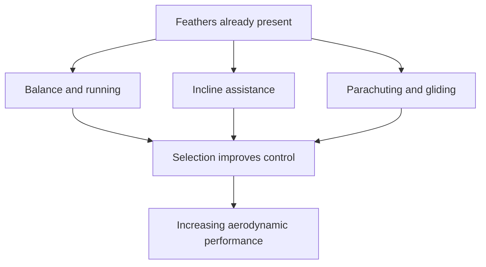

# Early birds, feathers and the origin of flight

## Learning goals

By the end of this note you should be able to:

- separate ancestry, aerodynamic performance and the original function of feathers;
- describe the anatomical mosaic of *Archaeopteryx*;
- compare the three flight-origin hypotheses Erika presents; and
- explain why “what use is half a wing?” does not describe the proposed sequence.

## Three different questions

The lesson keeps three questions distinct:

1. **Where does a fossil sit in the theropod tree?** This uses the full character set.
2. **Could the animal perform powered flight, glide, parachute or only use feathered forelimbs on the ground?** This uses shoulder range, feather geometry, sternum, mass and other functional anatomy.
3. **Why were feathers initially selected?** This asks what feathers did before the complete flight apparatus existed.

A specimen can strongly answer the first question while leaving uncertainty about the second. And the first feathers need not have evolved “for” the later function of flight.

## Archaeopteryx in detail

Erika uses *Archaeopteryx* to answer George Mivart's 1871 challenge about the use of “half a wing” ([1:53:41](https://www.youtube.com/watch?v=vhOyNiv6PTY&t=6821s)). Numerous specimens show a stable combination, rather than a few unrelated fragments assembled into a hypothetical animal.

### Features shared with later birds

- asymmetrical flight feathers capable of producing an aerodynamic foil;
- hollow bones, a furcula and an S-shaped neck;
- a semilunate carpal that permitted the forelimb to fold;
- a shoulder joint able to raise the forelimb enough for a downstroke;
- a largely bird-directed pubis; and
- bipedal posture and feathered wings.

### Retained theropod features

- three separate, mobile and grasping fingers retained into adulthood;
- teeth rather than a toothless modern beak;
- gastralia;
- a long, rigid bony tail rather than a short pygostyle; and
- a shoulder less mobile than the fully saddle-shaped joint of living flying birds.

Erika compares the hand directly with *Deinonychus*, a living bird and the juvenile hoatzin. Hoatzin chicks can move two clawed digits before those bones fuse as they mature, whereas adult *Archaeopteryx* retained three grasping fingers ([1:57:34](https://www.youtube.com/watch?v=vhOyNiv6PTY&t=7054s)). That makes “some living birds have wing claws” an incomplete answer: number, fusion, mobility and persistence all matter.

At [2:00:28](https://www.youtube.com/watch?v=vhOyNiv6PTY&t=7228s), the asymmetrical feathers and shoulder comparison support limited powered flight. The shoulder socket is more mobile than in *Deinonychus* but less mobile than in a living flying bird. Erika therefore describes *Archaeopteryx* as capable of flight but not a modern-style sustained flier. The skeleton can legitimately be posed with the arms lower or raised because the joint permitted both, which explains why reconstructions can look more “dinosaur-like” or more “bird-like” without either pose changing the anatomy ([2:01:44](https://www.youtube.com/watch?v=vhOyNiv6PTY&t=7304s)).

## Feathers come before flight

Erika explicitly states that feathers appear before the complete musculoskeletal apparatus for powered flight ([2:02:29](https://www.youtube.com/watch?v=vhOyNiv6PTY&t=7349s)). This is an example of **co-option**: a structure selected for one or several existing functions can later contribute to a new function.

Living flightless birds demonstrate useful non-flight functions. Ostriches use feathers in display and to shade young; penguins use dense feathers for insulation ([2:32:56](https://www.youtube.com/watch?v=vhOyNiv6PTY&t=9176s)). Simple feathers can also contribute to brooding, sensory display or body covering. Selection has no foresight: every retained stage must work well enough in its present environment, not anticipate a wing millions of years later.

## Three routes that make a partial wing useful

At [2:04:00](https://www.youtube.com/watch?v=vhOyNiv6PTY&t=7440s), Erika presents three non-exclusive hypotheses.

### 1. Ground-up or cursorial

A running theropod could use feathered forelimbs for balance, manoeuvring, a stronger leap or maintaining position on prey. Erika illustrates this with a modern raptor flapping while standing on a struggling monitor lizard: its wings are not producing take-off, but they provide immediate control and stability ([2:05:20](https://www.youtube.com/watch?v=vhOyNiv6PTY&t=7520s)).

### 2. Wing-assisted incline running

Juvenile birds unable to fly can flap while running up steep surfaces. Experiments with young chickens and pheasants show that the wings improve their ability to climb inclines before they can achieve flight ([2:06:34](https://www.youtube.com/watch?v=vhOyNiv6PTY&t=7594s)). A small increase in escape success is already selectable; the forelimb need not be a complete aircraft wing.

### 3. Trees-down or arboreal

Feathers increase drag and surface area, allowing an animal to parachute, control a fall or glide after climbing. Erika notes that young birds can use downy, incompletely developed wings to survive falls before they can fly ([2:05:58](https://www.youtube.com/watch?v=vhOyNiv6PTY&t=7558s)).

The lesson does not insist that only one route operated. Erika says the current picture may combine all three advantages, particularly in forest environments containing feathered theropods with different locomotor capacities ([2:07:18](https://www.youtube.com/watch?v=vhOyNiv6PTY&t=7638s)).

## A fossil comparison of different performance levels

*Fossil specimen YFGP-T5199 of* Anchiornis huxleyi. *Image by Johan Lindgren and colleagues, reproduced under [CC BY 4.0](https://creativecommons.org/licenses/by/4.0/); [source and full author list](https://commons.wikimedia.org/wiki/File:Anchiornis_huxleyi_YFGP-T5199.jpg), Wikimedia Commons.*

Erika contrasts *Anchiornis*—rendered “Inkyornis” by the automatic captions—with *Archaeopteryx*. She identifies the former as a feathered paravian with long flight feathers on both the forelimbs and hindlimbs ([2:07:46](https://www.youtube.com/watch?v=vhOyNiv6PTY&t=7666s); [2:07:50](https://www.youtube.com/watch?v=vhOyNiv6PTY&t=7670s)). In her comparison, its shoulder lacked the full upstroke needed for powered flapping flight ([2:07:56](https://www.youtube.com/watch?v=vhOyNiv6PTY&t=7676s)), but the four aerodynamic surfaces made it an effective glider ([2:08:01](https://www.youtube.com/watch?v=vhOyNiv6PTY&t=7681s)).

By contrast, Erika describes *Archaeopteryx* as capable of powered flight but less proficient than strong modern flyers ([2:08:07](https://www.youtube.com/watch?v=vhOyNiv6PTY&t=7687s)). Her comparison with pheasants and quail is about limited flight performance, not an assertion that *Archaeopteryx* was the ancestor of either modern group ([2:08:14](https://www.youtube.com/watch?v=vhOyNiv6PTY&t=7694s)).

This is not a linear contest in which one is “more evolved.” The two forms occupy different branches and use different character combinations. They show that aerodynamic surfaces, gliding and powered flapping can be separated anatomically.

## Why a modern flight system is not irreducible

Erika considers an irreducible-complexity argument based on the triosseal canal, through which a tendon helps elevate the wing in many living birds ([2:09:40](https://www.youtube.com/watch?v=vhOyNiv6PTY&t=7780s)). Her response is empirical: some living flightless birds lack the complete canal, and some fossil avialans possess partial arrangements. Flight-related movement can therefore exist with different shoulder architectures; the fully enclosed modern condition is not required at the first useful stage ([2:10:23](https://www.youtube.com/watch?v=vhOyNiv6PTY&t=7823s)).

The same logic applies to the sternum. A large keel supports powerful flight muscles in many living flyers, but early branches can have a flat, weakly keeled or partly cartilaginous sternum and still glide or fly less powerfully. “No modern keel” is not equivalent to “no useful aerodynamic behaviour.”

## From maniraptorans to broader theropods

Maniraptorans retain a remarkable mixture: hollow bones, three clawed fingers, a furcula, four-toed feet, bipedality, gastralia and, in Erika's survey, widespread feathers; some also have a semilunate wrist allowing the forelimb to tuck ([2:15:16](https://www.youtube.com/watch?v=vhOyNiv6PTY&t=8116s)). They generally lack a keeled sternum and full powered-flight shoulder.

At the broader theropod level, Erika notes that animals such as tyrannosauroids share hollow bones, an S-shaped neck, a furcula, bipedality and a long bony tail, while their hands and pelvis retain more basal states ([2:26:09](https://www.youtube.com/watch?v=vhOyNiv6PTY&t=8769s)). *Yutyrannus* demonstrates that a very large tyrannosauroid could carry simple insulating feathers without being remotely close to flight ([2:30:24](https://www.youtube.com/watch?v=vhOyNiv6PTY&t=9024s)).

This graded distribution answers the “half-wing” challenge. There is no stage at which an animal must drag a useless, perfectly half-sized modern wing. Feathered forelimbs can be useful for insulation, display, balance, brooding, climbing and controlled descent while selection separately modifies feather asymmetry, the wrist, shoulder, sternum and body proportions.

## What the lesson does not settle

- It does not identify one named fossil as the direct ancestor of all birds.
- It does not prove exactly how every early avialan moved from bones alone.
- It does not require every feathered theropod to fly or every bird to retain flight.
- It does not choose a single flight-origin hypothesis to the exclusion of the others.

## Revision summary

The main sequence is:

1. feathers have immediate non-flight functions;
2. feathered forelimbs can improve balance, climbing and descent;
3. fossils preserve different combinations of aerodynamic feathers, wrist mobility and shoulder range;
4. developmental changes can modify feathers and skeletal structures without rebuilding an organism from scratch; and
5. the complete living-bird flight apparatus accumulates within a nested theropod history.

## Self-test

1. Why is “Could it fly?” not the same question as “Was it an avialan theropod?”
2. Give one immediate fitness benefit for each flight-origin hypothesis.
3. Which *Archaeopteryx* features support limited powered flight, and which remain non-modern?
4. How does the triosseal-canal example answer an irreducibility claim?
