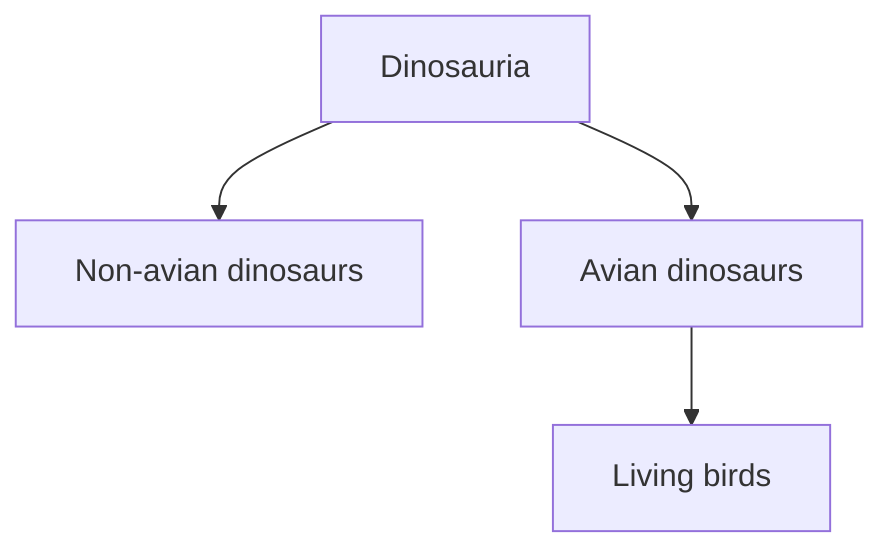
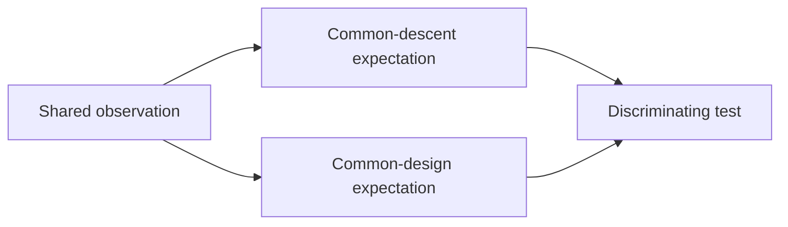

# Will's opening presentation

Will does give a conventional prepared presentation before the mammal lesson. It begins after Erika's whale-source review and concerns what he learned—and what still troubles him—after the previous lesson on bird evolution. This note records **Will's questions and claims as presented**; it does not treat every claim as verified or as Erika's view.

## What Will wanted the presentation to do

At [1:02:22](https://www.youtube.com/watch?v=TuWlGUq5Wi4&t=3742s), Erika hands the floor to Will for his bird-evolution follow-up. He says he is excited by an “epiphany” that may explain why the same evidence looks different to him and to Erika. His intended endpoint is not a new fossil argument but a proposal for moving beyond clashing interpretations: formulate tests that common descent and common design could answer differently.

Will also describes the series as increasingly overwhelming at [1:05:17](https://www.youtube.com/watch?v=TuWlGUq5Wi4&t=3917s). When experts disagree, he says he does not know how to adjudicate between them and does not want to accept a position only because it is the majority view. He uses examples from nutrition and his experience of knee pain to explain his distrust of defaulting to consensus. These anecdotes explain his epistemic starting point; they are not themselves tests of evolutionary biology.

## What changed for Will after *Archaeopteryx*

Will starts his scientific follow-up with *Archaeopteryx* at [1:08:29](https://www.youtube.com/watch?v=TuWlGUq5Wi4&t=4109s). He says the creationist videos he watched did not make a strong case against the fossil's relevance. More importantly, at [1:09:36](https://www.youtube.com/watch?v=TuWlGUq5Wi4&t=4176s), he criticises those presentations for not crediting evolutionary theory with predicting an animal combining avian and non-avian dinosaurian traits.

This is a meaningful concession in Will's own reasoning. He is not saying *Archaeopteryx* proves every component of evolutionary theory. He is saying that a model deserves evidential credit when it specifies an unexpected discovery and the discovery occurs.

At [1:11:22](https://www.youtube.com/watch?v=TuWlGUq5Wi4&t=4282s), Will adds that more than a hundred toothed bird species are known from the fossil record. He says he cannot currently reconcile the extinction of all toothed birds with a young-Earth chronology and calls this a significant weakness in his view. The important distinction is between:

- **observation:** many fossil bird lineages possessed teeth, while living birds do not; and
- **chronological problem for Will:** fitting their diversity, deposition and disappearance into only a few thousand years.

## His request for symmetrical credit

At [1:10:02](https://www.youtube.com/watch?v=TuWlGUq5Wi4&t=4202s), Will asks critics of young-Earth creationism to credit creationists when they make successful scientific predictions. He offers Russell Humphreys' published claims about the magnetic fields of Uranus and Neptune as an example at [1:10:35](https://www.youtube.com/watch?v=TuWlGUq5Wi4&t=4235s).

This stream does **not** audit the initial conditions, numerical predictions or comparison with competing planetary models, so the example should remain labelled “Will's reported example,” not a conclusion established by Erika. It illustrates his desired rule: judge a prediction by what was specified beforehand and what later measurements found, regardless of who made it.

## Two bird-anatomy objections Will brings to Erika

Will reports a conversation with creationist biologist Joel Tay at [1:11:53](https://www.youtube.com/watch?v=TuWlGUq5Wi4&t=4313s). Tay had a much longer presentation opposing dinosaur–bird ancestry, but Will had not seen it. He therefore brings forward only two points from their short conversation.

### 1. The antitrochanter

At [1:12:28](https://www.youtube.com/watch?v=TuWlGUq5Wi4&t=4348s), Will introduces the antitrochanter, a pelvic structure near the acetabulum involved in the bird hip. He reports Tay's claim that it is uniquely avian and could separate birds from dinosaurs. Will then finds a specialist paper whose abstract describes the antitrochanter as a uniquely avian osteological feature ([1:13:09](https://www.youtube.com/watch?v=TuWlGUq5Wi4&t=4389s)).

The unresolved question is not simply whether modern birds possess the feature. It is how the structure is defined, which fossil taxa show precursors or homologous regions, and how its form changes along the bird-line archosaur tree. Will openly says the terminology—antitrochanter, acetabulum and other pelvic anatomy—is too specialist for him to adjudicate immediately ([1:13:29](https://www.youtube.com/watch?v=TuWlGUq5Wi4&t=4409s)).

### 2. Proposed quill knobs in *Velociraptor*

At [1:13:55](https://www.youtube.com/watch?v=TuWlGUq5Wi4&t=4435s), Will returns to the forearm marks interpreted as quill knobs in *Velociraptor*. The published figure compares subtle marks on the fossil ulna with much more obvious knobs on a turkey-vulture ulna. Will emphasises that the *Velociraptor* marks require magnification and appear to him as indentations rather than projecting knobs.

At [1:15:09](https://www.youtube.com/watch?v=TuWlGUq5Wi4&t=4509s), he reads the paper's conclusion that the structures constitute direct evidence of feathers on the posterior forearm. He asks viewers to inspect the figure and decide whether the arrows look like quill knobs ([1:15:31](https://www.youtube.com/watch?v=TuWlGUq5Wi4&t=4531s)). The underlying publication is Turner, Makovicky and Norell, [“Feather quill knobs in the dinosaur *Velociraptor*”](https://doi.org/10.1126/science.1145076) (*Science*, 2007).

The visual question is useful but incomplete. Erika later asks whether a large flying bird is the correct biomechanical comparison for a flightless animal. That response is covered in [Checking claims before arguing from them](01-checking-claims.md).

## “Birds are not dinosaurs” and the meaning of membership

At [1:16:12](https://www.youtube.com/watch?v=TuWlGUq5Wi4&t=4572s), Will introduces the informal “BAND”—“birds are not dinosaurs”—label for researchers who disputed the theropod origin of birds. He names Alan Feduccia, Larry Martin, Storrs Olson, John Ruben and others as examples. Because these researchers were not young-Earth creationists, their disagreement is important to him: he wants to know how a learner should decide when specialists reject a mainstream relationship.

However, “birds are not theropod dinosaurs” has not always meant “feathered animals conventionally called dinosaurs did not exist.” As Erika later notes, Feduccia has described *Velociraptor* as a secondarily flightless bird. The disagreement can concern where to draw or root a branch, which fossils count as avialans, and which anatomical interpretation is preferred—not necessarily whether every bird-like fossil is fictitious.

Will then separates two claims at [1:17:53](https://www.youtube.com/watch?v=TuWlGUq5Wi4&t=4673s): he can imagine accepting that a hummingbird descended from a dinosaur, but he resists saying that a hummingbird **is** a dinosaur. This is the same nested-classification issue Erika addresses at the start of the mammal lesson. In cladistics, descendants remain within the ancestral branch name; in everyday speech, “dinosaur” usually evokes only extinct non-avian forms.

The diagram represents the cladistic convention Will is resisting, not a claim he accepts during this presentation.

## Two broader objections: inherited information and beauty

After explaining his personal affection for birds, Will says at [1:21:19](https://www.youtube.com/watch?v=TuWlGUq5Wi4&t=4879s) that two observations remain difficult for him to explain through evolution.

### Cuckoo migration and brood parasitism

Will describes European cuckoos laying eggs in nests belonging to other species and migrating to southern Africa. Their young are raised without meeting their biological parents yet later undertake the appropriate migration ([1:21:33](https://www.youtube.com/watch?v=TuWlGUq5Wi4&t=4893s)). At [1:22:24](https://www.youtube.com/watch?v=TuWlGUq5Wi4&t=4944s), he interprets the behaviour as information programmed by God and asks how an evolutionary process could account for it.

This is posed as a question, not answered in Will's presentation. A testable version would need to break “information” into measurable components—orientation cues, inherited behavioural variation, survival and reproductive differences, learning, and population genetics—then compare what competing models predict.

### Aesthetic beauty

At [1:22:36](https://www.youtube.com/watch?v=TuWlGUq5Wi4&t=4956s), Will argues that much bird colour and form appears gratuitously beautiful. He shows macaws, eclectus parrots, toucans, aracaris, magpies and a royal flycatcher, and interprets their appearance as the product of an artistic mind rather than selection ([1:24:07](https://www.youtube.com/watch?v=TuWlGUq5Wi4&t=5047s)).

Again, the observation and explanation must be separated. “Humans find these birds beautiful” is an observation about human response; “the features have no signalling, mate-choice, camouflage or other biological consequences” is a further empirical claim. The later lesson on sexual selection in Lesson 8 provides mechanisms relevant to that second claim.

## The “metaphysical spectacles” epiphany

Will's conclusion begins at [1:24:27](https://www.youtube.com/watch?v=TuWlGUq5Wi4&t=5067s). Rebecca Davis recommended Cornelius Hunter's book *Darwin's God*, and Will says it changed both his understanding of Darwin and his view of the disagreement. He focuses on a passage from page 128 about unnoticed fundamental assumptions shaping how people interpret reality ([1:26:55](https://www.youtube.com/watch?v=TuWlGUq5Wi4&t=5215s)).

At [1:28:05](https://www.youtube.com/watch?v=TuWlGUq5Wi4&t=5285s), Will applies the metaphor to shared bone patterns:

| Same observation | Erika, as characterised by Will | Will's interpretation |
| --- | --- | --- |
| Corresponding anatomical structures across taxa | Evidence of common ancestry | Evidence of common design |

Will initially characterises Erika's starting assumption as “God does not exist.” Erika later explains that she accepted evolution for many years as a theistic evolutionist and did not infer it from prior naturalism. Therefore, Will's table describes how he perceived their disagreement at this moment; it is not a complete account of Erika's intellectual history.

The useful part of the epiphany is self-application. Will says he also wears interpretive spectacles and that everyone brings prior experience and assumptions to evidence ([1:27:41](https://www.youtube.com/watch?v=TuWlGUq5Wi4&t=5261s)). Acknowledging bias does not make every conclusion equally supported. It motivates designing comparisons that can fail.

## Will's proposed way forward

At [1:29:57](https://www.youtube.com/watch?v=TuWlGUq5Wi4&t=5397s), Will rejects the idea that different metaphysical commitments create a permanent impasse. Science can specify hypotheses, test predictions and either weaken or strengthen explanations. At [1:30:13](https://www.youtube.com/watch?v=TuWlGUq5Wi4&t=5413s), he connects this to his role in The Final Experiment and asks for experiments capable of distinguishing the views.

The unresolved task is to state both expectation sets precisely. A model that can accommodate every possible fossil, genetic pattern and chronology after the fact cannot be discriminated. Erika agrees that Will should identify what he would regard as convincing, while noting that discoveries such as *Archaeopteryx* already function as risky predictions.

## Revision snapshot

| Issue Will raises | Status at the end of his presentation |
| --- | --- |
| *Archaeopteryx* prediction | He grants it evidential credit. |
| Diversity of toothed fossil birds | He sees it as a significant problem for a young Earth. |
| Antitrochanter | Specialist question brought forward; not resolved. |
| *Velociraptor* quill marks | Will doubts the visual identification; comparative biomechanics remains to be checked. |
| BAND researchers | Evidence of genuine historical dissent, but the exact scope of their disagreement needs definition. |
| Cuckoo migration | Presented as an unsolved “information” problem. |
| Bird beauty | Presented as evidence that seems designed to Will. |
| Common design versus common descent | Will asks for predictions capable of separating them. |

**Active recall:** Which claim does Will concede, which fossil pattern challenges his chronology, which two anatomical objections does he bring from Joel Tay, and what would turn his final “spectacles” insight into a scientific comparison?
