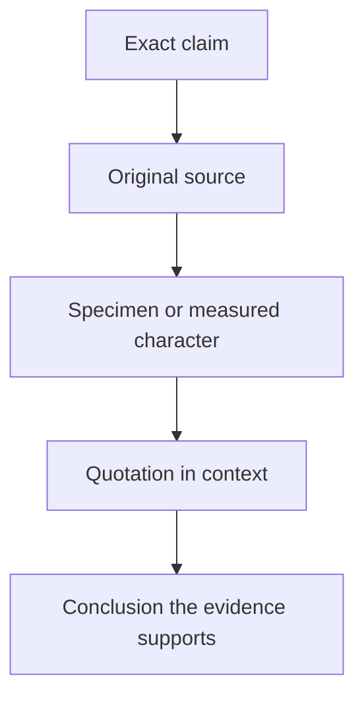
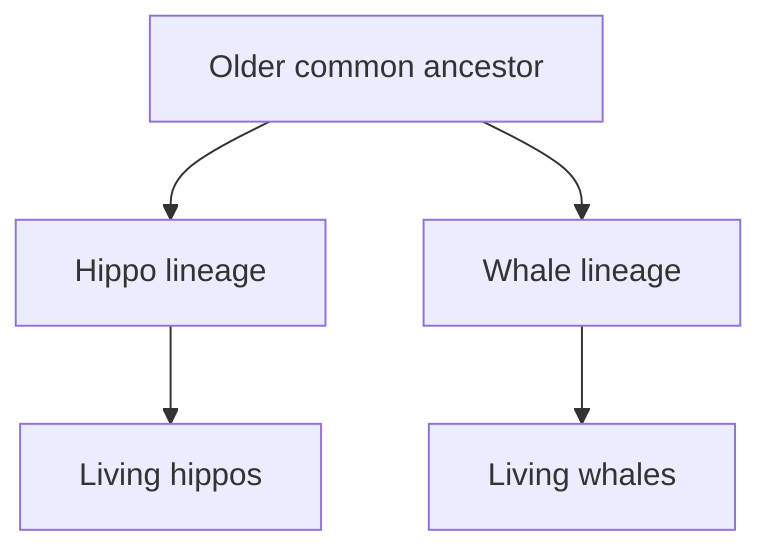

# Checking claims before arguing from them

The first hour is not the mammal lecture proper. Erika returns to the whale objections discussed in the previous stream and checks them against the papers, specimens and interview context on which they depend. It is therefore a worked lesson in **how to audit a scientific claim**, not merely another list of whale fossils.

## What you should learn

After revising this note, you should be able to:

- separate a fossil specimen from an artist's restoration of it;
- distinguish a diagnostic feature from a feature that is merely conspicuous;
- explain why “closest living relative” does not mean “direct ancestor”;
- read the sentence before and after a quotation before deciding what its source says;
- distinguish a mistaken reconstruction from dishonesty; and
- test an evolutionary explanation by asking what it predicted before the relevant discovery.

## Erika's method: slow the claim down

Erika explains why she spent so much time on this follow-up at [5:08](https://www.youtube.com/watch?v=TuWlGUq5Wi4&t=308s). Carl Werner had presented quotations, interviews and museum reconstructions as problems for whale evolution. Rather than answer the overall conclusion first, she checked the smaller propositions that had been used to reach it: what an interviewee was asked, which bone a paper actually discussed, what material was known when a reconstruction was made, and whether later publications changed that reconstruction.

This yields a useful audit chain:

The last step matters. A source can be genuine and accurately quoted yet still be made to support a larger conclusion than its authors reached. Conversely, an early reconstruction can be wrong without the underlying specimen being fraudulent.

## Prediction is more than fitting a story afterwards

At [10:44](https://www.youtube.com/watch?v=TuWlGUq5Wi4&t=644s), Erika returns to the structure of an evolutionary prediction. If living whales descended from terrestrial mammals, researchers should not have to rely on one vaguely whale-like fossil. Independent evidence should converge: living-whale genetics, development, vestigial structures, diagnostic ear anatomy and a dated series of fossils with changing locomotor anatomy.

At [11:18](https://www.youtube.com/watch?v=TuWlGUq5Wi4&t=678s), she stresses that these are separate evidential routes. For example, genes place cetaceans within even-toed ungulates, while fossils can preserve an artiodactyl-style ankle and a cetacean-style ear in the same broader transition. Agreement between systems is more informative than repeatedly measuring variants of one feature.

The relevant prediction is not “every fossil must be a direct ancestor.” Evolution produces branches. A fossil can show the expected mixture of inherited and modified anatomy even if it belongs to an extinct side branch.

## Whales and hippos: relationship is not descent from a modern animal

Erika addresses the claim that whale evolution says a hippo simply turned into a whale at [18:46](https://www.youtube.com/watch?v=TuWlGUq5Wi4&t=1126s). The scientific claim is that living hippos are the **closest living relatives** of cetaceans among the sampled living groups. Both descend from an earlier common ancestor. A modern hippo is no more the ancestor of a modern whale than one cousin is the ancestor of another.

At [20:02](https://www.youtube.com/watch?v=TuWlGUq5Wi4&t=1202s), Erika points out that Werner's own cited material depicted a common ancestor rather than descent from a living hippo. At [22:13](https://www.youtube.com/watch?v=TuWlGUq5Wi4&t=1333s), she reports contacting palaeontologist Daryl Domning to check how an interview quotation had been used. The lesson is methodological: an edited answer can sound as if a scientist denied a relationship when the original question, technical meaning of “ancestor,” or surrounding explanation is missing.

Erika next discusses dietary evidence at [23:43](https://www.youtube.com/watch?v=TuWlGUq5Wi4&t=1423s). Teeth can preserve information about feeding ecology, and changes in tooth form and wear can be compared across fossils. Diet is not used as a magical label that decides ancestry by itself; it adds another character to the broader anatomical and chronological case.

## The ear-bone dispute: involucrum is not the sigmoid process

The most detailed source check begins at [27:38](https://www.youtube.com/watch?v=TuWlGUq5Wi4&t=1658s). Erika separates two structures that had been blurred together:

| Structure | What the lesson says to ask |
| --- | --- |
| **Involucrum** | Is the medial wall of the auditory bulla thickened in the cetacean pattern? Erika treats this as the important diagnostic cetacean feature. |
| **Sigmoid process** | How narrowly is the process being defined, and how completely is it preserved? Its shape can be discussed without cancelling the involucrum. |

At [28:48](https://www.youtube.com/watch?v=TuWlGUq5Wi4&t=1728s), Erika identifies the central error: uncertainty about whether a damaged fossil displays a narrowly defined sigmoid process had been made to sound like uncertainty about whether it possessed the involucrum. They are not interchangeable claims. At [38:18](https://www.youtube.com/watch?v=TuWlGUq5Wi4&t=2298s), she adds that damage to the relevant specimen was not disclosed in the presentation she was checking. Preservation must be included in the inference; absence of a crisp outline in a damaged area is not automatically evidence that the structure never existed.

By [39:01](https://www.youtube.com/watch?v=TuWlGUq5Wi4&t=2341s), Erika is explicit that broader and stricter definitions of “sigmoid process” can change how a researcher describes the feature. That terminological debate does not remove the thickened involucrum. A revision answer should therefore name the exact structure rather than say only “the ear bone is disputed.”

This also prevents a category mistake raised at [41:19](https://www.youtube.com/watch?v=TuWlGUq5Wi4&t=2479s): *Basilosaurus* is accepted as a whale even though its nostrils were not yet in the modern blowhole position. Membership in Cetacea is diagnosed from a suite of inherited traits, not from possession of every specialised feature of living whales.

## *Ambulocetus*: read the whole diagnosis

At [43:00](https://www.youtube.com/watch?v=TuWlGUq5Wi4&t=2580s), Erika examines a quotation used to suggest that *Ambulocetus* was labelled a whale on inadequate grounds. The quotation stopped before the source's anatomical justification. At [44:16](https://www.youtube.com/watch?v=TuWlGUq5Wi4&t=2656s), she reads the following material, which lists derived characters rather than relying on the animal's general appearance.

*The fossil material, not a full-bodied painting, is the primary evidence. The bones are laid out beside palaeontologist Hans Thewissen; their arrangement in the photograph should not be mistaken for an articulated life pose. Photograph by Akrasia25, [source file](https://commons.wikimedia.org/wiki/File:Ambulocetus_Skeleton_with_Hans_Thewissen.jpg), [CC BY-SA 4.0](https://creativecommons.org/licenses/by-sa/4.0/).*

At [45:22](https://www.youtube.com/watch?v=TuWlGUq5Wi4&t=2722s), Erika works through the character list, including cetacean ear anatomy. Her point is not that one item proves the entire phylogeny. It is that the original diagnosis contains several observations omitted from the shortened presentation. The responsible question is therefore: **does the cited paper diagnose the animal with a character suite, and was that suite represented fairly?**

At [46:21](https://www.youtube.com/watch?v=TuWlGUq5Wi4&t=2781s), she also corrects another common misunderstanding. Calling *Ambulocetus* a member of an early whale branch does not require it to be the particular individual lineage from which all later whales descended. Most fossils will be side branches because branching is what the model predicts.

For the source discussed in this part, see Thewissen and colleagues' original report, [“Fossil evidence for the origin of aquatic locomotion in archaeocete whales”](https://doi.org/10.1126/science.263.5144.210) (*Science*, 1994). Read it as a specimen description, not as a picture caption.

## *Rodhocetus*: correction is part of the evidence trail

The next case begins at [50:05](https://www.youtube.com/watch?v=TuWlGUq5Wi4&t=3005s). Older restorations gave *Rodhocetus* a whale-like tail fluke even though that soft-tissue outline was speculative. Later-discovered limb material led researchers to reject parts of the earlier reconstruction. Erika does not defend the obsolete fluke. She uses its correction to show why a restoration must not be confused with the fossil.

The distinction is:

- **observation:** preserved bones and their documented anatomical features;
- **inference:** a proposed swimming mode or soft-tissue outline based on those bones;
- **revision:** changing the inference when new material becomes available.

At [56:10](https://www.youtube.com/watch?v=TuWlGUq5Wi4&t=3370s), Erika says that a wrong inference is not by itself evidence of deception. The timing matters: additional hand and foot material was published, scientific interpretations changed, and a museum display or popular illustration could remain outdated after the research had moved on. The 2001 study relevant to this correction is Gingerich and colleagues, [“Origin of whales from early artiodactyls: hands and feet of Eocene Protocetidae from Pakistan”](https://doi.org/10.1126/science.1063902).

## Side branches do not erase a transition

At [1:00:19](https://www.youtube.com/watch?v=TuWlGUq5Wi4&t=3619s), Erika agrees that *Basilosaurus* is not treated as the direct ancestor of modern whales. That fact is compatible with the transition because phylogenies are bushes, not ladders. A fossil can document the presence of a trait combination at a particular time without sitting on the single surviving line.

At [1:00:56](https://www.youtube.com/watch?v=TuWlGUq5Wi4&t=3656s), she closes the audit by noting how many relevant specimens and characters were absent from Werner's presentation. A critique that selects only the fossils with controversial restorations does not address the total case formed by ears, ankles, teeth, limbs, pelvises, chronology, development and molecular relationships.

## Applying the method to Will's bird follow-up

Will's prepared bird presentation starts at [1:02:22](https://www.youtube.com/watch?v=TuWlGUq5Wi4&t=3742s), and Erika responds from [1:30:44](https://www.youtube.com/watch?v=TuWlGUq5Wi4&t=5444s). She accepts that the proposed *Velociraptor* quill knobs look subtle, then asks what comparison would actually discriminate between explanations. A flying turkey vulture must anchor large flight feathers; a flightless animal using feathers for display, insulation or balance need not have equally prominent attachment scars. At [1:43:06](https://www.youtube.com/watch?v=TuWlGUq5Wi4&t=6186s), she proposes comparing *Velociraptor* with flightless birds rather than treating a single visual contrast as decisive.

For the antitrochanter objection, Erika searches for specialist literature instead of assuming that the claim “only birds have it” settles the issue. At [1:44:45](https://www.youtube.com/watch?v=TuWlGUq5Wi4&t=6285s), she finds work discussing the structure in the evolution of bird-line archosaurs and says she needs to read it before drawing a conclusion. This is good source discipline in real time: locate the relevant literature, state what has and has not yet been checked, and avoid manufacturing confidence.

At [1:50:52](https://www.youtube.com/watch?v=TuWlGUq5Wi4&t=6652s), she returns to the value of prediction. *Archaeopteryx*, early whales, hominin fossils and fish–tetrapod mosaics were not all invented as rescue stories after discovery; investigators specified expected combinations, ages or environments and then tested them. A fair model comparison must say what common descent and common design separately lead us to expect.

## Common confusions

1. **“Closest living relative” means ancestor.** No. It identifies the nearest surviving branch in a comparison.
2. **A reconstruction is the fossil.** No. Bones are observations; the skin, fluke and posture added around them are inferences.
3. **One disputed feature invalidates every other feature.** No. Name the disputed structure and test how much of the analysis depends on it.
4. **A corrected idea shows science cannot be trusted.** Correction is expected when new specimens appear. Ask whether the correction was published and whether later arguments use the updated evidence.
5. **A transitional fossil must be a direct ancestor.** No. Side branches can preserve transitional combinations.

## Active recall

- Why does uncertainty about a sigmoid process not automatically remove the involucrum?
- What information was lost when the *Ambulocetus* quotation ended before its anatomical diagnosis?
- How can an inaccurate *Rodhocetus* restoration coexist with valid fossil evidence?
- Draw the relationship between a common ancestor, the hippo branch and the whale branch.
- What comparison did Erika suggest before judging the subtle *Velociraptor* forearm marks?

**Compact recap:** identify the exact proposition, inspect the original specimen or measurement, restore quotation context, separate observation from reconstruction, and ask whether independent evidence converges on the same relationship.
