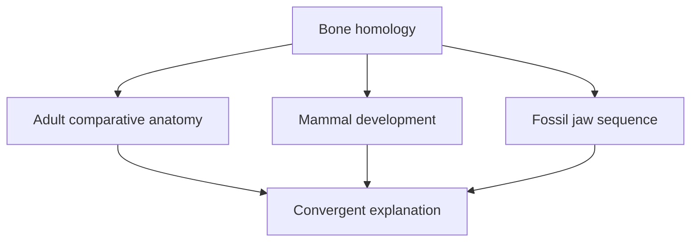
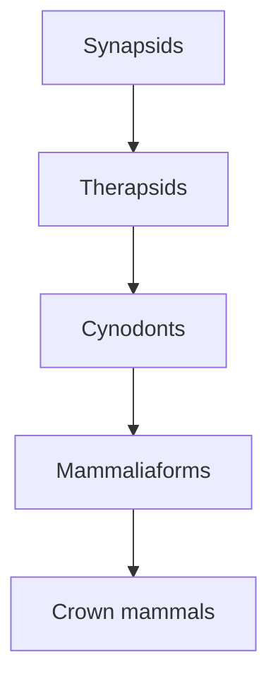

# Mammal traits and synapsid ancestry

Mammals are not identified by one familiar feature such as fur or live birth. Erika builds the group from a **suite of inherited anatomical and physiological traits**, then follows those traits backwards through mammaliaforms, cynodonts, therapsids and earlier synapsids. The result is a nested history: the older groups do not stop being part of the classification when a more specialised subgroup evolves inside them.

## What you should learn

After revising this note, you should be able to:

- describe the main traits Erika uses to recognise living mammals;
- explain the difference between the mammalian and non-mammalian jaw joints;
- connect the fossil jaw sequence with mammalian development;
- distinguish a directly fossilised trait from a trait inferred through a proxy;
- explain why *Dimetrodon* is a synapsid rather than a dinosaur; and
- read “synapsid → therapsid → cynodont → mammaliaform → crown mammal” as nested groups, not as five unrelated types.

## A mammal is a character suite

Erika introduces the diagnostic list at [2:36:42](https://www.youtube.com/watch?v=TuWlGUq5Wi4&t=9402s). Living mammals are tetrapods that typically combine the following traits:

| Trait | Meaning in the lesson | Why it is useful |
| --- | --- | --- |
| Hair | Keratin filaments growing from skin; fur and whiskers are forms of hair. | Unique living-mammal integument and an insulation/sensory system. |
| Milk | Nutrient-rich secretion made by mammary tissue for young. | Present even in egg-laying monotremes. |
| Three auditory ossicles | Malleus, incus and stapes transmit vibrations from the eardrum toward the inner ear. | Their relationship to ancestral jaw bones can be traced in development and fossils. |
| Dentary–squamosal jaw joint | The lower jaw's dentary articulates with the squamosal region of the skull. | Replaces the ancestral quadrate–articular joint as the load-bearing mammalian joint. |
| Secondary palate | Bony partition between oral and nasal passages. | Permits breathing while processing food and helps make suckling possible. |
| Heterodont teeth | Incisors, canines, premolars and molars have different forms and jobs. | Records increasing specialisation in food processing. |
| One temporal opening | The synapsid opening behind the eye, modified in mammalian skull architecture. | Connects mammals to the deeper synapsid branch. |
| Upright limb posture | Limbs are held mainly beneath the body rather than sprawling laterally. | Changes support and locomotion. |
| Rounded braincase | Mammals have a relatively expanded, rounded brain compared with the elongate condition Erika contrasts in crocodilians. | Can be inferred from the interior of a fossil skull. |
| Endothermy | Metabolism maintains a relatively stable internal body temperature. | Leaves indirect signatures in bone, isotopes and the vestibular system. |
| Usually live birth | Marsupials and placentals give live birth. | Useful, but not universal: monotremes lay eggs. |

At [2:38:14](https://www.youtube.com/watch?v=TuWlGUq5Wi4&t=9494s), Erika immediately marks the exception to the final row. Platypuses and echidnas are not “almost mammals”; they are monotreme mammals that retain egg laying while sharing mammalian ancestry and the broader trait suite. Classification follows the whole pattern, not a single checklist box.

### Traits also explain function

Hair can insulate, protect skin and act as a sensory organ when specialised into whiskers ([2:38:24](https://www.youtube.com/watch?v=TuWlGUq5Wi4&t=9504s)). Heterodont teeth divide feeding into stages: incisors cut, canines pierce, premolars shear and molars grind ([2:41:31](https://www.youtube.com/watch?v=TuWlGUq5Wi4&t=9691s)). A secondary palate separates nasal and oral spaces, which you can feel with your tongue at the roof of your mouth ([2:40:02](https://www.youtube.com/watch?v=TuWlGUq5Wi4&t=9602s)). Upright limbs place support beneath the trunk rather than requiring the side-to-side sprawling posture shown in Erika's reptile comparison ([2:42:42](https://www.youtube.com/watch?v=TuWlGUq5Wi4&t=9762s)).

Endothermy is not literally “warm blood.” At [2:43:32](https://www.youtube.com/watch?v=TuWlGUq5Wi4&t=9812s), Erika defines it as internally maintaining a comparatively stable temperature. That capacity costs energy, which is why mammals generally need to feed much more frequently than a similarly sized ectotherm.

## The jaw and middle ear: the central transformation

At [2:39:38](https://www.youtube.com/watch?v=TuWlGUq5Wi4&t=9578s), Erika contrasts the two jaw arrangements. In living mammals, the dentary is the dominant lower-jaw bone and contacts the squamosal portion of the skull. In a non-mammalian amniote, the lower jaw contains several bones, and the articular contacts the quadrate to form the joint.

*Evolution of the synapsid jaw joint. Abbreviations: `a` = articular, `d` = dentary, `q` = quadrate and `s` = squamosal. The sequence makes the functional overlap visible: the dentary–squamosal contact enlarges before the articular–quadrate pair leaves the jaw articulation. © UC Museum of Paleontology Understanding Evolution, [source and explanation](https://evolution.berkeley.edu/what-are-evograms/jaws-to-ears-in-the-ancestors-of-mammals/), [CC BY-NC-SA 4.0](https://creativecommons.org/licenses/by-nc-sa/4.0/).*

Those “extra” jaw bones were not lost without a trace. Erika explains at [2:50:52](https://www.youtube.com/watch?v=TuWlGUq5Wi4&t=10252s) that the quadrate and articular correspond to two of the mammalian auditory ossicles; together with the stapes, they form the three-bone middle-ear chain. The ossicles jiggle in sequence when the tympanic membrane vibrates, transmitting mechanical energy to the oval window ([2:49:56](https://www.youtube.com/watch?v=TuWlGUq5Wi4&t=10196s)).

> Terminology note: the captions repeatedly render Erika as saying “inner-ear bones,” but the malleus, incus and stapes are anatomically the **middle-ear ossicles**. The inner ear contains the cochlea and vestibular system.

The important revision question is not “How could a working adult jaw suddenly become an ear?” Evolutionary change occurs across generations while selection acts on functional intermediate arrangements. Early mammaliaforms could retain the ancestral joint while also using a newer dentary–squamosal contact, so neither chewing nor hearing had to vanish during the transition.

## Three independent views of the same bones

Erika combines comparative anatomy, development and fossils rather than asking any one line to carry the whole conclusion.

### 1. Adult anatomy

The mammalian malleus and incus occupy the ear, whereas homologous elements remain associated with the jaw in non-mammalian amniotes. Their position and function differ, but their relationships to surrounding bones provide the anatomical starting point.

### 2. Development

At [2:52:21](https://www.youtube.com/watch?v=TuWlGUq5Wi4&t=10341s), Erika compares an extremely immature marsupial with an adult marsupial and a bearded dragon. Because a marsupial is born at an early developmental stage and completes much of its growth in the pouch, the temporary connection between jaw and future ear structures is unusually accessible. The newborn configuration is not identical to a reptile or fossil cynodont, but it preserves a closer jaw association before the bones acquire their adult positions.

At [2:53:23](https://www.youtube.com/watch?v=TuWlGUq5Wi4&t=10403s), she places the fossil cynodont *Thrinaxodon* beside those developmental stages. Researchers quoted in her slide describe the match between opossum development and the fossil transition as useful for interpreting extinct forms. At [2:54:21](https://www.youtube.com/watch?v=TuWlGUq5Wi4&t=10461s), she adds that experimentally changing the expression of a single developmental gene can preserve or break the jaw–middle-ear connection. Her wording is careful: the manipulated configuration is not an exact recreation of an extinct animal, but it shows that the attachment is developmentally alterable without inventing an entirely new organ.

### 3. Fossils

Erika's animated sequence begins at [2:55:07](https://www.youtube.com/watch?v=TuWlGUq5Wi4&t=10507s). Across earlier synapsids, therapsids, cynodonts, *Morganucodon* and later mammals, the post-dentary bones become smaller and shift toward the definitive middle ear. The sequence is not a row of direct ancestors; it samples successive anatomical conditions from a branching record. What matters is that the transformations occur in small changes rather than a jump from a many-boned jaw to an isolated three-ossicle ear.

For a detailed scientific overview of this evidence, see Anthwal, Joshi and Tucker, [“Evolution of the mammalian middle ear and jaw”](https://doi.org/10.1111/brv.12020), and Luo, [“Transformation and diversification in early mammal evolution”](https://doi.org/10.1038/nature06277).

## *Morganucodon*: two joints reveal the sequence

At [2:48:02](https://www.youtube.com/watch?v=TuWlGUq5Wi4&t=10082s), Erika introduces the rat-sized *Morganucodon*, about 205 million years old in the chronology used in the lesson. It possesses the dentary–squamosal joint used to define the mammalian condition, yet it also retains the ancestral quadrate–articular contact. This **double jaw joint** makes it especially instructive: a new articulation was present before the old system was completely detached into the auditory chain.

Erika lists a mosaic of other traits at [2:48:38](https://www.youtube.com/watch?v=TuWlGUq5Wi4&t=10118s): heterodont teeth, a secondary palate, a single temporal opening, upright limbs and a rounded braincase, alongside inferred hair, milk and endothermy. Egg laying is considered likely. That combination is neither a living reptile nor a modern placental mammal; it is the kind of mixed condition expected near the base of mammal history.

## How can soft physiology be inferred from stone?

Erika repeatedly separates observations from inferences.

### Brain shape

A brain rarely fossilises, but the cavity inside a skull preserves its approximate external form. At [2:57:12](https://www.youtube.com/watch?v=TuWlGUq5Wi4&t=10632s), Erika compares the elongated crocodilian brain with a mouse and the mammaliaform *Hadrocodium*. The more rounded endocast in *Hadrocodium* is evidence about braincase expansion, not a fossilised brain sitting inside the skull.

### Lactation

Milk does not normally fossilise. Erika therefore explains both a proposed origin and fossil proxies. Mammary glands share structural and secretory similarities with apocrine skin glands ([2:58:03](https://www.youtube.com/watch?v=TuWlGUq5Wi4&t=10683s)). A platypus supplies a living comparison: it has no nipples and secretes milk onto specialised abdominal patches, where hairs help guide the fluid toward the young ([2:58:57](https://www.youtube.com/watch?v=TuWlGUq5Wi4&t=10737s)).

At [3:00:31](https://www.youtube.com/watch?v=TuWlGUq5Wi4&t=10831s), Erika cautions that milk is not simply sweat. Caseins are distinctive milk proteins. She presents the proposal that duplication and modification of genes from a related protein family contributed to milk proteins, but explicitly says at [3:01:26](https://www.youtube.com/watch?v=TuWlGUq5Wi4&t=10886s) that the timing and exact pathway remain incomplete. The caecilian secretion she mentions is a modern analogy for nutrient-rich skin secretion, **not** a claim that mammals descended from caecilians.

Three fossil clues can make nursing plausible ([3:01:45](https://www.youtube.com/watch?v=TuWlGUq5Wi4&t=10905s)):

1. rapid juvenile growth recorded in bone tissue;
2. only two tooth generations, avoiding continual tooth replacement during nursing; and
3. a secondary palate capable of supporting suckling while breathing.

When all three occur in *Morganucodon*, lactation is a reasonable inference, not a directly observed certainty. Erika says this explicitly at [3:02:49](https://www.youtube.com/watch?v=TuWlGUq5Wi4&t=10969s).

### Hair and whiskers

At [3:06:25](https://www.youtube.com/watch?v=TuWlGUq5Wi4&t=11185s), Erika explains how whiskers leave skeletal correlates. Vibrissae are richly innervated; canals and pits in the muzzle carry the nerves and blood supply. Similar muzzle pitting in some cynodont skulls supports whiskers even when the hairs themselves are absent. It does not prove that the entire body was covered in dense fur, so Erika keeps the larger inference separate.

At [3:08:19](https://www.youtube.com/watch?v=TuWlGUq5Wi4&t=11299s), she connects hair, scales and feathers through embryonic placodes—thickened patches of developing skin whose outcomes depend on signalling cascades. The point is not that an adult scale peels into a hair. Related developmental systems can be modified through changes in when and where genes signal, producing diverse integumentary structures.

## From synapsids to mammals

Mammals belong to Synapsida because they inherit the synapsid skull pattern. Erika introduces the single temporal opening at [2:40:21](https://www.youtube.com/watch?v=TuWlGUq5Wi4&t=9621s). In humans it is reshaped into the region bounded by the zygomatic arch and used by jaw muscles; it has not simply disappeared.

*Despite its frequent placement in toy “dinosaur” sets,* Dimetrodon *is an early synapsid. This mounted* D. incisivum *skeleton is displayed at the State Museum of Natural History Karlsruhe. Photograph by H. Zell, [source file](https://commons.wikimedia.org/wiki/File:Dimetrodon_incisivum_01.jpg), [CC BY-SA 3.0](https://creativecommons.org/licenses/by-sa/3.0/).*

At [3:32:25](https://www.youtube.com/watch?v=TuWlGUq5Wi4&t=12745s), Erika uses *Dimetrodon* and *Edaphosaurus* as early synapsid examples. Their key mammal-side traits are modest: a single temporal opening and incipient differentiation of teeth. They lack the full mammalian jaw, ear, palate and brain condition. This is precisely why they are useful near the base of the branch: moving backwards in time should reveal fewer of the later specialisations and more similarity between the deep ancestors of major amniote lineages.

Therapsids appear later within Synapsida and show different mixtures of posture, tooth differentiation and metabolic proxies ([3:25:56](https://www.youtube.com/watch?v=TuWlGUq5Wi4&t=12356s)). Cynodonts are nested within therapsids, mammaliaforms within cynodonts, and crown mammals within mammaliaforms.

Erika states the nesting directly at [3:34:20](https://www.youtube.com/watch?v=TuWlGUq5Wi4&t=12860s): all crown mammals are mammaliaforms, all mammaliaforms are cynodonts, all cynodonts are therapsids, and all therapsids are synapsids. Descending the diagram does not replace one identity with another; it adds a more specific one.

## Inferring endothermy without a fossil thermostat

At [3:29:23](https://www.youtube.com/watch?v=TuWlGUq5Wi4&t=12563s), Erika presents three proxies rather than pretending metabolism fossilises directly:

- **Semicircular canals:** their dimensions relate to the physical behaviour of endolymph at different body temperatures.
- **Fibrolamellar bone:** rapidly deposited, highly vascularised tissue is associated with fast growth and high metabolic activity.
- **Oxygen isotopes:** ratios incorporated into bones and teeth can record formation temperature; a stable internal signal differs from one that closely tracks environmental variation.

The proxies suggest a graded acquisition of mammalian-style endothermy, with the fully developed condition appearing later than the earliest synapsids in the timeline Erika presents. The inner-ear study behind one of these proxies is Araújo and colleagues, [“Inner ear biomechanics reveals a Late Triassic origin for mammalian endothermy”](https://doi.org/10.1038/s41586-022-04963-z).

## Common confusions

1. **Three “ear bones” means the inner ear.** The ossicles are in the middle ear; the lesson's captions use the terms loosely.
2. **Jaw bones moved into an individual's ear.** The transition concerns inherited changes across populations and generations.
3. **A double joint is non-functional.** It provides a plausible functional overlap while the newer joint takes over and the older elements specialise in hearing.
4. **Whisker pits prove a full fur coat.** They support vibrissae; broader body covering requires additional evidence.
5. **“Mammal-like reptile” means a reptile became a mammal.** It is historical shorthand for non-mammalian synapsids and can conceal their actual placement on the mammal branch.
6. ***Dimetrodon* is a dinosaur.** It is a synapsid and is more closely related to mammals than to dinosaurs.

## Active recall

- Name five mammalian traits and explain why no single one should define every fossil by itself.
- Which bones form the ancestral jaw joint, and which bones form the mammalian joint?
- Why is *Morganucodon* having both joints informative?
- What three clues did Erika use to infer lactation?
- What can muzzle pits establish, and what can they not establish?
- Put synapsid, therapsid, cynodont, mammaliaform and crown mammal in nested order.

**Compact recap:** mammals are specialised synapsids. Their origin is recorded not by a single half-mammal but by correlated changes in jaw construction, hearing, teeth, palate, posture, braincase, integument and physiology, supported to different degrees by fossils, development and living comparison.
