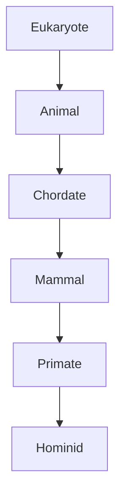
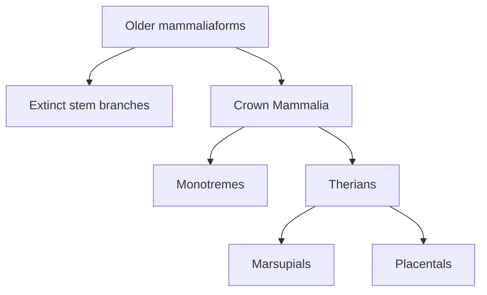

# Mesozoic mammals, classification and branching diversity

Before tracing mammal origins, Erika spends more than half an hour rebuilding the logic of biological classification. That foundation matters: the mammal fossil record is a branching collection of crown groups, stem relatives and extinct experiments, not a ladder whose successive rungs are “reptile,” “primitive mammal” and “advanced mammal.”

## What you should learn

After revising this note, you should be able to:

- explain why taxonomists place organisms in nested groups;
- distinguish a group's scientific definition from a colloquial use of its name;
- read crown mammal, stem mammal and mammaliaform on a branching tree;
- describe the ecological diversity of mammals during the Mesozoic;
- explain why survival and extinction “prune” a tree without making survivors more evolved; and
- connect the end-Permian extinction, small body size and later Mesozoic mammal ecology without turning the pattern into a just-so story.

## Why classify life at all?

Erika begins the mammal lesson at [1:53:57](https://www.youtube.com/watch?v=TuWlGUq5Wi4&t=6837s). Her first question is not “What did the first mammal look like?” but “Why do we classify things?” At [1:59:07](https://www.youtube.com/watch?v=TuWlGUq5Wi4&t=7147s), she answers that categories convey information. If a listener knows what traits define a mammal, the word *mammal* communicates a bundle of expectations without requiring the speaker to repeat every trait.

Systematics is the science of naming and classifying living things. Erika traces the familiar scheme to Carl Linnaeus at [2:01:03](https://www.youtube.com/watch?v=TuWlGUq5Wi4&t=7263s). Linnaeus developed his taxonomy in the eighteenth century, before Darwin's evolutionary theory, and understood his work as cataloguing creation. This chronology matters because nested similarity was not invented to rescue evolution. It was an empirical pattern anatomists were already trying to organise.

The traditional ranks—domain, kingdom, phylum, class, order, family, genus and species—become progressively more specific. Erika compares them to Russian nesting dolls at [2:02:55](https://www.youtube.com/watch?v=TuWlGUq5Wi4&t=7375s): the smallest doll occupies all the larger enclosing dolls, while a large doll does not occupy every smaller category.

The arrows mean “is a member of,” not “became during one lifetime.” A human is simultaneously a eukaryote, animal, chordate, mammal, primate and hominid. Adding a specific category does not erase the broader ones.

## Overall pattern versus one convenient feature

Erika's vehicle analogy starts at [2:03:13](https://www.youtube.com/watch?v=TuWlGUq5Wi4&t=7393s). Vehicles could be grouped temporarily by colour or manufacture year, but the whole construction—wheels, engines, parts and function—produces a more informative hierarchy. In the biological case, taxonomists compare many anatomical characters and, today, molecular data. Convergent traits can mislead when considered alone, but do not grant unlimited freedom to move organisms anywhere on the tree.

This answers the fear that classification is arbitrary. Names and rank boundaries are human conventions; the observed character distribution is not. One could rename Mammalia, but animals with hair, milk, a dentary–squamosal jaw and three middle-ear ossicles would still cluster together. A proposed alternative must explain the full distribution at least as well, not merely select a different favourite character.

## Linnaeus and the human example

At [2:05:18](https://www.youtube.com/watch?v=TuWlGUq5Wi4&t=7518s), Erika explains a problem Linnaeus encountered. The anatomical traits separating humans from most mammals—forward-facing eyes, grasping extremities, nails, enlarged brains and particular skull anatomy—also grouped humans with other primates. Within primates, the absence of an external tail, broad chest, slow development and other traits grouped humans with apes ([2:07:35](https://www.youtube.com/watch?v=TuWlGUq5Wi4&t=7655s)).

Linnaeus did not infer this because he assumed Darwinian evolution; Darwin had not yet proposed it. Erika quotes his correspondence at [2:08:36](https://www.youtube.com/watch?v=TuWlGUq5Wi4&t=7716s), where he challenged colleagues to provide an anatomical distinction that would remove humans from the grouping. He maintained a theological distinction concerning the soul while retaining the physical classification.

Erika's point is limited and important: biological taxonomy answers a physical question. Moral status, personhood and religious beliefs are separate philosophical or theological questions. Calling humans animals in the kingdom Animalia does not say that eating a human is morally equivalent to eating another species.

## Reconstructing the hierarchy one boundary at a time

At [2:11:44](https://www.youtube.com/watch?v=TuWlGUq5Wi4&t=7904s), Erika walks a cartoon set of organisms through successive filters:

1. **Eukaryotes** have cells with a membrane-bound nucleus and specialised organelles. A paramecium, snail, fish, snake, skunk, baboon, chimpanzee and human all pass this broad filter.
2. **Animals** are multicellular, heterotrophic organisms with the relevant developmental pattern, including a blastula stage. The single-celled paramecium falls outside Animalia ([2:12:28](https://www.youtube.com/watch?v=TuWlGUq5Wi4&t=7948s)).
3. **Chordates** share a notochord, dorsal hollow nerve cord, pharyngeal structures, post-anal tail and endostyle/thyroid homology at some stage of development. The snail falls outside this group ([2:13:10](https://www.youtube.com/watch?v=TuWlGUq5Wi4&t=7990s)).
4. **Mammals** share the mammalian character suite. The ray-finned fish and snake fall outside Mammalia while remaining chordate animals ([2:13:55](https://www.youtube.com/watch?v=TuWlGUq5Wi4&t=8035s)).
5. **Primates** add grasping anatomy, binocular vision, enlarged brains, a postorbital bar and nails on key digits; the skunk falls outside Primates ([2:16:39](https://www.youtube.com/watch?v=TuWlGUq5Wi4&t=8199s)).
6. **Hominids** add the ape suite, including a broad thorax, no external tail, long arms relative to the trunk, slow growth and a Y-5 lower-molar pattern ([2:17:33](https://www.youtube.com/watch?v=TuWlGUq5Wi4&t=8253s)).
7. ***Homo sapiens*** adds the traits distinguishing humans from other living hominids, such as habitual bipedalism and the particularly expanded human brain ([2:18:39](https://www.youtube.com/watch?v=TuWlGUq5Wi4&t=8319s)).

This is why humans do not cease to be mammals when classified as primates, and do not cease to be apes when classified as *Homo sapiens*. Species identity is an additional, narrower statement.

### Will's post-anal-tail objection

Will asks at [2:14:57](https://www.youtube.com/watch?v=TuWlGUq5Wi4&t=8097s) how humans meet the chordate post-anal-tail condition. Erika answers from development: early human embryos extend the vertebral axis beyond the developing anus; most of that extension regresses, leaving the coccyx. The defining condition can occur during development even when an adult lacks an external tail. A character must therefore be checked at the life stage specified by its definition.

### Scientific and everyday “animal”

Will says at [2:25:14](https://www.youtube.com/watch?v=TuWlGUq5Wi4&t=8714s) that calling humans animals is the hardest part for him because he perceives a very large gap. Erika suggests that the conflict may be linguistic. In ordinary conversation, “animals” often means “non-human animals”; in systematics, Animalia is a kingdom defined by biological traits ([2:25:39](https://www.youtube.com/watch?v=TuWlGUq5Wi4&t=8739s)). This resembles the difference between an everyday “theory” and a scientific theory.

When Will wonders whether taxonomists could simply change the chosen traits, Erika's answer at [2:26:54](https://www.youtube.com/watch?v=TuWlGUq5Wi4&t=8814s) is testable: try to find a physical definition that excludes humans while still coherently including the other organisms already classified as animals. Humans are multicellular, develop through a blastula stage and obtain energy by consuming other organisms rather than photosynthesis. A theological distinction can coexist with those observations, but it is not an anatomical criterion.

## The label can change without changing the pattern

At [2:24:05](https://www.youtube.com/watch?v=TuWlGUq5Wi4&t=8645s), Erika anticipates the later tetrapod lesson with Sarcopterygii, the lobe-finned vertebrate branch. Its paired appendages join the body through a single proximal bone. Humans retain that “one bone” arrangement in the humerus and femur. Because the everyday word *fish* is associated with an aquatic body form, saying “humans are fish” sounds absurd. A less provocative statement is that humans are nested within the lobe-finned vertebrate lineage. Renaming the lineage would not alter the shared anatomy.

## Mammals lived with dinosaurs

The historical section begins at [2:31:31](https://www.youtube.com/watch?v=TuWlGUq5Wi4&t=9091s). Most familiar living mammal orders diversified in the Cenozoic, especially after the end-Cretaceous extinction, but mammals did not originate when non-avian dinosaurs disappeared. Their history extends far back into the Mesozoic.

Erika describes a surprisingly varied Mesozoic mammal fauna at [2:32:42](https://www.youtube.com/watch?v=TuWlGUq5Wi4&t=9162s): swimmers, diggers, gliders and animals occupying ecological roles loosely comparable with beavers, moles, rodents and flying squirrels. Those comparisons describe **ecology**, not close identity. A Jurassic swimmer that behaves somewhat like a beaver is not therefore a member of the modern beaver family.

Most known Mesozoic mammals remained small. Erika gives “smaller than a badger” as the upper-scale shorthand for the fossils known in the lesson. Small did not mean passive. At [2:33:17](https://www.youtube.com/watch?v=TuWlGUq5Wi4&t=9197s), she discusses a mammal preserved with juvenile dinosaur remains in its abdomen. The primary report is Hu and colleagues, [“Large Mesozoic mammals fed on young dinosaurs”](https://doi.org/10.1038/nature03102) (*Nature*, 2005). Stomach contents are unusually direct evidence of diet; the interpretation does not depend on tooth shape alone.

Erika summarises the ecological pattern as mammals “ruling the undergrowth” at [2:33:53](https://www.youtube.com/watch?v=TuWlGUq5Wi4&t=9233s). Mammals occupied numerous small-bodied niches while many non-avian dinosaurs dominated larger-bodied roles. This is an ecological generalisation, not a rule that every dinosaur was large or that competition alone determined body size.

**Image note.** A fossil specimen labelled *Morganucodon watsoni* at the Natural History Museum, London. This is a photograph of fossil material, not an AI image or a life reconstruction. It provides a visual reference for the small-bodied early mammaliaforms discussed across this lesson; it is not presented as the direct ancestor of any living mammal. Photograph by Ghedoghedo, [source file](https://commons.wikimedia.org/wiki/File:Morganucodon_watsoni.JPG), [CC BY-SA 3.0](https://creativecommons.org/licenses/by-sa/3.0/).

## Crown mammals, stem relatives and extinct branches

Living mammals fall into three major surviving branches in Erika's overview ([2:44:33](https://www.youtube.com/watch?v=TuWlGUq5Wi4&t=9873s)):

- **monotremes**—platypuses and echidnas, which lay eggs;
- **marsupials**—therian mammals whose very immature young usually continue development attached to a teat, often in a pouch; and
- **placentals**—therian mammals with the placental reproductive pattern characteristic of the group.

These are not three stages of progress. Each is a living branch with its own long history.

At [2:45:01](https://www.youtube.com/watch?v=TuWlGUq5Wi4&t=9901s), Erika displays many extinct groups outside the three living branches. The **crown group** includes the last common ancestor of living mammals and all its descendants. A **stem mammal** is more closely related to that crown than to another living group but lies outside the crown itself. “Stem” does not mean defective; it records tree position.

In the lesson's timeline, crown mammals extend back to roughly 165 million years ago ([2:45:31](https://www.youtube.com/watch?v=TuWlGUq5Wi4&t=9931s)). Erika names early representatives associated with placental, marsupial and monotreme branches at [2:45:59](https://www.youtube.com/watch?v=TuWlGUq5Wi4&t=9959s). Some of those precise placements and “earliest” titles can change when fossils are redescribed, so the stable revision point is the larger one: members close to all three living branches existed while non-avian dinosaurs were alive.

Mammaliaforms are broader still. At [2:46:53](https://www.youtube.com/watch?v=TuWlGUq5Wi4&t=10013s), Erika describes extinct gliding, swimming and digging mammaliaforms that fall outside crown Mammalia. Their familiar ecological roles evolved long before modern squirrel, mole or beaver lineages. Similar lifestyle is not evidence that one is the direct ancestor of the modern look-alike.

## Extinction prunes a tree

Erika compares the end-Cretaceous event to pruning at [2:48:25](https://www.youtube.com/watch?v=TuWlGUq5Wi4&t=10105s). Numerous mammal and mammaliaform branches lived before the impact; only some lineages crossed the boundary and later produced today's diversity. Therefore, living groups can give a badly incomplete impression of past variety.

The survivors are not “more evolved” than extinct branches. Survival can depend on ecology, geography, body size and chance. All lineages had been evolving up to the moment they disappeared.

## Why were early survivors small?

At [3:10:24](https://www.youtube.com/watch?v=TuWlGUq5Wi4&t=11424s), Erika asks why the mammals discussed so far were so small. Remaining small and inconspicuous could reduce competition and predation in dinosaur-dominated ecosystems, but that only explains persistence. To explain how the relevant ancestors became small, she goes further back to the end-Permian mass extinction.

Erika introduces the “Great Dying” at [3:11:30](https://www.youtube.com/watch?v=TuWlGUq5Wi4&t=11490s), around 252 million years ago. It was the most severe of the major Phanerozoic mass extinctions. The abrupt disappearance of many fossil species across the Permian–Triassic boundary is the observation; proposed causes are tested using volcanic rocks, dates, geochemistry, sediments, pollen and climate models.

### The causal cascade presented in the lesson

1. **Siberian Traps volcanism.** A vast province of flood basalts and intrusive magma formed over a prolonged interval ([3:12:52](https://www.youtube.com/watch?v=TuWlGUq5Wi4&t=11572s)). Erika describes magma interacting with carbon-rich sediments, intensifying greenhouse-gas release.
2. **Greenhouse warming.** Large carbon emissions increased atmospheric heat retention ([3:15:56](https://www.youtube.com/watch?v=TuWlGUq5Wi4&t=11756s)). Isotope records and models are used to reconstruct extreme warming rather than reading an ancient thermometer.
3. **Ocean acidification and deoxygenation.** Warmer water holds less oxygen, and carbon dioxide entering seawater causes acidification. Decomposition and microbial blooms can remove still more oxygen and produce toxic hydrogen sulfide ([3:18:00](https://www.youtube.com/watch?v=TuWlGUq5Wi4&t=11880s)).
4. **Terrestrial stress.** Erika discusses wildfire evidence and malformed fossil pollen as clues to extreme environmental stress and enhanced ultraviolet exposure ([3:19:27](https://www.youtube.com/watch?v=TuWlGUq5Wi4&t=11967s)).
5. **Biotic collapse and slow recovery.** Diversity falls sharply across the boundary, and ecological recovery takes far longer than the initial crisis ([3:22:14](https://www.youtube.com/watch?v=TuWlGUq5Wi4&t=12134s)).

> Accuracy note: the transcript says ocean pH “increased” while discussing acidification. Acidification means that pH **decreases**. This correction preserves the causal point Erika was making rather than repeating a verbal slip.

For a modern overview of the timing and environmental links, see the [UC Museum of Paleontology introduction to the Permian extinction](https://ucmp.berkeley.edu/permian/permianextinction.html) and Burgess, Muirhead and Bowring, [“Initial pulse of Siberian Traps sills as the trigger of the end-Permian mass extinction”](https://doi.org/10.1038/s41467-017-00083-9).

### The Lilliput effect

At [3:22:32](https://www.youtube.com/watch?v=TuWlGUq5Wi4&t=12152s), Erika returns from global catastrophe to mammal ancestry. Small, burrowing animals have several advantages during ecological collapse:

- lower absolute food requirements;
- access to insects and other resilient foods;
- easier sheltering underground from heat, storms and fire;
- greater capacity for dormancy in some lineages; and
- faster generation times and population replacement.

She cites a burrow containing an adult mammaliaform relative and numerous young at [3:23:46](https://www.youtube.com/watch?v=TuWlGUq5Wi4&t=12226s) as an example of high reproductive output. The general tendency for post-extinction faunas to be dominated by small forms is called the **Lilliput effect** ([3:24:21](https://www.youtube.com/watch?v=TuWlGUq5Wi4&t=12261s)).

This pattern does not mean “small always wins.” Small size is advantageous under particular shortage and shelter conditions. After the crisis, surviving archosaur lineages expanded into larger-bodied niches, while the mammal-side survivors remained predominantly small through much of the Mesozoic. After non-avian dinosaurs disappeared, mammals radiated rapidly into a much wider range of body sizes ([3:25:21](https://www.youtube.com/watch?v=TuWlGUq5Wi4&t=12321s)).

## Common confusions

1. **A nested category is a stage.** No. A living human occupies several categories simultaneously.
2. **Taxonomic names are natural laws.** Names are conventions; the repeated character pattern is the observation requiring explanation.
3. **Humans being animals is a moral claim.** In this lesson it is a biological classification, not a statement about ethics or theology.
4. **All Mesozoic mammals were identical shrew-like animals.** They were usually small but ecologically diverse—diggers, swimmers, gliders and predators.
5. **Crown mammals are more advanced than stem mammals.** Crown and stem specify relationship to living lineages, not worth or complexity.
6. **Mass extinction selected the “best” organisms.** It acted as an ecological filter; survival depended on circumstance as well as traits.

## Active recall

- Why did Linnaeus's classification of humans matter even though he predated Darwin?
- Explain the Russian-doll analogy using animal, chordate, mammal and primate.
- What is the difference between crown Mammalia and a stem mammaliaform?
- Give three Mesozoic mammal ecologies mentioned by Erika.
- How does stomach content differ evidentially from an artist's reconstruction?
- Draw the causal chain from Siberian Traps activity to marine oxygen loss.
- Why might small, burrowing animals be overrepresented among mass-extinction survivors?

**Compact recap:** classification compresses repeatable anatomical information into nested names. The fossil record then fills those branches with far more mammal diversity than survives today, while mass extinctions repeatedly prune the tree and reshape which ecological opportunities remain.
