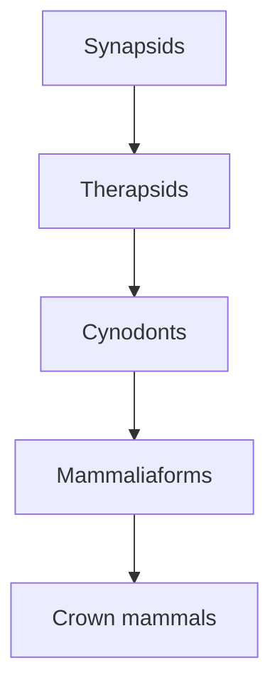

# Lesson 7 — mammals and their synapsid ancestry

This lesson uses mammals to connect four kinds of reasoning: checking sources, reading nested classifications, identifying a character suite and inferring traits that do not fossilise directly. The mammal lecture begins at [1:53:57](https://www.youtube.com/watch?v=TuWlGUq5Wi4&t=6837s); its detailed anatomical section begins at [2:36:42](https://www.youtube.com/watch?v=TuWlGUq5Wi4&t=9402s).

## Suggested route

1. [Will's opening presentation](00-wills-opening.md) records his bird-evolution follow-up, including *Archaeopteryx*, toothed birds, quill knobs and his request for a discriminating experiment.
2. [Checking claims before arguing from them](01-checking-claims.md) reconstructs Erika's whale-source audit and her response to Will's bird objections.
3. [Mesozoic mammals, classification and branching diversity](03-mesozoic-mammals-and-branches.md) explains nested groups, crown and stem branches, Mesozoic ecology and the extinction filters that shaped mammal history.
4. [Mammal traits and synapsid ancestry](02-mammal-traits-and-synapsids.md) follows jaw, middle ear, teeth, palate, hair, lactation, posture and metabolism through the fossil and developmental evidence.
5. [Will Duffy Q&A](will-duffy-qa.md) collects only Will's substantive questions and Erika's answers before superchats.

## Core storyline

The nested names are cumulative. Crown mammals are also mammaliaforms, cynodonts, therapsids and synapsids. The evidence is not a single “missing link”: it is a correlated record of changing jaws, ears, teeth, posture, brains, integument and physiology.

The full livestream is available [on YouTube](https://www.youtube.com/watch?v=TuWlGUq5Wi4). Superchat discussion begins at approximately [3:40:04](https://www.youtube.com/watch?v=TuWlGUq5Wi4&t=13204s) and is outside this revision guide.
