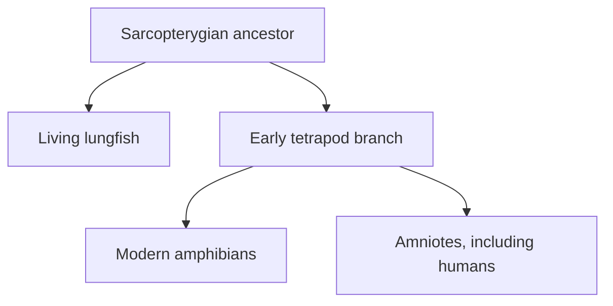

# Will's opening presentation

Will's presentation runs from about 5:09 to 28:25. It is best read as a map of
the questions he wants Erika to answer, not as the lesson's conclusions. He
focuses on four connected concerns: whether clade names contradict ordinary
definitions, whether character selection is circular, whether convergence makes
trees unfalsifiable, and how a geological column can be exposed at the surface.
He ends by proposing genetics as a possible “Final Experiment” for evolution.

## The questions Will brings to the lesson

| Theme | Will's concern | Where Erika addresses it |
| --- | --- | --- |
| Nested categories | How can a human still be a fish, or a bird still be a dinosaur, after losing or changing familiar traits? | [Logic and nested classification](01-logic-and-classification.md#6-everyday-words-versus-evolutionary-groups) |
| Choice of characters | Why are small anatomical details used instead of more obvious features? | [Characters are not chosen merely to force a tree](01-logic-and-classification.md#characters-are-not-chosen-merely-to-force-a-preferred-tree) |
| Convergence | If a conflict can be called convergence and a new branch can be added, what would falsify the tree? | [Predictions and model comparison](01-logic-and-classification.md#2-predictions-falsification-and-model-comparison) |
| Geological order | Why can very old formations occur high in a landscape or directly at the surface? | [Independent geological records](01-logic-and-classification.md#3-why-the-age-of-the-earth-is-not-one-isolated-measurement) |
| Genetics | What pattern does common descent predict, and what genetic result would count against it? | [The genetic analogy](01-logic-and-classification.md#7-how-the-genetic-analogy-is-meant-to-work) |

## 1. “Are humans animals, apes and fish? Are birds dinosaurs?”

After a short personal update, Will returns to the nested hierarchies from the
previous session. He uses Russian nesting dolls to picture categories contained
within broader categories. He says he accepts that classification is useful but
is still struggling with the claim that humans are animals, apes and fish, or
that birds are dinosaurs ([6:31](https://www.youtube.com/watch?v=aJofeBRFwvI&t=391s)).
He explicitly invites criticism and says he is listening to the pushback he has
received ([7:11](https://www.youtube.com/watch?v=aJofeBRFwvI&t=431s)).

### Will's bird argument

Will starts from three familiar generalisations: birds have beaks, birds have
wings, and birds usually fly. He acknowledges flightless birds with an asterisk,
comparing the exception to egg-laying mammals ([7:43](https://www.youtube.com/watch?v=aJofeBRFwvI&t=463s),
[8:12](https://www.youtube.com/watch?v=aJofeBRFwvI&t=492s)). He then contrasts
that description with an ordinary-language picture of a dinosaur as an animal
without a beak, wings or flight. From those premises he concludes that birds
cannot be dinosaurs ([8:36](https://www.youtube.com/watch?v=aJofeBRFwvI&t=516s)).

The revision issue to notice is **which definition appears in the premise**.
“Dinosaur” can mean “an extinct, non-avian dinosaur” in casual speech, or it can
mean the clade Dinosauria, which contains avian dinosaurs. If the premise defines
dinosaurs so as to exclude birds, the conclusion merely repeats that chosen
definition; it does not test whether birds descend from within Dinosauria.

### Will's fish syllogism

He repeats the structure with fish. Fish, as he is using the word, have fins,
gills and cold-blooded physiology; adult humans do not have those properties, so
he concludes that humans are not fish
([8:54](https://www.youtube.com/watch?v=aJofeBRFwvI&t=534s)). Will formalises it
as *modus tollens*: if **P**, then **Q**; not **Q**; therefore not **P**
([9:33](https://www.youtube.com/watch?v=aJofeBRFwvI&t=573s),
[10:00](https://www.youtube.com/watch?v=aJofeBRFwvI&t=600s)). He asks where the
logic goes wrong.

The logical form can be valid while a premise is ambiguous or false. In a
clade-based premise, membership means descent from a common ancestor, not
retaining every ancestral adult feature unchanged. Tetrapods can lose adult
gills, transform paired fins into limbs and evolve internal temperature control
without leaving the lineage in which those changes occurred. This is the exact
definition problem that Erika later tackles with her imaginary-creature exercise.

## 2. Why these small anatomical characters?

On rewatching the mammal lesson, Will notices that taxonomic diagnoses often use
features much smaller than “has wings” or “has fur.” His examples are the
dentary–squamosal jaw joint used to diagnose mammals, the postorbital bar used
in primate anatomy, and the endostyle/thyroid relationship discussed for
chordates ([10:23](https://www.youtube.com/watch?v=aJofeBRFwvI&t=623s)).

He asks the same question about each:

- Why use the joint between the dentary and squamosal rather than another part
  of the skull ([10:54](https://www.youtube.com/watch?v=aJofeBRFwvI&t=654s))?
- Why use the small postorbital bar rather than a more conspicuous primate
  feature ([11:36](https://www.youtube.com/watch?v=aJofeBRFwvI&t=696s))?
- Why connect the vertebrate thyroid with the endostyle and use this in the
  chordate character suite ([12:03](https://www.youtube.com/watch?v=aJofeBRFwvI&t=723s))?

Will describes these as apparently peculiar or minor choices. The concern behind
the examples is possible circularity: if biologists first assume an evolutionary
tree and then select the characters that fit it, the resulting nesting would
not be an independent test. Erika's eventual answer is that no one feature is
supposed to carry the classification. Researchers compare a matrix of characters,
including conflicts, and then test the recovered pattern with additional data.

## 3. The appendix and repeated evolution

Will next asks why the appendix is not used as a major grouping character. He
reasons that it is another small anatomical structure distributed across
multiple mammals, so it appears to fit the pattern of the earlier examples
([13:02](https://www.youtube.com/watch?v=aJofeBRFwvI&t=782s)). He then cites a
*Science* news report, [“Appendix Evolved More Than 30 Times”](https://www.science.org/content/article/appendix-evolved-more-30-times),
which covered a comparison of 361 mammal species. Fifty were coded as having an
appendix, and the study inferred at least 32 independent origins, perhaps as
many as 38 ([13:52](https://www.youtube.com/watch?v=aJofeBRFwvI&t=832s),
[14:39](https://www.youtube.com/watch?v=aJofeBRFwvI&t=879s)). The underlying
paper is [Smith et al., “Multiple independent appearances of the cecal appendix in mammalian evolution” (2013)](https://doi.org/10.1016/j.crpv.2012.12.001).

He connects this to what he remembers learning as a child: that the appendix was
a useless vestige. The evidence for immune and microbiome-related functions
makes him suspicious of treating it as evidence for evolution
([14:07](https://www.youtube.com/watch?v=aJofeBRFwvI&t=847s)). Keep two concepts
separate when revising this point:

- **Vestigial does not mean functionless.** A structure can retain or acquire a
  function while being reduced or changed from an ancestral condition.
- **Convergence concerns history, not usefulness.** A useful structure may
  evolve independently in several lineages; that distribution is then one
  potentially conflicting character among many.

Will's appendix example is therefore an important challenge about character
weighting, but the organ's present function does not by itself decide whether
its form is ancestral, convergent or modified.

## 4. The colugo as Will's test of tree flexibility

Will uses the so-called flying lemur—the colugo—as his strongest example of a
difficult classification. The animal glides rather than flying and is not a
lemur ([15:55](https://www.youtube.com/watch?v=aJofeBRFwvI&t=955s),
[16:10](https://www.youtube.com/watch?v=aJofeBRFwvI&t=970s)). He recounts how
earlier workers compared colugos with insectivores on dental grounds, with tree
shrews on skeletal grounds, and with lemurs on the basis of large forward-facing
eyes, rounded ears, long limbs and arboreal habits
([16:25](https://www.youtube.com/watch?v=aJofeBRFwvI&t=985s),
[17:23](https://www.youtube.com/watch?v=aJofeBRFwvI&t=1043s)).

Genetic results did not place colugos inside bats, tree shrews or lemurs. They
are recognised as their own branch, Dermoptera, close to Primates. Will refers
to Hank Green's video [“Is This Weird Animal Our Closest Relative?”](https://www.youtube.com/watch?v=MYvWxCBWmDc),
which describes colugos as the closest living *non-primate group* to primates
([18:46](https://www.youtube.com/watch?v=aJofeBRFwvI&t=1126s),
[19:12](https://www.youtube.com/watch?v=aJofeBRFwvI&t=1152s)). This is a branch-
level relationship, not the claim that a colugo is closer to a human than a
chimpanzee or other primate is.

Will interprets the history as evidence that the system is too malleable: move
an animal when genetics conflicts with anatomy, label repeated anatomy
convergence, and add a branch when it fits nowhere else
([19:32](https://www.youtube.com/watch?v=aJofeBRFwvI&t=1172s)). By
[20:07](https://www.youtube.com/watch?v=aJofeBRFwvI&t=1207s), his core question
is explicit: what observation could falsify the nested hierarchy if apparent
exceptions can always be accommodated?

The question Erika inherits is not whether a tree may be revised—it should be
revised when new evidence arrives—but whether revisions make novel predictions
and improve consistency across independent datasets. A new branch is not an
exemption from a tree; every branch has a precise position that genetic and
anatomical data can support or contradict.

## 5. Why do old rocks occur at the surface?

Will agrees that disagreement about the geological column blocks progress. He
explains that his mental model comes from archaeological tells: settlements are
built repeatedly in the same place, producing a mound with younger occupation
layers over older ones ([20:38](https://www.youtube.com/watch?v=aJofeBRFwvI&t=1238s),
[21:45](https://www.youtube.com/watch?v=aJofeBRFwvI&t=1305s)). He mentions the
unexcavated tell at Colossae and the excavated Tell Megiddo to show why an
archaeologist may imagine a vertical “layer cake” that must be dug from the
youngest layer down ([22:26](https://www.youtube.com/watch?v=aJofeBRFwvI&t=1346s),
[23:04](https://www.youtube.com/watch?v=aJofeBRFwvI&t=1384s)).

That model clashes with his fossil-digging experience. In the Hell Creek
Formation in Montana, the dinosaur-bearing horizon was reached by removing a
grey overlying material near the top of a hill, not by digging through every
later period in the geological column. He reports finding a tyrannosaur tooth
and partial skull, while his daughter found *Edmontosaurus* and *Triceratops*
material ([24:30](https://www.youtube.com/watch?v=aJofeBRFwvI&t=1470s),
[25:12](https://www.youtube.com/watch?v=aJofeBRFwvI&t=1512s)).

He also recounts being told of Cambrian and Precambrian rocks exposed at the
surface in Utah, including a locality where the reported order appeared reversed
([25:51](https://www.youtube.com/watch?v=aJofeBRFwvI&t=1551s),
[26:22](https://www.youtube.com/watch?v=aJofeBRFwvI&t=1582s)). Will presents
these as second-hand observations and repeatedly says that he may be missing
something. The missing variables he asks Erika to explain are erosion, uplift,
folding, faulting, subduction and incomplete deposition: the geological column
is a global sequence reconstructed by correlation, not a claim that every
location preserves every interval in one horizontal stack.

## 6. Genetics as a possible “Final Experiment”

Will closes with comments viewers made during the previous stream: “genetics”
and “falsifiability” were repeatedly proposed when he asked what an evolutionary
equivalent of The Final Experiment might be
([26:54](https://www.youtube.com/watch?v=aJofeBRFwvI&t=1614s),
[27:20](https://www.youtube.com/watch?v=aJofeBRFwvI&t=1640s)). He is unusually
open about the stakes. He thinks genetics could potentially confirm evolution
strongly enough to persuade many young-Earth creationists
([27:39](https://www.youtube.com/watch?v=aJofeBRFwvI&t=1659s)).

His request is for a result specified *before* looking at the answer:

1. What genetic pattern does common descent predict?
2. Why would that pattern be unlikely under a competing explanation?
3. What genetic pattern would count against common descent?

He asks those questions directly at
[28:08](https://www.youtube.com/watch?v=aJofeBRFwvI&t=1688s). They become the
organising thread for Erika's later comparison of whole genomes, shared neutral
changes, outgroups and independently recovered trees.

## One-minute recall

- State Will's bird or fish syllogism and identify the disputed premise.
- Name his three examples of “small” classification characters.
- Why does the appendix distribution make him worry about convergence?
- What did successive forms of evidence suggest about colugo relationships?
- Why did Will's experience of archaeological tells create the wrong mental
  picture for a global geological column?
- What prediction-and-falsifier pair does he ask geneticists to provide?
