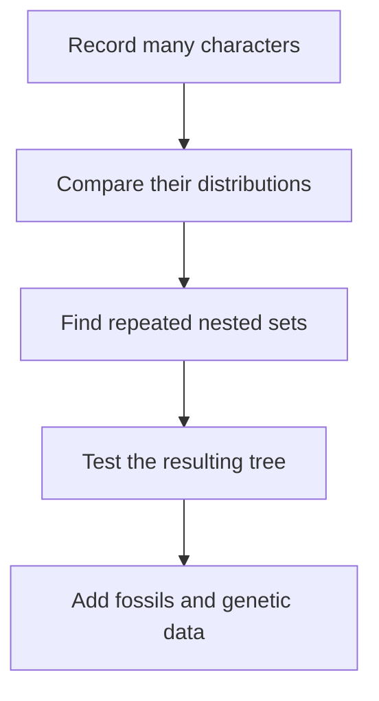
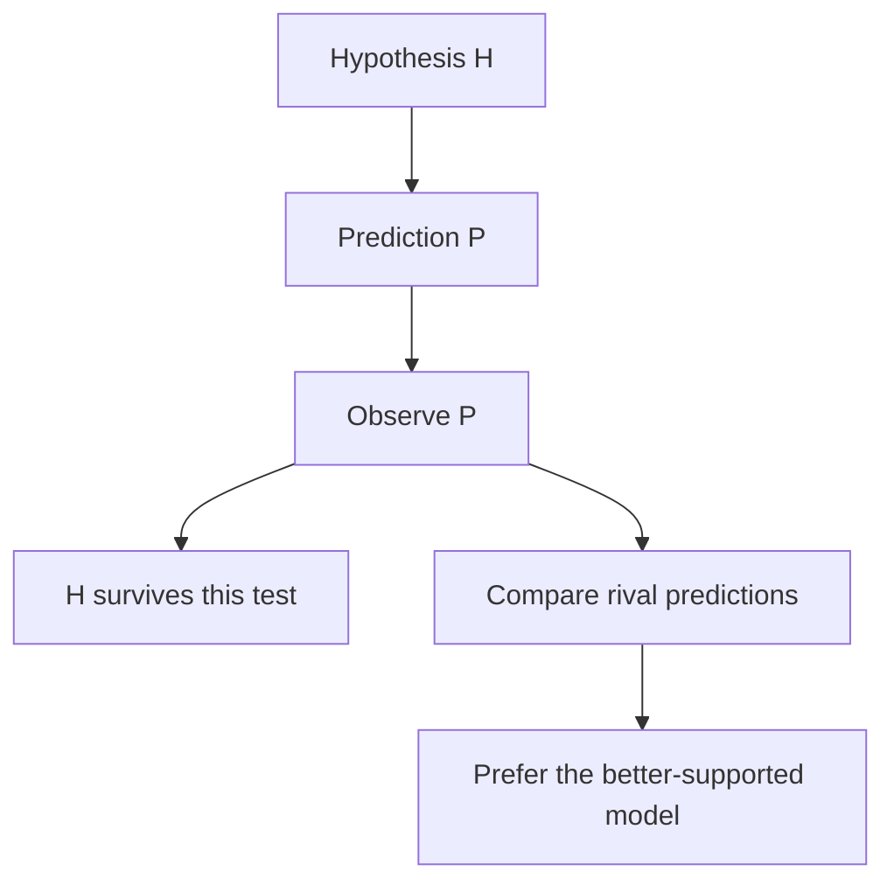
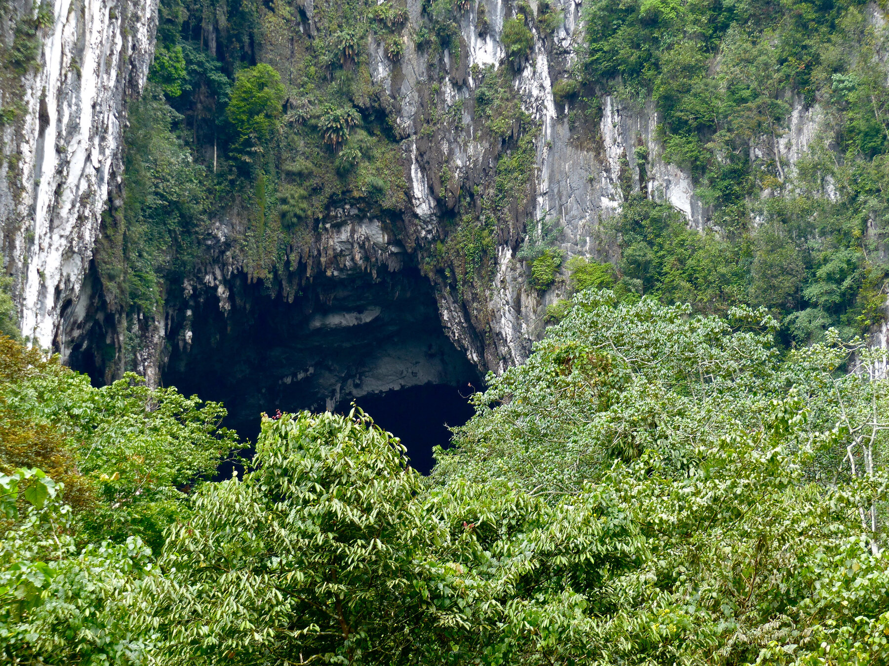
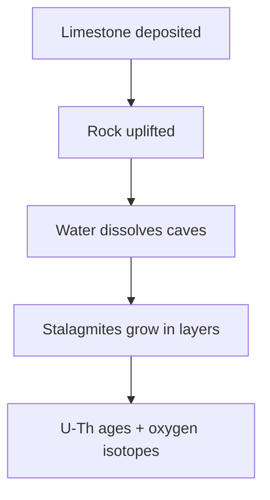
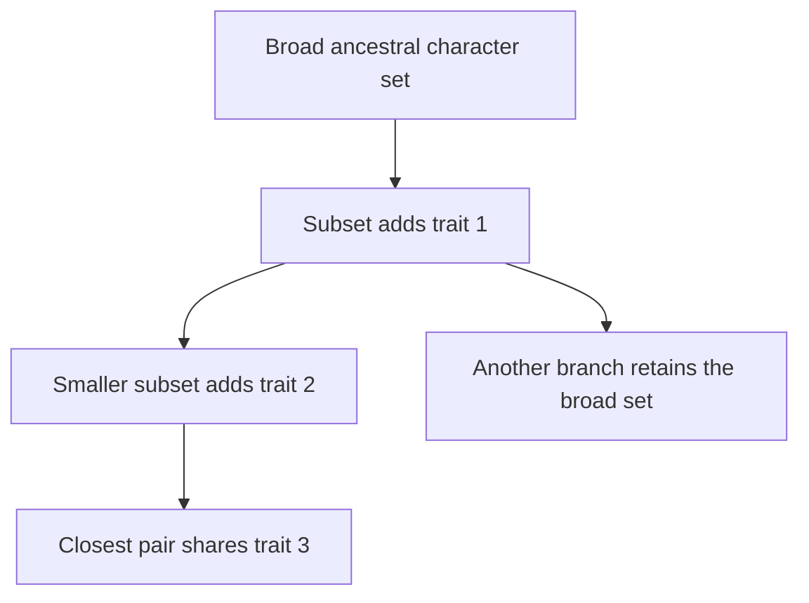

# Logic, evidence and nested classification

This part of the stream is the conceptual foundation for the fossil lesson that
follows. Erika first answers Will's objections, then reviews how scientific
predictions, geology, selection and biological classification fit together.
The central idea is not that one resemblance “proves evolution.” It is that
many partly independent observations can be compared with the expectations of
competing explanations.

## What you should be able to explain

After revising this note, you should be able to:

- distinguish a prediction from proof by affirming the consequent;
- explain why independent geological records are stronger together than any
  one date considered alone;
- separate mutation, natural selection and sexual selection;
- construct a nested classification from a *set* of characters rather than one
  conspicuous feature; and
- explain why genetic comparisons can resolve relationships that morphology
  leaves uncertain.

## 1. Erika's response to Will's opening

Erika begins by saying that several of Will's points will be addressed in the
slides, especially his difficulty with nested hierarchy. She does not dismiss
that difficulty: she calls it a hard concept and proposes trying a different
visual explanation ([28:52](https://www.youtube.com/watch?v=aJofeBRFwvI&t=1732s)).

### Characters are not chosen merely to force a preferred tree

Will had asked why biologists use traits such as a particular jaw joint or an
opening in a skull rather than broad features such as flying or possessing
scales. Erika's answer is that researchers do not begin by deciding which
organisms they want together and then pick convenient traits. They record many
characters and examine their distribution. The group is diagnosed by the
*combination* of shared characters, not by whichever single feature looks most
striking ([30:14](https://www.youtube.com/watch?v=aJofeBRFwvI&t=1814s)).

This distinction matters because an isolated trait may evolve more than once.
Wings unite bats and birds in an everyday category of “flying animals,” but
wings alone do not erase the much larger suites of mammalian and avian traits.
Likewise, the scales of a pangolin and those of a crocodilian are not sufficient
to make them closest relatives. A pangolin still has the broader mammalian
character set ([2:03:43](https://www.youtube.com/watch?v=aJofeBRFwvI&t=7423s)).

Erika also grants that Will's geological questions are fair. Earlier lessons
had not yet explained erosion, uplift or subduction in enough detail, so a
surface exposure can look puzzling if one imagines strata as an undisturbed
stack that simply accumulates forever ([31:19](https://www.youtube.com/watch?v=aJofeBRFwvI&t=1879s)).
The later geological review is meant to supply that missing context.

### Morphology is useful; genetics offers an additional test

Erika compares morphology with recognising cousins by appearance. Family
resemblance can be informative, but it may not settle every close relationship.
DNA is analogous to having a much larger inheritance record available
([32:51](https://www.youtube.com/watch?v=aJofeBRFwvI&t=1971s)). Convergent
evolution can also make unrelated organisms look alike because they face
similar functional demands. Even so, she notes that trees originally built
from morphology are often close to later molecular trees; genetic evidence
usually refines difficult branches rather than replacing the entire structure
([34:17](https://www.youtube.com/watch?v=aJofeBRFwvI&t=2057s)).

Her colugo example illustrates the point. “Flying lemur” is a misleading common
name: colugos are neither true flyers nor lemurs. Genetic evidence places their
branch near primates without requiring researchers to treat one superficial
similarity as decisive ([34:57](https://www.youtube.com/watch?v=aJofeBRFwvI&t=2097s)).
For living organisms, Erika treats genetics as the stronger relationship test;
for fossils, where DNA is normally unavailable, anatomy remains indispensable
([36:28](https://www.youtube.com/watch?v=aJofeBRFwvI&t=2188s)).

> **Method note:** Genetic evidence is not a magic similarity score. Later in
> the discussion Erika emphasises comparisons across many sequences and the use
> of outgroups. Correctly identifying corresponding sequences and checking that
> different methods recover the same branching pattern are part of the test.

## 2. Predictions, falsification and model comparison

Erika restates the purpose of the course: Will asked to be taught evolution, so
the sessions should show both what the theory says and how its claims can be
tested ([39:54](https://www.youtube.com/watch?v=aJofeBRFwvI&t=2394s)). A useful
scientific prediction is risky—it describes a result that could have turned out
differently. Evolutionary theory therefore needs more than observations that
can be made compatible with any possible history ([41:15](https://www.youtube.com/watch?v=aJofeBRFwvI&t=2475s)).

### Do not reverse a conditional

Suppose a model predicts observation **P**. Finding **P** does not deductively
prove that model, because another model might also predict **P**. The scientific
task is to ask whether the alternatives predict the *same total pattern* at
least as well.

This avoids two opposite mistakes:

1. **“The prediction succeeded, therefore the theory is proven.”** A successful
   prediction supports a model but is not deductive certainty.
2. **“I can imagine another explanation, therefore the evidence has no force.”**
   An alternative must itself account for the details and make discriminating
   predictions.

Will raises the familiar “Cambrian rabbit” challenge. Erika agrees that a
genuine mammal fossil in securely established Cambrian rock would radically
conflict with the expected fossil order. She adds that provenance matters: a
loose object placed in old sediment, contamination, or a reworked specimen is
not equivalent to an organism fossilised *as part of* that stratum
([42:02](https://www.youtube.com/watch?v=aJofeBRFwvI&t=2522s)). Her framing at
[42:53](https://www.youtube.com/watch?v=aJofeBRFwvI&t=2573s) is therefore a
comparison of common descent and special creation: which model predicts the
observed nested anatomy, genetic hierarchy and chronological sequence with
fewer ad hoc exceptions?

## 3. Why the age of the Earth is not one isolated measurement

Erika's geology review is an exercise in converging evidence. She begins with
records that contain repeated annual or near-annual layers: tree rings, ice
cores and lake varves. These can be counted and cross-matched, extending the
record far beyond a human lifetime without initially depending on a single
radiometric age ([48:20](https://www.youtube.com/watch?v=aJofeBRFwvI&t=2900s)).
Sedimentary sequences and thick limestone formations add records of deposition,
burial and later exposure; measured plate motion and mountain building supply
yet another scale of geological change ([49:16](https://www.youtube.com/watch?v=aJofeBRFwvI&t=2956s)).

### The Mulu cave example

Erika uses her visit to Gunung Mulu National Park in Borneo as a concrete case.
The caves occur within the very thick Melinau Limestone Formation. The rock is
made largely from accumulated marine carbonate material, including microfossils,
and was later uplifted and dissolved by water to form enormous cave systems
([53:28](https://www.youtube.com/watch?v=aJofeBRFwvI&t=3208s)). Active rivers
still run through and enlarge parts of the system, so the landscape records
deposition, uplift, erosion and continuing dissolution rather than one simple
event.

**Image note.** Deer Cave in Gunung Mulu National Park, the same cave landscape Erika uses to make the timescale concrete. The photograph shows the scale of the **opening**, not the microscopic evidence or uranium-thorium measurement itself; the scientific inference comes from the formation's stratigraphy and replicated stalagmite records described below. Photograph by Bernard Dupont, [source file](https://commons.wikimedia.org/wiki/File:Deer_Cave_Entrance.jpg), [CC BY-SA 2.0](https://creativecommons.org/licenses/by-sa/2.0/); downloaded and resized for the guide.

Stalagmites then provide a record *inside* that older limestone. Erika explains
that carbonate layers can be dated by uranium-series methods—specifically
uranium-thorium dating in the study she describes ([58:20](https://www.youtube.com/watch?v=aJofeBRFwvI&t=3500s)).
The researchers sampled eleven stalagmites from separate caves and dated layers
through their growth sequences ([59:09](https://www.youtube.com/watch?v=aJofeBRFwvI&t=3549s)).
Oxygen-isotope ratios in those layers act as a climate proxy, so each specimen
contains both an age sequence and a record of wetter or drier conditions
([1:00:07](https://www.youtube.com/watch?v=aJofeBRFwvI&t=3607s)).

The important result is replication: overlapping portions of independently
formed stalagmites show corresponding oxygen-isotope cycles at compatible
dates ([1:02:22](https://www.youtube.com/watch?v=aJofeBRFwvI&t=3742s)). The
argument is therefore not “trust this one stalagmite.” Different caves and
different specimens reproduce a regional climate pattern, including long
orbital-scale cycles.

### Plate movement, ash and historical cross-checks

Indonesia's volcanoes are related to plate boundaries and subduction
([1:03:35](https://www.youtube.com/watch?v=aJofeBRFwvI&t=3815s)). Erika links
this large-scale geology to testable rates: seafloor ages and the distances
created by spreading can be compared with present-day movement measured by GPS
([1:07:28](https://www.youtube.com/watch?v=aJofeBRFwvI&t=4048s)). Historical
eruptions provide shorter cross-checks because ash layers can be radiometrically
dated and compared with written or archaeological records
([1:09:39](https://www.youtube.com/watch?v=aJofeBRFwvI&t=4179s)).

Her examples include the volcanic history recorded around Borobudur and the
large 1257 Samalas eruption ([1:11:07](https://www.youtube.com/watch?v=aJofeBRFwvI&t=4267s)).
An ash bed below another deposit must have been laid down first, illustrating
superposition, while chemical matching can connect ash at distant sites to an
eruption ([1:12:49](https://www.youtube.com/watch?v=aJofeBRFwvI&t=4369s)).
Erika's conclusion is cumulative: radiometric ages, measured plate movement,
layer order, historical evidence and isotope records constrain one another
([1:13:43](https://www.youtube.com/watch?v=aJofeBRFwvI&t=4423s)). Will responds
that independent archaeological checks—his example is a dated coin found in a
layer—are exactly the kind of corroboration he wants to investigate
([1:14:29](https://www.youtube.com/watch?v=aJofeBRFwvI&t=4469s)).

## 4. Mutation supplies variation; selection changes its distribution

Erika defines a mutation as a lasting change in DNA and reviews several scales:
single-base substitutions, insertions or deletions, and larger duplications or
rearrangements. A mutation must occur in the germ line to be transmitted to
offspring; a somatic mutation in one person's body cells is not normally passed
to the next generation ([1:15:01](https://www.youtube.com/watch?v=aJofeBRFwvI&t=4501s)).
Mutations are probabilistic rather than appearing because an organism “needs”
one, although some genomic locations mutate more often than others
([1:16:26](https://www.youtube.com/watch?v=aJofeBRFwvI&t=4586s)).

Natural selection is the population-level consequence of differential
reproductive success. Individuals with a heritable variant that works better
in the current environment tend, on average, to contribute more descendants;
the variant can consequently become more common
([1:16:42](https://www.youtube.com/watch?v=aJofeBRFwvI&t=4602s)). Mutation and
selection therefore do different jobs:

| Process | Role in Erika's explanation | What it does **not** imply |
| --- | --- | --- |
| Mutation | Produces new heritable variation | The environment requests the needed change |
| Natural selection | Filters variation through differences in survival and reproduction | Every mutation is beneficial or that organisms consciously adapt |

The environment determines the consequence, not the origin, of the variant
([1:18:05](https://www.youtube.com/watch?v=aJofeBRFwvI&t=4685s)). Erika uses
light and dark moths, then dark mice on volcanic rock, to show that camouflage
can be helpful in one setting and harmful in another
([1:19:04](https://www.youtube.com/watch?v=aJofeBRFwvI&t=4744s),
[1:28:01](https://www.youtube.com/watch?v=aJofeBRFwvI&t=5281s)). “Beneficial”
and “harmful” are thus shorthand for effects on reproductive success in a
specified environment, not permanent labels attached to a mutation
([1:21:36](https://www.youtube.com/watch?v=aJofeBRFwvI&t=4896s)).

### A human example: Bajau diving physiology

Erika describes visiting Bajau communities whose traditional lifestyle involves
repeated breath-hold diving ([1:22:07](https://www.youtube.com/watch?v=aJofeBRFwvI&t=4927s)).
She discusses a 2018 study that found larger average spleens in the sampled
Bajau population—about 50% larger than in a neighbouring comparison group—and
identified selection signals involving *PDE10A*, a gene connected through
thyroid-hormone regulation to spleen size
([1:24:44](https://www.youtube.com/watch?v=aJofeBRFwvI&t=5084s)). A larger spleen
can release more oxygenated red blood cells during a dive, so the proposed
advantage is specific to prolonged diving. The cited study is
[Ilardo et al., “Physiological and Genetic Adaptations to Diving in Sea Nomads” (2018)](https://doi.org/10.1016/j.cell.2018.03.054).

Erika contrasts this with high-altitude populations, including Tibetans and
Sherpa, where low-oxygen conditions favoured other physiological pathways
([1:26:28](https://www.youtube.com/watch?v=aJofeBRFwvI&t=5188s)). Similar
environmental problems can therefore produce convergent *outcomes* without the
same mutation or anatomical mechanism. That is another reason not to classify
organisms from a single adaptive resemblance.

## 5. Sexual selection is about mating success

Erika next separates natural selection in the broad survival-and-reproduction
sense from sexual selection, where trait frequencies change because individuals
differ in obtaining mates or producing offspring
([1:28:42](https://www.youtube.com/watch?v=aJofeBRFwvI&t=5322s)). Two processes
can operate together:

- **Intrasexual competition:** individuals compete with members of the same sex,
  as with antlers, horns or direct combat.
- **Mate choice:** one sex preferentially mates with individuals possessing a
  display, signal or behaviour.

Sexual dimorphism—the sexes differing in size, colour or structures—can be a
clue, not an automatic proof, that sexual selection has acted. Erika illustrates
it with mandrills, peafowl, moose and salmon
([1:31:01](https://www.youtube.com/watch?v=aJofeBRFwvI&t=5461s)). The fitness cost
need not be immediate death. Darwin's key point, as Erika explains it, is that
an individual may simply leave fewer offspring than a competitor
([1:31:48](https://www.youtube.com/watch?v=aJofeBRFwvI&t=5508s)).

Examples in the lesson show why one mechanism should not be assumed for every
species:

| Example | Selection point made in the stream |
| --- | --- |
| Great argus pheasant | The male clears a display court and presents an elaborate wing display; Erika uses it for mate choice ([1:33:13](https://www.youtube.com/watch?v=aJofeBRFwvI&t=5593s)). |
| Komodo dragon | Male competition and female choice can both influence reproduction ([1:34:06](https://www.youtube.com/watch?v=aJofeBRFwvI&t=5646s)). |
| Large female pythons, raptors and spiders | Larger females may produce or provision more offspring; this is fecundity selection, not a rule that males must always be larger ([1:34:51](https://www.youtube.com/watch?v=aJofeBRFwvI&t=5691s)). |
| Beetle horns and “headgear” | Structures may function in male competition while also being affected by mate preference ([1:37:08](https://www.youtube.com/watch?v=aJofeBRFwvI&t=5828s)). |
| Peafowl trains | Erika's review of multiple papers is that the train matters, but females can integrate several visual, behavioural and condition cues; “longest train always wins” is too simple ([1:41:06](https://www.youtube.com/watch?v=aJofeBRFwvI&t=6066s), [1:43:28](https://www.youtube.com/watch?v=aJofeBRFwvI&t=6208s)). |
| Flanged male orangutans | Adult males can show alternative developmental and reproductive strategies rather than every male immediately developing the same form ([1:44:50](https://www.youtube.com/watch?v=aJofeBRFwvI&t=6290s)). |
| Proboscis-monkey noses | The large male nose affects vocal resonance and is associated with social and mating signals; related traits can change as a correlated response ([1:46:23](https://www.youtube.com/watch?v=aJofeBRFwvI&t=6383s), [1:47:43](https://www.youtube.com/watch?v=aJofeBRFwvI&t=6463s)). |

Proboscis monkeys also swim in mangrove and river habitats. Erika uses that fact
to remind viewers that natural and sexual selection can act on different
aspects of the same animal at the same time ([1:48:35](https://www.youtube.com/watch?v=aJofeBRFwvI&t=6515s)).

## 6. Everyday words versus evolutionary groups

Will's syllogisms rely on traditional word boundaries: birds have wings whereas
“dinosaurs” do not; fish have fins whereas humans do not. Erika replies that
scientific categories changed when ancestry became part of the definition.
Historically, *dinosaur* was often used only for non-avian forms and *ape* only
for non-human apes. In cladistics, descendants do not leave their ancestral
groups merely because they acquire a distinctive form
([1:49:10](https://www.youtube.com/watch?v=aJofeBRFwvI&t=6550s)).

Everyday languages also divide nature differently. Erika gives the Malay words
*orang* (“person”) and *hutan* (“forest”), from which *orangutan* means “person
of the forest” ([1:50:39](https://www.youtube.com/watch?v=aJofeBRFwvI&t=6639s)).
That naming history does not by itself settle a biological relationship. Her
question—whose ordinary definition is the uniquely correct one?—shows why
technical definitions need explicit criteria
([1:52:04](https://www.youtube.com/watch?v=aJofeBRFwvI&t=6724s)).

### Erika's imaginary-creature sorting exercise

Erika presents cartoon organisms that vary across eight characters
([1:56:54](https://www.youtube.com/watch?v=aJofeBRFwvI&t=7014s)). Sorting them by
only colour, appendage shape or one other trait produces competing arrangements
([1:57:39](https://www.youtube.com/watch?v=aJofeBRFwvI&t=7059s)). When the whole
character set is considered, repeated subsets appear: a broad shared suite,
then additional derived traits within successively narrower subsets
([1:58:20](https://www.youtube.com/watch?v=aJofeBRFwvI&t=7100s)).

A narrower label does not cancel the broader one. In Erika's example, sharing a
new trait places two creatures in a smaller group, but both remain members of
every broader group diagnosed earlier ([2:00:03](https://www.youtube.com/watch?v=aJofeBRFwvI&t=7203s)).
A conflicting colour can be a convergence or reversal; it is weighed against
the complete character pattern rather than being ignored
([2:02:35](https://www.youtube.com/watch?v=aJofeBRFwvI&t=7355s)).

Applied to humans, the nesting is cumulative:

> eukaryote → animal → chordate → vertebrate → tetrapod → mammal → primate →
> hominid → *Homo sapiens*

Each later term adds distinguishing features; none removes the inherited traits
that diagnose the earlier groups ([2:04:12](https://www.youtube.com/watch?v=aJofeBRFwvI&t=7452s)).
Erika calls this repeated hierarchy powerful because it emerges across many
characters, while also acknowledging that morphology can be incomplete and
genetic data can refine the tips of a tree
([2:11:15](https://www.youtube.com/watch?v=aJofeBRFwvI&t=7875s)). Will says the
physical sorting logic makes sense, although he still wants to understand how
the genetic version works ([2:13:02](https://www.youtube.com/watch?v=aJofeBRFwvI&t=7982s)).

## 7. How the genetic analogy is meant to work

Will asks whether an objective tree requires every individual trait to agree.
Erika answers that the total character set should recover a close approximation
to the relationship, and that genetics provides an independent check on the
imaginary-creature result ([2:13:18](https://www.youtube.com/watch?v=aJofeBRFwvI&t=7998s)).
When morphology and genetics appear to conflict—Will mentions whales and hippos,
and hyraxes and elephants—Erika says molecular data revealed relationships that
were difficult to see from the most conspicuous external traits, while closer
study also identified less obvious anatomical consistencies
([2:14:43](https://www.youtube.com/watch?v=aJofeBRFwvI&t=8083s)).

Her manuscript analogy distinguishes functional similarity from shared errors.
Two books on the same subject may use many of the same necessary words without
having been copied from one another. Repeated, matching typos or arbitrary
changes are more informative about a copying history
([2:19:11](https://www.youtube.com/watch?v=aJofeBRFwvI&t=8351s)). Similarly,
functional DNA may resemble other functional DNA because similar organisms need
similar processes, whereas shared neutral changes can be especially informative
about inheritance. Erika says the comparison should be genome-wide rather than
resting on a hand-picked gene ([2:20:48](https://www.youtube.com/watch?v=aJofeBRFwvI&t=8448s)).

Will asks whether ENCODE's claims about biochemical activity undermine the idea
of “nonfunctional” sequence ([2:23:17](https://www.youtube.com/watch?v=aJofeBRFwvI&t=8597s)).
Erika's broader response is methodological: a designer could be proposed to
produce any pattern, but if every possible result is compatible with the model,
it becomes difficult to distinguish through testing
([2:24:43](https://www.youtube.com/watch?v=aJofeBRFwvI&t=8683s)). Known dog
pedigrees provide a practical validation case: genetic methods can be asked to
recover relationships already documented by breeders
([2:25:22](https://www.youtube.com/watch?v=aJofeBRFwvI&t=8722s)).

There is no universal percentage at which common ancestry switches from “yes”
to “no.” Erika says relationships are inferred from *relative* patterns across
multiple organisms and methods. A result that consistently made humans closer
to mice than to other primates would contradict the expected topology; in
practice, independent datasets recover the ape relationship
([2:37:18](https://www.youtube.com/watch?v=aJofeBRFwvI&t=9438s),
[2:38:37](https://www.youtube.com/watch?v=aJofeBRFwvI&t=9517s)). This is why she
criticises pairwise human–chimpanzee comparisons that omit outgroups: without a
third reference, a percentage alone does not establish the branching order
([2:39:48](https://www.youtube.com/watch?v=aJofeBRFwvI&t=9588s)). A method that
reports roughly 87% for human versus human and 86% for human versus chimpanzee
has also failed an obvious calibration check
([2:41:14](https://www.youtube.com/watch?v=aJofeBRFwvI&t=9674s)).

## Common confusions to correct

| Confusion | Revision correction |
| --- | --- |
| “One successful prediction proves the theory.” | It supports the theory; strength comes from discriminating predictions and comparison with alternatives. |
| “A useful or convergent trait cannot carry ancestry information.” | Function and convergence affect how a character is weighted; the whole nested pattern remains testable. |
| “Mutation happens because an organism needs to adapt.” | Mutation supplies probabilistic variation; the environment changes which heritable variants reproduce. |
| “Sexual selection always means bright males chosen by females.” | Competition, choice and fecundity selection vary across species and can act in either sex. |
| “Being in a narrower clade removes the older label.” | Descendants retain membership in ancestral clades: birds remain dinosaurs and tetrapods remain sarcopterygians. |
| “A single DNA-similarity percentage gives the family tree.” | A tree needs relative comparisons, outgroups, many sequences and methodological calibration. |

## Active recall

1. Why does an authentic out-of-place fossil require secure stratigraphic
   context?
2. Name three mutually independent checks mentioned in Erika's geological
   discussion.
3. In the Bajau example, what supplies the variation, what environmental
   activity affects its fitness, and what physiological effect is proposed?
4. Why can pangolin scales conflict with one character while the full character
   set still places pangolins among mammals?
5. Why are shared “typos” more informative in Erika's manuscript analogy than
   ordinary functional words?
6. What control would reveal that a DNA-similarity method is badly calibrated?
