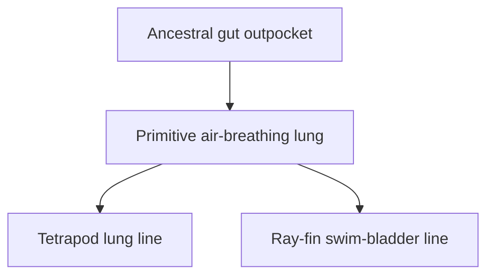
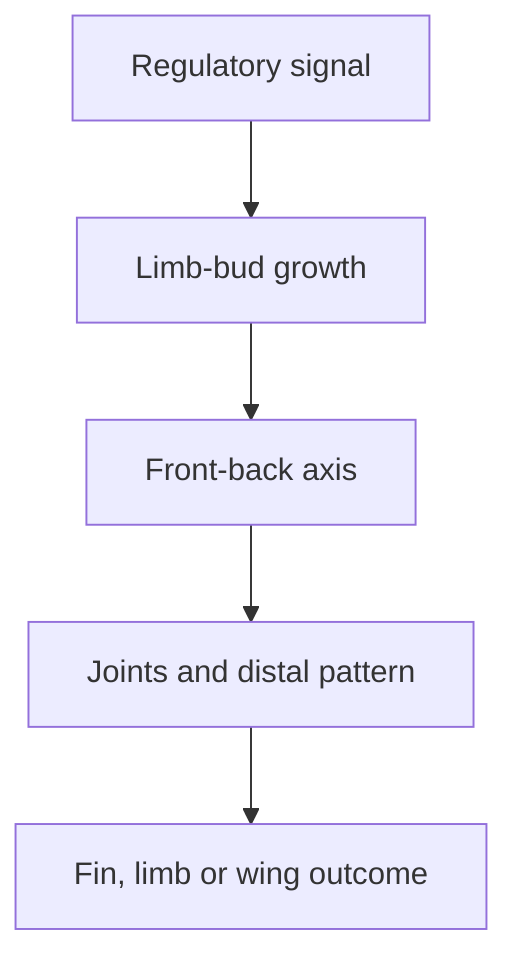

# From lobe-finned fish to tetrapods

The fish–tetrapod transition is not a story about a modern aquarium fish suddenly turning into a salamander. Erika first identifies the relevant branch of bony vertebrates, then asks whether anatomy, development, genes, fossils and geology independently place tetrapods inside that branch.

## What you should learn

After revising this note, you should be able to:

- distinguish ray-finned fish from lobe-finned vertebrates;
- explain why “fish” is useful colloquially but incomplete as a clade;
- recognise the one-bone, two-bones, wrist/ankle, digits limb pattern;
- describe how lungs and swim bladders are developmentally related;
- explain how changes in developmental signalling can alter fins and limbs; and
- state what *Tiktaalik* was predicted to have without claiming it was a modern land walker or a known direct ancestor.

## Start with the limb pattern

Erika begins the case study at [2:43:08](https://www.youtube.com/watch?v=aJofeBRFwvI&t=9788s). A ray-finned fish and a rodent both possess a skull, vertebral column, paired appendages and many corresponding organ systems. The major contrast she isolates is the internal construction of the paired appendages.

All limbed tetrapods inherit the same basic sequence:

In a forelimb, the sequence is humerus → radius and ulna → carpals → digits. In a hind limb, it is femur → tibia and fibula → tarsals → digits. Wings, flippers, hands and hooves can alter or lose pieces, but the inherited layout remains recognisable. Erika describes it directly at [2:43:50](https://www.youtube.com/watch?v=aJofeBRFwvI&t=9830s).

The pattern is a homology claim, not a claim that all limbs perform the same job. A whale flipper, bird wing and human arm differ functionally because descendants modified the shared construction.

## “Fish” is not one complete evolutionary branch

At [2:46:23](https://www.youtube.com/watch?v=aJofeBRFwvI&t=9983s), Erika explains why the question “How did a fish become a tetrapod?” is too broad. The everyday category “fish” groups aquatic vertebrates while excluding many descendants of their common ancestors. It contains jawless vertebrates, cartilaginous fishes, ray-finned fishes and lobe-finned fishes, which do not form one exclusive branch once tetrapods are omitted.

Her hierarchy separates successive character sets:

| Branching distinction | Example outside the next group | Added character emphasised in the lesson |
| --- | --- | --- |
| Chordates versus other animals | Flatworm | Notochord and dorsal nerve-cord pattern |
| Jawless versus jawed vertebrates | Lamprey | Jaws |
| Cartilaginous versus bony vertebrates | Shark | Bony internal skeleton |
| Ray-finned versus lobe-finned bony vertebrates | Salmon | Lobed appendage joined by a single proximal bone |
| Non-tetrapod sarcopterygians versus tetrapods | Lungfish | Digited limb lineage and its descendant character suite |

Most living species ordinarily called fish are actinopterygians—ray-finned fish ([2:47:51](https://www.youtube.com/watch?v=aJofeBRFwvI&t=10071s)). Sarcopterygians are the much smaller living set of coelacanths and lungfishes **plus tetrapods and their extinct relatives**. When someone says humans are “fish,” the precise cladistic statement is that humans remain sarcopterygians because our branch descends from within Sarcopterygii.

At [2:48:32](https://www.youtube.com/watch?v=aJofeBRFwvI&t=10112s), Erika emphasises that this is not descent from a living coelacanth or lungfish. Those are surviving cousin branches. The relevant shared anatomy is the single proximal element connecting a paired appendage to the body, along with many other skeletal and genetic characters.

## What counts as a tetrapod?

Erika gives a simplified definition at [2:51:06](https://www.youtube.com/watch?v=aJofeBRFwvI&t=10266s): a tetrapod is a vertebrate sarcopterygian belonging to the four-limbed, digited lineage. The ancestry clause matters because whales, snakes and caecilians have reduced or lost obvious limbs yet remain tetrapods. Their anatomy, development and genes nest them among limbed mammals, reptiles or amphibians rather than among unrelated fish.

Trait loss is not a taxonomic escape hatch. A whale without external hind limbs still has mammalian middle ears, lungs, milk production, a mammalian genome and embryonic hind-limb initiation. At [2:51:43](https://www.youtube.com/watch?v=aJofeBRFwvI&t=10303s), Erika uses this total pattern to explain why one convergent similarity to a shark—an aquatic body lacking visible hind legs—does not outweigh the rest of whale anatomy.

The genetic tree Erika shows at [2:52:14](https://www.youtube.com/watch?v=aJofeBRFwvI&t=10334s) independently groups lungfish and coelacanths more closely with tetrapods than with ray-finned fishes. The lesson's intended prediction is convergence among anatomy and genetics, not classification from a single humerus.

## What changed near the water–land boundary?

Erika lists the condition of early terrestrial tetrapods from [2:53:06](https://www.youtube.com/watch?v=aJofeBRFwvI&t=10386s):

- broad, relatively flat skulls with the tetrapod roofing-bone arrangement;
- a mobile neck separating the skull from the shoulder girdle;
- regionalised vertebrae and ribs;
- robust pectoral and pelvic girdles;
- limbs containing wrists/ankles and digits;
- air breathing without adult gills; and
- locomotion capable of supporting the body on land.

These traits need not appear simultaneously. That is exactly what the fossil test examines. Some animals can possess air-breathing anatomy while remaining fully aquatic; some can bear weight underwater without a terrestrial gait; some can have digits used to grip vegetation before digits are used for walking.

At [2:54:24](https://www.youtube.com/watch?v=aJofeBRFwvI&t=10464s), Erika explains how breathing mode can leave skeletal clues. Gill-supporting arches and grooves can indicate gills. Spiracles and internal nostril connections can support gulping air. Rib shape and regionalisation can constrain whether the trunk could ventilate lungs. Each clue is an inference with a comparison group, not a preserved lung in every specimen.

“Walking” also requires definition. Mudskippers, walking catfish, lungfish and frogfish can propel or drag themselves using fins ([2:55:52](https://www.youtube.com/watch?v=aJofeBRFwvI&t=10552s)). That does not give them the weight-bearing, coordinated gait of a terrestrial tetrapod. Locomotion is a continuum of biomechanical capacities, not a binary label applied from appearance.

## Air breathing came before life on land

Early sarcopterygians such as *Eusthenopteron* retained gills yet likely possessed a vascular air-breathing sac, inferred by comparison with living lungfish and the relevant cranial openings ([2:58:42](https://www.youtube.com/watch?v=aJofeBRFwvI&t=10722s)). In stagnant or seasonally oxygen-poor water, gulping atmospheric air can be useful while an animal remains aquatic.

Erika originally asks whether lungs evolved from swim bladders, then reverses the direction at [3:01:57](https://www.youtube.com/watch?v=aJofeBRFwvI&t=10917s): in the model she presents, an ancestral ventral air-breathing organ preceded the specialised buoyancy organ of many ray-finned fishes. Supporting observations include:

- basal living ray-finned lineages with lungs rather than a conventional swim bladder;
- overlapping developmental genes in lungs and swim bladders;
- corresponding arterial supply in the two structures; and
- the older fossil appearance of air-breathing structures.

The diagram is a branching homology, not an adult lung physically converting into an adult swim bladder. Development modifies a shared embryonic outgrowth in different directions. Erika discusses lamprey genes and gulping behaviour at [3:03:40](https://www.youtube.com/watch?v=aJofeBRFwvI&t=11020s) as clues to components predating the complete organ; she does not claim a lamprey has a lung.

## Fossil fins already contain parts of the limb pattern

At [2:57:00](https://www.youtube.com/watch?v=aJofeBRFwvI&t=10620s), Erika starts with early sarcopterygians whose overall bodies remain fish-like. Their skull-roof bones align more closely with later tetrapods than ray-finned fish skulls do. In *Eusthenopteron*, the pectoral fin contains a humerus followed by radius- and ulna-like elements ([2:58:08](https://www.youtube.com/watch?v=aJofeBRFwvI&t=10688s)). It has no wrist or digits and cannot walk, so it records only an early portion of the sequence.

*Panderichthys* adds a flatter tetrapod-like skull and CT-visible distal elements interpreted as precursors of wrist bones ([3:05:45](https://www.youtube.com/watch?v=aJofeBRFwvI&t=11145s)). Its hind fin remains more conservative than its forefin, and its vertebral column lacks terrestrial specialisation. Biomechanical studies allow limited belly-dragging but not a push-up or weight-bearing gait ([3:08:15](https://www.youtube.com/watch?v=aJofeBRFwvI&t=11295s)). This forelimb–hind-limb mismatch is a mosaic, not a failed tetrapod.

## *Tiktaalik*: a targeted prediction

Erika introduces *Tiktaalik* at [3:08:50](https://www.youtube.com/watch?v=aJofeBRFwvI&t=11330s). Its scientific importance is not merely that it “looks intermediate.” Neil Shubin and colleagues used the ages of previously known fish-like and tetrapod-like fossils, reconstructed Devonian environments, maps of exposed sedimentary rock and an expected anatomical mosaic to target the Canadian Arctic ([3:09:53](https://www.youtube.com/watch?v=aJofeBRFwvI&t=11393s)).

*Artist Zina Deretsky's life restoration for the U.S. National Science Foundation places the animal in shallow water. It is an evidence-guided conception, not the fossil itself. [Source file](https://commons.wikimedia.org/wiki/File:Tiktaalik_roseae_life_restor.jpg), U.S. federal government work/public domain.*

The search had multiple failure points: rocks of the predicted age could have lacked the right environment, the fossils could have shown the wrong anatomy, or nothing relevant could have been present. Instead, the team recovered an animal of the expected age and broad environment with a mosaic including:

- a flattened skull with eyes high on the head;
- a limited but genuine neck;
- a robust shoulder girdle detached from the skull;
- humerus, radius and ulna;
- enlarged wrist-like elements ending in fin rays;
- forefins capable of flexing and supporting part of the body; and
- evidence consistent with both gills and air gulping.

*A* Tiktaalik *skeletal display at Chicago's Field Museum. The skull and preserved skeleton—not a surrounding body outline—are the observations from which anatomy is reconstructed. Photograph credited on Commons to Matt/Mira Mechtley, [source file](https://commons.wikimedia.org/wiki/File:Tiktaalik_Field_Museum.jpg), [CC BY-SA 2.0](https://creativecommons.org/licenses/by-sa/2.0/).*

At [3:11:41](https://www.youtube.com/watch?v=aJofeBRFwvI&t=11501s), Erika concentrates on the pectoral fin. Large muscle-attachment areas and articulating joints indicate that *Tiktaalik* could flex the fin and push its front body upward. Its hind appendages and pelvic girdle were much weaker ([3:12:32](https://www.youtube.com/watch?v=aJofeBRFwvI&t=11552s)), so this was not a four-legged terrestrial walk.

The two foundational papers are Daeschler, Shubin and Jenkins, [“A Devonian tetrapod-like fish and the evolution of the tetrapod body plan”](https://pubmed.ncbi.nlm.nih.gov/16598249/), and Shubin, Daeschler and Jenkins, [“The pectoral fin of *Tiktaalik roseae* and the origin of the tetrapod limb”](https://pubmed.ncbi.nlm.nih.gov/16598250/) (*Nature*, 2006).

## Development explains how a fin can change

Fossils give the historical series; development tests whether the required anatomical transformations are biologically accessible. At [3:19:03](https://www.youtube.com/watch?v=aJofeBRFwvI&t=11943s), Erika describes limb development as a cascade. Early limb buds form in both ray-finned fish and tetrapods. Conserved regulatory genes switch downstream genes on and off in particular places and times, creating axes, growth zones, joints and distal structures.

Hox genes help specify body regions and appendage identity ([3:20:21](https://www.youtube.com/watch?v=aJofeBRFwvI&t=12021s)). Sonic hedgehog signalling forms a concentration-and-duration gradient across the limb bud, contributing to anterior–posterior identity and digit pattern ([3:27:27](https://www.youtube.com/watch?v=aJofeBRFwvI&t=12447s)). Moving a signalling centre in a chick embryo can produce a mirror-image set of digits without redesigning every structural gene ([3:29:02](https://www.youtube.com/watch?v=aJofeBRFwvI&t=12542s)).

The developmental claim is not “one gene makes an entire limb.” Multiple interacting pathways are involved. The point is that a mutation to a regulator can have coordinated downstream effects, so anatomical novelty does not require independent mutations for every bone and muscle.

## A living genetic test: extra fin bones in zebrafish

At [3:29:43](https://www.youtube.com/watch?v=aJofeBRFwvI&t=12583s), Erika describes naturally occurring zebrafish mutants with extra pectoral-fin bones. The new elements articulate with neighbouring bones, form joints and integrate with muscle. Activating mutations in the *vav2*/*waslb* pathway reveal a latent capacity to elaborate endoskeletal structures inside a fin.

The experiment does not turn a zebrafish into a tetrapod and does not reproduce the Devonian transition. It does test a narrower mechanistic claim: small regulatory changes can recruit an existing developmental system to build additional, integrated skeletal elements. The source Erika quotes is Hawkins and colleagues, [“Latent developmental potential to form limb-like skeletal structures in zebrafish”](https://doi.org/10.1016/j.cell.2021.01.003) (*Cell*, 2021).

## Could *Tiktaalik* walk on land?

Erika's answer at [3:31:40](https://www.youtube.com/watch?v=aJofeBRFwvI&t=12700s) is no—not with a modern tetrapod gait. It could support and raise its front body, and probably manoeuvre by lateral undulation and fin-assisted pushing. That ability was useful in shallow water and perhaps during brief excursions without being “bad walking on the way to future success.” Selection acts on benefits in the animal's own environment ([3:32:24](https://www.youtube.com/watch?v=aJofeBRFwvI&t=12744s)).

## Common confusions

1. **Tetrapods descended from modern lungfish.** No. Lungfish and tetrapods share an older sarcopterygian ancestor.
2. **A humerus by itself proves the relationship.** No. Anatomy, genomes, development, fossils and chronology converge.
3. **Lungs evolved only after animals reached land.** Air breathing was useful in oxygen-poor water and precedes terrestrial locomotion.
4. ***Tiktaalik* had a hand.** It had wrist-like internal bones ending in fin rays, not true digits.
5. ***Tiktaalik* walked like a salamander.** Its front fins could bear weight; its whole-body gait remained predominantly aquatic.
6. **One regulatory mutation builds a complete modern limb.** Regulatory changes alter a network; the observed zebrafish result is extra integrated fin bones, not a finished tetrapod leg.

## Active recall

- Write the tetrapod limb pattern from proximal to distal.
- Why is “humans are sarcopterygians” more precise than “humans are fish”?
- Give two observations linking lungs and swim bladders developmentally.
- Which features distinguish *Panderichthys* from *Eusthenopteron*?
- What did the *Tiktaalik* search predict about time, environment and anatomy?
- What does the zebrafish mutant demonstrate, and what does it not demonstrate?

**Compact recap:** tetrapods are a specialised sarcopterygian branch. The case combines nested anatomy and genes, an ordered Devonian fossil series, a successful targeted search and experimentally tractable developmental pathways linking fins to limbs.
