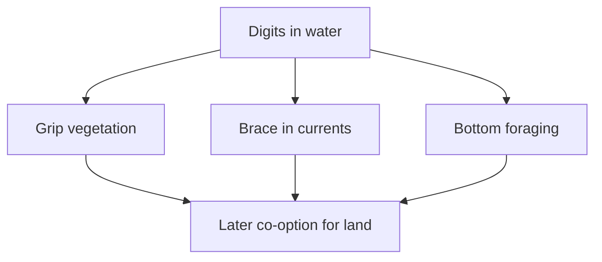
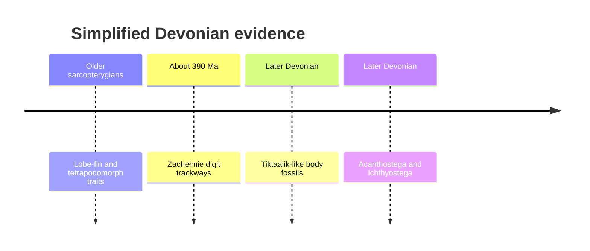

# Early tetrapods, difficult trackways and experimental multicellularity

This note continues beyond *Tiktaalik*. Erika follows digited animals that were still predominantly aquatic, the first convincing terrestrial walkers in her sequence, and trackways that force a revision of any simple ancestor-to-descendant ladder. She then closes the lesson's “+more” section with laboratory evolution of multicellularity.

## What you should learn

After revising this note, you should be able to:

- explain why digits need not have evolved for walking;
- compare *Acanthostega*, *Ichthyostega* and *Pederpes* without ranking them as “bad” or “good” tetrapods;
- distinguish a transitional character combination from a claim of direct ancestry;
- explain how the Zachełmie trackways changed the timeline without reversing geological order;
- describe the selection regimes used in the algae and snowflake-yeast experiments; and
- state what those experiments establish and what remains unresolved about complex multicellularity.

## Digits appear in animals that still live in water

At [3:32:55](https://www.youtube.com/watch?v=aJofeBRFwvI&t=12775s), Erika moves from finned tetrapodomorphs to *Acanthostega* and *Ichthyostega*. Both combine a much more tetrapod-like skeleton with clear aquatic specialisations.

*This is a museum cast of the partial skeleton USNM PAL 617511, not the original fossil. It makes the preserved digit, axial-skeleton and limb arrangement visible while leaving missing material visibly incomplete. Photograph by Neil Pezzoni at the Smithsonian's Deep Time hall, [source file](https://commons.wikimedia.org/wiki/File:Acanthostega_Deep_Time.jpg), [CC BY-SA 4.0](https://creativecommons.org/licenses/by-sa/4.0/).*

Their tetrapod-side traits include a neck, broad skull with tetrapod roofing bones, regionalised vertebrae and ribs, robust paired appendages, and true digits on both fore- and hind limbs ([3:33:06](https://www.youtube.com/watch?v=aJofeBRFwvI&t=12786s)). Yet they also retain evidence of gills and aquatic sensory systems. *Acanthostega* has a large tail fin; both have lateral-line canals used to detect water movement ([3:35:08](https://www.youtube.com/watch?v=aJofeBRFwvI&t=12908s)).

This is a particularly important mosaic because digits are often assumed to mean terrestrial walking. Biomechanical reconstruction suggests that these animals could not lift the whole trunk and coordinate a land gait like later tetrapods. Their hind limbs did not provide strong rear propulsion on land, and the belly would have dragged ([3:33:47](https://www.youtube.com/watch?v=aJofeBRFwvI&t=12827s)).

### Then what were hands and feet for?

At [3:34:38](https://www.youtube.com/watch?v=aJofeBRFwvI&t=12878s), Erika compares them with aquatic salamanders such as axolotls. Digited appendages can grip submerged vegetation, brace against current, pull an animal along the bottom and manipulate the environment while foraging. Selection can therefore favour a hand-like structure in water before a descendant lineage co-opts it for weight-bearing on land.

The diagram avoids foresight. Digits were not produced because evolution “knew” land animals would need them. A structure useful now can later be recruited for another job—an evolutionary process called exaptation.

## Digit number was initially variable

Early tetrapods did not all begin with the five-digit hand familiar from many living species. Erika notes at [3:37:02](https://www.youtube.com/watch?v=aJofeBRFwvI&t=13022s) that *Acanthostega* had eight digits, *Ichthyostega* seven and *Tulerpeton* six. Pentadactyly became common later; it was not a requirement for being a tetrapod.

Erika presents the working idea that broad, many-digit appendages may be advantageous for gripping and paddling in water, while fewer, more robust digits articulate more effectively with a weight-bearing wrist or ankle ([3:37:30](https://www.youtube.com/watch?v=aJofeBRFwvI&t=13050s)). She flags this as a topic she had only just reviewed, so it should be learned as a proposed functional explanation, not an uncontested law. Developmental experiments showing that digit number can change through signalling shifts make the transformation mechanistically plausible; they do not by themselves establish which ecological pressure fixed five digits historically.

## *Pederpes* and terrestrial gait

By about 350 million years ago in the timeline used in the lesson, *Pederpes* supplies a much more terrestrial combination ([3:35:48](https://www.youtube.com/watch?v=aJofeBRFwvI&t=12948s)). Erika highlights:

- robust pectoral and pelvic girdles capable of transmitting body weight;
- limbs and joints compatible with coordinated walking;
- a rib cage more like that of later air-breathing tetrapods;
- no preserved gill-cover apparatus; and
- five digits associated with a terrestrial, weight-bearing foot.

*Pederpes* is also important because it occurs within “Romer's Gap,” an interval in the early Carboniferous once conspicuously poor in tetrapod body fossils ([3:36:52](https://www.youtube.com/watch?v=aJofeBRFwvI&t=13012s)). Finding fossils in a gap can transform the apparent pace of change without implying that organisms only began evolving when preservation improves. The original description is Clack, [“An early tetrapod from ‘Romer's Gap’”](https://doi.org/10.1038/nature00824) (*Nature*, 2002).

## Why spend more time on land?

At [3:38:18](https://www.youtube.com/watch?v=aJofeBRFwvI&t=13098s), Erika offers two possible selective opportunities in Devonian environments:

1. large aquatic predators could be avoided in very shallow water or during brief excursions; and
2. terrestrial arthropods offered food in habitats with few vertebrate competitors.

These are hypotheses about ecological incentives, not claims that one predator “caused” all tetrapod evolution. The anatomical changes were already useful in shallow aquatic settings, and different populations could encounter different combinations of oxygen stress, seasonality, predation and food.

## A tidy ladder would be the wrong model

The simplified teaching sequence can look like this:

Erika explicitly disrupts that impression at [3:39:47](https://www.youtube.com/watch?v=aJofeBRFwvI&t=13187s). These taxa need not be a chain of direct ancestors. They are sampled branches preserving combinations of characters. A phylogeny may contain an older, poorly sampled digited branch alongside later-surviving fish-like branches.

## The Zachełmie trackways: a genuine chronological challenge

In 2010, Niedźwiedzki, Szrek, Narkiewicz, Narkiewicz and Ahlberg reported trackways from Zachełmie Quarry in Poland. Erika introduces them at [3:39:59](https://www.youtube.com/watch?v=aJofeBRFwvI&t=13199s). Some tracks preserve digit impressions and a gait attributable to a tetrapod-grade animal, yet they are roughly 390 million years old in the dating discussed—substantially older than *Tiktaalik* and the best-known digited body fossils.

The primary paper is [“Tetrapod trackways from the early Middle Devonian period of Poland”](https://doi.org/10.1038/nature08623) (*Nature*, 2010). A later environmental study argues that the track-bearing beds record ephemeral non-marine lakes rather than the initially proposed tidal-flat setting: [Qvarnström and colleagues (2018)](https://www.nature.com/articles/s41598-018-19220-5).

### What the tracks overturn

The trackways rule out a naive statement that *Tiktaalik* itself must be ancestral to every tetrapod. A digited tetrapod-grade lineage existed earlier, so either relevant body fossils remain missing or some known early tetrapodomorphs represent side branches surviving after the divergence.

Erika calls the tracks the strongest “out-of-place fossil” candidate she has encountered at [3:40:41](https://www.youtube.com/watch?v=aJofeBRFwvI&t=13241s), precisely because they make the previous narrative less tidy. Good revision practice should preserve that discomfort instead of hiding the date.

### What the tracks do not overturn

They do not occur before lobe-finned vertebrates or all tetrapodomorphs. Older body fossils already establish the broader source population from which a track-maker could branch ([3:41:24](https://www.youtube.com/watch?v=aJofeBRFwvI&t=13284s)). The tracks therefore push the origin of digited forms deeper within the sarcopterygian interval; they do not place a tetrapod before vertebrates, bony fish or lobe-finned anatomy existed.

Erika gives a useful counterexample at [3:42:39](https://www.youtube.com/watch?v=aJofeBRFwvI&t=13359s). A mammal in Cambrian rocks or a *T. rex* in Holocene deposits would cross major established boundaries in a way the tracks do not. The trackways revise branching order and ghost-lineage length while leaving the broader geological nesting intact.

## Transitional does not mean direct ancestor

After corresponding with Per Ahlberg, Erika reports at [3:43:39](https://www.youtube.com/watch?v=aJofeBRFwvI&t=13419s) that additional Devonian material was then under study. She avoids presenting unpublished details as evidence. The stable point from their exchange is that the Polish tracks are problematic for *Tiktaalik* as **the** ancestor, not for a tetrapod origin within older lobe-finned vertebrates.

At [3:44:47](https://www.youtube.com/watch?v=aJofeBRFwvI&t=13487s), Erika asks whether this removes *Tiktaalik*'s transitional status. Her answer is no. A transitional fossil possesses an informative mixture of ancestral and derived traits relative to specified groups. It need not be on the one genealogical line that happens to reach living descendants. *Basilosaurus* can illuminate whale evolution without being the ancestor of all living whales; *Archaeopteryx* can illuminate avian character evolution without being the ancestor of all birds; *Tiktaalik* can do the same for tetrapods.

Erika's preferred reading at [3:45:43](https://www.youtube.com/watch?v=aJofeBRFwvI&t=13543s) is that *Tiktaalik* represents a late-surviving side branch close to the tetrapod-origin radiation. She rejects confidence in a direct-ancestor claim because a fossil sample this old and incomplete rarely allows it.

## “Living fossil” does not mean unevolved

Will asks about coelacanth occurrences at [3:45:57](https://www.youtube.com/watch?v=aJofeBRFwvI&t=13557s). Erika answers that different members of the coelacanth lineage occur across many layers and are not anatomically identical ([3:46:17](https://www.youtube.com/watch?v=aJofeBRFwvI&t=13577s)). Living coelacanths retain a recognisable body plan but have continued accumulating genetic and anatomical changes.

Slow net morphological change is compatible with evolution. If a stable deep-water environment rewards the existing form, new variants can be neutral, lost by drift or removed by selection rather than driving dramatic directional change ([3:47:10](https://www.youtube.com/watch?v=aJofeBRFwvI&t=13630s)). “Living fossil” is therefore informal shorthand for long-term resemblance, not suspended heredity.

## Erika's tetrapod evidence summary

At [3:48:38](https://www.youtube.com/watch?v=aJofeBRFwvI&t=13718s), Erika reunites the independent lines:

| Evidence route | Pattern discussed |
| --- | --- |
| Variation | Mutation and regulatory change can alter appendage development. |
| Time | Multiple geological clocks provide a long, ordered history. |
| Taxonomy | Tetrapods nest with lobe-finned rather than ray-finned vertebrates. |
| Palaeontology | Skull, neck, girdle, fin/limb, digit and breathing traits appear in mosaics through Devonian rocks. |
| Genetics/development | Conserved pathways can generate coordinated changes in fins, wrists and digits. |

The inference is strongest because each route could have contradicted the others. Erika ends by asking where a separately created “kind” boundary could be drawn and what independent character would justify it ([3:49:44](https://www.youtube.com/watch?v=aJofeBRFwvI&t=13784s)).

---

## “+more”: can multicellularity evolve in the laboratory?

The final scientific section begins at [3:50:11](https://www.youtube.com/watch?v=aJofeBRFwvI&t=13811s). Erika treats the origin of multicellularity as another major transition: cells must remain together, reproduce as a collective, and eventually divide labour.

She briefly mentions putative multicellular fossils far older than the familiar late-Proterozoic macroscopic organisms at [3:50:57](https://www.youtube.com/watch?v=aJofeBRFwvI&t=13857s), but explicitly says she has not evaluated the new paper. The secure lesson does not depend on accepting that particular interpretation. By roughly 600 million years ago, complex multicellular organisms are unambiguous in the Ediacaran record ([3:51:58](https://www.youtube.com/watch?v=aJofeBRFwvI&t=13918s)).

## Experiment 1: predation selects multicellular algae

At [3:52:17](https://www.youtube.com/watch?v=aJofeBRFwvI&t=13937s), Erika describes an experiment that exposed initially unicellular *Chlamydomonas* algae to a filter-feeding *Paramecium* predator. Multicellular clusters evolved in two of five selected populations within 750 asexual generations; unselected controls did not show the same response.

The key controls appear in Erika's explanation at [3:55:15](https://www.youtube.com/watch?v=aJofeBRFwvI&t=14115s): the clusters had a heritable life cycle, persisted for thousands of generations after predators were removed, and outcompeted unicells when predators were present. This rules out a purely temporary clumping response. The source is Herron and colleagues, [“De novo origins of multicellularity in response to predation”](https://doi.org/10.1038/s41598-019-39558-8) (*Scientific Reports*, 2019).

## Experiment 2: snowflake yeast become macroscopic

The second experiment selects yeast clusters for rapid settling. After 600 daily selection rounds, anaerobic snowflake yeast had become roughly 20,000 times larger and about 10,000 times tougher while retaining a clonal multicellular life cycle ([3:53:53](https://www.youtube.com/watch?v=aJofeBRFwvI&t=14033s)). Cells elongated and branches became entangled, allowing the collective to remain together even when individual cell–cell bonds broke.

At [3:56:21](https://www.youtube.com/watch?v=aJofeBRFwvI&t=14181s), Erika explains how snowflake yeast reproduce: daughter cells remain attached, the cluster grows, mechanical strain breaks a branch, and the detached multicellular propagule begins another cluster. Selection acts on the settling and survival of whole clusters, making the cluster a heritable level of biological organisation.

The peer-reviewed source is Bozdag and colleagues, [“De novo evolution of macroscopic multicellularity”](https://www.nature.com/articles/s41586-023-06052-1) (*Nature*, 2023).

## Does clumping count as complex multicellularity?

Erika presents the strongest limitation at [3:57:43](https://www.youtube.com/watch?v=aJofeBRFwvI&t=14263s). A cluster of similar cells is not equivalent to an animal whose muscle, nerve, blood and skin cells perform specialised jobs. The experiments establish an origin of heritable multicellular collectives and subsequent increases in size and toughness; they do not evolve an animal in a flask.

At [3:59:25](https://www.youtube.com/watch?v=aJofeBRFwvI&t=14365s), Erika reports preliminary material from the Ratcliff laboratory website suggesting three putative yeast cell states enriched for growth, cell-wall production and programmed cell death. Because she cites a lab update rather than a completed paper in the stream, revise it as **promising evidence under investigation**, not as a settled demonstration of animal-grade differentiation.

The right conclusion is proportional:

- **shown directly:** stable, heritable multicellular life cycles can evolve from unicellular ancestors under selection;
- **shown in the long-term yeast experiment:** collectives can evolve macroscopic size and radically greater toughness;
- **suggested, with the caveat Erika gives:** early division of labour may be emerging;
- **not shown:** the origin of every feature of complex animals in one experiment.

## What happened is separate from why it happened

At [4:00:17](https://www.youtube.com/watch?v=aJofeBRFwvI&t=14417s), Erika excludes abiogenesis from her claim and says she is addressing how biodiversity changed after life existed. At [4:01:31](https://www.youtube.com/watch?v=aJofeBRFwvI&t=14491s), she also separates evolutionary mechanism from ultimate purpose: evidence that lineages changed through natural processes does not by itself determine whether a deity guided or intended those processes.

This distinction prepares the next four lessons on human evolution. Erika's scientific question is “What sequence and mechanism best explains the evidence?” Questions of cosmic purpose require additional philosophical or theological premises.

## Common confusions

1. **Digits prove land walking.** *Acanthostega* shows digits can be useful in water.
2. **The fossil series is a direct genealogy.** The named fossils are anatomical samples from a branching radiation.
3. **Older tracks make *Tiktaalik* irrelevant.** They reject a simple direct-ancestor claim but not its transitional anatomy.
4. **A “living fossil” has not evolved genetically.** It has a conservative body plan, not a frozen genome.
5. **Temporary cell clumps equal multicellularity.** The experiments test heritability and a multicellular life cycle precisely to avoid that mistake.
6. **Snowflake yeast are equivalent to animals.** They establish a major first transition, not the whole history of complex multicellularity.

## Active recall

- Why could digits be selected before terrestrial walking?
- Give two aquatic traits retained by *Acanthostega* or *Ichthyostega*.
- What makes *Pederpes* more compatible with a terrestrial gait?
- What did the Zachełmie tracks overturn, and what broader order did they leave intact?
- Define transitional fossil without using the words “direct ancestor.”
- Compare the selection pressure in the algae experiment with that in the yeast experiment.
- Which multicellularity results were peer reviewed, and which cell-differentiation claim did Erika present as preliminary?

**Compact recap:** early tetrapod anatomy is a branching mosaic whose functions begin in water and are later co-opted on land. Difficult evidence changes the detailed tree without erasing the broader nested order. Laboratory selection supplies an independent proof of principle that even a major transition such as heritable multicellularity can begin through observable population change.
